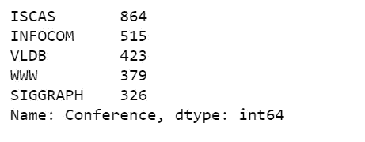
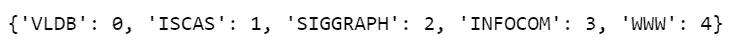
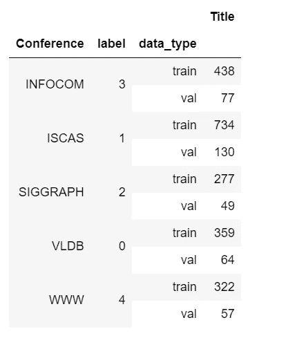
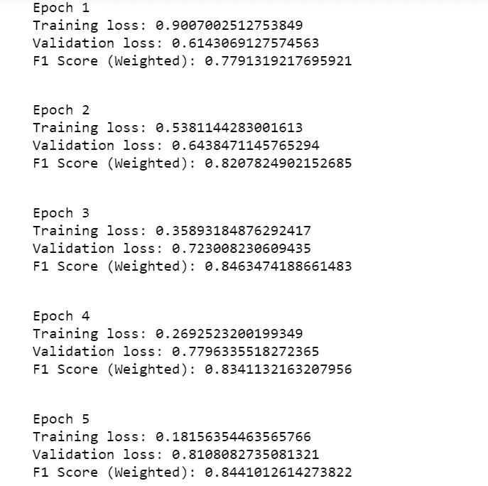
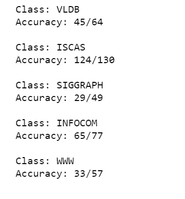

# 基于 BERT 深度学习的多类文本分类

> 原文：<https://towardsdatascience.com/multi-class-text-classification-with-deep-learning-using-bert-b59ca2f5c613?source=collection_archive---------0----------------------->


图片来源:Pexels

## 自然语言处理，自然语言处理，拥抱脸

大多数研究人员将他们的研究论文提交给学术会议，因为这是一种更快捷的公布结果的方式。寻找和选择一个合适的会议一直具有挑战性，尤其是对年轻的研究人员来说。

然而，根据以前的会议进展数据，研究人员可以增加论文被接受和发表的机会。我们将尝试使用 [BERT](https://huggingface.co/transformers/model_doc/bert.html) 用深度学习解决这个文本分类问题。

几乎所有的代码都取自这个[教程](https://www.coursera.org/projects/sentiment-analysis-bert)，唯一的区别就是数据。

# 数据

[数据集](https://raw.githubusercontent.com/susanli2016/NLP-with-Python/master/data/title_conference.csv)包含 2507 篇研究论文标题，已被人工分类为 5 类(即会议)，可从[此处](https://raw.githubusercontent.com/susanli2016/NLP-with-Python/master/data/title_conference.csv)下载。

## 探索和预处理

conf _ explorer . py


表 1

```
df['Conference'].value_counts()
```



图 1

你可能已经注意到了我们的班级不平衡，我们将在稍后解决这个问题。

## 给标签编码

标签 _ 编码. py



```
df['label'] = df.Conference.replace(label_dict)
```

# 培训和验证分割

因为标签是不平衡的，我们以分层的方式分割数据集，用它作为类别标签。

拆分后，我们的标签分布将如下所示。

训练 _ 测试 _ 拆分. py



图 2

# BertTokenizer 和编码数据

[记号化](https://huggingface.co/transformers/main_classes/tokenizer.html)是将原始文本分割成记号的过程，记号是表示单词的数字数据。

*   构造一个 [BERT 记号化器](https://huggingface.co/transformers/model_doc/bert.html#berttokenizer)。基于文字部分。
*   实例化一个预训练的 BERT 模型配置来编码我们的数据。
*   为了将所有的标题从文本转换成编码形式，我们使用了一个名为`batch_encode_plus`的函数，我们将分别处理训练和验证数据。
*   上述函数中的第一个参数是标题文本。
*   `add_special_tokens=True`表示序列将使用与其模型相关的特殊标记进行编码。
*   当将序列批处理在一起时，我们设置了`return_attention_mask=True`，因此它将根据由`max_length`属性定义的特定标记器返回注意掩码。
*   我们还想填充所有的标题到一定的最大长度。
*   我们实际上不需要设置`max_length=256`，只是为了安全起见。
*   `return_tensors='pt'`返回 PyTorch。
*   然后我们需要将数据拆分成`input_ids`、`attention_masks`和`labels`。
*   最后，在我们得到编码数据集之后，我们可以创建训练数据和验证数据。

tokenizer_encoding.py

# BERT 预训练模型

我们将每个标题视为其唯一的序列，因此一个序列将被归类到五个标签之一(即会议)。

*   `bert-base-uncased`是一个较小的预训练模型。
*   用`num_labels`表示输出标签的数量。
*   我们其实并不关心`output_attentions`。
*   我们也不需要`output_hidden_states`。

BERT_pretrained_model.py

# 数据加载器

*   `DataLoader`组合数据集和采样器，并在给定的数据集上提供可迭代的。
*   我们使用`RandomSampler`进行训练，使用`SequentialSampler`进行验证。
*   鉴于我的环境内存有限，我设置了`batch_size=3`。

data_loaders.py

# 优化器和调度器

*   要构建一个优化器，我们必须给它一个包含要优化的参数的 iterable。然后，我们可以指定特定于优化器的选项，如学习率、ε等。
*   我发现`epochs=5`很适合这个数据集。
*   创建一个学习率从优化程序中设置的初始学习率线性降低到 0 的调度，在此期间，学习率从 0 线性增加到优化程序中设置的初始学习率。

优化程序 _ 调度程序. py

# 性能指标

我们将使用 f1 分数和每节课的准确度作为性能指标。

performance_metrics.py

# 训练循环

培训 _loop.py



图 3

# 加载和评估模型

loading_evaluating.py



图 4

[Jupyter 笔记本](https://github.com/susanli2016/NLP-with-Python/blob/master/Text_Classification_With_BERT.ipynb)可以在 [Github](https://github.com/susanli2016/NLP-with-Python/blob/master/Text_Classification_With_BERT.ipynb) 上找到。享受余下的周末吧！