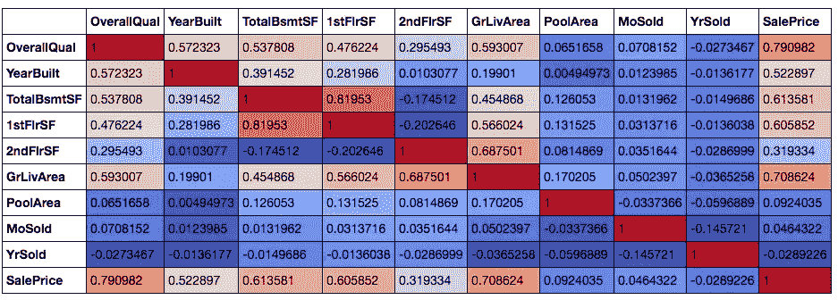
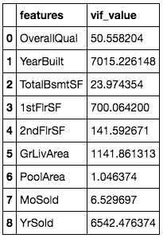
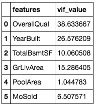
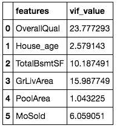
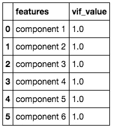

# 回归中的多重共线性

> 原文：<https://towardsdatascience.com/multi-collinearity-in-regression-fe7a2c1467ea?source=collection_archive---------2----------------------->

## **为什么这是个问题？如何检查和修理**


来源:by @jjying 来自 [unsplash](https://unsplash.com/photos/PDxYfXVlK2M)

当回归模型中的独立变量彼此高度相关时，会发生多重共线性。这使得很难解释模型，并且还产生过拟合问题。人们在选择回归模型中的变量之前会进行测试，这是一个常见的假设。

我以前在为时间序列数据构建回归模型时遇到过严重的多重共线性问题。我根据不同的时间段创建了多个特征，如 1 个月的总回报、6 个月的总回报和 1 年的总回报，以获得更多的输入变量。然而，这些特征彼此高度相关。例如，如果一只股票在过去一年表现良好，那么它很可能在最近一个月表现良好。我需要放弃这些变量中的一些，或者找到一种方法使它们不那么相关。我将在文章的后面解释解决这个问题的不同方法。

## 为什么多重共线性是一个问题？

当独立变量高度相关时，一个变量的变化会引起另一个变量的变化，因此模型结果波动很大。如果数据或模型发生微小变化，模型结果将会不稳定且变化很大。这将产生以下问题:

1.  如果模型每次给你不同的结果，你将很难**选择模型的重要变量列表**。
2.  **系数估计不稳定**，你很难解释这个模型。换句话说，如果你的一个预测因子改变了 1 个单位，你就无法判断输出的变化程度。
3.  模型的不稳定性可能导致**过度拟合**。如果将该模型应用于另一个数据样本，则与训练数据集的准确性相比，准确性会显著下降。

> 根据具体情况，如果仅出现轻微或中等程度的共线性问题，则对于您的模型来说可能不是问题。但是，如果存在严重的共线性问题(例如，两个变量之间的相关性> 0.8 或方差膨胀因子(VIF) >20)，强烈建议解决该问题

## 如何检查是否出现多重共线性？

**第一个简单的方法**是画出所有自变量的相关矩阵。

我用了 Kaggle 竞赛的住房数据。竞赛的目标是使用房屋数据输入来正确预测销售价格。我在这里选择了一些数值变量来包含在我的模型中。

```
#plot color scaled correlation matrix
corr=house_selected.corr()
corr.style.background_gradient(cmap='coolwarm')
```



住房数据的彩色标度相关矩阵

在绘制相关矩阵并对背景进行颜色缩放后，我们可以看到所有变量之间的成对相关性。我还在这里加入了因变量“销售价格”。这是因为当我试图选择包含在模型中的独立变量时，这是我的一个秘密技巧。

> 当你不知道模型中包含哪些变量时，只需做一个相关矩阵，选择那些与因变量高度相关的自变量。

回到多重共线性问题，我们可以看到，从相关矩阵中，有相当多的变量是相互关联的。有一对相关系数大于 0.8 的自变量是地下室总表面积和一层表面积。具有较大地下室面积的房屋往往也具有较大的一楼面积，因此高相关性是可以预期的。

**检查多重共线性的第二种方法**是对每个自变量使用方差膨胀因子(VIF)。它是多重回归变量集合中多重共线性的度量。VIF 值越高，该变量与其他变量的相关性越高。

```
#Compute VIF data for each independent variable
from statsmodels.stats.outliers_influence import variance_inflation_factor
vif = pd.DataFrame()
vif["features"] = house_selected.columns
vif["vif_Factor"] = [variance_inflation_factor(house_selected.values, i) for i in range(house_selected.shape[1])]
vif
```



住房模型数据的 VIF 结果-原始

如果 VIF 值高于 10，通常被认为与其他自变量有很高的相关性。然而，接受范围受到要求和约束。从结果中，我们可以看到大多数特征与其他自变量高度相关，只有两个特征可以通过低于 10 的阈值。

## 如何修复多重共线性问题？

1.  **变量选择**

最直接的方法是删除一些与其他变量高度相关的变量，将更重要的变量留在集合中。例如，当我们绘制包含“销售价格”的相关矩阵时，我们可以看到整体质量和地面居住面积与因变量“销售价格”的相关性最高，因此我将尝试将它们包含在模型中。



住房模型数据的 VIF 结果-选择后

我们可以看到，使用简单的消去法，我们能够显著降低 VIF 值，同时保留重要的变量。然而，一些变量如整体质量和建造年限仍然有很高的 VIF 值，它们在预测房价时很重要。**如何？**有时我们可以使用第二种方法中描述的小技巧来转换变量。

2.**变量转换**

第二种方法是**转换一些变量，使它们不那么相关，但仍然保持它们的特征**。我这么说是什么意思？在房屋模型示例中，我可以通过用建造年份减去当前年份，将“建造年份”转换为“房屋年龄”。例如，如果建筑年份是 1994 年，那么房子的年龄是 2020–1994 = 26 年。



住房模型数据的 VIF 结果-转换为 house_age 后

在我将建筑年限转换为房龄后，新的“房龄”因子的 VIF 下降到一个可接受的范围，整体质量的 VIF 值也下降了。

在我开始提到的时间序列分析的例子中，我也转换了变量，使它们不那么相关。例如，过去 1 个月的总回报与过去 6 个月的总回报高度相关。我从过去 6 个月的回报中减去过去 1 个月的回报，得到不包括过去一个月的前 5 个月回报的新变量。相关性结果更容易接受，我能够将这两个变量作为我的模型特征。

3.**主成分分析**

主成分分析(PCA)通常用于通过将数据分解成多个独立的因子来降低数据的维度。它有许多应用，如通过减少预测因子的数量来简化模型计算。然而，在我们的例子中，我们将只使用 PCA 的变量独立性来消除模型中的多重共线性问题。

```
#Create the new data frame by transforming data using PCA
import numpy as np
from sklearn.decomposition import PCA
pca = PCA(n_components=6)
components=pca.fit_transform(house_adjusted)
componentsDf=pd.DataFrame(data=components,columns=['component 1','component 2','component 3','component 4','component 5','component 6'])#Calculate VIF for each variable in the new data frame
vif = pd.DataFrame()
vif["features"] = componentsDf.columns
vif["vif_value"] = [variance_inflation_factor(componentsDf.values, i) for i in range(componentsDf.shape[1])]
vif
```



住宅模型数据的 VIF 结果 PCA 转换后

与原始数据相比，我仍然保留相同数量的变量，我们可以看到，现在这 6 个变量彼此完全不相关。我们可以用新的 6 个变量作为自变量来预测房价。

这种方法的弊端也非常明显。在 PCA 变换之后，我们没有每个变量的同一性，并且将很难解释结果。

## 结论和建议

在建立回归模型之前，我们每次都应该检查多重共线性的问题。VIF 是一种简单的方法，可以观察每个独立变量，看它们是否与其他变量高度相关。当您不确定为模型选择哪些变量时，相关矩阵将有助于选择重要的因素。相关矩阵还有助于理解为什么某些变量具有高 VIF 值。

就修复多重共线性问题的方法而言，我个人不喜欢这里的 PCA，因为模型解释将会丢失，当您想要将模型应用于另一组数据时，您需要再次进行 PCA 转换。因此，我们应该尽最大努力通过选择正确的变量来减少相关性，并在需要时进行转换。当变量具有相对较高的 VIF 值，而且对预测结果也很重要时，您可以决定是否保留该变量。试错法总是包括不同的变量集，建立模型并根据测试数据进行测试，以查看是否有任何过度拟合。

你认为在构建模型之前，你已经完成了所有的统计假设检查了吗？不，你不是！如果你想了解更多关于回归模型中的其他统计假设，请参考我下面的另一篇关于回归模型中的正态假设的文章。

[](/is-normal-distribution-necessary-in-regression-how-to-track-and-fix-it-494105bc50dd) [## 回归中正态分布有必要吗？如何跟踪修复？

### 博克斯-考克斯变换，夏皮罗-维尔克检验，QQ 图

towardsdatascience.com](/is-normal-distribution-necessary-in-regression-how-to-track-and-fix-it-494105bc50dd)