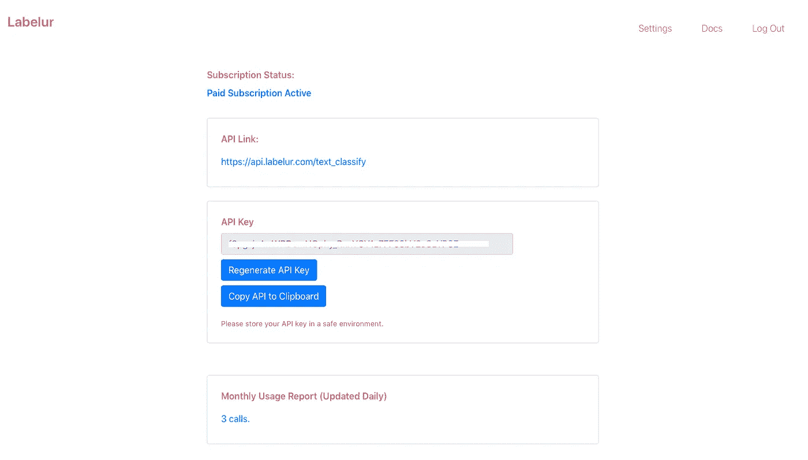
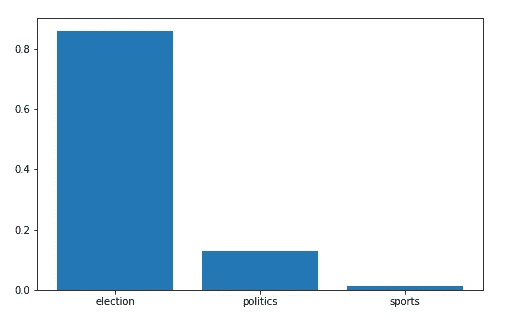

# 基于标签的多领域文本分类

> 原文：<https://towardsdatascience.com/multi-domain-text-classification-via-labelur-bb4dafbf9580?source=collection_archive---------51----------------------->

[Labelur](http://www.labelur.com) 允许你通过 REST API 对多领域文本进行分类。Labelur 使用现代零镜头学习技术进行多领域文本分类，无需训练定制模型。

# 什么是 Labelur？

[Labelur](http://labelur.com) 是一个执行多领域文本分类的在线服务。上手毫不费力！只需使用您选择的任何编程语言，如 Python、Java、Node 或 PHP(谁还在使用 PHP？)用您的文本数据向 Labelur 的 API 服务器发送 POST 请求。Labelur 将回复给定文本的标签。

# Labelur 与其他文本分类有何不同

大多数文本分类服务只处理特定领域的数据，如情感分析、法律文档分类或通用主题的通用文本分类。如果你想为一个特定的领域做一个分类器，比如房地产，你需要有一个训练数据，创建一个分类器。传统上，如果没有数据来训练自定义模型，就无法产生好的文本分类器。

> Labelur 使用 NLP 中的现代进步来分类大多数通用领域中的文本。它利用知识提炼和零炮学习对文本进行分类。如果您没有自己的数据或者不想训练和部署自己的 ML 模型，这是一个极好的起点。

# 让我们对一些文本进行分类！

我将用 Python 做一个演示，但是同样的，你可以使用任何你选择的语言。首先，创建一个帐户并获得您的 API 密钥。

API 密钥已被编辑

我将使用 Python 的请求库向 Labelur 的服务器发送 POST 请求。JSON 库将用于 JSON 化我们的文本负载，Matplot 将用于绘制最终结果。

在这里，我们必须遵循有效载荷模式。有效载荷需要有**文本和** **标签**作为键。标签**的值**将由一列字符串组成，文本**的值**也将是一个字符串。在选择可能的标签类别时，我们必须选择一个尽可能描述该类别的词。

例如，在文本“了解美国的邮寄投票”中，我们提供的标签是“体育”、“政治”和“选举”。下面是 Labelur 返回的结果。

Labelur 的结果

# **总之**

我们只用了 3 分钟就创建了一个帐户，并开始使用 Labelur 对文本进行分类。如果您没有数据来训练自己的模型，或者不想处理部署 ML 模型的麻烦，Labelur 可能是您的一个很好的解决方案。

*注意:Labelur 目前处于测试版，API 仅通过邀请提供。*

[www.labelur.com](http://www.labelur.com)