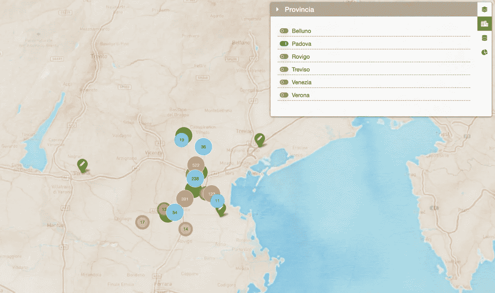
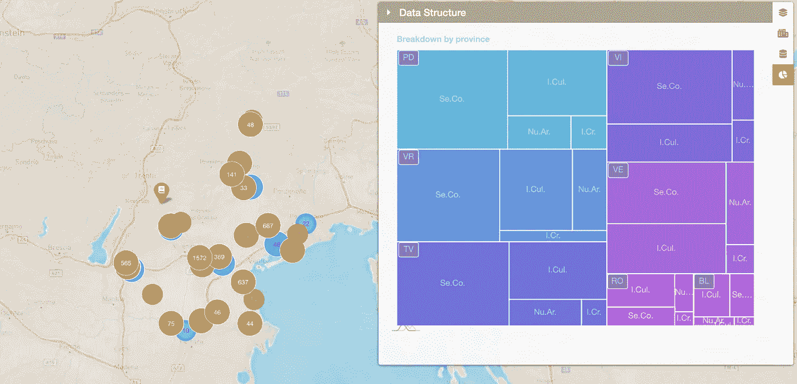

# 使用传单和 amCharts 在浏览器中进行多方面的数据探索

> 原文：<https://towardsdatascience.com/multi-faceted-data-exploration-in-the-browser-using-leaflet-and-amcharts-f74d049d78d9?source=collection_archive---------38----------------------->

## 在浏览器中创建一个数据探索仪表板，从 Google Sheets 加载实时记录，并将地理空间信息与时间数据交叉。


演示:[https://smarques.github.io/mufa-leaf/](https://smarques.github.io/mufa-leaf/)
(演示中的数据是随机的，真正的研究还没有发表。)

在这个充满挑战的 CoVid 时代，我被要求对我居住的意大利地区进行数据可视化。

这些数据由大约 20k 条记录组成，按照子行业、主题类型、数据来源和活动开始的年份进行地理参考和标记。

> 例如:
> 
> subsector =>sub C1，
> subject =>subject 2，
> year = > 1985，
> position =>【45.375302，11.727905】
> source =>gov . Census

我的目标是以不同的方式探索这些数据:
- **作为地图上的标记和聚类**-
-**作为可导航的树形图**-
-**通过过滤器和时间轴选择器**

理想情况下，这种可视化应该应用于整个数据集或选定的数据子集，以便您可以应用过滤器，查看特定年份的分布情况，也可能仅针对给定省份的特定子行业。

想法是将数据作为 JSON 结构加载到浏览器中，并保存在内存中，根据用户与过滤器的交互加载子集，并将子集数据提供给每个可视化。

我在这里将会介绍一些流程，具体的实现请参考 GitHub repo:[https://github.com/smarques/mufa-leaf](https://github.com/smarques/mufa-leaf)

# 准备数据

由于数据仍在修改和重新分类中，我想从一个共享的谷歌表单中加载它。我还用谷歌工作表对地址进行地理编码，使用的是[这个漂亮的谷歌工作表宏](https://github.com/nuket/google-sheets-geocoding-macro)。

因为人们仍在使用 google sheet，所以我决定在将数据导入我的 JS 应用程序时直接进行数据检查和数据清理。

要从 Google 工作表中加载数据，我找到的最佳选项是 [Papa Parse](https://www.papaparse.com/) 。它可以让你把 CSV 解析成 JSON，从任何地方加载，处理大文件，所有的事情，而且它有一个有趣的名字。

让我们试一试。

首先，您需要在 Google 表单上执行两个操作:

*   发布到 web:文件->发布到 web，复制网址，会是这样的:[*https://docs.google.com/spreadsheets/d/e/<哈希>/pub html*](https://docs.google.com/spreadsheets/d/e/2PACX-1vSZ3vkQTK-CrT7Rv6Rdu3uDKmumQB94Ic7WrmBu4ezak-72QWbkUISb7FfvR_Z1AhmYgfASVad205BE/pubhtml)
*   分享:点击右上方的分享按钮，然后点击获取可分享链接。这将打开按链接共享，任何有链接的人都可以看到数据。

你需要提供给 Papa Parse 的 url(呀，这个名字真有趣)是 https://docs.google.com/spreadsheets/d/e/*T4<哈希> /pub？输出= CSV*

你也可以直接从 google sheets 导出 JSON 格式的数据，但是我们的朋友 Papa 给了我们更多的类型转换、数据清理等选项。

完成后，您只需通过以下方式导入数据:

[https://gist . github . com/smarques/3d bfaaae 4 B3 D8 a 204 D2 AC 280 f 488528 e](https://gist.github.com/smarques/3dbfaaae4b3d8a204d2ac280f488528e)

*processData* 函数负责清理和提炼我们从 Google Sheets 收到的数据。有时你需要应用一些正则表达式，删除奇怪字符，修复输入错误。

# 创建聚类地图

现在的目标是让这些家伙在地图上，可能在三个不同的层和不同的标记颜色层。我们还希望标记有一个不同的主题类型的图标。因为我们有将近 30k 个标记，所以设置一些聚类可能是个好主意。


我选择的地图库是[传单](https://leafletjs.com/)。它有很棒的代码和文档，非常灵活，有一个很好的插件生态系统。

我添加了几个插件，如:
[传单全屏控制](https://github.com/Leaflet/Leaflet.fullscreen)因为我只是喜欢让地图全屏
[传单轻松打印](https://github.com/rowanwins/leaflet-easyPrint):有几个打印插件，但这似乎对我最有效
[传单提供者](https://github.com/leaflet-extras/leaflet-providers):要轻松混合和匹配不同来源的瓷砖，我必须提到[雄蕊水彩瓷砖](https://stamen.com/opensource/)因为它们真的很赏心悦目。
[传单牛逼标记](https://github.com/lvoogdt/Leaflet.awesome-markers)让你在地图标记上使用牛逼字体图标

现在，如果您只需显示并最终过滤传单地图上的标记，通常的做法是将标记添加到相应的图层，然后调用地图上的函数来隐藏或显示整个图层或特定标记。我的想法有点不同，我想**将所有数据保存在应用程序级别**，这样我不仅可以将它用于地图，还可以用于其他图形和小部件。**当我们应用过滤器时，我希望在应用程序级别过滤数据，随后重新绘制地图**，以及应用程序中任何其他数据相关的小部件。

此时的问题是:地图和图形的重绘速度是否足够快，以提供良好的用户体验和数据探索？
让我们来了解一下。*(剧透:yayyy 他们做)*

因此，我们在应用程序中有一个名为 *currentData* 的变量，它保存当前显示的完整记录集的子集。每次用户改变选择过滤器时，我们从 *App.data* 开始创建一个新的数据选择，保存到 *App.currentData* 中，并触发每个小部件的重绘。

```
updateCurrentData(App.data);
```

即使我们只是在清理数据后初始化应用程序，我们也可以调用 update 函数来填充应用程序 *currentData* ，因为用户没有机会过滤记录集，函数将只选择每一条记录，我们就可以开始了。

现在让我们看看如何使用地图小部件。

没有聚类，地图会有点拥挤:不是很有用，而且在你的浏览器上也很沉重。


因此，让我们使用[传单添加一个聚类级别。标记集群](https://github.com/Leaflet/Leaflet.markercluster)。

我根据标记所属的子部门来构造标记，这里只有 4 个可能的值，所以让每个子部门在不同的层上会使每个组的开关变得非常容易。此外，这将使每个子行业有可能有单独的集群，使显示更有趣，并为数据分布提供更好的线索。


MarkerCluster 允许您自定义显示聚类标记的功能(因此得名..)因此，根据集群的大小，我有稍微不同的标记。(例如，参见 9 对 325 红色星团)。

对于四个扇区中的每一个，我们实例化一个标记集群组，给出一个 iconCreateFunction，如前所述。我还在集群图标上添加了一个鼠标悬停功能，这样你就可以通过将鼠标悬停在一个层上来向上浮动(改变它的 z 索引)。

我还想强调这项研究涉及的领域。传单让你加载 [**GeoJSON**](https://geojson.org/) 所以我所要做的就是在 GitHub 中搜索带有该区域形状的 GeoJSON，并将其加载到自己的图层上。(感谢[斯特凡诺·库迪尼](https://github.com/stefanocudini))

```
L.geoJson(venetoData).addTo(App.mainMap);
```


# 过滤器！

我希望所有的过滤器都集成到地图中，所以我在地图的右侧添加了一个侧面板，让您可以打开不同的过滤器控制面板。


我为整个子行业或某个行业内的单个主题创建了过滤器。然后过滤每个省



并且对于每个数据源


我不会深入讨论所有过滤器 gui 的实现细节，您可以在 GitHub repo 上查找，基本上是为了避免回调地狱每个 gui 元素都使用 [**bacon.js**](https://baconjs.github.io/) (一个反应函数库)连接到一个事件流。这样，任何过滤器中的任何更改都会导致调用相同的更新函数，传递完整的过滤器值集，以便我们可以将所有需要的条件应用到完整的数据集，并为每个要显示的小部件加载新的 *currentData* 子集。

# 更新功能

因为我希望将数据过滤保持在主应用程序级别，所以每次过滤器发生变化时，我都会调用一个更新函数来从整个集合中提取相关数据。
我使用一个名为 [**的 js 库 alasql**](https://github.com/agershun/alasql) 根据用户选择的过滤器处理 15k 记录数组。其中，alasql 允许您对任何对象数组运行 sql 查询。这使得处理您的数据变得非常容易，并且使您的代码可读，易于调试和维护。

我可以运行如下查询:

```
var res = alasql(`SELECT MIN(${App.field_names.year}) AS minYear, MAX(${App.field_names.year}) AS maxYear FROM ? WHERE ${App.field_names.year} > 1900`, [App.currentData]);
```

至此，我在 update 函数中所要做的就是构建一个条件数组来添加到我的 SELECT 语句中。

事实证明，如果您删除所有图层标记并重新添加它们，MarkerCluster 的更新速度非常快，所以当我有一个新的 currentData 对象时，我只需运行它并重新分配它。

# 时间轴选择器

接下来，我们希望能够根据年间隔选择记录。


传单控件只是 html 元素，所以我使用了 [**Ion。RangeSlider**](http://ionden.com/a/plugins/ion.rangeSlider/index.html) 并将其值添加到触发新查询和后续重绘的反应流中。
当我第一次从 Google Sheet 接收数据时，我只获得了 year 列的最小值和最大值，所以我可以用它来显示时间选择器的合理范围。

# 树形图

作为最后一个元素，我们添加了一个树形图，这样我们就可以可视化所选子集的结构。我包含了 [**amCharts**](https://www.amcharts.com/) 库，并在我的更新函数中设置了一个调用来重绘图表。我选择按省份开始分解。



然后，您可以点击树形图块，在可视化视图中向下钻取。


# 包装它

因此，现在我们有了一个主应用程序层，它负责加载完整的数据，根据不同的过滤器和用户行为进行子选择，然后触发不同图形和小部件的更新。这是一个很好的框架，可以让用户在浏览器中探索数据，并且很容易添加更多的可视化。关键是它们都引用相同的数据子集。
例如，当您更改 year 参数时，查看位置和数据结构如何变化非常有用。您可以添加一个播放按钮，并创建一个显示每年变化的动画。
另一个改进是通过 IndexedDb (alasql 支持它)同步本地存储上的数据，以便您有完整的离线体验。

如果你想添加元素或进行实验，请随意在 GitHub 上提出请求！