# 使用词袋和 TF-IDF 的多标签分类

> 原文：<https://towardsdatascience.com/multi-label-classification-using-bag-of-words-bow-and-tf-idf-4f95858740e5?source=collection_archive---------13----------------------->

## 该项目遵循传统技术，如单词袋和 tf-idf，以数字格式表示语料库中的单词，用于多标签分类。

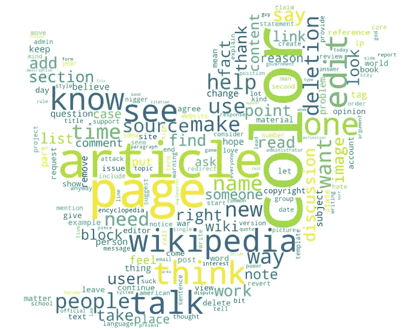

Wordcloud 摘录自 Jigsaw 有毒评论。*免责声明:该数据集包含被视为亵渎、粗俗或冒犯的文本。文章最后给出了构建这个词云的代码。*

# 1.加载数据

在这项研究中，我们使用 Kaggle 数据进行[有毒评论分类挑战](https://www.kaggle.com/c/jigsaw-toxic-comment-classification-challenge/data)。让我们加载并检查数据。这是一个多标签分类问题，其中注释按照毒性级别进行分类:`toxic / severe_toxic / obscene / threat / insult / identity_hate`

```
import pandas as pd
data = pd.read_csv('train.csv')
print('Shape of the data: ', data.shape)
data.head()
```

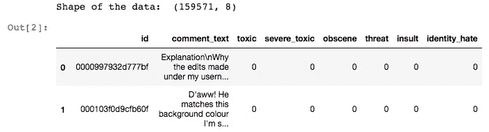

数据集的快照

```
y_cols = list(data.columns[2:])
is_multilabel = (data[y_cols].sum(axis=1) >1).count()
print('is_multilabel count: ', is_multilabel)
```

*   从上面的数据可以观察到，并不是所有的评论都有标签。
*   其次，它是多标签数据，意味着每个评论可以有一个或多个标签。

首先，让我们为没有标签的评论添加一个标签“无毒”。此外，探索如何平衡的类。

```
# Add a label, ‘non_toxic’ for comments with no label
data['non_toxic'] = 1-data[y_cols].max(axis=1)
y_cols += ['non_toxic']# Inspect the class balance
def get_class_weight(data):
    class_weight = {}
    for num,col in enumerate(y_cols):
        if num not in class_weight:
            class_weight[col] = round((data[data[col] == 1][col].sum())/data.shape[0]*100,2)
    return class_weight
class_weight = get_class_weight(data)print('Total class weight: ', sum(class_weight.values()), '%\n\n', class_weight)
```

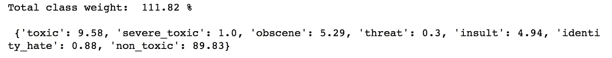

我们可以看到数据是高度不平衡的。不平衡数据指的是分类问题，例如，89%的评论被归类到新建的“无毒”标签下。

任何给定的线性模型如果使用平方损失进行二进制分类，将会非常糟糕地处理类别不平衡。在这个项目中，我们将不讨论解决不平衡问题的技术。如果你想了解更多关于处理不平衡数据的知识，请参考[这篇](https://pub.towardsai.net/imbalanced-data-real-time-bidding-6ee9c4ef957c)博客。

让我们在使用 BoW(单词包)和 tf-idf(术语频率和逆文档频率)将文本数据转换为数字数据之前，重点关注预处理。

## 2.将数据集分为训练、验证和测试

```
from sklearn.model_selection import train_test_splitX, X_test, y, y_test = train_test_split(X_data, y_data, test_size=0.2, train_size=0.8)
X_train, X_val, y_train, y_val = train_test_split(X,y,test_size = 0.25,train_size =0.75)X_train[:1]
```

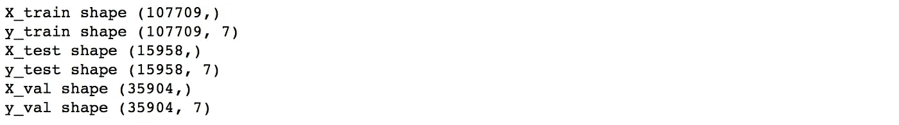

让我们仔细看看其中一条评论。请注意，由于数据集是随机分割的，因此文本会因您而异。如果你的目标是复制结果，请在分割中使用种子。

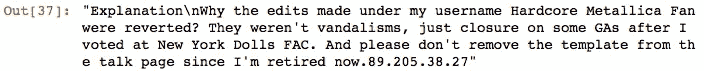

# 3.预处理文本

从上面的例子中，我们可以看到，文本需要预处理，即将其转换为相同的大小写(小写)，在将文本转换为标记之前，删除符号、数字和停用词。为了预处理文本，您需要下载特定的库。

```
import re
import numpy as n
import nltk
nltk.download('stopwords')
from nltk.corpus import stopwords
nltk.download('punkt')
```

要点学分: [Coursera](https://www.coursera.org/learn/language-processing)

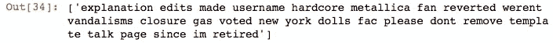

预处理文本

# 4.将文本转换为矢量

对于机器学习模型，文本数据必须转换为数字数据。这可以通过各种方式实现，如 BoW、tf-idf、单词嵌入等。在这个项目中，我们将关注 BoW 和 tf-idf。

# 词汇袋

> 在 BoW 模型中，一个文本(如一个句子或一个文档)被表示为其单词的包(多集合),不考虑语法甚至词序，但保持多样性。

## *-通过排名建立一个前 N 个流行词的字典。*

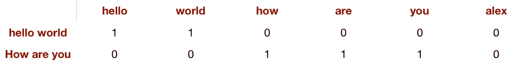

BoW 表示两个评论，“hello world”和“How are you”

我们将把自己限制在 N 个流行词，以限制矩阵的大小。而且包含冷门词只会引入稀疏，不会增加太多信息。对于这个项目，让我们用 10000 个流行词。

```
# Lets take a look at top 10 popular words
POPULAR_WORDS[:10]
```

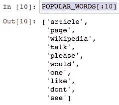

## -建造船首

对于语料库中的每个评论，创建具有 N 维的零向量，并且对于在评论中找到的单词，将向量中的值增加 1，例如，如果一个单词出现两次，则向量中的索引将得到 2。

为了有效存储，我们将把这个向量转换成一个稀疏向量，一个利用稀疏性并且实际上只存储非零条目的向量。

```
from scipy import sparse as sp_sparse
```

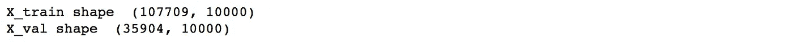

# TF-IDF

> [在信息检索中，**TF–IDF**或 **TFIDF** ，是**词频-逆文档频率**的简称，是一种数值统计，意在反映一个词对集合或语料库中的文档有多重要。](https://en.wikipedia.org/wiki/Tf–idf)

这种方法是单词袋的扩展，其中单词的总频率除以文档中的总单词数。这通过在整个文档中规范化过于频繁的单词来惩罚它们。

```
from sklearn.feature_extraction.text import TfidfVectorizer
```

# 5.多标签分类

我们使用两种不同的技术 BoW 和 tf-idf 准备了数据集。我们可以在两个数据集上运行分类器。由于这是一个多标签分类问题，我们将使用一个简单的 OneVsRestClassfier 逻辑回归。

```
from sklearn.multiclass import OneVsRestClassifier
from sklearn.linear_model import LogisticRegression
```

你可以尝试不同的正则化技术，L1 和 L2 与不同的系数(例如，C 等于 0.1，1，10，100)，直到你满意的结果，这被称为超参数调整。这可以通过 cv 网格搜索、随机搜索和贝叶斯优化来实现。我们不打算在本文中讨论这个话题。如果你想了解更多这方面的信息，请参考这个[帖子](https://medium.com/vantageai/bringing-back-the-time-spent-on-hyperparameter-tuning-with-bayesian-optimisation-2e21a3198afb)。

# 6.估价

我们将使用准确性分数和 f1 分数等指标进行评估。

*   准确度分数:在多标签分类中，该函数计算子集准确度:为样本预测的标签集必须*与 y_true 中的相应标签集完全*匹配。
*   F1 分数:F1 分数可以解释为精确度和召回率的加权平均值，其中 F1 分数在 1 时达到其最佳值，在 0 时达到其最差分数。精确度和召回率对 F1 分数的相对贡献是相等的。F1 得分= 2 *(精确度*召回率)/(精确度+召回率)

`'F1 score micro'`:通过计算总的真阳性、假阴性和假阳性来计算全局指标。

`'F1 score macro'`:计算每个标签的指标，求其未加权平均值。这没有考虑标签不平衡。

`'F1 score weighted'`:计算每个标签的度量，并根据支持度(每个标签真实实例的数量)计算它们的平均值。这改变了“宏”以解决标签不平衡；它会导致 F 值不在精确度和召回率之间。

```
from sklearn.metrics import accuracy_score
from sklearn.metrics import f1_score
from sklearn.metrics import roc_auc_score 
from sklearn.metrics import average_precision_score
from sklearn.metrics import recall_score
```

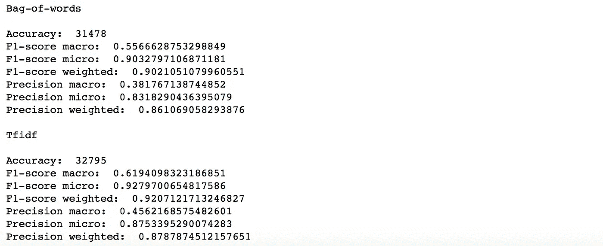

F1 分数加权和说明数据不平衡的宏看起来不错。让我们检查输出、预测标签和实际标签。我们需要用实际的标签替换一次性编码的标签来进行解释。接下来让我们对 tf-idf 模型进行预测。

```
test_predictions = classifier_tfidf.predict(X_test_tfidf)
```

```
for i in range(90,97):
    print('\ny_label: ', test_labels[i], '\ny_pred: ', test_pred_labels[i])print('\ny_label: ', test_labels[i], '\ny_pred: ', test_pred_labels[i])
```

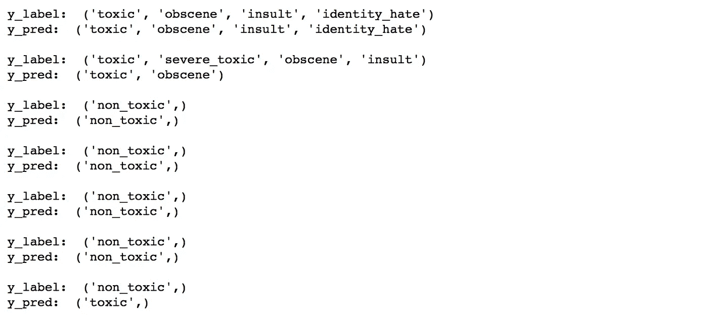

成绩不算太差，但还可以做得更好。请尝试使用超参数调整和不同的分类器来检查模型的性能。希望你喜欢阅读。

如果你感兴趣，我留下了构建单词云图像的代码。

# 带 Twitter 掩码的词云

```
comments_join = ' '.join(POPULAR_WORDS)from scipy.misc import imread
from wordcloud import WordCloud, STOPWORDStwitter_mask = imread('twitter.png', flatten=True)

wordcloud = WordCloud(
                      stopwords=STOPWORDS,
                      background_color='white',
                      width=1800,
                      height=1400,
                      mask=twitter_mask
            ).generate(comments_join)plt.figure(figsize = (12, 12), facecolor = None) 
plt.imshow(wordcloud)
plt.axis("off")
plt.savefig('twitter_comments.png', dpi=300)
plt.show()
```

带代码的 jupyter 笔记本，请点击[此处](https://github.com/snehalnair/bow_tfidf)。

参考资料:

[https://www.coursera.org/learn/language-processing/home](https://www.coursera.org/learn/language-processing/home/week/1)