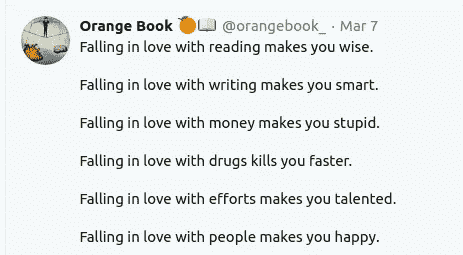

# 使用 Vowpal Wabbit 的多标签分类:从为什么到如何！

> 原文：<https://towardsdatascience.com/multi-label-classification-using-vowpal-wabbit-from-why-to-how-c1451ca0ded5?source=collection_archive---------30----------------------->

## 如何制定多标签分类任务并使用 Vowpal Wabbit 求解


由[伊利亚·巴甫洛夫](https://unsplash.com/@ilyapavlov?utm_source=unsplash&utm_medium=referral&utm_content=creditCopyText)在 [Unsplash](https://unsplash.com/s/photos/technology?utm_source=unsplash&utm_medium=referral&utm_content=creditCopyText) 上拍摄

## 什么是多标签分类？

想想你最近读的一篇文章/推文，如果你被要求标记它！

大概你会想出科技、政治、时尚等标签。考虑这条推文，自己尝试一下。



来源:[https://twitter.com/orangebook_](https://twitter.com/orangebook_)

它可以被标上自助，沉思，凌晨 3 点的想法！和许多其他人。不能说其中有一个是最好的。他们每个人都是对的，你只需要一个视角！

一个标签可能比其他的更合适，但是你不能只有一个标签。我们稍后将回到这个话题。

现在这样的问题在我们的生活中经常出现，更多的例子有:

*   根据图像的内容给图像加标签:(天空、房子、草地)
*   电影的类型分类:(动作、冒险、犯罪)
*   标记堆栈溢出中提出的问题。

## 那么多类和多标签分类有什么区别呢？

当有多个类别，但每个实例只分配了其中一个类别，或者类别是互斥的，这就是**多类别分类**。

当每个实例可以被分配多个类别或者类别彼此相关时，这就是**多标签分类。**

## 解决多标签分类问题的标准实践

Scikit-Learn 为多标签分类提供了单独的库 [Scikit-Multilabel](http://scikit.ml/) 。我不会深入本库提供的标准算法的细节，因为那样会分散我对博客目标的注意力。

您可以看看下面的文章来方便地使用这个库:

*   [https://www . analyticsvidhya . com/blog/2017/08/introduction-to-multi-label-class ification/](https://www.analyticsvidhya.com/blog/2017/08/introduction-to-multi-label-classification/)
*   [http://scikit.ml/multilabeldnn.html](http://scikit.ml/multilabeldnn.html)基于 DL 的多标签分类
*   [https://towards data science . com/journey-to-the-center-of-multi-label-class ification-384 c 40229 BFF](/journey-to-the-center-of-multi-label-classification-384c40229bff)

# 什么是 Vowpal Wabbit，为什么我们需要它？

它是由微软研究院(之前由雅虎公司)开发的一个库，用于解决机器学习问题。

> Vowpal Wabbit 提供了一种快速、灵活、在线和主动的学习解决方案，使您能够解决复杂的交互式机器学习问题。

从我的经历来看，这个图书馆与众不同的两点是**速度和在线学习。**

> 在计算机科学中，**在线机器学习**是一种机器学习方法，其中数据以连续的顺序变得可用，并用于在每一步更新我们对未来数据的最佳预测，这与批量学习技术相反，批量学习技术通过一次性学习整个训练数据集来生成最佳预测。

## 让我们深入研究我们的问题

为了更好地理解 Vowpal Wabbit 和多标签分类，让我们解决将标签分配给简短文本描述的问题。

我们将使用来自[极限分类库](http://manikvarma.org/downloads/XC/XMLRepository.html)的 *Bibtex* 数据集，该分类库为单个文本提供了 1836 个二进制特征和 159 个可能的标签。

使用 Vowpal Wabbit 的多标签分类代码

为了获得更广泛的视图，你可以前往 [Github 链接](https://github.com/Shivanshmundra/Contextual_Bandits_VowpalWabbit/blob/master/Cost-Sensitive%20Multilabel%20Classification%20.ipynb)。

正如你可能已经看到的，只要对每个例子迭代一次，也是以在线的方式和极快的速度，模型收敛到很好的精度。

让我们了解一下这里使用的算法(请在继续下一步之前阅读代码)。

# 成本敏感的多类分类

这里，不是只有一个正确的标签(而所有其他的都不正确)，而是 K 个不同标签中的每一个都有不同的成本。对于每个例子，你也可以有不同的“允许”标签。与上述相同的成本敏感训练集是:

```
1\. 1:0 2:1 3:1 4:1 | a b c
2\. 1:1 2:1 3:0 4:1 | b c d
```

第一行意味着标签 1 的成本为零，标签 2、3 和 4 的成本都为一。“a、b、c”是与示例相关联的二元特征。你可以只陈述存在的特征，而忽略不存在的特征。

在内部， *csoaa* 做了一些与你想象不同的事情。这个问题归结为回归问题。如果有 K 个可能的标签，它将构建 K 个*回归*问题，其中输入是要素的(基于标签的)版本，输出是该标签的成本。

然后在测试时，选择回归量给出最低值(预测成本)的标签。

这篇博客的目的不是寻找提高准确率的方法，而是介绍这个不同的机器学习世界(多标签分类)以及如何有效地使用 Vowpal Wabbit 来解决这个问题。

在上述解决方案中有许多可能的修改/改进，例如:改变损失函数、通过数据的次数、优化策略、改变每个标签的成本等。

要了解更多信息，您可以点击下面的链接:

*   [*http://users.umiacs.umd.edu/~hal/tmp/multiclassVW.html*](http://users.umiacs.umd.edu/~hal/tmp/multiclassVW.html)
*   *[*https://github . com/VowpalWabbit/vowpal _ wabbit/wiki/Cost-Sensitive-One-again-All-(csoaa)-multi-class-example*](https://github.com/VowpalWabbit/vowpal_wabbit/wiki/Cost-Sensitive-One-Against-All-(csoaa)-multi-class-example)*
*   *[*http://manikvarma.org/downloads/XC/XMLRepository.html*](http://manikvarma.org/downloads/XC/XMLRepository.html)*
*   *[*https://vail lab . blogspot . com/2014/06/mutlti-label-class ification-using . html*](https://vaillab.blogspot.com/2014/06/mutlti-label-classification-using.html)*

**如有任何疑问或建议，欢迎随时 ping 我*😃。*还有，在*[*Twitter*](https://twitter.com/MundraShivansh)*和*[*Linkedin*](https://www.linkedin.com/in/shivansh-mundra-300849140/)*上找我。再见！！**