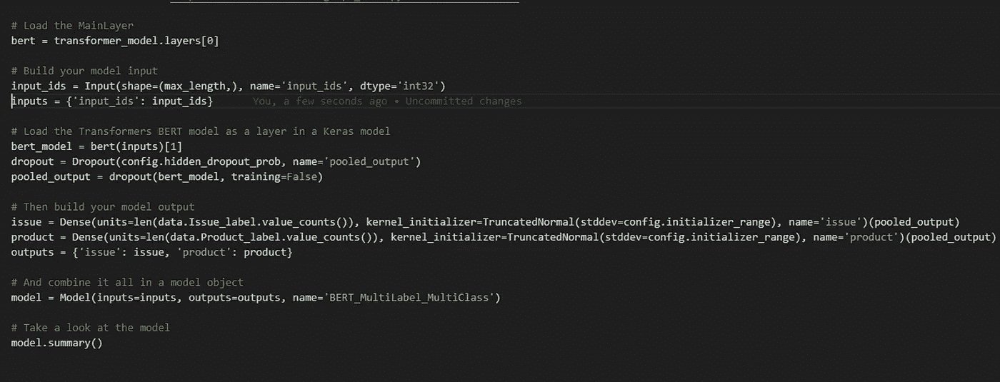
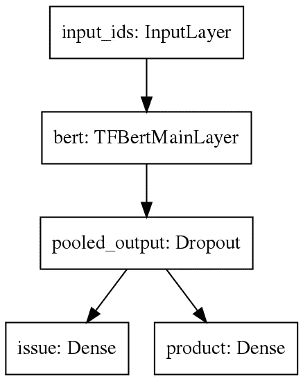

# 使用 BERT、Transformers 和 Keras 的多标签、多类别文本分类

> 原文：<https://towardsdatascience.com/multi-label-multi-class-text-classification-with-bert-transformer-and-keras-c6355eccb63a?source=collection_archive---------4----------------------->

## 在本文中，我将展示如何使用 [Huggingface Transformers](https://huggingface.co/transformers/) 库和 [Tensorflow Keras API](https://www.tensorflow.org/guide/keras/) 完成多标签、多类别的文本分类任务。这样，您将了解如何使用 Transformer 中的 BERT 模型作为使用 Keras API 构建的 Tensorflow 模型中的一个层。



使用 BERT、Transformers 和 Keras 的多标签、多类别文本分类

互联网上充满了文本分类的文章，其中大多数是 BoW 模型与某种 ML 模型的结合，通常解决二进制文本分类问题。随着 NLP 的兴起，特别是 BERT(如果你不熟悉 BERT，请看这里的[)和其他基于多语言转换器的模型，越来越多的文本分类问题现在可以得到解决。](/bert-explained-state-of-the-art-language-model-for-nlp-f8b21a9b6270)

然而，当涉及到使用 [Huggingface Transformers](https://huggingface.co/transformers/) 、 [BERT](https://github.com/google-research/bert) 和 [Tensorflow Keras](https://www.tensorflow.org/guide/keras/) 解决多标签、多类别文本分类问题时，文章的数量确实非常有限，就我个人而言，我还没有找到任何…还没有！

因此，在大量与 BERT、Keras 中的多标签分类或其他有用信息相关的博客帖子、教程和 GitHub 代码片段的帮助和启发下，我将向您展示如何构建一个工作模型，解决这个问题。

为什么使用拥抱脸变形金刚而不是谷歌自己的 BERT 解决方案？因为使用变压器很容易在不同型号之间切换，如伯特、阿尔伯特、XLnet、GPT-2 等。这意味着，您或多或少地“只是”在代码中用一个模型替换另一个模型。

## 从哪里开始

用数据。在寻找可以用于多标签多类别文本分类任务的文本数据时，我偶然发现了来自 data.gov 的[“消费者投诉数据库】](https://www.consumerfinance.gov/data-research/consumer-complaints/)。看起来很管用，所以我们就用这个。

接下来是探索性数据分析。显然，这对于正确理解数据的样子、可能存在的缺陷、数据的质量等等至关重要。但是我现在跳过这一步，只是因为这篇文章的目的纯粹是如何建立一个模型。

如果你不喜欢四处搜索，可以看看这两篇关于这个主题的文章: [NLP 第 3 部分|文本数据的探索性数据分析](/nlp-part-3-exploratory-data-analysis-of-text-data-1caa8ab3f79d)和[一个完整的文本数据的探索性数据分析和可视化](/a-complete-exploratory-data-analysis-and-visualization-for-text-data-29fb1b96fb6a)。

## 继续吧

我们有了数据，现在是编码部分。

首先，我们将加载所需的库。

```
#######################################
### -------- Load libraries ------- #### Load Huggingface transformers
from transformers import TFBertModel,  BertConfig, BertTokenizerFast# Then what you need from tensorflow.keras
from tensorflow.keras.layers import Input, Dropout, Dense
from tensorflow.keras.models import Model
from tensorflow.keras.optimizers import Adam
from tensorflow.keras.callbacks import EarlyStopping
from tensorflow.keras.initializers import TruncatedNormal
from tensorflow.keras.losses import CategoricalCrossentropy
from tensorflow.keras.metrics import CategoricalAccuracy
from tensorflow.keras.utils import to_categorical# And pandas for data import + sklearn because you allways need sklearn
import pandas as pd
from sklearn.model_selection import train_test_split
```

然后，我们将导入我们的数据，并围绕它展开讨论，使其符合我们的需求。没什么特别的。请注意，我们将仅使用数据集中的“消费者投诉叙述”、“产品”和“问题”列。“消费者投诉叙述”将作为我们模型的输入，“产品”和“问题”将作为我们的两个输出。

```
#######################################
### --------- Import data --------- #### Import data from csv
data = pd.read_csv('dev/Fun with BERT/complaints.csv')# Select required columns
data = data[['Consumer complaint narrative', 'Product', 'Issue']]# Remove a row if any of the three remaining columns are missing
data = data.dropna()# Remove rows, where the label is present only ones (can't be split)
data = data.groupby('Issue').filter(lambda x : len(x) > 1)
data = data.groupby('Product').filter(lambda x : len(x) > 1)# Set your model output as categorical and save in new label col
data['Issue_label'] = pd.Categorical(data['Issue'])
data['Product_label'] = pd.Categorical(data['Product'])# Transform your output to numeric
data['Issue'] = data['Issue_label'].cat.codes
data['Product'] = data['Product_label'].cat.codes# Split into train and test - stratify over Issue
data, data_test = train_test_split(data, test_size = 0.2, stratify = data[['Issue']])
```

接下来，我们将加载一些不同的变压器类。

```
#######################################
### --------- Setup BERT ---------- #### Name of the BERT model to use
model_name = 'bert-base-uncased'# Max length of tokens
max_length = 100# Load transformers config and set output_hidden_states to False
config = BertConfig.from_pretrained(model_name)
config.output_hidden_states = False# Load BERT tokenizer
tokenizer = BertTokenizerFast.from_pretrained(pretrained_model_name_or_path = model_name, config = config)# Load the Transformers BERT model
transformer_model = TFBertModel.from_pretrained(model_name, config = config)
```

在这里，我们首先加载一个控制模型、记号赋予器等的 BERT 配置对象。

然后，我们将在稍后的脚本中使用一个记号赋予器，将我们的文本输入转换成 BERT 记号，然后填充并截断到我们的最大长度。记号赋予器[已经被很好地记录了](https://huggingface.co/transformers/model_doc/bert.html#berttokenizer)，所以我不会在这里深入讨论。

最后，我们将加载 BERT 模型本身作为 BERT Transformers TF 2.0 Keras 模型(这里我们使用[12 层 bert-base-uncased](https://huggingface.co/transformers/pretrained_models.html) )。

## 现在是有趣的部分

我们准备好建立我们的模型。在变形金刚库中，有许多[不同的 BERT 分类模型可以使用](https://huggingface.co/transformers/model_doc/bert.html)。所有模型的母亲是简单地称为“BertModel”(py torch)或“TFBertModel”(tensor flow)的模型，因此也是我们想要的模型。

Transformers 库还附带了一个预构建的用于序列分类的 BERT 模型，称为“TFBertForSequenceClassification”。如果你看一下这里的代码[你会发现，他们从加载一个干净的 BERT 模型开始，然后简单地添加一个漏失层和一个密集层。因此，我们要做的只是简单地添加两个密集层，而不是只有一个。](https://huggingface.co/transformers/_modules/transformers/modeling_tf_bert.html#TFBertForSequenceClassification)

这是我们模型的样子:



基于 BERT、Transformer 和 Keras 模型的多标签多类别文本分类

更详细的模型视图:

```
Model: "BERT_MultiLabel_MultiClass"
___________________________________________________________________
Layer (type)      Output Shape       Param #    Connected to       
===================================================================
input_ids         [(None, 100)]      0                             
(InputLayer)
___________________________________________________________________
bert              (                  109482240  input_ids[0][0]    
(TFBertMainLayer)  (None, 100, 768),
                   (None, 768)
                  )
___________________________________________________________________
pooled_output     (None, 768)        0          bert[1][1]         
(Dropout)
___________________________________________________________________
issue             (None, 159)        122271     pooled_output[0][0]
(Dense)
___________________________________________________________________
product           (None, 18)         13842      pooled_output[0][0]
(Dense)
===================================================================
Total params: 109,618,353
Trainable params: 109,618,353
Non-trainable params: 0
___________________________________________________________________
```

如果你想更多地了解 BERTs 建筑本身，[看看这里](https://medium.com/analytics-vidhya/understanding-bert-architecture-3f35a264b187)。

现在我们有了模型架构，我们需要做的就是用代码编写它。

```
#######################################
### ------- Build the model ------- #### TF Keras documentation: [https://www.tensorflow.org/api_docs/python/tf/keras/Model](https://www.tensorflow.org/api_docs/python/tf/keras/Model)# Load the MainLayer
bert = transformer_model.layers[0]# Build your model input
input_ids = Input(shape=(max_length,), name='input_ids', dtype='int32')
inputs = {'input_ids': input_ids}# Load the Transformers BERT model as a layer in a Keras model
bert_model = bert(inputs)[1]
dropout = Dropout(config.hidden_dropout_prob, name='pooled_output')
pooled_output = dropout(bert_model, training=False)# Then build your model output
issue = Dense(units=len(data.Issue_label.value_counts()), kernel_initializer=TruncatedNormal(stddev=config.initializer_range), name='issue')(pooled_output)
product = Dense(units=len(data.Product_label.value_counts()), kernel_initializer=TruncatedNormal(stddev=config.initializer_range), name='product')(pooled_output)
outputs = {'issue': issue, 'product': product}# And combine it all in a model object
model = Model(inputs=inputs, outputs=outputs, name='BERT_MultiLabel_MultiClass')# Take a look at the model
model.summary()
```

## 让魔法开始吧

然后剩下要做的就是编译我们的新模型，并根据我们的数据进行拟合。

```
#######################################
### ------- Train the model ------- #### Set an optimizer
optimizer = Adam(
    learning_rate=5e-05,
    epsilon=1e-08,
    decay=0.01,
    clipnorm=1.0)# Set loss and metrics
loss = {'issue': CategoricalCrossentropy(from_logits = True), 'product': CategoricalCrossentropy(from_logits = True)}
metric = {'issue': CategoricalAccuracy('accuracy'), 'product': CategoricalAccuracy('accuracy')}# Compile the model
model.compile(
    optimizer = optimizer,
    loss = loss, 
    metrics = metric)# Ready output data for the model
y_issue = to_categorical(data['Issue'])
y_product = to_categorical(data['Product'])# Tokenize the input (takes some time)
x = tokenizer(
    text=data['Consumer complaint narrative'].to_list(),
    add_special_tokens=True,
    max_length=max_length,
    truncation=True,
    padding=True, 
    return_tensors='tf',
    return_token_type_ids = False,
    return_attention_mask = False,
    verbose = True)# Fit the model
history = model.fit(
    x={'input_ids': x['input_ids']},
    y={'issue': y_issue, 'product': y_product},
    validation_split=0.2,
    batch_size=64,
    epochs=10)
```

一旦模型被拟合，我们就可以根据我们的测试数据对它进行评估，看看它的表现如何。

```
#######################################
### ----- Evaluate the model ------ #### Ready test data
test_y_issue = to_categorical(data_test['Issue'])
test_y_product = to_categorical(data_test['Product'])
test_x = tokenizer(
    text=data_test['Consumer complaint narrative'].to_list(),
    add_special_tokens=True,
    max_length=max_length,
    truncation=True,
    padding=True, 
    return_tensors='tf',
    return_token_type_ids = False,
    return_attention_mask = False,
    verbose = True)# Run evaluation
model_eval = model.evaluate(
    x={'input_ids': test_x['input_ids']},
    y={'issue': test_y_issue, 'product': test_y_product}
)
```

事实证明，我们的模型表现得相当好，具有相对较好的准确性。尤其是考虑到我们的输出“产品”由 18 个标签组成，而“问题”由 159 个不同的标签组成。

```
####################################################################
Classification metrics for Product precision    recall  f1-score   support
    Bank account or service       0.63      0.36      0.46      2977
Checking or savings account       0.60      0.75      0.67      4685
              Consumer Loan       0.48      0.29      0.36      1876
                Credit card       0.56      0.42      0.48      3765
Credit card or prepaid card       0.63      0.71      0.67      8123
           Credit reporting       0.64      0.37      0.47      6318
   Credit reporting, credit 
  repair services, or other
  personal consumer reports       0.81      0.85      0.83     38529
            Debt collection       0.80      0.85      0.82     23848
    Money transfer, virtual 
 currency, or money service       0.59      0.65      0.62      1966
            Money transfers       0.50      0.01      0.01       305
                   Mortgage       0.89      0.93      0.91     13502
    Other financial service       0.00      0.00      0.00        60
                Payday loan       0.57      0.01      0.02       355
Payday loan, title loan, or
              personal loan       0.46      0.40      0.43      1523
               Prepaid card       0.82      0.14      0.24       294
               Student loan       0.83      0.87      0.85      5332
      Vehicle loan or lease       0.49      0.51      0.50      1963
           Virtual currency       0.00      0.00      0.00         3 accuracy                           0.76    115424
                  macro avg       0.57      0.45      0.46    115424
               weighted avg       0.75      0.76      0.75    115424####################################################################
Classification metrics for Issue (only showing summarized metrics)precision    recall  f1-score   support
                   accuracy                           0.41    115424
                  macro avg       0.09      0.08      0.06    115424
```

## 下一步做什么？

但是，您可以做很多事情来提高这个模型的性能。在这里，我尽量做到简单，但如果您希望获得更好的性能，请考虑以下几点:

*   摆弄优化器中设置的超参数，或者改变优化器本身
*   使用消费者投诉数据库数据训练一个语言模型——要么从头开始，要么通过微调现有的 BERT 模型([在这里看看](https://github.com/huggingface/transformers/tree/master/examples/language-modeling))。然后加载该模型，而不是这里使用的“bert-base-uncased”。
*   使用多个输入。在我们当前的设置中，我们只使用令牌 id 作为输入。然而，如果我们在输入中加入注意力屏蔽，我们可能会获得一些性能提升。它非常简单，看起来像这样:

```
# Build your model inputinput_ids = Input(shape=(max_length,), name='input_ids', dtype='int32')attention_mask = Input(shape=(max_length,), name='attention_mask', dtype='int32')inputs = {'input_ids': input_ids, 'attention_mask': attention_mask}
```

*(记得在拟合你的模型时添加 attention_mask，并在你的 tokenizer 中设置 return_attention_mask 为 True。更多关于注意力面具的信息，* [*看这里*](https://huggingface.co/transformers/glossary.html#attention-mask) *。此外，我在下面的要点中添加了注意力面具，并将其注释掉，以供你的*灵感*。)*

*   尝试另一个模型，如艾伯特、罗伯塔、XLM，甚至是自回归模型，如 GPT-2 或 XLNet——所有这些都可以通过 Transformers 库轻松导入到您的框架中。您可以在此处找到所有直接可用型号的概述[。](https://huggingface.co/transformers/model_summary.html)

就是这样——希望你喜欢这个如何用 BERT、Transformer 和 Keras 进行“多标签、多类文本分类”的小演示。如果你有任何反馈或问题，请在下面的评论中提出。