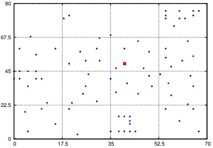

# 多目标车辆路径优化

> 原文：<https://towardsdatascience.com/multi-objective-vehicle-route-optimisation-6824264da636?source=collection_archive---------29----------------------->

## 遵循从完整的基础到先进的路线优化解决方案的学习路径。

作者图片

路线优化是运输规划中最重要的方面之一，因为它确保货物总是准时到达，并以尽可能低的成本和能耗执行。然而，对于现实生活中的场景，我们需要考虑很多变量。

[来源](https://www.google.com/url?sa=i&url=https%3A%2F%2Fblog.locus.sh%2F8-points-for-a-successful-selection-of-a-route-optimization-software%2F&psig=AOvVaw3xMJATtIoGowGk_4jo3UH-&ust=1595150001330000&source=images&cd=vfe&ved=0CAIQjRxqFwoTCMiQ453x1eoCFQAAAAAdAAAAABAD):一个路线优化软件能提供什么？

在这个不幸的 COVID 期间，我们要处理来自分散在一个城市、一个国家甚至整个世界的各种客户的大量电子商务订单，然后出现了大量的变量，这些变量根本无法在实际时间内使用传统方法解决。随着人工智能、机器学习和云数据的最新发展，路线优化的整个游戏已经开始改变。人工智能不断检索数据，从中学习，并寻找改进的方法，以确保司机的最佳路线。

在这个系列中，我们将经历一个学习多目标路线优化的奇妙旅程，从线性方法到高级深度强化学习:

1.车辆路径问题及多目标优化

2.遗传算法

3.蚁群优化

4.迭代局部搜索

5.使用 CPLEX-python 的基于 MILP 的方法

6.深度强化学习

在这篇博客中，我们将深入探讨带有一些附加约束的车辆路径问题的详细描述、多目标优化的概念以及本系列将介绍的方法的简要概述。

# 介绍

V 车辆路径问题(VRP)可以定义为在满足一些约束条件的情况下，寻找从一个或几个仓库到多个客户的最优运送或收集路线的问题。这个问题可以推广到社会垃圾的收集、汽油运输车、货物和邮件的运送等，应用是无限的。

[来源](https://www.google.com/url?sa=i&url=https%3A%2F%2Fcarpalfleet.com%2Froute-optimization-software%2F&psig=AOvVaw3lyYmD6rcj7RH0lCjcjLsH&ust=1595002133957000&source=images&cd=vfe&ved=0CAIQjRxqFwoTCOizkI-U0uoCFQAAAAAdAAAAABAD):为什么要进行路线优化？

# 车辆路径问题

在传统的 VRP 中，顾客和仓库的位置是预先知道的，这有助于我们在上述路线中确定路线。为了简化问题的定义，让我们考虑一个图 *G=(V，A)* ，其中 *V={1……n}* 是一组顶点(客户)，仓库位于顶点 1，而 *A* 是一组弧线(路线)。除此之外，我们假设停车场有一定数量的可用车辆，并为每辆车分配初始成本。这些车辆通过以下方式覆盖客户之间的路线:

(I)每个城市只被一辆车访问一次

(ii)所有车辆路线的起点和终点都在停车场

[来源](https://neo.lcc.uma.es/vrp/vehicle-routing-problem/):上述配方的图示

然而，平心而论，上述问题虽然包括几个变量和指令，但仍然缺乏直接应用于任何地方的现实感，因此我们转向一种更一般化形式的 VRP，称为车辆路线安排和调度问题或 **VRPTW** (带时间窗的车辆路线安排问题)。我们的目标是优化车队的使用，车队必须多次停车为一组客户提供服务，并指定每辆车应该为哪些客户提供服务以及以何种顺序提供服务，以使成本最小化，同时遵守**车辆容量**和**服务时间限制。**

因此，上述定义可以修改为有向图 *G=(V，E)* ，由一组 n 个客户+ 1 个仓库组成，每个客户只能在指定的时间间隔或时间窗口内到达，以及一组具有非负权重的弧 *E* 代表行程距离。每辆车的最大载客量为 Q，所有客户的请求服务规模为 *qi*

# 多目标方法

在确定问题之后，现在的任务是优化车辆行驶的路线，以获得最低的成本。然而，在我们开始之前，让我们先熟悉一下**多目标优化**的概念。这是一个多准则决策的领域，涉及数学优化问题，涉及一个以上的目标函数同时优化。它主要用于当我们的目标相互冲突，并且最优决策位于它们的折衷之间时。与单目标相比，多目标优化的另一个结果是我们获得一组最优解，而不是单个解，所有这些融合在一起，使多目标方法更适合现实世界的情况。

作者图片:多目标优化是必要的！

我们将在场景中考虑的目标是分配给任务的**车辆数量**和穿越路线所需的**总成本**。时间延迟将在成本函数中用额外的**延迟成本**来处理。上图将整个过程概括为两个部分，即初始随机解的生成，将这些随机解收敛以获得一组非支配解。重复这个过程，直到获得帕累托最优集合。

作者的图像:多目标解决方案的表示

# 各种方法概述

乍看之下，VRP 似乎并不难解决，因为人们总是可以通过确定所有可能的路线并选择最便宜的路线来遵循蛮力方法来解决问题。那么这种方法有什么问题呢？原来这个过程叫做*枚举*，只对非常小的问题可行。据报道，VRP 是一个 NP-hard 问题，这意味着求解时间随着规模的增加而呈天文数字增长。对于 VRP 来说，可能的解决方案有 n 个！，这种阶乘的增长是时间的巨大增长的原因。下表显示了每秒处理十亿次计算的计算机求解 VRP 的预计时间。

作者图片

大多数现实世界的问题涉及大量的客户，因此我们需要转向其他方法，比如元启发式方法来解决问题。这些都是从*‘启发式’*和*‘元’——一个更高层次或更高层次的意思中衍生出来的。*这些方法在生成随机化和局部搜索之间进行权衡。解决方案的质量在更短的时间内得到保证。此外，也不能保证这种方法会给我们提供一个最优解。元启发式算法的两个主要组成部分是探索和利用。前者处理不同解的生成，以在全局范围内探索搜索空间，而后者负责搜索局部区域，知道该区域中存在好的解。在这两者之间找到一个好的平衡会导致一个好的算法收敛，并给出最接近全局最优的解

作者图片:这里使用的元启发式方法

另一种可以解决这个 NP 难题的方法是强化学习。近来，这个领域有了巨大的发展，尤其是在 Deepmind 通过 AlphaZero 计划取得成功之后。一个通用的 RL 模型由三个主要部分组成，即:- **状态**、**主体**和**环境**。该模型使用一系列的奖励和惩罚作为在特定环境中给定状态下主体所采取行动的积极或消极行为的信号。代理人的主要目标是最大化总的累积报酬。下图说明了 RL 模型的**动作反馈**回路:

[来源](https://www.google.com/imgres?imgurl=https%3A%2F%2Fwww.kdnuggets.com%2Fimages%2Freinforcement-learning-fig1-700.jpg&imgrefurl=https%3A%2F%2Fwww.kdnuggets.com%2F2018%2F03%2F5-things-reinforcement-learning.html&tbnid=ivmsD3gf5LO7WM&vet=12ahUKEwiuntH5ktLqAhU9KrcAHaO2DP4QMygAegUIARCvAQ..i&docid=ciSCJdUOasdOyM&w=700&h=270&q=reinforcement%20learning%20images&ved=2ahUKEwiuntH5ktLqAhU9KrcAHaO2DP4QMygAegUIARCvAQ):通用 RL 模型

# 资料组

整个教程是使用 [Solomon 数据集](http://web.cba.neu.edu/~msolomon/problems.htm)进行的，它由三种不同的客户分布组成；

(一)随机化或 R 型

[来源](http://eprints.nottingham.ac.uk/13713/1/thesis.pdf):红点代表单个车厂，其他为客户

客户随机分布在整个城市，车辆从仓库出发。这相当于在一个城市中的不同商店需要交付货物。

(二)集群或 C 型

[来源](http://eprints.nottingham.ac.uk/13713/1/thesis.pdf):红点代表单个仓库，其他为客户

这是一个有趣的案例，其中特定的数据群随机分布在整个城市中，就像城市中有组织的地区和社会，用于送货上门或垃圾收集等基本服务。

(iii)随机和群集或 RC 类型。

[来源](http://eprints.nottingham.ac.uk/13713/1/thesis.pdf):红点代表单个仓库，其他为客户

这种特殊类型是上述两种方法的组合，其中地理位置以聚类和随机的形式分布。

根据它们的时间窗口的长度，它们被进一步分成两个子类别:短调度和长调度

# 摘要

在详细描述了我们在 VRP 问题上所面临的问题，并简要概述了本系列将采用的方法之后，我们将进入本系列的下一部分，深入讨论我们的第一个元启发式方法:遗传算法。在这里，我们将详细阐述应用框架的细节，并详细解释选择、变异和交叉的各个步骤。

真诚感谢[萨纳特·K](https://www.linkedin.com/in/sarnath/)、[斯巴纳·拉纳](https://www.linkedin.com/in/subarna-rana/)和[拉维·兰詹](https://www.linkedin.com/in/ravi-ranjan-03/)对这个项目的指导，特别感谢[拉维·兰詹](https://www.linkedin.com/in/ravi-ranjan-03/)在这个系列中的灵感。