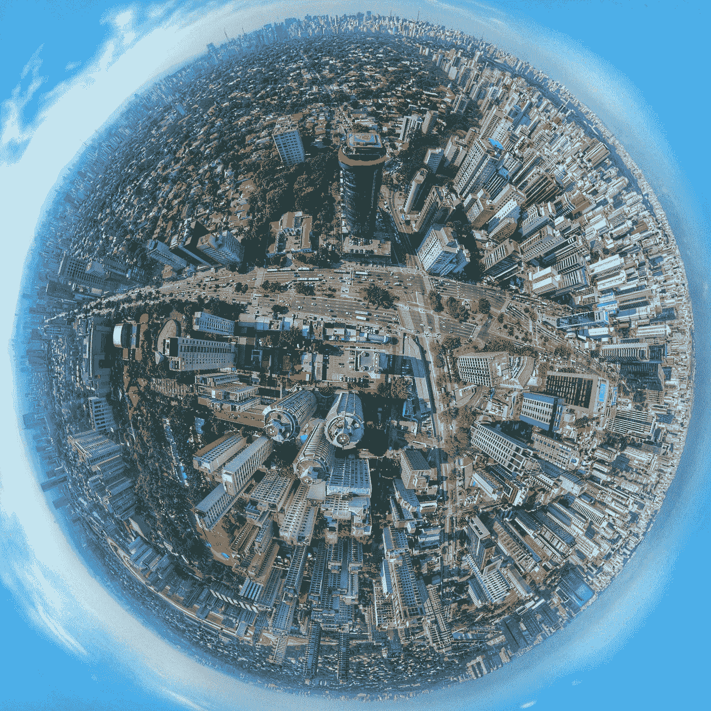
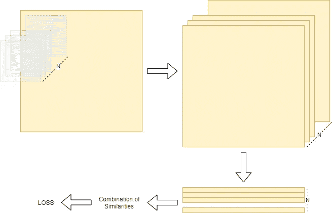

# 多视角神经网络——一种无监督的深度度量学习算法

> 原文：<https://towardsdatascience.com/multi-perspective-neural-networks-an-unsupervised-deep-metric-learning-algorithm-54c4a7c93e3?source=collection_archive---------39----------------------->

## 一种学习生成嵌入的无监督深度度量学习算法。

***链接:*** [演示视频](https://www.youtube.com/watch?v=zIReaxDhfcQ) & [Github 资源库](https://github.com/evrimozmermer/filter_distinguisher)

想象你是一个刚刚睁开眼睛看世界的婴儿。想象一下缺乏意识，想象一下什么都不知道。你连怎么看东西都不知道，更别说怎么识别东西了。现在，回到你的意识中来。你可以看到，你可以认出你周围的任何物体，这些物体甚至会让你想起你的记忆。


克里斯蒂安·鲍文在 [Unsplash](https://unsplash.com?utm_source=medium&utm_medium=referral) 上拍摄的照片

但是，你是如何获得这些技能的呢？这是多视角神经网络(MPNN)的起点。

在我之前的文章中，我已经谈到了一种无监督学习算法，它可以学习创建有意义的特征作为输出的过滤器。帖子链接:[无监督学习的学习过滤器](/filter-learning-with-unsupervised-learning-6e72fd5057a9)。这篇文章是上一篇文章的延续。在这篇文章中将有三个部分，如逻辑和哲学，代码，测试。

## 逻辑和哲学



由 [sergio souza](https://unsplash.com/@serjosoza?utm_source=medium&utm_medium=referral) 在 [Unsplash](https://unsplash.com?utm_source=medium&utm_medium=referral) 上拍摄的照片

该算法基本上学会了将卷积层的输出彼此分解。当我们对图像应用卷积运算时，我们得到 NxRxC 矩阵，其中 N 是滤波器的数量，R 和 C 是行大小和列大小。在 MPNNs 中，卷积运算的输出中的 N 个层试图彼此分解。当最大相似性值低于预定阈值时，该级别的学习过程完成。之后，对下一级重复这一过程。最后，神经网络生成具有有意义特征的嵌入。



显示分解管道的图表(按作者)

我开始思考这次行动的哲学。我想到了与这个层分解操作相匹配的概念。我一直在寻找的概念是 ***视角。*** 人类试图学会用不同的视角看待事件、物体和其他一切，以便他们能够分析正在发生的事情。这不仅发生在高级抽象中，也发生在低级学习中。MPNN 试图做的是将这种视角生成应用于视觉中的低级学习过程。

## 密码

我在以前的帖子中分享了代码。但是，我已经做了一些改变，所以我想在这个帖子里再次分享。完整的代码仍然可以在[的 GitHub 库](https://github.com/evrimozmermer/filter_distinguisher)中找到。

一个单独的卷积图层类。

```
class ConvLayer(torch.nn.Module):
    def __init__(self, in_channels, out_channels, kernel_size, stride):
        super(ConvLayer, self).__init__()
        self.conv2d = torch.nn.Conv2d(in_channels, out_channels, kernel_size, stride)def forward(self, x):
        out = self.conv2d(x)
        return out
```

一个单一的卷积级类。级别是分解发生的地方。

```
class SSNet(torch.nn.Module):
    def __init__(self,in_filters, out_filters):
        super(SSNet, self).__init__()
        self.conv1 = ConvLayer(in_filters, 64, kernel_size = 5, stride = 1)
        self.conv2 = ConvLayer(64, out_filters, kernel_size = 1, stride = 1)
        self.pool = nn.AvgPool2d(2, stride=2)
        self.relu = torch.nn.ReLU()

    def forward(self, x):
        out = self.pool(self.conv2(self.relu(self.conv1(x))))
        return out
```

包含几级 SSNet 类的 MPNN 类。

```
class SSNetMultiple(torch.nn.Module):
    def __init__(self,levels = 5):
        super(SSNetMultiple, self).__init__()
        self.children = []
        for cnt in range(levels):
            if cnt == 0:
                in_filters, out_filters = 3,16
            elif cnt == levels-1:
                in_filters, out_filters = 16,16
            else:
                in_filters, out_filters = 16,16
            self.children.append(SSNet(in_filters, out_filters))

        self.main = nn.Sequential(*self.children)

    def forward(self, x, queue = 1):
        outs = [x]
        for cnt,child in enumerate(self.main):
            if cnt<queue:
                outs.append(child(outs[-1]))
        return outs[-1]
```

规范化操作。如果我们想要获得相似性值 1 作为最大相似性，归一化是必要的。

```
def normalize(vector):
    norm = vector.norm(p=2, dim=0, keepdim=True)
    vector_normalized = vector.div(norm.expand_as(vector))
    return vector_normalized
```

相似性函数用于提取和组合层的相似性，以便我们可以计算损失。

```
def sim_func(layers):
    combinations = list(itertools.combinations(np.arange(0,layers.shape[1]), 2))
    similarity_vector = torch.empty(len(combinations))
    for cnt,comb in enumerate(combinations):
        first = layers[0][comb[0]].flatten()
        second = layers[0][comb[1]].flatten()
        first_norm = normalize(first)
        second_norm = normalize(second)
        similarity_vector[cnt] = torch.matmul(first_norm,second_norm.T)
    return similarity_vector
```

用分解层数定义 MPNN 实例。

```
model = SSNetMultiple(levels = 4)
```

对于数据集，我在上一篇文章中使用了 MNIST。这一次，我们将使用从 YouTube 下载的视频。

视频可在链接中找到:[西班牙伊比沙岛的诱惑](https://www.youtube.com/watch?v=axqSGXU5qIw)

为了从视频中捕捉帧，我使用了 OpenCV。我们需要捕捉帧，应用中心裁剪，调整大小，并转换到 PyTorch 张量。

```
def cam_to_tensor(cam):
    if cam.isOpened():
        ret, frame_ = cam.read()
    else:
        cam.release()
        cam = cv2.VideoCapture(video_source)
        ret, frame_ = cam.read()
    frame = cv2.cvtColor(frame_, cv2.COLOR_BGR2RGB)
    frame_pil = Image.fromarray(frame)
    image = transform(frame_pil)
    return image, frame_, camtransform=transforms.Compose([
                            transforms.CenterCrop((360,360)),
                            transforms.Resize((224,224)),
                            transforms.ToTensor()
                            ])
```

现在，所有的训练脚本。对于评论行，请检查我在以前的职位解释。链接可以在这篇文章的顶部找到。

首先，我们从视频中捕捉一帧。然后，我们准备好要提供给模型的帧。之后，模型训练分解的第一级。当最大相似值低于 0.3 时，我们开始训练下一级，以此类推。别忘了，视频中捕捉到的画面是城市旅游的场景。

```
lr = 0.02
optimizer = optim.SGD(model.parameters(), lr=lr)
lossfunc = nn.MSELoss()video_source = "./videoplayback.mp4"
cam = cv2.VideoCapture(video_source)loss_obs = 0
epoch = 0while epoch<4:
#    if epoch>0:
#        for cc,param in enumerate(model.main[epoch-1].parameters()):
#            print(epoch-1,"grad is deactivated")
#            param.requires_grad = True
    for cnt in range(0,120000):
        image, _, cam = cam_to_tensor(cam)

        optimizer.zero_grad()
        out = model(image.unsqueeze(0), queue = epoch+1)
        sim_vec = sim_func(out)
        loss = lossfunc(sim_vec, torch.zeros(sim_vec.shape))
        loss_obs_ = torch.max(torch.abs(sim_vec-torch.zeros(sim_vec.shape)))
        loss_obs += loss_obs_
        loss.backward()
        optimizer.step()
        print("Epoch: {}\tSample: {}\tLoss: {}\tLR: {}".format(epoch,cnt,loss_obs_,optimizer.param_groups[0]["lr"]))if cnt%20 == 0 and cnt!=0:
            loss_obs = loss_obs/20
            print("Epoch: {}\tSample: {}\tLoss: {}\tLR: {}".format(epoch,cnt,loss_obs,optimizer.param_groups[0]["lr"]))
            if loss_obs<0.30:
                epoch += 1
                break
            loss_obs = 0
```

## 试验

我们的模特学会了欣赏城市风景。我们如何观察它学到了什么？我们可以捕捉随机帧，并将这些帧与后面的帧进行比较。通过这样做，我们可以观察帧的相似性值，并看到帧中每个场景出现的效果。例如:如果有一个特定的对象，如人、窗户等。在锚定帧中，并且如果在随后的帧中存在该对象，即使场景已经改变，并且如果相似性值有点高，那么我们理解模型可以提取特征来帮助它识别场景中的该对象。

```
def generate_embedding(model,cam,queue = 3):
    image, frame, _ = cam_to_tensor(cam)
    embedding = model(image.unsqueeze(0), queue = queue).flatten()
    return embedding, framedef compare_samples(e1,e2):
    first_norm = normalize(e1.flatten())
    second_norm = normalize(e2.flatten())
    return torch.matmul(first_norm,second_norm.T).detach().numpy()embedding_list = []
def compare_continuous(model,cam,queue):
    min_sim = 1
    max_diff = 0

    font                   = cv2.FONT_HERSHEY_SIMPLEX
    bottomLeftCornerOfText = (10,100)
    fontScale              = 1
    fontColor              = (255,255,255)
    lineType               = 2

    last_sim_list = []
    cnt_f = 0
    while True:
        if cnt_f%300==0:
            e1, f1 = generate_embedding(model,cam,queue = queue)
            cv2.imshow('frame 1', f1)

        e2, f2 = generate_embedding(model,cam,queue = queue)
        embedding_list.append(e2.detach().numpy())
        embedding_list_np = np.array(embedding_list)
        std = np.std(embedding_list_np, axis=0)
        pca_idx = std.argsort()[-64:][::-1]

        e1_pca = e1[pca_idx.tolist()]
        e2_pca = e2[pca_idx.tolist()]

        sim = compare_samples(e1_pca,e2_pca)
        print(sim)

        cv2.putText(f2,'Similarity: {}'.format(sim), 
            bottomLeftCornerOfText, 
            font, 
            fontScale,
            fontColor,
            lineType)
        cv2.imshow('frame 2', f2)
        if cv2.waitKey(25) & 0xFF == ord('q'):
            break

        cnt_f += 1
```

还有播放按钮。

```
compare_continuous(model,cam,queue=5)
```

演示视频可以在[链接](https://www.youtube.com/watch?v=zIReaxDhfcQ)中找到。