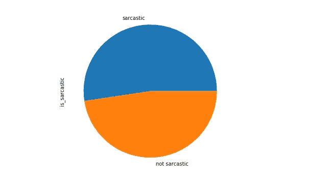
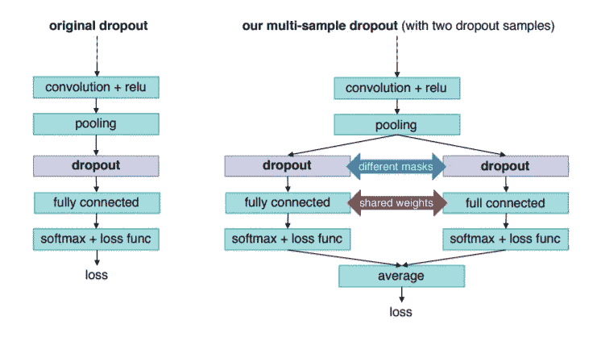
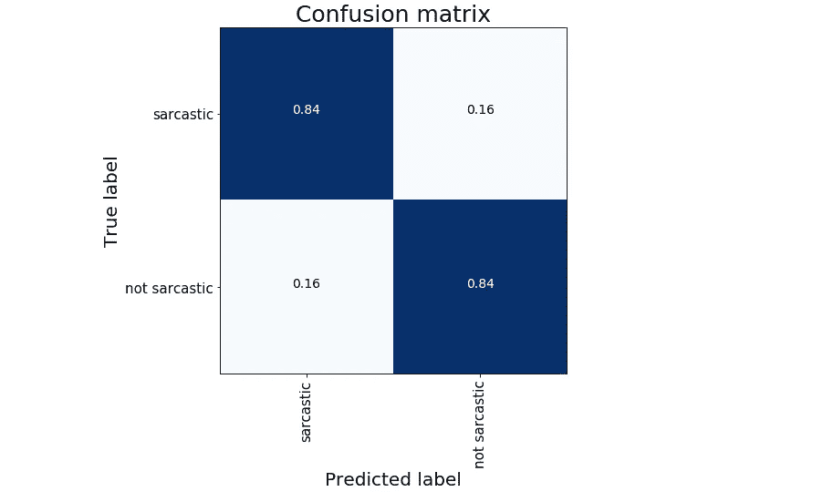

# Keras 中的多样本丢失

> 原文：<https://towardsdatascience.com/multi-sample-dropout-in-keras-ea8b8a9bfd83?source=collection_archive---------30----------------------->

## 加速训练和更好地推广你的神经网络


安布尔·沃尔夫在 [Unsplash](https://unsplash.com?utm_source=medium&utm_medium=referral) 上拍摄的照片

Dropout 是一种有效的正则化工具，用于避免深度神经网络的过拟合。它的工作非常简单，在训练过程中随机丢弃一部分神经元；结果，泛化发生了，因为以这种方式神经元不再相互依赖。Dropout 很容易适用于每一个神经网络结构，它也可以用于各种目的:例如，我在[的前一篇文章](/when-your-neural-net-doesnt-know-a-bayesian-approach-with-keras-4782c0818624)中用它来估计神经网络的不确定性。

在这篇文章中，我试图重现在[这篇文章](https://arxiv.org/abs/1905.09788)中的结果；引入了一种叫做多样本丢失的技术。正如作者所声明的，其范围是:

*   加快培训，提高对原有辍学学生的概括能力；
*   降低计算成本，因为大部分计算时间消耗在下面的层中(通常是卷积的或递归的),并且共享顶部层中的权重；
*   实现更低的错误率和损失。

# 数据

我想在一个 NLP 问题中应用论文中介绍的程序。我在 Kaggle 上发现了一个有价值的数据集。提供了[新闻标题数据集](https://www.kaggle.com/rmisra/news-headlines-dataset-for-sarcasm-detection#Sarcasm_Headlines_Dataset_v2.json)来进行句子中的讽刺检测。这个数据集中的文本是从网上收集的，带有讽刺或不讽刺的相关注释。



标签分发

# 模型

我选择 NLP 任务是因为它允许我们用一致的训练时间来尝试一个循环的模型结构。此外，在网络末端附近使用 dropout 和全连接层使得执行时间不显著。

*基本想法很简单:创建多个漏失样本，而不是只有一个，*如下图所示*。对于每个漏失样本，重复漏失层和漏失之后的几个层。“dropout”、“fully connected”和“softmax + loss func”层被复制。不同的掩模用于漏失层中的每个漏失样本，使得不同的神经元子集用于每个漏失样本。相反，参数(即，连接权重)在复制的完全连接的层之间共享。使用相同的损失函数(例如交叉熵)为每个丢失样本计算损失，并且通过对所有丢失样本的损失值求平均来获得最终损失值。该最终损失值用作训练期间优化的目标函数。将最后一个完全连接的层的输出平均值中具有最高值的类标签作为预测。*



原始漏失与多样本漏失([来源](https://arxiv.org/pdf/1905.09788.pdf))

在 Keras 语言中，所有的概念都可以用简单的代码实现:

```
def get_model(num):inp = Input(shape=(max_len,))
    emb = Embedding(len(tokenizer.word_index) + 1, 64)(inp)
    x = SpatialDropout1D(0.2)(emb)
    x = GRU(128, return_sequences=True, activation='relu')(x)
    out = GRU(32, activation='relu')(x)

    dense = []
    FC = Dense(32, activation='relu')
    for p in np.linspace(0.1,0.5, num):
        x = Dropout(p)(out)
        x = FC(x)
        x = Dense(y_train.shape[1], activation='softmax')(x)
        dense.append(x)

    out = Average()(dense)
    model = Model(inp, out)
    model.compile(loss='categorical_crossentropy', 
                  optimizer='adam', metrics=['accuracy'])

    return model
```

作为一个循环块，在模型的底部，我使用了 GRU 层。当模型被初始化时，丢失样本的数量被定义为参数。顶部完全连接的层共享每个漏失样本的权重。我用不同的掩码和不同的概率(从 0.1 到 0.5，不总是 0.5)构建了每个辍学样本(这是我允许自己采用的一个小变化)。网络有多个输出层，其数量与丢弃样本一样多。我们的网络的最后一步是一个平均层，它将前面的全连接层输出组合成一个简单的平均值。通过这种方式，最终损耗值计算为我们的丢失样本输出的平均值。

在训练阶段结束时，我们能够在测试集上实现大约 0.85%的最终准确度。



# 摘要

在这篇文章中，我试图重现一种叫做多样本丢失的技术。这是传统辍学的升级。它可以简单地应用于每一个神经网络结构(也可以应用于深度神经网络结构),并提供一种低成本的方式来更好地概括和改进结果，尤其是在分类任务中。

[**查看我的 GITHUB 回购**](https://github.com/cerlymarco/MEDIUM_NoteBook)

保持联系: [Linkedin](https://www.linkedin.com/in/marco-cerliani-b0bba714b/)

**参考文献**

加速训练和更好推广的多样本辍学:井上浩，IBM 研究，东京