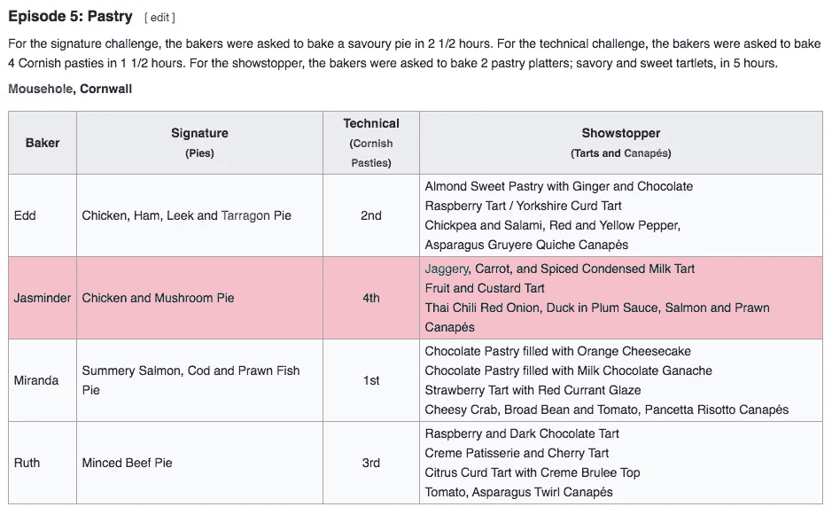
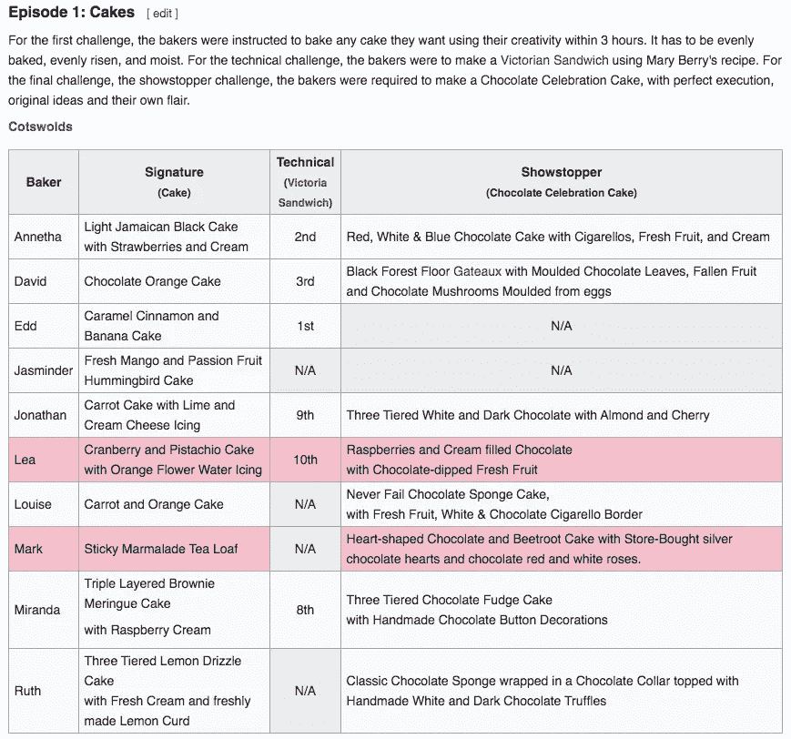
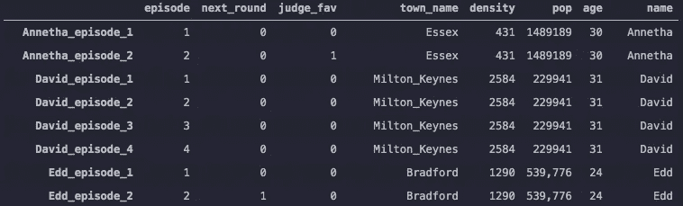
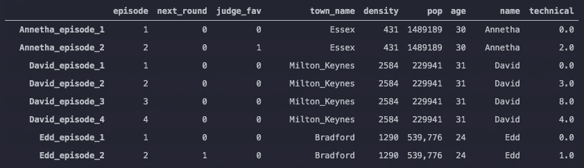

# 多表刮！

> 原文：<https://towardsdatascience.com/multi-table-scraping-7e104fe1707a?source=collection_archive---------70----------------------->

## 当你想从多篇文章中获取信息时该怎么做


克林特·王茂林在 [Unsplash](https://unsplash.com?utm_source=medium&utm_medium=referral) 上拍摄的照片

在过去的几个星期里，我一直在写如何从维基百科页面上抓取不同的东西。三周前，我写了一篇关于[如何从维基百科文章](/using-beautifulsoup-on-wikipedia-dd0c620d5861?source=friends_link&sk=ba9fd2d3ddd3d5dc2fab2433f6848b81)中抓取一张表格的文章。两周前，我写了关于如何使用一个脚本从维基百科的多个页面中抓取数据的文章。最后，上周我写了一篇关于 s [使用颜色而不是文本来显示数据的文章](/scraping-tables-without-text-881eb7ba12fc?source=friends_link&sk=db2c4f87fe794a17ce387de7950d707a)。本周，我将讨论如何从多个表中抓取数据。

正如我们过去三周所做的那样，我们将继续研究关于英国烘焙大赛第一季的文章。本周，我们的目标是了解面包师如何应对技术挑战。对于那些不熟悉节目形式的人来说，每一集面包师都要经历三个挑战，签名，技术和节目主持人。技术上的挑战是，所有的面包师根据其中一位评委写的食谱烘焙相同的东西，这些面包师被匿名评判，并从最差到最好排序。在文章中，技术挑战结果显示在一个表格中，如下所示:



从一个图表中获取信息非常容易，您可以回到我的第一篇文章来回顾一下它是如何工作的。但是，当你想获得所有剧集的技术挑战信息时，你会怎么做呢？这将在下面讨论

正如我们一直在做的，我们将从导入包和使用 BeautifulSoup 访问网站开始

```
import requests
from bs4 import BeautifulSoup
import pandas as pd
import re
import numpy as npurl='https://en.wikipedia.org/wiki/The_Great_British_Bake_Off_(series_1)'page = requests.get(url)soup = BeautifulSoup(page.content)
```

此外，为了获得我们的面包师名单，我们将首先隔离排除图(上周我们使用的那张)。

然后，我们将通过执行以下操作从图表中获取面包师的姓名:

我不会过多地讨论我是如何得到这个列表的，因为这不是本文的重点，但本质上，如果排除表中的一个项目具有属性“align”，那么该项目的文本就是一个参赛者姓名。此外，如果“align”在项目的样式部分，文本也是参赛者姓名。这些名字被添加到一个列表中，在名字被刮掉之后，它们都通过。rstrip()去掉任何换行符。这给我们留下了一个参赛者名单，如下所示:

```
['Edd', 'Ruth', 'Miranda', 'Jasminder', 'David', 'Jonathan', 'Annetha', 'Louise', 'Lea', 'Mark']
```

现在我们要做的就是拿到所有的烘焙技术结果。下面是我们将要浏览的完整代码:

下面是上面代码的最终输出:

```
{1: {'Edd': 0,
  'Ruth': 0,
  'Miranda': 0,
  'Jasminder': 0,
  'David': 0,
  'Jonathan': 0,
  'Annetha': 0,
  'Louise': 0,
  'Lea': 0,
  'Mark': 0},
 2: {'Annetha': 2.0,
  'David': 3.0,
  'Edd': 1.0,
  'Jasminder': 5.5,
  'Jonathan': 9.0,
  'Lea': 10.0,
  'Louise': 5.5,
  'Mark': 5.5,
  'Miranda': 8.0,
  'Ruth': 5.5},
 3: {'Annetha': 7.0,
  'David': 8.0,
  'Edd': 6.0,
  'Jasminder': 2.0,
  'Jonathan': 1.0,
  'Louise': 4.0,
  'Miranda': 3.0,
  'Ruth': 5.0},
 4: {'David': 4.0,
  'Edd': 1.0,
  'Jasminder': 5.0,
  'Jonathan': 6.0,
  'Miranda': 3.0,
  'Ruth': 2.0},
 5: {'David': 5.0, 'Edd': 3.0, 'Jasminder': 2.0, 'Miranda': 1.0, 'Ruth': 4.0},
 6: {'Edd': 2.0, 'Jasminder': 4.0, 'Miranda': 1.0, 'Ruth': 3.0}}
```

现在让我们进入上面的代码。前三行表示三个变量，“ep_counter”、“tech_results_list”和“ep_tech”，分别是零、空列表和字典。字典以键 1 开始，值是一个字典，其中键是参赛者的名字，值都是零。这样做是因为如果你使用这些数据来创建一个预测模型，你想从最近的前一集得到技术排名，而不是你正在分析的当前一集。显然，在第一集里，选手们没有进行技术烘焙，也没有被排名，因此他们都被分配了零分。

从这里，我们开始刮。前两行(5-6)查找所有包含“情节”的标题。然后我们创建两个空列表，名字和地点。名字将有来自一个给定的事件的选手名字，并且地点将有在所说的事件中选手如何被放置在技术烘焙中。在这里，我们执行以下操作:

本质上，我们正在做的是找到具有技术烘焙的剧集(上面的第 2 行)，然后我们获取整个表并将其命名为“result_tables ”,并向剧集计数器添加 1。最后，我们创建“ep_list”，这是一个从 2 开始到最后一集结束的数字列表(本例中为 6)。然后我们深入研究结果表:

我们首先找到包含参赛者姓名的列，我们这样做，“如果一个条目的文本中的一个单词与参赛者姓名列表中的一个条目匹配，则将该条目的文本添加到姓名列表中。”然后我们再看两栏，看看他们在技术上的排名。但是，您可能已经在文章中注意到了一个小问题:



在第一集中，只有前三名和后三名获得排名，所以我们不知道谁获得了第 4，第 5，第 6 和第 7 名。因此，当我将一个条目的文本追加到位置列表中时，我告诉 regex split 要么获取数字(可能有一个或两个数字)，要么获取“N/A”

考虑到这一点，我们如何处理像上面这样的缺失值呢？我选择的方法是取上述值的平均值，并将该平均值赋给缺失值，我使用下面的代码做到了这一点:

在这一点上，我将处理一个完整的位置列表，所以我首先说如果在位置列表中有一个“N/A ”,那么执行以下操作。然后我创建一个数字列表(num_list ),隔离列表中的所有数字，并使它们都是整数。然后，我取该列表的平均值(ave ),并用该平均值替换 place 列表中的所有“N/A”值。

现在我们有了一个名称列表，并且所有这些名称都有与之对应的位置编号，我们可以使用以下方法将它们放在一起:

```
place = [float(x) for x in place]episode_placement = dict(zip(names,place))tech_results_list.append(episode_placement)
```

首先，我们使位置列表中的所有项成为浮点型，因为它们以前是字符串，除非它们是代替“N/A”的平均值。然后，我们创建我们的字典(episode_placement ),其中键是参赛者的名字，值是它们在技术中的位置。然后，我们将该词典添加到我们一开始创建的技术结果列表中。

最后，我们能够更新我们开始时使用的 ep_tech 字典。如果您还记得，该字典以一个键和一个包含所有参赛者姓名的字典值 0 开始。现在我们有了以下剧集的所有信息，我们可以做以下事情:

```
ep_tech.update(dict(zip(ep_list,tech_results_list)))
```

通过这样做，我们获得了 ep_list，它计算了所有具有技术挑战的剧集，并使列表中的项目成为键，而值则是每集的名称和位置的字典。这导致了上面显示的输出:

```
{1: {'Edd': 0,
  'Ruth': 0,
  'Miranda': 0,
  'Jasminder': 0,
  'David': 0,
  'Jonathan': 0,
  'Annetha': 0,
  'Louise': 0,
  'Lea': 0,
  'Mark': 0},
 2: {'Annetha': 2.0,
  'David': 3.0,
  'Edd': 1.0,
  'Jasminder': 5.5,
  'Jonathan': 9.0,
  'Lea': 10.0,
  'Louise': 5.5,
  'Mark': 5.5,
  'Miranda': 8.0,
  'Ruth': 5.5},
 3: {'Annetha': 7.0,
  'David': 8.0,
  'Edd': 6.0,
  'Jasminder': 2.0,
  'Jonathan': 1.0,
  'Louise': 4.0,
  'Miranda': 3.0,
  'Ruth': 5.0},
 4: {'David': 4.0,
  'Edd': 1.0,
  'Jasminder': 5.0,
  'Jonathan': 6.0,
  'Miranda': 3.0,
  'Ruth': 2.0},
 5: {'David': 5.0, 'Edd': 3.0, 'Jasminder': 2.0, 'Miranda': 1.0, 'Ruth': 4.0},
 6: {'Edd': 2.0, 'Jasminder': 4.0, 'Miranda': 1.0, 'Ruth': 3.0}}
```

现在，假设您有一个预先存在的数据帧，其中有关于这一集的其他数据，例如参赛者的年龄和家乡信息，以及他们在之前几集的表现。我之前创建了这个数据帧，下面是它的快照:



下面是我如何用那本字典创建一个技术安置专栏:

浏览代码时，我首先创建了一个字典，其中的关键字是带有名称和剧集的元组，值是参赛者如何放置该剧集(第 1-4 行)。然后我创建一个空列表 placement_list，它将成为技术栏。然后，我创建了一个元组列表，其中每个元组都是上面所示数据帧(第 6–7 行)中每行的参赛者姓名和剧集编号。从那里，我说对于元组列表中的每一项，在 tech_tuple 字典中查找它的值，并将该值添加到位置列表中。现在我已经有了一个完整的技术职位列表，我只需创建一个新的列“technical”并将其分配给职位列表。这就是我们如何得到以下结果的:



在本文中，我展示了如何查看页面的许多不同区域，而不仅仅是页面的一个图表或部分。维基百科页面的格式一般来说是可读的，并且便于用户理解，但这也意味着你可能正在寻找的数据需要被格式化和压缩。通过这样做，您可以获取可读信息并使其可处理。