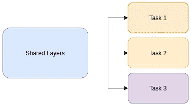

# 使用 Pytorch 和 FastAI 进行多任务学习

> 原文：<https://towardsdatascience.com/multi-task-learning-with-pytorch-and-fastai-6d10dc7ce855?source=collection_archive---------7----------------------->

## 使用相同的模型预测年龄、性别和种族。

阿纳斯塔西娅·舒拉耶娃在[像素](https://www.pexels.com/photo/woman-carrying-her-baby-and-working-on-a-laptop-4079283/)上拍摄的照片

根据我在名为[的帖子中提出的概念，你应该使用 FastAI 吗？](https://medium.com/deeplearningbrasilia/should-you-use-fastai-7ce994de67d0)，我想在这里展示如何使用混合 Pytorch-FastAI 方法来训练多任务深度学习模型。Pytorch-FastAI 方法的基本思想是使用 Pytorch 代码定义数据集和模型，然后使用 FastAI 来拟合您的模型。这种方法为您提供了构建复杂数据集和模型的灵活性，但仍然能够使用高级 FastAI 功能。

多任务学习(MTL)模型是一种能够完成多项任务的模型。就这么简单。一般来说，一旦你发现自己在优化不止一个损失函数，你就有效地在做 MTL。

在这次演示中，我将使用 [UTKFace 数据集](https://www.kaggle.com/jangedoo/utkface-new)。该数据集由超过 30k 张带有年龄、性别和种族标签的图像组成。

年龄:61 岁，性别:女性，民族:印度人

如果你想跳过所有的谈话，直接跳到代码，这里有[链接](https://github.com/thiagodma/Pytorch_exs/blob/master/MultiTaskLearning/multitask_age_gender_ethnicity_resnet34.ipynb)。

# 1.为什么要多任务学习？

当你看着某人的照片并试图预测年龄、性别和种族时，你没有使用完全不同的大脑区域，对吗？我想说的是，你不要试图用 3 种不同的方式去理解这幅图像，每一种方式都是针对每一项任务的。你所做的是利用大脑对图像的单一理解，然后试图将这种理解解码成年龄、性别和种族。除此之外，来自性别估计的知识可能有助于年龄估计，来自种族估计的知识可能有助于性别估计等等。

那么，为什么是 MTL？我们相信，训练一个模型来完成我们感兴趣的所有任务，会比训练一个模型来完成每项任务产生更好的结果。里奇·卡鲁阿纳很好地总结了 MTL 的目标:“MTL 通过利用相关任务的训练信号中包含的特定领域信息来提高概括能力”。

由于这是一个训练 MTL 模型的实用教程，我不会深入理论和直觉，但如果你想阅读更多，请查看 Sebastian Ruder 的这篇惊人的[帖子](https://ruder.io/multi-task/)。

# 2.创建数据集、数据加载器和数据绑定

编辑:有些人报告了代码中的一个错误，看起来像是一个图像正在破坏它。好像删除图片“61_3_20170109150557335.jpg”就解决问题了。(谢谢 [Stonelive](https://medium.com/u/76e70e1ceeca?source=post_page-----6d10dc7ce855--------------------------------) ！)

当你在处理深度学习问题时，通常首先要关心的是如何向你的模型提供数据，以便它能够学习。对于这个特定的 MTL 问题，Pytorch 数据集的定义非常简单。

数据集类定义

你可能会问，为什么我取年龄的对数，然后除以 4.75。取对数意味着预测高年龄和低年龄的误差将同样影响结果。稍后我会解释为什么除以 4.75。另外要提的是，我这里用的是 FastAI 的数据增强(我觉得比 torchvision.transforms 的要好)。

一旦定义了 dataset 类，创建 dataloaders 和 databunch 就非常容易了。

创建数据集、数据加载器和数据绑定。

# 3.创建模型

请记住，我们的目标是根据给定的图像，预测年龄、性别和种族。回想一下，预测年龄是单输出的回归问题，预测性别是双输出的分类问题，种族是 5 输出的分类问题(在这个特定的数据集中)。考虑到这一点，我们可以创建我们的 MTL 模型。

您可以看到该模型只使用了一个编码器(一个特征提取器),并将编码(特征)提供给特定于任务的头部。每个头有适当数量的输出，以便它可以学习它的任务。

为什么我要对来自 ages head 的结果应用一个 sigmoid？这与我之前提到的除以 4.75 有关，我会在下节课讲。

# 4.损失函数呢？

损失函数是指导训练的，对吗？如果你的损失函数不好，你的模型也不会好。在 MTL 问题中，通常你要做的是将每项任务的损失结合起来。例如，在我们的问题中，损失可能是预测年龄的均方误差和预测性别和种族的交叉熵。对于 MTL 问题，有一些组合任务特定损失的常用方法。我就说其中的三个。

第一步是计算每项任务的损失，然后将它们加在一起，或者取平均值。尽管我在一些论坛上读到过这种方法很有效，但这并不是我从实验中得出的结论。由于损失可能有不同的大小，其中一个损失可以控制训练，你不会得到好的结果。

第二步是试着用手称量损失，然后将它们相加/平均。事实证明，这种方法相当复杂，需要太多时间，我也无法让它工作。

另一方面，第三次拍摄给我带来了不错的结果。它包括让模型学习如何衡量特定任务的损失。在论文[多任务学习使用不确定性来衡量场景几何和语义的损失](https://arxiv.org/abs/1705.07115)中，作者提出了这样的损失函数。下面是我对论文中针对这个具体问题的建议的实现。

> 我们提出了一种多任务深度学习的原则性方法，该方法通过考虑每个任务的同方差不确定性来权衡多个损失函数。这允许我们在分类和回归设置中同时学习不同单位或标度的各种量。

现在我应该解释一下为什么我选择将年龄的对数除以 4.75(在 dataset 类的 __getitem__ 方法上)以及为什么我将 sigmoid 应用于年龄头部的输出(在模型定义上)。

理论上，损失函数应该能够学习权重并衡量每个任务的损失。但事实上，在我的实验中，我得出结论，保持特定任务的损失在相同的范围内对拟合过程有很大帮助。所以我用年龄的对数除以 4.75，因为这是对数(年龄)的最大值。所以 log(age)/4.75 的结果应该是 0 到 1 之间的一个数，这样 MSE 损失就不会比其他损失大很多。我在年龄的头部后应用了一个 sigmoid，这样我可以强制我的模型总是输出一个在可接受范围内的预测。

# 5.创造学习者和培训

通过数据分组，模型和损失函数定义了创建学习器的时间。我将添加一些指标来帮助我跟踪模型在验证集上的性能。

定义了学习者之后，现在我们可以使用 FastAI 功能来训练我们的模型。我们可以使用学习率查找器、fit_one_cycle 方法、判别学习率训练等。

由于我使用的是在 Imagenet 上预训练的 resnet34 编码器，首先我将只训练编码器上的头部和批次规范层。经过 15 个纪元的训练，我得到了年龄预测的 **0.087** RMSE，性别预测的 **89.84%** 准确率和种族预测的 **84.15%** 准确率。

之后，我解冻编码器，并用 100 个时期的判别学习率训练整个模型，这使我得到了年龄预测的 **0.058** RMSE，性别预测的 **99.42%** 准确度和种族预测的 **99.19%** 准确度。

# 6.结论

在这篇文章中，我介绍了使用 Pytorch/FastAI 混合方法训练 MTL 模型所需的基础知识。我想我再次展示了 FastAI 的高级功能非常有用，让我的生活变得更加轻松。如此轻松地使用高级深度学习功能作为区分性学习速率和一个周期调度，在我看来是 FastAI 的大拇指。

值得一提的是，在本教程中，我的重点是帮助你解决一个 MTL 问题。UTKFace 数据集非常偏向于白人和年龄在 20 到 40 岁之间的人，所以你应该记住这一点。在我的最终实现中，我对损失函数做了一些小的调整，使得模型的性能偏差更小。

如果你喜欢这篇文章，请给它一些掌声。你可以通过访问我的 [github](http://github.com/thiagodma) 查看更多关于我正在做的事情，并通过 [LinkedIn](https://www.linkedin.com/in/thiago-dantas-041b41167/) 取得联系。

感谢您的阅读！