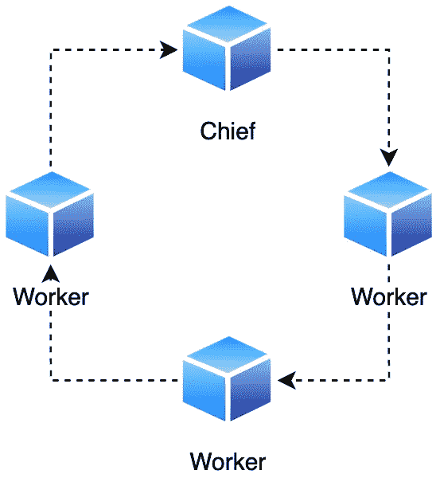

# Google Cloud AI 平台上的 Tensorflow 多工培训

> 原文：<https://towardsdatascience.com/multi-worker-distributed-tensorflow-training-on-google-cloud-ai-platform-64b383341dd8?source=collection_archive---------23----------------------->

## [理解大数据](https://towardsdatascience.com/tagged/making-sense-of-big-data)



图片由作者在 [CC BY-NC 4.0](https://creativecommons.org/licenses/by-nc/4.0/) 下

几乎在每个深度学习项目中，都有一个决定性的时刻，海量的训练数据或缺乏处理能力成为在适当的时间完成训练的限制因素。因此，应用适当的缩放是不可避免的。虽然纵向扩展，即升级到更强大的硬件，可能会提供暂时的补救措施，但它很少提供正确的可扩展性，因为纵向扩展会很快达到其物理极限。因此，我们没有其他选择，只能扩大模型训练，即使用额外的机器。幸运的是，在云时代，横向扩展不再是一个障碍。

谈到向外扩展神经网络训练，有两种主要方法。有一种叫做**模型并行**的策略，在这种策略中，神经网络本身被分割到多个设备上。这种类型的分布主要用于模型由大量参数组成并且不适合特定设备的情况，或者输入样本的大小甚至会妨碍计算激活的情况。对于那些对 Tensorflow 的模型并行感兴趣的人，有一个官方的解决方案叫做 [Mesh](https://github.com/tensorflow/mesh) 。

另一种分布策略称为**数据并行**，其中模型在每个节点上复制。然后，数据以这样的方式分布，每个副本看到它的不同部分。这种分布策略对于具有大量训练数据的情况特别有用。

由于每个副本在每一步都接收到不同的训练数据片段，因此工作人员必须有序地传达梯度更新。有两种沟通方式。有**异步训练**、**、**工人独立训练自己的复制品。异步训练通常使用离散参数服务器来报告梯度更新。

另一种是**同步训练**，在每一个训练步骤之后，工人们分享参数更新。同步训练经常实现全归约算法，这意味着所有副本存储归约(更新)的参数，而不是将它们传递到中央位置。

异步训练的主要好处体现在避免最慢的工人空闲，以及稍微好一点的机器容错能力。主要缺点是参数服务器需要大量的网络带宽来与工作人员进行有效的通信。运行多个参数服务器可能会解决这个问题，但也会增加培训成本。

同步训练的权衡正好相反。不需要使用额外的机器来存储更新的模型参数。另一方面，等待最慢的工人肯定会拖延进程。选择业绩相似的员工可能会减少闲置时间。采用高效的网络拓扑来共享梯度更新同样至关重要。工人之间多余的交流会抵消同步培训的好处。

# 多工人分布式张量流

Tensorflow 通过`tf.distribute.Strategy` API 在他们的标准库中实现数据并行策略。它们支持同步和异步多工人培训，尽管后者支持有限。截至撰写本文时，异步的`ParameterServerStrategy`只支持原始的`tf.estimator.Estimator` API。然而，从 2.4 版本开始，人们开始努力使异步培训变得更加可用。

自从 Tensorflow 2.0 发布以来，`tf.keras.Model` API 已经成为构建神经网络的主要方式，尤其是那些不需要定制训练循环的神经网络。新开发的分布式培训策略同样主要集中在 Keras 模型上。尽管已经为 Keras 模型实现了几种分布式培训策略，但是在撰写本文时，当前可用的多工人培训仅仅是同步的`MultiWorkerMirroredStrategy`。

这个策略为我们增加了很多负担。它会根据所用的硬件和网络拓扑来优化选择合适的 all-reduce 实现。目前，可用的选项有 ring all-reduce 和 NVidia 的 [NCLL](https://developer.nvidia.com/nccl) 。在训练 Keras 模型的情况下，该策略还自动在工人中分发训练数据集。通过文件或数据对数据集进行[分片，可以进行分发。按文件分片是首选，因为每个副本只加载分配的文件。例如，它可用于](https://www.tensorflow.org/tutorials/distribute/input#sharding) [TFRecord](https://www.tensorflow.org/tutorials/load_data/tfrecord) 数据集。在其中存储训练样本是高效处理大型数据集的最有效方式。另一方面，如果没有办法按文件进行分片，那么所有的工作人员都会读取所有可用的数据，但是他们只处理分配给他们的分片。例如，在[直接从 BigQuery](https://www.tensorflow.org/io/tutorials/bigquery) 中读取数据的情况下，或者文件数量少于 workers 的情况下，可能会发生日期分片。验证和测试数据集也是如此。

该策略还可以通过名为`BackupAndRestore`的 Keras 回调提供容错。[该回调](https://www.tensorflow.org/api_docs/python/tf/keras/callbacks/experimental/BackupAndRestore)在每个时期结束时备份模型。如果发生工人中断，所有其他工人也将重新开始，并且训练从最后完成的训练时期继续。模型训练成功后，存储的检查点将被删除。

## 多工人配置

在 Tensorflow 中配置多工人培训最简单的方法是通过名为`TF_CONFIG`的环境变量。它是一个 JSON 字符串，包含两个键，`cluster`和`task`。前者描述拓扑结构，包括节点的地址。它的值在所有节点上都是相同的。后者对于每个节点都是唯一的，并定义了它们在集群中各自的角色。一旦 Tensorflow 解析了环境变量，它就会根据配置启动 gRPC 服务器。

以下示例描述了一个包含两个节点的集群，一个主节点和一个工作节点。

TF_CONIFG

在这个集群中有一个指定的节点具有额外的职责，称为主节点。它可以满足诸如保存训练检查点、为 TensorBoard 编写摘要以及序列化训练模型等任务的需要。如果在配置中没有明确指定负责人，则索引为 0 的工作人员将担任该角色。当然，主节点也执行相同的代码。

## 多工人模型

将`MultiWorkerMirroredStrategy`与 Keras 模型集成很简单。只有几个要求。首先，模型的构建和编译必须在分销策略的范围内进行。其次，批量大小必须反映节点的数量。通常，批量大小通过乘以节点数来调整。保持原来的批量大小也是可行的。但是，在这种情况下，工人收到的批次较少。这些方法分别被称为弱缩放和强缩放。

多员工战略范围

与常规 Keras 训练相反的另一个区别是需要指定`steps_per_epoch`参数，否则这是可选的。每个时期的步骤数很容易计算，并且是训练实例数除以调整后的全局批量的比率。函数`create_model`包含了定义一个包含模型编译的模型的常用方法。

创建模型助手方法

保存一个多工人模型有点复杂。所有节点都必须保存模型，尽管保存到不同的位置。最后，除了主节点之外的所有节点都必须删除它们保存的版本。采取这些步骤的原因是所有-减少通信仍然可能发生。

多工人模型保存

# 人工智能平台上的多人培训

Google Cloud 和 Tensorflow 和谐地协同工作。Tensorflow 在 AI 平台中一直享有突出的地位。此外，谷歌云也一直在努力开发 Tensorflow 的新产品。例如，他们最近推出了带有补充支持和托管服务的 [Tensorflow Enterprise](https://cloud.google.com/tensorflow-enterprise) 。

正如我们所见，正确设置`TF_CONFIG`是 Tensorflow 多员工培训的重要组成部分。对于 Tensorflow 来说，在运行模型训练之前，环境变量必须存在。幸运的是，AI 平台会根据给定的[培训作业配置](https://cloud.google.com/ai-platform/training/docs/training-jobs#configuring_the_job)来负责[设置](https://cloud.google.com/ai-platform/training/docs/distributed-training-details)。

有两种方式提供作业配置。功能是设置[提交命令](https://cloud.google.com/sdk/gcloud/reference/ai-platform/jobs/submit/training)的各个选项。但是，对于不常改变的属性，将它们存储在 YAML 配置文件中更方便。对于成功的多人培训，需要的选项有`runtimVersion`、`pythonVersion`、`scaleTier`、`masterType`、`worketType`、`workerCount`。

培训配置

上面的配置文件将创建一个由三个节点组成的集群，包括一个首领和两个工人。机器的类型可以不同，但最好是在整个培训集群中保持相同。也有预定义的[机器层级](https://cloud.google.com/ai-platform/training/docs/machine-types)，但是它们都带有参数服务器。因此，将 scale-tier 设置为 custom 是当前的当务之急。

配置还指定了 Tensorflow 版本，它等于`runtimeVersion`属性。[运行时](https://cloud.google.com/ai-platform/training/docs/runtime-version-list)会定期更新，但支持更高版本的 Tensorflow 需要一些时间。需要注意的是，2.1 版之前的运行时[没有正确设置主节点。因此，AI 平台上的多工人培训仅适用于运行时 2.1 和更高版本。](https://cloud.google.com/ai-platform/training/docs/distributed-training-details#chief-versus-master)

另一方面，在某些情况下，能够使用尚不支持的 Tensorflow 版本是至关重要的。例如，有相关的新特性，或者它们需要在投入生产之前进行适当的测试。对于这种情况，Google AI 平台提供了使用[自定义容器](https://cloud.google.com/ai-platform/training/docs/custom-containers-training)进行训练的选项。提交定制容器进行培训与使用所提供的运行时非常相似。不过，还有一些小细节需要考虑。为了拥有正确的`TF_CONFIG`，容器化张量流模型需要将选项`useChiefInTfConfig`设置为`true`。此外，培训配置必须为主管和工人指定图像 URIs。当然，两种情况下的容器是相同的。

自定义容器配置

在官方运行时和自定义容器中，AI 平台训练都自动使用[云 ML 服务代理](https://cloud.google.com/ai-platform/training/docs/custom-service-account#default)凭证。

## 本地测试

在向 AI 平台提交作业之前，在本地测试培训配置的正确性是可行的，因为失败的作业也会被计费。幸运的是，官方运行时在本地运行、执行

```
gcloud ai-platform local train --distributed --worker-count $N ...
```

[命令](https://cloud.google.com/sdk/gcloud/reference/ai-platform/local/train)为我们设置了一个正确的`TF_CONFIG`。唉，它还在配置中添加了一个参数服务器。Tensorflow 会发出警告，但拥有参数服务器不会妨碍训练。

对于容器，设置一个正确的`TF_CONFIG`并运行容器稍微复杂一点，但并非不可行。实现本地测试的最简单的方法是使用 [docker-compose](https://docs.docker.com/compose/) 来运行主容器和工作容器以及设置环境变量。

docker-编写用于本地测试的配置

`COMMAND`变量是一个字符串，包含训练任务的所有参数。一旦 docker-compose 配置完成，只需点击

```
docker-compose up
```

在这两种情况下，如果培训需要访问其他 Google 云服务，例如云存储，那么必须在运行本地培训之前定义指向正确的[服务帐户密钥 JSON 文件](https://cloud.google.com/docs/authentication/getting-started)的`GOOGLE_APPLICATION_CREDENTIALS`。

# 后续步骤

构建神经网络本身并不是一项简单的任务。在此基础上处理分布式计算最终会严重阻碍这一过程。幸运的是，现代深度学习框架是在考虑可扩展性的情况下构建的，因此能够实现更快的开发。此外，由于 Tensorflow 和 Google Cloud 之间的顺利兼容，开发这种可扩展性从未像现在这样容易。

## 简单的例子

事实上，这种平稳性乍看起来可能并非如此。为此，我在 Github 上创建了一个简单的工作示例。查看实际细节。记住，最好的学习方法是实践。

[](https://github.com/kalosisz/tf-gcp-multi-worker-example) [## kalosisz/TF-GCP-多工人-示例

### 在 Google Cloud AI 平台上设置和运行 Tensorflow 多工人培训模型的简单示例。这个…

github.com](https://github.com/kalosisz/tf-gcp-multi-worker-example) 

# 资源

*   [使用 TensorFlow 进行分布式训练](https://www.tensorflow.org/guide/distributed_training)
*   [使用 Keras 进行多工人培训](https://www.tensorflow.org/tutorials/distribute/multi_worker_with_keras)
*   [TF_CONFIG 和分布式培训](https://cloud.google.com/ai-platform/training/docs/distributed-training-details)
*   [Amir h . Payberah 的分布式学习(幻灯片)](https://id2223kth.github.io/slides/2019/13_distributed_learning.pdf)