# RoboCup 救援模拟器的多智能体强化学习

> 原文：<https://towardsdatascience.com/multiagent-reinforcement-learning-for-robocup-rescue-simulator-17773553f46?source=collection_archive---------28----------------------->

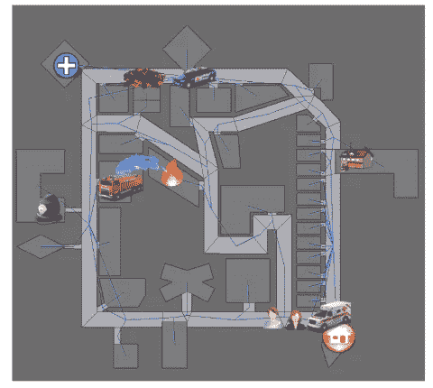

RoboCup 救援模拟器

多智能体，强化学习，RoboCup 救援模拟器。标题中已经使用了相当多的术语。但是不用担心。读完这篇文章，你会明白其中的每一点。我将首先构建一些关于机器学习的背景，机器学习技术的类型，然后深入研究强化学习领域。这是事情开始变得稍微技术性的地方，但我会尽量保持简单，并尽可能提供例子。然后，我将解释我如何应用强化学习来训练一群消防队，以找到着火的建筑并扑灭这些建筑中的火。全靠自己！所以，为这次激动人心的旅程做好准备吧。

# 什么是机器学习？

我们正处于这样一个时代，我们可以教机器如何学习，一些机器甚至可以自己学习。这种神奇的现象叫做**机器学习**。但是机器是怎么学习的呢？他们通过在相似的数据中寻找模式来学习。把数据想象成你从世界上获得的信息。给机器的数据越多，它就越“聪明”。

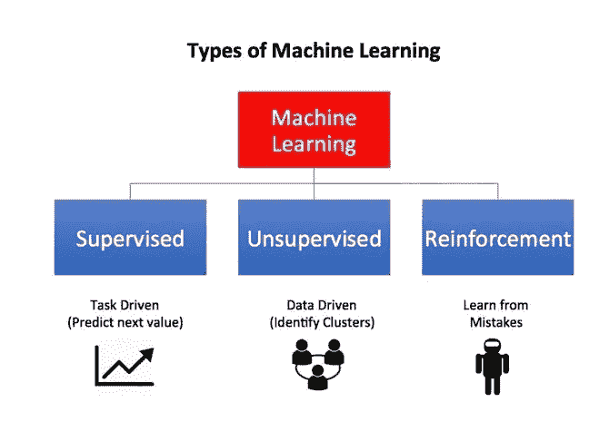

机器学习算法的类型

# 机器学习算法有哪些类型？

从广义上讲，有三种类型:**监督学习、非监督学习和强化学习。**

## 1.监督学习

机器从标记的数据中学习。**标记数据**由未标记数据组成，带有数据中特征的描述、标签或名称。例如，在标记的图像数据集中，图像被标记为它是猫的照片并且它是狗的照片。

## 2.无监督学习

机器从未标记的数据中学习。**未标记数据**由取自自然或人类创造的数据组成，以探索其背后的科学模式。未标记数据的一些例子可能包括照片、录音、视频、新闻文章、推文、x 光片等。主要概念是数据中的特征没有解释、标签、标记、类或名称。

## 3.强化学习

它是一种机器学习技术，使代理能够在交互式环境中使用来自其自身行为和经验的反馈，通过反复试验来学习。

虽然监督学习和强化学习都使用输入和输出之间的映射，但与监督学习不同，监督学习向代理提供的反馈是执行任务的一组正确的动作，强化学习使用奖励和惩罚作为积极和消极行为的信号。

与无监督学习相比，强化学习在目标方面是不同的。虽然无监督学习的目标是找到数据点之间的相似性和差异，但在强化学习的情况下，目标是找到一个合适的动作模型，使代理的总累积报酬最大化。下图说明了通用 RL 模型的**行动-奖励反馈回路**。

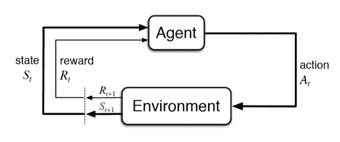

强化学习模型的抽象描述

# 如何公式化一个基本的强化学习问题？

描述 RL 问题基本要素的一些关键术语是:

1.  **环境—** 代理运行的物理世界
2.  **状态—** 代理的当前状态
3.  **奖励—** 环境的反馈
4.  **策略—** 将代理的状态映射到动作的方法
5.  **价值—** 代理在特定状态下采取行动将获得的未来回报

一个 RL 的问题可以通过游戏得到最好的解释。就拿 [**吃豆人**](https://en.wikipedia.org/wiki/Pac-Man) 这个游戏来说，代理人(吃豆人)的目标是吃掉格子里的食物，同时避开途中的幽灵。在这种情况下，网格世界对于代理来说是一个交互环境。代理人会因为吃了食物而得到奖励，如果被鬼魂杀死(输掉游戏)则会受到惩罚。状态是代理在网格世界中的位置，总的累积奖励是代理赢得游戏。

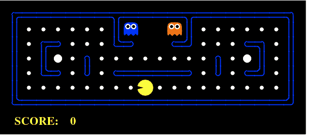

强化学习应用于 PacMan 的例子

为了建立一个最优策略，代理人面临着探索新状态，同时最大化其整体报酬的困境。这叫做**勘探与开发**权衡。为了平衡这两者，最好的整体策略可能需要短期的牺牲。因此，代理应该收集足够的信息，以便在未来做出最佳的整体决策。

[**马尔可夫决策过程**](https://en.wikipedia.org/wiki/Markov_decision_process)**【MDPs】**是描述 RL 中环境的数学框架，几乎所有的 RL 问题都可以用 MDPs 来表述。一个 MDP 由一组有限的环境状态 S，一组在每个状态下的可能动作 A(s)，一个实值报酬函数 R(s)和一个转移模型 P(s '，s | a)组成。然而，真实世界的环境更有可能缺乏任何环境动力学的先验知识。在这种情况下，无模型 RL 方法就派上了用场。

[**Q-learning**](https://en.wikipedia.org/wiki/Q-learning)**是一种常用的无模型方法，可用于构建自玩 PacMan 代理。它围绕着更新 Q 值的概念，Q 值表示在状态 *s* 中执行动作 *a* 的值。下面的值更新规则是 Q 学习算法的核心。**

**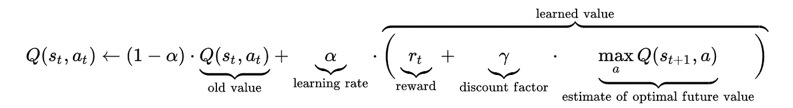**

**q 学习算法**

**[**策略梯度**](http://www.scholarpedia.org/article/Policy_gradient_methods) 是另一种流行的无模型 RL 方法，但它不计算 Q 值，而是使用策略。政策学习从每个状态到行动的映射，它的目标是发现哪些行动导致更高的回报并增加它们的概率。政策梯度观察环境并在其中采取行动，并根据其获得的回报不断更新其政策。经过多次迭代后，策略收敛到最大值。策略梯度方法的缺点可能是，它有时会陷入局部最大值，而无法达到全局最大值。**

# **最常用的强化学习算法有哪些？**

**在有大的状态和动作空间的情况下，学习每个状态和动作对的 Q 值或策略是不可行的。这是使用**深度强化学习(DRL)** 的时候，其中利用神经网络对 RL 的组件进行建模。**

**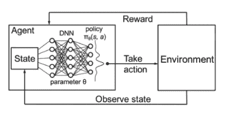**

**深度强化学习架构**

**我们考虑两种基于 DRL 模型的算法:深度 Q 学习和 ProximalPolicy 优化，主要是因为 DQN 在 Atari 游戏上表现出了很好的结果，并帮助团队实现了人类水平的表现，而使用 PPO，OpenAI 的 DOTA 2 团队能够在公开比赛中击败 99.4%的玩家。**

## **深度 Q 网(DQN)**

**DQN 是 Q 学习和深度神经网络的结合。DQN 通过使用两种观点解决了使用非线性逼近器来表示 Q 值所导致的不稳定性:经验重放和目标网络。**

****体验回放**:例如，我们将最后一百万个转场(或视频帧)放入一个缓冲区，并从该缓冲区中抽取一个 32 大小的小批量样本来训练深度网络。这就形成了一个足够稳定的输入数据集用于训练。当我们从重放缓冲区随机取样时，数据更加相互独立，更接近于同分异址。**

****目标网络**:我们创建两个深度网络 *θ-* 和 *θ。*我们使用第一个来检索 *Q* 值，而第二个包括训练中的所有更新。比如说 100，000 次更新之后，我们将 *θ-* 与 *θ* 同步。目的是暂时固定 Q 值目标，这样我们就没有一个移动的目标可以追逐。此外，参数变化不会立即影响 *θ-* ，因此即使输入可能不是 100% i.i.d .，也不会错误地放大其效果，如之前的[所述。](https://medium.com/@jonathan_hui/rl-dqn-deep-q-network-e207751f7ae4)**

**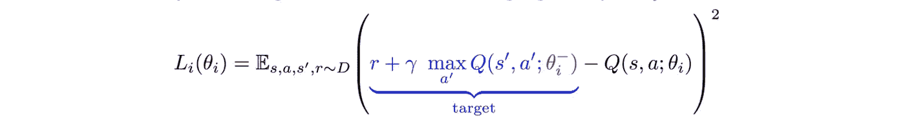**

**有了经验重放和目标网络，我们有了更稳定的输入和输出来训练网络，并且表现得更像监督训练。要了解更多关于 DQN 是如何运作的，请阅读乔纳森·许的这篇令人惊叹的文章。**

## **近似策略优化(PPO)**

**PPO 是一种政策梯度方法，其表现相当于或优于最先进的方法，但实施和调整要简单得多。为了用策略梯度算法获得好的结果，需要仔细调整步长。此外，大多数策略梯度方法对每个采样轨迹执行一次梯度更新，并且具有高样本复杂度。PPO 算法解决了这两个问题。它使用了一个替代目标，该目标被最大化，同时惩罚对策略的大的改变。他们定义了一个可能性比率**

**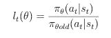**

**PPO 然后优化目标:**

**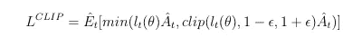**

**其中 A_t 是广义优势估计，clip (l_t(θ)，1ε，1+ε)在区间[1-ε，1+ε]内 clips l_t(θ)。该算法在从策略中采样多个轨迹和在采样的数据集上执行 SGD 的几个时期之间交替，以优化该替代目标。由于状态值函数也被同时近似，所以值函数近似的误差也被添加到替代目标以计算完整的目标函数。要了解更多关于 PPO 如何工作的信息，请阅读 Jonathan Hui 的这篇令人惊叹的文章。**

# **RoboCup 救援模拟器**

**现在理论到位了，让我们把重点放在一些应用上。1995 年 1 月 17 日，日本港口城市神户发生里氏 6.8 级地震，造成大规模破坏，约 7000 人丧生。1999 年 4 月 30 日，RoboCup 救援联盟成立，旨在促进国际研究，开发更好的救援能力。多年来，许多团队都参加了一年一度的机器人世界杯救援联盟，该联盟包括三个竞赛:机器人竞赛、虚拟机器人竞赛和模拟代理人竞赛。我们将重点关注被称为机器人世界杯救援模拟(RCRS)的模拟智能体竞赛，这是多智能体系统的一个完美例子。我们将把强化学习应用到 RCRS，以训练这些代理完成他们各自的任务。**

****

**RoboCup 救援模拟环境**

**以下是分配给代理的任务:**

*   ****消防队**:灭火**
*   ****警察**:清除碎片**
*   ****救护车**:运送平民到安全避难所**

**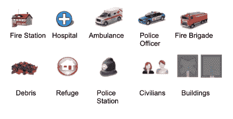**

**在这篇文章中，我们将关注消防队，并训练他们学会如何在城市中灭火。**

## **RoboCup 救援模拟器(RCRS)的强化学习**

**正如我们上面所讨论的，为了制定任何 RL 模型，我们需要定义状态空间、动作空间和奖励函数。让我们讨论一下 RCRS 的这些属性。**

*****状态空间*** :状态空间有三部分。第一部分是建筑物信息，包括温度和热度。注意，火热度是衡量程度的一个参数。一栋大楼着火了。第二部分是代理信息，它给出了每个时间步的位置((X，Y)坐标)、消防水箱中的水和消防队的健康点。第三部分是忙/闲信息，它是一个二进制变量。消防队在每个时间点都会收到一个建筑物 id 作为他们的目标位置。但是有时它们需要一个以上的时间间隔才能到达建筑物。与此同时，动作不断被发送。因此，消防队必须忽略这些动作，直到他们访问在先前时间步中被告知要访问的建筑物。该信息作为状态信息被传递，这对于我们的算法更好地执行是非常有价值的。每当由算法发送的动作在模拟器中被使用时(忙)，1 作为状态信息被发送回来，否则 0 被发送(空闲)。**

**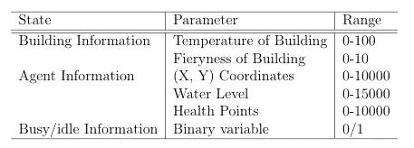**

**状态空间参数范围**

*****动作空间:*** 我们的代理唯一可用的动作是移动到着火的建筑物，因此动作空间由建筑物的 ID 组成。请注意，灭火和补水是我们的代理的默认特征，即，每当我们的代理靠近着火的建筑物时，它将尝试灭火，每当它离开水时，它将移动到避难所来给水箱补水。因此，这些动作不包括在动作空间中。**

*****奖励功能*** :由于消防队的最终目标是尽可能快地灭火，我们创建了一个奖励功能，对将火势控制在最低限度的特工给予更高的奖励，如果火势增大则对他们进行惩罚。火热度是衡量建筑物燃烧程度的一个参数，因此将整体火热度值保持在最低会导致更高的累积奖励。**

**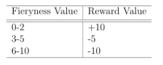**

**奖励计算**

**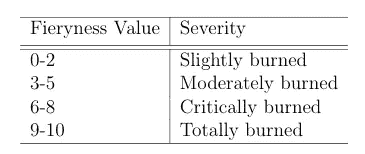**

**根据火热程度值的火热程度**

## **模型架构**

**我们使用 DQN 和 PPO 架构，做了一些修改。我们没有卷积层的集合，因为神经网络的输入不是图像。网络的输入是状态表示，每个可能的动作有一个单独的输出单元。稳定基线可以选择使用不同的架构，我们可以改变隐藏层的数量，使用 LSTM，使用 CNN 或结合 CNN 和 LSTM。我们在训练模型时尝试了不同的架构。作为我们尝试的一种架构的示例，请参考下图。**

**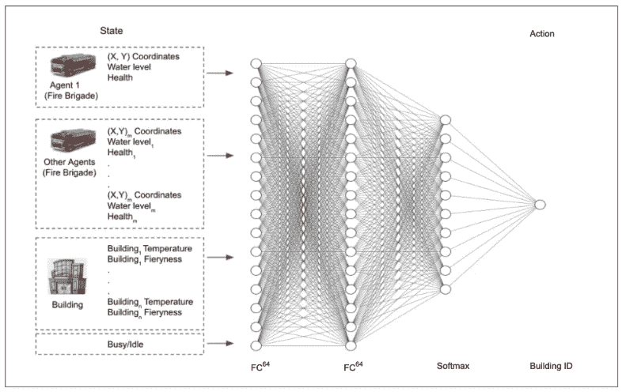**

**模型架构**

## **超参数搜索**

**该表显示了我尝试训练模型的不同超参数。**

**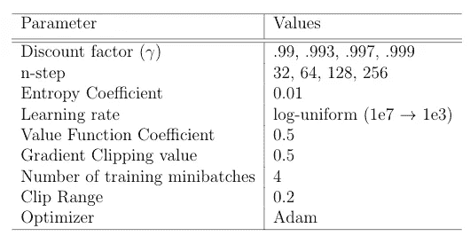**

**PPO 超参数**

**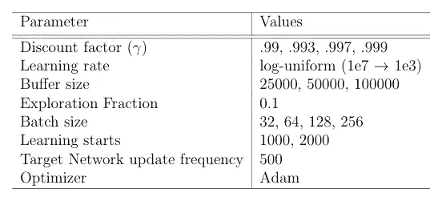**

**DQN 超参数**

# **结果**

**理论太多！让我们言归正传。结果如何？**

**以下是训练有素的特工对 DQN 和 PPO 的一些模拟。这些视频是在特定的时间间隔拍摄的，即在 5 集、150 集和 250 集之后。每集 100 个时间步长。**

**这里红色的移动点代表消防队，右下角是避难所，消防队正在那里重新装满他们的水箱。**

**不同的颜色阴影代表了这些建筑的火灾强度:**

*   ***淡黄色*:建筑物起火**
*   ***橙色*:楼内火势加剧**
*   ***红色*:建筑燃烧严重**
*   ***黑色*:建筑被烧毁**
*   ***蓝色:*消防队将大楼内的火扑灭**
*   ***灰色*:建筑未燃烧**

**这里是一个可视化的模拟器在未经训练时的样子，以及它如何开始学习最终扑灭城市中的所有火灾。**

# **学习曲线**

****

**两种算法的学习曲线**

**从上面的曲线和 gif 可以看出，这两种算法都在这个模拟器上成功地学习，并且能够成功地完成它们的任务。从学习曲线中，我们还可以看到，DQN 在这种情况下比 PPO 表现得更好，并且能够快速学习。尽管如此，结果并不比贪婪算法更好(在贪婪算法中，所有的代理将熄灭温度最高的建筑)。目前，我正在一张有更多建筑的地图上训练这些代理，并将很快分享结果。**

**我要感谢我的导师皮特·斯通、加勒特·沃内尔和子超，他们给了我参与这个项目的机会。**

**这是我的 GitHub 回购协议的链接。**

** [## 强化学习 101

### 学习强化学习的要领！

towardsdatascience.com](/reinforcement-learning-101-e24b50e1d292)  [## 机器学习初学者指南

### 我应该现在学…还是以后学？学习是一种普遍的技能/特性，是任何生物在这方面获得的…

medium.com](https://medium.com/@randylaosat/a-beginners-guide-to-machine-learning-dfadc19f6caf)  [## 多智能体强化学习

### 在目前人工智能(AI)研究的各个领域中，有一个领域已经…

medium.com](https://medium.com/@RemiStudios/multi-agent-reinforcement-learning-3f00b561f5f0)  [## 我在深度学习方面的文章列表

### 包括物体检测、自动驾驶汽车、元学习等

medium.com](https://medium.com/@jonathan_hui/index-page-for-my-articles-in-deep-learning-19821810a14)**