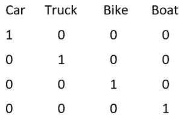
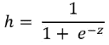
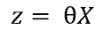
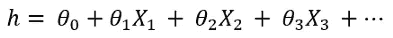
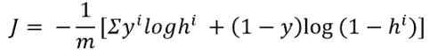
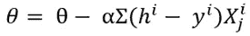
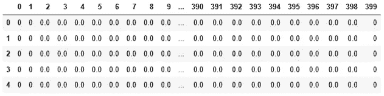
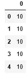
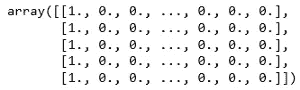
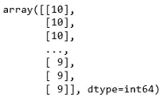

# Python 中从头开始使用逻辑回归的多类分类:分步指南

> 原文：<https://towardsdatascience.com/multiclass-classification-algorithm-from-scratch-with-a-project-in-python-step-by-step-guide-485a83c79992?source=collection_archive---------1----------------------->


Tj·霍洛韦丘克在 [Unsplash](https://unsplash.com?utm_source=medium&utm_medium=referral) 上拍摄的照片

## 逻辑回归的两种方法:梯度下降法和优化函数

逻辑回归是一种非常流行的机器学习技术。当因变量是分类变量时，我们使用逻辑回归。本文将集中讨论多类分类问题的逻辑回归的实现。我假设您已经知道如何用逻辑回归实现二元分类。

如果你还没有用逻辑回归研究过二元分类，我建议你在深入研究这篇文章之前先浏览一下这篇文章。

> 因为多类分类是建立在二类分类之上的。

在本文中，您将学习二进制分类的概念、公式和工作示例:

[](/logistic-regression-in-python-to-detect-heart-disease-2892b138d0c0) [## Python 中用于检测心脏病的逻辑回归

### 发展逻辑回归演算法的重要方程式和如何发展逻辑回归演算法…

towardsdatascience.com](/logistic-regression-in-python-to-detect-heart-disease-2892b138d0c0) 

## 多类分类

多类分类的实现遵循与二类分类相同的思想。如你所知，在二元分类中，我们解决一个是或否的问题。与上述文章中的示例一样，输出回答了一个人是否患有心脏病的问题。我们只有两节课:心脏病和非心脏病。

如果输出为 1，则此人患有心脏病，如果输出为 0，则此人没有心脏病。

在多类分类中，我们有两个以上的类。这里有一个例子。比方说，我们将汽车、卡车、自行车和船只的不同功能和特征作为输入功能。我们的工作是预测标签(汽车、卡车、自行车或船)。

> **这怎么解决？**

我们将把每一个类当作一个二元分类问题，就像我们解决一个心脏病或没有心脏病的问题一样。

> 这种方法被称为一对一方法

在 one vs all 方法中，当我们处理一个类时，这个类用 1 表示，其余的类变成 0。

例如，如果我们有四类:汽车、卡车、自行车和船。当我们处理汽车时，我们将汽车作为 1，其余的类作为 0。同样，当我们在卡车上工作时，卡车的元素将是 1，其余的类将是 0。



等你落实了就更好理解了。我建议你在阅读的时候继续编码和运行代码。

> **在这里，我将用两种不同的方式实现这个算法:**

1.  梯度下降法。

2.优化函数方法。

> **重要方程式及其工作原理:**

逻辑回归使用 sigmoid 函数来预测输出。sigmoid 函数返回一个从 0 到 1 的值。一般我们取一个阈值，比如 0.5。如果 sigmoid 函数返回大于等于 0.5 的值，我们将其视为 1，如果 sigmoid 函数返回小于 0.5 的值，我们将其视为 0。



z 是输入特征乘以表示为θ的随机初始值。



这里，X 是输入特征。在大多数情况下，有几个输入特征。所以，这个公式变大了:



X1、X2 和 X3 是输入要素，将为每个输入要素随机初始化一个θ。开始时的θ0 是偏置项。

> 该算法的目标是在每次迭代中更新该θ，以便能够建立输入要素和输出标注之间的关系。

> **成本函数和梯度下降**

成本函数给出了我们的预测与原始输出有多远的想法。这是它的公式:



这里，

m 是训练样本的数量或训练数据的数量，

y 是原始输出标签，

h 是假设或预测输出。

这是梯度下降的方程式。使用这个公式，我们将在每次迭代中更新θ值:



## 用梯度下降法实现

> **先决条件:**

a.您需要能够舒适地读写 python 代码。

b.基本数字图书馆和熊猫图书馆。

> 在这里，我将一步一步地展示实现过程。

1.  导入必要的包和数据集。我从 Coursera 的[吴恩达的机器学习课程中获取了数据集。这是一个手写识别数据集。有从 1 到 10 的数字。](https://www.coursera.org/learn/machine-learning)

从像素数据集中，我们需要识别数字。在该数据集中，输入变量和输出变量被组织在 Excel 文件的不同表格中。请随意从本页末尾的链接下载数据集。

> 如果你正在阅读这篇文章来学习这个算法，请运行每一段代码。

让我们导入必要的包和数据集，

```
import pandas as pd
import numpy as np
xl = pd.ExcelFile('ex3d1.xlsx')
df = pd.read_excel(xl, 'X', header=None)
```



2.导入 y，这是输出变量

```
y = pd.read_excel(xl, 'y', header = None)
```



3.定义采用输入变量和θ的假设。它返回计算出的输出变量。

```
def hypothesis(theta, X):
    return 1 / (1 + np.exp(-(np.dot(theta, X.T)))) - 0.0000001
```

4.构建采用输入变量、输出变量和θ的成本函数。它返回假设的成本。这意味着它给出了预测与原始输出之间的距离。

```
def cost(X, y, theta):
    y1 = hypothesis(X, theta)
    return -(1/len(X)) * np.sum(y*np.log(y1) + (1-y)*np.log(1-y1))
```

5.现在，是数据预处理的时候了。

数据是干净的。不需要太多的预处理。我们需要在输入变量中添加一个偏差列。请检查 df 和 y 的长度。如果长度不同，模型将不起作用。

```
print(len(df))
print(len(y))
X = pd.concat([pd.Series(1, index=df.index, name='00'), df], axis=1)
```

6.y 列有从 1 到 10 的数字。这意味着我们有 10 节课。

y 是一个不必要的数据帧。我将只把列作为包含值的序列。

```
y = y.iloc[:, 0]
```

我们将为每个类创建一个长度与 y 相同的列。当类为 5 时，为包含 5 和 0 的行创建一个包含 1 的列，否则为 0。

看看，我们有多少节课，

```
y.unique()
```

输出:

```
array([10,  1,  2,  3,  4,  5,  6,  7,  8,  9], dtype=int64)
```

所以，我们有 10 节课。启动一个有 10 列和 df.shape[0]行的 DataFrame。

```
y1 = np.zeros([df.shape[0], len(y.unique())])
y1 = pd.DataFrame(y1)
```

我们将用一些简单的代码以编程的方式实现它:

```
for i in range(0, len(y.unique())):
    for j in range(0, len(y1)):
        if y[j] == y.unique()[i]:
            y1.iloc[j, i] = 1
        else: 
            y1.iloc[j, i] = 0
y1.head()
```

7.现在定义函数‘gradient _ descent’。该函数将输入变量、输出变量、theta、alpha 和历元数作为参数。这里，α是学习率。

你应该根据你的要求来选择它。学习率太小或太大都会使你的算法变慢。我喜欢针对不同的学习速率运行算法，并获得正确学习速率的想法。可能需要几次迭代来选择正确的学习速率。

> 对于 y1 中的每一列，我们将实现一个二元分类。

例如，当我考虑数字 2 时，它应该为数字 2 返回 1，为其余的数字返回 0。因此，由于我们有 10 个类，我们已经运行了每个时期(迭代)10 次。这里有一个嵌套的 for 循环。

```
def gradient_descent(X, y, theta, alpha, epochs):
    m = len(X)
    for i in range(0, epochs):
        for j in range(0, 10):
            theta = pd.DataFrame(theta)
            h = hypothesis(theta.iloc[:,j], X)
            for k in range(0, theta.shape[0]):
                theta.iloc[k, j] -= (alpha/m) * np.sum((h-y.iloc[:, j])*X.iloc[:, k])
            theta = pd.DataFrame(theta)
    return theta, cost
```

7.初始化θ。记住，我们将为每个类实现逻辑回归。每堂课也会有一系列的θ。

我已经运行了 1500 个纪元了。我相信随着时代的增加，准确率会更高。

```
theta = np.zeros([df.shape[1]+1, y1.shape[1]])
theta = gradient_descent(X, y1, theta, 0.02, 1500)
```

8.使用更新后的θ，计算输出变量。

```
output = []
for i in range(0, 10):
    theta1 = pd.DataFrame(theta)
    h = hypothesis(theta1.iloc[:,i], X)
    output.append(h)
output=pd.DataFrame(output)
```

9.将计算的输出与原始输出变量进行比较，以计算模型的准确性。

```
accuracy = 0
for col in range(0, 10):
    for row in range(len(y1)):
        if y1.iloc[row, col] == 1 and output.iloc[col, row] >= 0.5:
            accuracy += 1
accuracy = accuracy/len(X)
```

准确率为 72%。我确信，更多时代的准确性会更好。因为花了太多时间，我没有重新运行算法。

> 如果你正在运行这个，请随意尝试更多的纪元，并在评论部分让我知道，你有多少准确性。

> **除了梯度下降法，你还可以使用内置的优化函数**。

在这种方法中，使用优化函数来优化算法的θ。这是一个更快的方法。

## 用优化函数实现

1.我们将使用与之前相同的数据集。如果使用相同的笔记本，请使用不同的名称导入数据集:

```
xls = pd.ExcelFile('ex3d1.xlsx')
df = pd.read_excel(xls, 'X', header=None)
```


2.我们仍然需要为 df 中的偏差项添加一列全 1。

```
X = np.c_[np.ones((df.shape[0], 1)), df]
```



3.导入“y”的数据。

```
y = pd.read_excel(xls, 'y', header=None)
```


由于这是一个数据帧，只需将列 0 作为一个系列，并使其二维，以匹配 x 的维度。

```
y = y[0]
y = y[:, np.newaxis]
```



这里，“y”只有一列。10 节课 10 栏。每个专栏将处理一个类。例如，当我们将处理类 10 时，我们将把 10 保留在它的位置，并用零替换其余的值。下面是函数 y_change，它将接受 y 本身和一个类(比如 3)。然后，它会用 1 替换 3，用所有其他类替换 0。在后面的步骤中很快就会用到这个函数。

```
def y_change(y, cl):
    y_pr=[]
    for i in range(0, len(y)):
        if y[i] == cl:
            y_pr.append(1)
        else:
            y_pr.append(0)
    return y_pr
```

数据准备完成。现在开发模型:

4.定义假设函数。这与前面的方法相同。

```
def hypothesis(X, theta):
    z = np.dot(X, theta)
    return 1/(1+np.exp(-(z)))
```

5.开发成本函数。这一个也和前面的方法一样:

```
def cost_function(theta, X, y):
    m = X.shape[0]
    y1 = hypothesis(X, theta)
    return -(1/len(X)) * np.sum(y*np.log(y1) + (1-y)*np.log(1-y1))
```

6.定义渐变。这个不一样。该函数定义了如何更新θ。

```
def gradient(theta, X, y):
    m = X.shape[0]
    y1 = hypothesis(X, theta)
    return (1/m) * np.dot(X.T, y1 - y)
```

7.现在，导入优化函数并初始化θ。我取零作为初始θ值。任何其他值应该也可以。

```
from scipy.optimize import minimize, fmin_tnc
theta = np.zeros((X.shape[1], 1))
```

8.让我们创建一个拟合函数，它将 X，y 和θ作为输入。它将使用一个[优化函数](https://docs.scipy.org/doc/scipy/reference/generated/scipy.optimize.fmin_tnc.html)并为我们输出优化后的θ。

它需要这三个参数:

I .需要最小化的功能，

二。待优化的参数，

三。用于优化的参数。

在本例中，成本函数应最小化，θ需要为此进行优化。输入和输出变量 X 和 y 是要使用的参数。

这个优化函数采用另一个参数，即梯度。但这是可选的。这里，我们有一个关于梯度的公式或函数。所以我们正在通过它。

```
def fit(X, y, theta):
    opt_weigths = fmin_tnc(func=cost_function, x0=theta,
                          fprime=gradient, args=(X, y.flatten()))
    return opt_weigths[0]
```

9.使用这种拟合方法找到优化的θ。我们必须分别优化每个类的θ。让我们开发一个函数，其中对于每个类，将使用步骤 3 中的 y_change 方法相应地修改“y”。

```
def find_param(X, y, theta):
    y_uniq = list(set(y.flatten()))
    theta_list = []
    for i in y_uniq:
        y_tr = pd.Series(y_change(y, i))
        y_tr = y_tr[:, np.newaxis]
        theta1 = fit(X, y, theta)
        theta_list.append(theta1)
    return theta_list
```

用这种方法找到最终的θ

```
theta_list = find_param(X, y, theta)
```

10.是时候预测产量了。我们还必须单独预测各个类别。

```
def predict(theta_list, x, y):
    y_uniq = list(set(y.flatten()))
    y_hat = [0]*len(y)
    for i in range(0, len(y_uniq)):
        y_tr = y_change(y, y_uniq[i])
        y1 = hypothesis(X, theta_list[i])
        for k in range(0, len(y)):
            if y_tr[k] == 1 and y1[k] >= 0.5:
                y_hat[k] = y_uniq[i]
    return y_hat
```

使用上述预测方法，计算预测输出 y_hat:

```
y_hat = predict(theta_list, X, y)
```

11.计算准确度

```
accuracy=0
for i in range(0, len(y)):
    if y_hat[i] == y.flatten()[i]:
        accuracy += 1
print(accuracy/len(df)*100)
```

**这个过程给出了 100%的准确率。**现在。你可以自己决定，你想在你的项目中使用哪种逻辑回归方法。

在本文中，使用神经网络解决了同样的问题，展示了如何从头开始开发神经网络:

[](https://medium.com/towards-artificial-intelligence/build-a-neural-network-from-scratch-in-python-f23848b5a7c6) [## 用 Python 从头开始构建神经网络

### 神经网络的详细说明和逐步实现

medium.com](https://medium.com/towards-artificial-intelligence/build-a-neural-network-from-scratch-in-python-f23848b5a7c6) 

如果你有任何问题，请在评论区问我。查看 GitHub 页面获取数据集:

[](https://github.com/rashida048/Machine-Learning-With-Python/blob/master/ex3d1.xlsx) [## rashida 048/用 Python 进行机器学习

### 此时您不能执行该操作。您已使用另一个标签页或窗口登录。您已在另一个选项卡中注销，或者…

github.com](https://github.com/rashida048/Machine-Learning-With-Python/blob/master/ex3d1.xlsx) 

这是梯度下降法代码的链接

[](https://github.com/rashida048/Machine-Learning-With-Python/blob/master/multicall_classification_with_logistic_regression.ipynb) [## rashida 048/用 Python 进行机器学习

### permalink dissolve GitHub 是超过 5000 万开发人员的家园，他们一起工作来托管和审查代码，管理…

github.com](https://github.com/rashida048/Machine-Learning-With-Python/blob/master/multicall_classification_with_logistic_regression.ipynb) 

下面是优化函数方法 Github 链接的链接:

[](https://github.com/rashida048/Machine-Learning-With-Python/blob/master/multiclass_classification_with_fmin_tnc.ipynb) [## rashida 048/用 Python 进行机器学习

### permalink dissolve GitHub 是超过 5000 万开发人员的家园，他们一起工作来托管和审查代码，管理…

github.com](https://github.com/rashida048/Machine-Learning-With-Python/blob/master/multiclass_classification_with_fmin_tnc.ipynb) 

推荐阅读:

[](/basic-linear-regression-algorithm-in-python-for-beginners-c519a808b5f8) [## Python 中的线性回归算法:一步一步

### 学习线性回归的概念，并使用 python 从头开始开发一个完整的线性回归算法

towardsdatascience.com](/basic-linear-regression-algorithm-in-python-for-beginners-c519a808b5f8) [](/multivariate-linear-regression-in-python-step-by-step-128c2b127171) [## Python 中多元线性回归的逐步实现

### 学习用 Python 从头开始开发任意数量变量的多元线性回归。

towardsdatascience.com](/multivariate-linear-regression-in-python-step-by-step-128c2b127171) [](/polynomial-regression-from-scratch-in-python-1f34a3a5f373) [## Python 中从头开始的多项式回归

### 学习用一些简单的 python 代码从头开始实现多项式回归

towardsdatascience.com](/polynomial-regression-from-scratch-in-python-1f34a3a5f373) [](/a-complete-anomaly-detection-algorithm-from-scratch-in-python-step-by-step-guide-e1daf870336e) [## Python 中从头开始的完整异常检测算法:分步指南

### 基于概率的异常检测算法

towardsdatascience.com](/a-complete-anomaly-detection-algorithm-from-scratch-in-python-step-by-step-guide-e1daf870336e) [](/a-complete-guide-to-confidence-interval-and-examples-in-python-ff417c5cb593) [## 置信区间的完整指南，以及 Python 中的示例

### 对统计学中一个非常流行的参数——置信区间及其计算的深入理解

towardsdatascience.com](/a-complete-guide-to-confidence-interval-and-examples-in-python-ff417c5cb593)