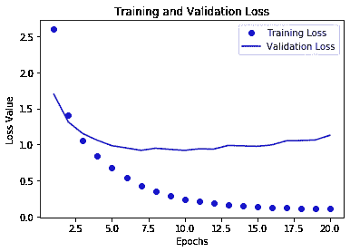
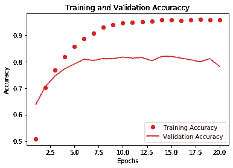

# 多类分类和信息瓶颈——以 Keras 为例

> 原文：<https://towardsdatascience.com/multiclass-classification-and-information-bottleneck-an-example-using-keras-5591b9a2c000?source=collection_archive---------10----------------------->

## 使用 Keras 对路透社数据集中的新闻进行分类，看看神经网络如何杀死你的数据。

***多类* *分类*** 是对两类以上样本的分类。将样本精确地分为两类，通俗地称为*二元*分类。

这篇文章将设计一个神经网络，使用 Python 库 Keras 将路透社 1986 年发布的路透社数据集中的新闻影片分类为 46 个互斥类。这个问题是一个典型的*单标签、多类分类问题。*


由[absolute vision](https://unsplash.com/@freegraphictoday?utm_source=unsplash&utm_medium=referral&utm_content=creditCopyText)在 [Unsplash](https://unsplash.com/s/photos/news?utm_source=unsplash&utm_medium=referral&utm_content=creditCopyText) 上拍摄的照片

## 信息瓶颈

神经网络由许多层组成。每一层都对数据执行某种转换，将输入映射到网络的输出。但是，需要注意的是，这些层不会生成任何额外的数据，它们只处理从前面的层接收到的数据。

比方说，如果一个层丢失了一些相关数据，那么所有后续层都无法访问这些信息。这些信息将永久丢失，并且无法恢复。丢弃该信息的层现在充当了瓶颈，抑制了模型的准确性和性能的提高，从而充当了信息瓶颈。

稍后我们将看到这一点。

# 路透社的数据集

路透社数据集是一组简短的新闻报道，分为 46 个互斥的话题。路透社在 1986 年发表了它。这个数据集被广泛用于文本分类。共有 46 个主题，其中一些主题比其他主题出现得多。但是，在训练集中，每个主题至少包含十个示例。

路透社*数据集*预装了 Keras，包含 8982 个训练样本和 2246 个测试样本。

# 加载数据

从 Keras 中预先打包的模块加载数据。我们将把数据限制在 10，000 个最频繁出现的单词。为此，我们将`num_words=10000`参数传递给`load_data`函数。

代码由 [rakshitraj](http://github.com/rakshitraj) 托管在 [GitHub](https://gist.github.com/rakshitraj) 上

## 一些探索性数据分析

我们将在数据集上执行一些老式的 EDA。这样做可以让我们对数据的广度和范围有一个大致的了解。

代码由 [rakshitraj](http://github.com/rakshitraj) 托管在 [GitHub](https://gist.github.com/rakshitraj) 上

## 解读一个故事

让我们继续解码一个故事。解码帮助我们获得数据的组织和编码的要点。

代码由 [rakshitraj](http://github.com/rakshitraj) 托管在 [GitHub](https://gist.github.com/rakshitraj) 上

# 准备数据

我们不能向神经网络输入整数序列；因此，我们将对每个序列进行矢量化，并将其转换为*张量*。我们通过对每个序列进行*一键编码*来做到这一点。

我们的训练和测试数据中有 10，000 个独特的元素。对我们的输入数据进行矢量化将产生两个 2D 张量；形状的*训练输入张量*(8982，10000)和形状的*测试输入张量*(2246，10000)。

由 [rakshitraj](http://github.com/rakshitraj) 托管在 [GitHub](https://gist.github.com/rakshitraj) 上的代码

这个问题的标签包括 46 个不同的类。标签用 1 到 46 范围内的整数表示。为了对标签进行矢量化，我们可以，

*   将标签转换为整数张量
*   对标签数据进行一次性编码

我们将对标签数据进行*一键编码*。这将给我们张量，它的第二轴有 46 维。这可以使用 Keras 中的`to_categorical`函数轻松完成。

为了更加清晰，我们将手动执行。

代码由 [rakshitraj](http://github.com/rakshitraj) 托管在 [GitHub](https://gist.github.com/rakshitraj) 上

执行标签的一次性分类编码的另一种方法是使用内置函数，如上面的要点所示。为了清楚起见，这里又是:

```
from keras.utils.np_utils import to_categorical
Y_train = to_categorical(train_labels)
Y_test = to_categorical(test_labels)
```

# 构建神经网络

主题分类的问题(*单标签多类分类 _)类似于文本字段的 _ 二元分类*。这两个问题都遵循类似的数据处理和预处理方法。实现神经网络的教学方法保持不变。然而，有一个新的限制:类的数量从 2 个增加到 46 个。*输出空间*的*维度*要高得多。

因此，每一层都必须处理更多的数据，这就出现了真正的*信息瓶颈*。

# 信息瓶颈

给定一个*多类分类*问题，与二进制*分类*问题相比，我们需要对数据执行的处理量显著增加。

在*密集*层的*堆栈*中，就像我们所使用的，每一层只能访问前一层输出中的信息。如果一个层丢弃了相关信息，该信息对于所有后续层都是永久不可访问的。信息一旦丢失，就永远不能被后面的层恢复。在像*多类分类这样的情况下，数据是有限且关键的，每一层都可能成为信息瓶颈*。

> 如果一个层丢失了相关的信息，这可能是一个信息瓶颈。

这些层很容易成为我们网络性能的瓶颈。为了确保关键数据不会被丢弃，我们将使用具有更多*隐藏单元的层，即更大的层*。为了比较，我们在 IMDB 评论的情感分析的两类分类示例中，使用具有 *16 个隐藏单元* `*Dense(16)*` *的层。在这种情况下，输出维度是 46，我们将使用 64 个隐藏单元的层，`Dense(64)`。*

## 模型定义

我们将用两个全连接的 ReLU 激活层来定义我们的网络，每个层有 64 个隐藏单元。第三和最后一层将是尺寸为 46 的致密层。该层将使用一个 *softmax* 激活，并将输出一个 46 维矢量。每一维都是属于该类的输入的概率。

代码由 [rakshitraj](http://github.com/rakshitraj) 托管在 [GitHub](https://gist.github.com/rakshitraj) 上

## 编译模型

对于我们的网络，我们将使用*优化器* `rmsprop`、_loss function_、`categorical_crossentropy`，并将监控模型的`accuracy` (_metrics_)。

代码由 [rakshitraj](http://github.com/rakshitraj) 托管在 [GitHub](https://gist.github.com/rakshitraj) 上

## 设置验证集

由 [rakshitraj](http://github.com/rakshitraj) 托管在 [GitHub](https://gist.github.com/rakshitraj) 上的代码

# 训练我们的模型

最初，我们将在 512 个样本的小批量中为 20 个时期训练我们的模型。我们还将把我们的*验证集*传递给`fit`方法。

由 [rakshitraj](http://github.com/rakshitraj) 托管在 [GitHub](https://gist.github.com/rakshitraj) 上的代码

调用`fit`方法返回一个`History`对象。这个对象包含一个成员`history`，它存储了关于训练过程的所有数据，包括随着时间的推移可观察到的或监控到的量的值。我们将保存该对象，因为它包含的信息将帮助我们确定更好地应用于训练步骤的微调。

在训练结束时，我们达到了 95%的训练准确率和 80.9%的验证准确率

既然我们已经训练了我们的网络，我们将观察存储在`History`对象中的性能指标。

调用`fit`方法返回一个`History`对象。这个对象有一个属性`history`，它是一个包含四个条目的字典:每个被监控的指标一个条目。

由 [rakshitraj](http://github.com/rakshitraj) 托管在 [GitHub](https://gist.github.com/rakshitraj) 上的代码

`history_dict`包含以下值

*   培训损失
*   训练准确性
*   验证损失
*   验证准确性

在每个时期结束时。

让我们使用 Matplotlib 并排绘制训练和验证损失以及训练和验证准确性。

## 培训和验证损失



损失与时代

代码由 [rakshitraj](http://github.com/rakshitraj) 托管在 [GitHub](https://gist.github.com/rakshitraj) 上

## 培训和验证准确性



模型与时代的准确性

代码由 [rakshitraj](http://github.com/rakshitraj) 托管在 [GitHub](https://gist.github.com/rakshitraj) 上

## 过度拟合:损失和精度数据的趋势

我们观察到*最小验证损失*和*最大验证准确度*在大约 9-10 个时期达到。之后，我们观察到两个趋势:

*   验证损失增加，培训损失减少
*   验证准确性降低，培训准确性提高

这意味着该模型在对训练数据的情绪进行分类方面越来越好，但当它遇到新的、以前从未见过的数据时，会做出持续更差的预测，这是过度拟合的标志。在第 10 个时期之后，模型开始过于接近训练数据。

为了解决过度拟合的问题，我们将把历元的数量减少到 9。这些结果可能会因您的机器以及不同型号的随机重量分配的本质而异。

在我们的情况下，我们将在九个纪元后停止训练。

# 从头开始重新训练我们的模型

既然我们知道过多的时期导致我们的模型过度拟合，我们将限制时期的数量并从头重新训练我们的模型。

代码由 [rakshitraj](http://github.com/rakshitraj) 托管在 [GitHub](https://gist.github.com/rakshitraj) 上

# 预测结果和评估

代码由 [rakshitraj](http://github.com/rakshitraj) 托管在 [GitHub](https://gist.github.com/rakshitraj) 上

我们的方法产生了大约 80%的效率

如果这是一个平衡的数据集，使用简单的概率，标签的随机属性将导致 50%的准确性。但是由于这个数据集是不平衡的，随机分类器的准确性可能会更低。

> 随机分类器随机给样本分配标签。客观地说，你当地动物园的黑猩猩会用随机分类器来分类这些新闻短片。

让我们确定这个随机基线:

代码由 [rakshitraj](http://github.com/rakshitraj) 托管在 [GitHub](https://gist.github.com/rakshitraj) 上

考虑到随机基线约为 19%，我们的模型以约 80%的准确度表现得相当好。

# 一个信息瓶颈模型

这次我们在模型中引入了一个信息瓶颈。我们的一个图层将会丢失数据，我们将会看到它对模型性能的影响，即其准确性的下降。

由 [rakshitraj](http://github.com/rakshitraj) 托管在 [GitHub](https://gist.github.com/rakshitraj) 上的代码

存在瓶颈时，测试精度会下降 10%

# 结论

至此，您已经成功地将路透社数据集中的新闻短片按照各自的主题进行了分类。您还将看到隐藏单元数量不足的层如何通过杀死宝贵的数据来破坏模型的性能。

> 信息瓶颈的影响是显而易见的，因为预测准确性大大降低。

我建议你配合这篇文章。您可以使用类似的策略解决大多数多类分类问题。如果你解决了这个问题，试着修改网络及其层的设计和参数。这样做将帮助您更好地理解您所选择的模型的属性和架构。

我在每篇文章中都详细讨论了一个话题。在这一篇中，我们探索了信息瓶颈。对任何特定主题的详尽解释从来不在我的写作范围之内；然而，你会发现大量的快速旁白。

我假设读者不是机器学习领域的完全新手。我在这篇文章之前和之前的更多工作链接如下；

[](/binary-classification-of-imdb-movie-reviews-648342bc70dd) [## IMDB 电影评论的二元分类

### 使用 Keras 根据情感对评论进行分类。

towardsdatascience.com](/binary-classification-of-imdb-movie-reviews-648342bc70dd) [](/solve-the-mnist-image-classification-problem-9a2865bcf52a) [## 解决 MNIST 图像分类问题

### “你好，世界！”深度学习和 Keras

towardsdatascience.com](/solve-the-mnist-image-classification-problem-9a2865bcf52a) 

想了解更多，请查看我发誓的书——Francois Chollet 的《用 Python 进行深度学习》。

请随意查看本文的[实现](https://github.com/rakshitraj/fchollet/)以及我在 [GitHub](https://github.com/rakshitraj/) 上的更多工作。

感谢阅读！