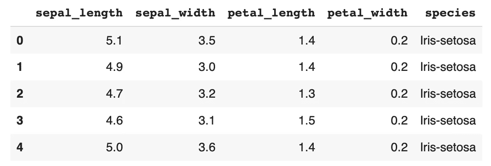
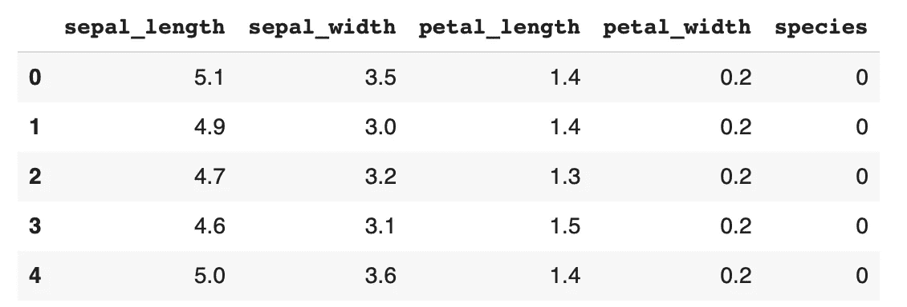
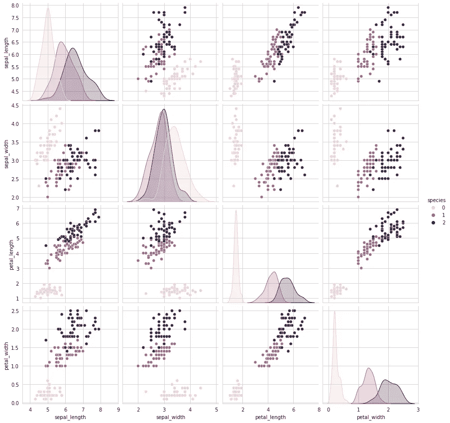
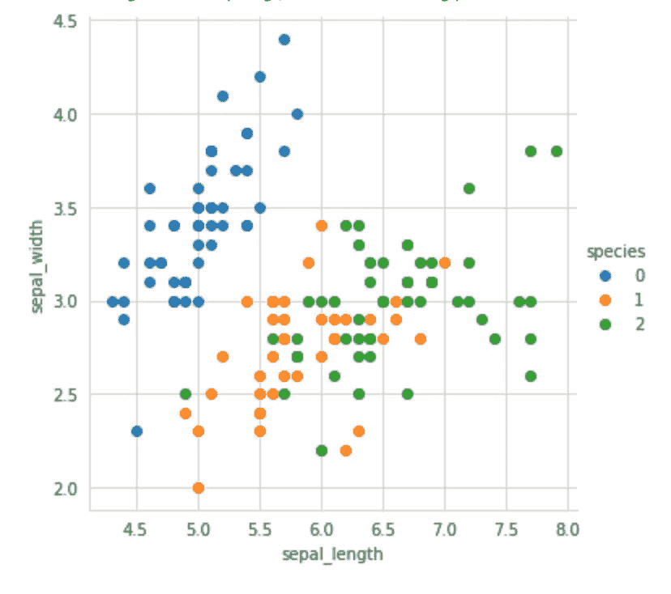
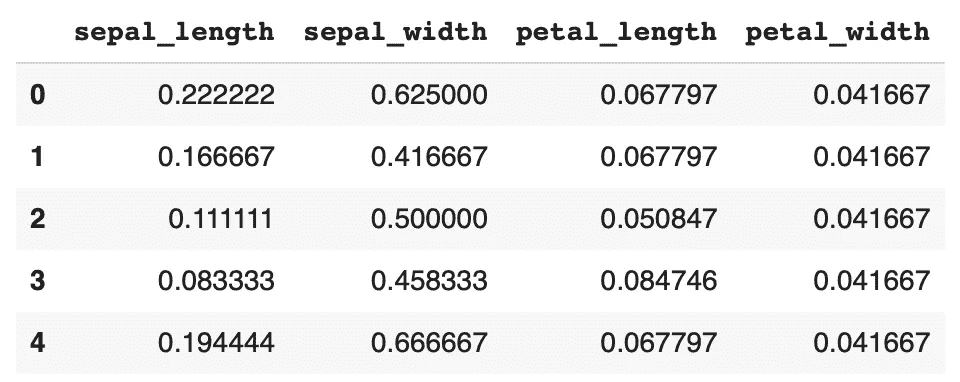
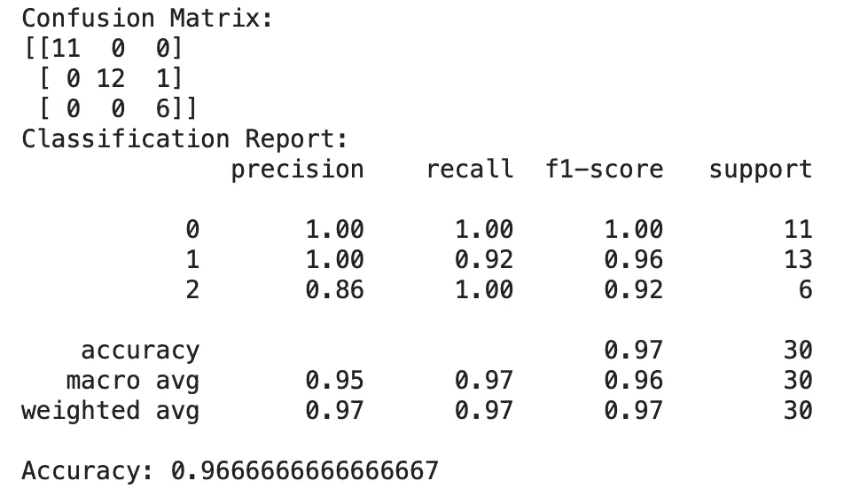

# 使用 K 近邻的多类分类

> 原文：<https://towardsdatascience.com/multiclass-classification-using-k-nearest-neighbours-ca5281a9ef76?source=collection_archive---------1----------------------->

## 在本文中，了解什么是多类分类以及它是如何工作的


马库斯·斯皮斯克在 [Unsplash](https://unsplash.com?utm_source=medium&utm_medium=referral) 上的照片

**简介:**

分类是一个经典的机器学习应用。分类基本上将你的产出分为两类，也就是说，你的产出可以是两种情况之一。例如，一家银行想知道客户是否能够支付他/她的每月投资？我们可以使用机器学习算法来确定这个问题的输出，这个输出要么是，要么不是(两个类)。但是，如果你想对有两个以上类别的东西进行分类，并且不是一个简单的是/否问题，该怎么办呢？

这就是多类分类的用武之地。多类分类可以定义为将实例分类为三个或更多类中的一个。在本文中，我们将使用 K 个最近邻进行多类分类。KNN 是一个超级简单的算法，它假设相似的事物彼此非常接近。因此，如果一个数据点靠近另一个数据点，它假设它们都属于相似的类。要更深入地了解 KNN 算法，我建议你去看看这篇文章:

[](/machine-learning-basics-with-the-k-nearest-neighbors-algorithm-6a6e71d01761) [## 基于 K-最近邻算法的机器学习基础

### k-最近邻(KNN)算法是一个简单，易于实现的监督机器学习算法，可以…

towardsdatascience.com](/machine-learning-basics-with-the-k-nearest-neighbors-algorithm-6a6e71d01761) 

现在，我们已经完成了所有的基础工作，让我们开始一些实现工作。我们将使用多个 python 库，如 pandas(读取我们的数据集)、Sklearn(训练我们的数据集并实现我们的模型)和 Seaborn 和 Matplotlib(可视化我们的数据)。如果您还没有安装这个库，您可以在您的 PC/笔记本电脑上使用 pip 或 Anaconda 安装它们。或者另一种方式，我个人建议，使用 google colab 在线执行实验，并预装所有的库。我们将使用的数据集称为鸢尾花数据集，它基本上有 4 个特征，共 150 个数据点，分为 3 个不同的物种，即每个物种 50 朵花。该数据集可从以下链接下载:

[](https://www.kaggle.com/arshid/iris-flower-dataset) [## 鸢尾花数据集

### 用于多类分类的鸢尾花数据集。

www.kaggle.com](https://www.kaggle.com/arshid/iris-flower-dataset) 

现在，当我们开始编写代码时，要做的第一步是导入代码中的所有库。

```
**from** sklearn **import** preprocessing**from** sklearn.model_selection **import** train_test_split**from** sklearn.neighbors **import** KNeighborsClassifier**import** matplotlib.pyplot **as** plt**import** seaborn **as** sns**import** pandas **as** pd
```

一旦导入了库，下一步就是读取数据。我们将使用熊猫图书馆来实现这一功能。在阅读时，我们还会检查数据中是否有空值以及不同物种的数量。(应该是 3，因为我们的数据集有 3 个物种)。我们还将为所有三个物种类别分配一个特定的数字，0、1 和 2。

```
df = pd.read_csv(‘IRIS.csv’)
df.head()
```



按作者分类的图像(原始数据集的前 5 列)

```
df[‘species’].unique()
```

*输出*:数组(['Iris-setosa '，' Iris-versicolor '，' Iris-virginica']，dtype=object)

```
df.isnull().values.any()
```

*输出*:假

```
df[‘species’] = df[‘species’].map({‘Iris-setosa’ :0, ‘Iris-versicolor’ :1, ‘Iris-virginica’ :2}).astype(int) #mapping numbersdf.head()
```



按作者分类的图像(带有输出映射数字的新表格)

一旦我们完成了库和 CSV 文件的导入，下一步就是探索性数据分析(EDA)。EDA 对于任何问题都是必要的，因为它帮助我们可视化数据，并通过查看数据而不是执行任何算法来推断一些结论。我们使用库 seaborn 执行所有特征之间的关联，并使用相同的库绘制所有数据集的散点图。

```
plt.close();sns.set_style(“whitegrid”);sns.pairplot(df, hue=”species”, height=3);plt.show()
```

*输出:*



按作者分类的图像(所有 4 个特征之间的相关性)

```
sns.set_style(“whitegrid”);sns.FacetGrid(df, hue=’species’, size=5) \.map(plt.scatter, “sepal_length”, “sepal_width”) \.add_legend();plt.show()
```

*输出:*



作者图片

EDA 的推论:

1.  虽然 Setosa 很容易识别，但 Virnica 和 Versicolor 有一些重叠。
2.  长度和宽度是识别各种花型最重要的特征。

在 EDA 之后，在数据集上训练我们的模型之前，剩下要做的最后一件事是归一化。标准化基本上是将不同特征的所有值放在同一尺度上。由于不同的特征具有不同的尺度，归一化有助于我们和模型更有效地优化其参数。我们将所有输入标准化，范围从 0 到 1。这里，X 是我们的输入(因此去掉了分类的物种)，Y 是我们的输出(3 个类)。

```
x_data = df.drop([‘species’],axis=1)y_data = df[‘species’]MinMaxScaler = preprocessing.MinMaxScaler()X_data_minmax = MinMaxScaler.fit_transform(x_data)data = pd.DataFrame(X_data_minmax,columns=['sepal_length', 'sepal_width', 'petal_length', 'petal_width'])df.head()
```



按作者分类的图像(标准化数据集)

最后，我们已经达到了训练数据集的程度。我们使用 sci-kit learn 内置的 KNN 算法。我们将输入输出数据分为训练数据和测试数据，在训练数据上训练模型，在测试模型上测试模型的准确性。对于我们的培训和测试数据，我们选择 80%–20%的分割。

```
X_train, X_test, y_train, y_test = train_test_split(data, y_data,test_size=0.2, random_state = 1)knn_clf=KNeighborsClassifier()knn_clf.fit(X_train,y_train)ypred=knn_clf.predict(X_test) #These are the predicted output values 
```

*输出:*

KNeighborsClassifier(algorithm = ' auto '，leaf_size=30，metric='minkowski '，metric_params=None，n_jobs=None，n_neighbors=5，p=2，weights='uniform ')

在这里，我们看到分类器选择 5 作为最近邻的最佳数量，以对数据进行最佳分类。现在我们已经建立了模型，我们的最后一步是可视化的结果。我们计算了混淆矩阵、精确召回参数和模型的整体准确度。

```
from sklearn.metrics import classification_report, confusion_matrix, accuracy_scoreresult = confusion_matrix(y_test, ypred)print(“Confusion Matrix:”)print(result)result1 = classification_report(y_test, ypred)print(“Classification Report:”,)print (result1)result2 = accuracy_score(y_test,ypred)print(“Accuracy:”,result2)
```

*输出:*



作者提供的图片(我们模型的结果)

***总结/结论:***

我们成功地实现了虹膜数据集的 KNN 算法。我们通过 EDA 找出了最具影响力的特征，并对我们的数据集进行了标准化，以提高准确性。我们用我们的算法得到了 96.67%的准确率，并且得到了混淆矩阵和分类报告。从分类报告和混淆矩阵中我们可以看到，它把云芝误认为是海滨锦葵。

这就是如何使用 KNN 算法进行多类分类。希望你今天学到了新的有意义的东西。

谢谢你。