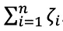

# 用支持向量机(SVM)、对偶问题和核函数进行多类分类

> 原文：<https://towardsdatascience.com/multiclass-classification-with-support-vector-machines-svm-kernel-trick-kernel-functions-f9d5377d6f02?source=collection_archive---------1----------------------->

## 最后，通过 scikit-learn 了解 Python 中 SVM +实现背后的概念


来源: [unsplash](https://unsplash.com/photos/VcQkZl4Wf1Y) (Bekky Bekks)

*支持向量机(SVM)* 不是新的，但仍然是一个强大的分类工具，因为它们不会过度拟合，但在许多情况下表现良好。如果你只对某个话题感兴趣，就滚动话题。这些是按时间顺序排列的主题:

*   *支持向量机背后的* ***数学概念*** *是什么？*
*   *什么是内核，什么是* ***内核函数*** *？*
*   *什么是* ***内核绝招*** *？*
*   *什么是 SVM 的* ***对偶问题*** *？*
*   ****多类分类*** *是如何发生的？**
*   ***通过 Python 和 scikit-learn 实现***

***如果你只对如何使用 Python 和 scikit-learn 实现感兴趣，向下滚动到最后！***

## *让我们开始吧。*

*目标是在 n 维空间中找到一个超平面，该超平面将数据点分成它们的潜在类别。超平面应该定位在距离数据点最远的位置。到超平面距离最小的数据点称为*支持向量*。由于它们的位置接近，它们对超平面的确切位置的影响比其他数据点大。在下图中，支持向量是位于直线上的 3 个点(2 个蓝色，1 个绿色)。*

**

*来源:[维基百科](https://en.wikipedia.org/wiki/Support_vector_machine#/media/File:SVM_margin.png) (Larhmam)*

*支持向量机也被称为*内核化 SVM* ，因为它们的内核将输入数据空间转换到一个更高维的空间。*

*输入空间 X 由 X 和 X’组成。*

**

*代表*内核函数*将输入空间变成一个更高维的空间，这样并不是每个数据点都被显式映射。*

*内核函数也可以写成*

**

*如何定义该函数以及该函数如何用于铺设超平面取决于数据:*

## ***内核函数***

*在 *scikit-learn* 中也可用的最流行的内核函数是*线性、多项式、径向基函数*和 *sigmoid* 。更多功能请访问[数据文件夹](https://data-flair.training/blogs/svm-kernel-functions/)。在下面你可以看到这四个内核函数的样子:*

1.  ***线性函数***

**

***2。多项式函数***

**

***3。径向基函数(RBF)***

**

***4。Sigmoid 函数***

**

# *内核技巧*

*内核函数是做什么的？*

*它取两个数据点 x_n 和 x_m，并计算它们的距离分数。数据点越近，得分越高，反之亦然。使用该分数有助于将数据点转换为更高维的映射，这减少了计算工作量和时间，并且对于大量数据特别有用。它避免了更复杂转换的需要。
这就是为什么这一步通常被称为*内核技巧*的原因。*

*从下图可以看出，数据点的映射是使用核函数(φ(( *a* ，*b*)=(*a*， *b* ， *a* 2 + *b* 2))从 2D 转到三维空间的。当变成 3D 空间时，先前居中的红点现在也位于垂直下方。不明显可分的数据点现在可以通过使用核来更好地划分。*

**

*来源:[维基百科](https://en.wikipedia.org/wiki/Support_vector_machine#/media/File:Kernel_trick_idea.svg)(、纪)*

*此外，不同的核可以帮助通过数据点的云铺设不同形状的超平面。显然，由于线性超平面对不同形状的适应性有限，它们的极限很快就被超过了。基于这一事实，不同的核函数被开发出来。*

*[](https://medium.com/subscribe/@hucker.marius) [## 请继续关注马里乌斯·哈克的新文章

### 请继续关注 Marius Hucker 的新文章。如果您还没有注册，您将创建一个中型帐户…

medium.com](https://medium.com/subscribe/@hucker.marius)* 

*为了更好地理解不同超平面的分离，不同种类的核函数在下图中被可视化。*

**

*不同内核函数的可视化。*

# *SVM 背后的数学概念*

*下面的公式提出了由支持向量机解决的优化问题。下面将进一步解释(scikit-learn，未注明日期):*

**

*目标是通过最大化从*支持向量*到超平面的裕度，同时最小化该项，来正确分类尽可能多的数据点*

**

*换句话说，目标也可以解释为找到大多数样本被正确预测的最优 **w** 和 **b** 。
大多数情况下，并不是所有的数据点都能完美分配，因此到正确边距的距离由下式表示*

**

**法向量*创建一条穿过坐标原点的线。超平面在一定距离处正交切割这条直线*

**

*从原点出发。*

*对于理想情况(毕晓普，第 325 页起。, 2006)*

**

*会≥ 1，然后被完美预测。现在有了到它们理想位置的距离的数据点，让我们修正≥ 1 到的理想情况*

**

*同时在最小化公式中引入了惩罚项。c 充当*正则化参数*并控制关于有多少数据点被错误地分配了总距离*

**

## ***对偶问题***

*优化任务可以被称为*对偶问题*，试图最小化参数，同时最大化余量。为了解决对偶问题，利用拉格朗日乘子(α≥0)。*

*这导致了一个拉格朗日函数(毕晓普，第 325 页 ff。, 2006):*

**

*利用以下两个条件(毕晓普，第 325 页起。, 2006):*

**

*w 和 b 可以从 *L(w，b，a)* 中消去。这导致下面的拉格朗日函数最大化为(Bishop，p.325 ff。, 2006):*

**

*解决优化问题时，可以使用(Bishop，第 325 页及以下)对新的数据点进行分类。, 2006):*

**

*对于核函数 *k(x_n，x_m)* 可以填入之前解释的核函数(sigmoid、线性、多项式、rbf)。*

***就这样！如果你能理解数学，你现在就能理解支持向量机背后的原理。很容易理解如何将一群数据点分成两类，但是对于多个类是如何做到的呢？让我们看看这是如何工作的。***

# *想看更多这样的故事？*

## *[开始](https://medium.com/@hucker.marius/membership)*

# *基于支持向量机的多类分类*

*在其最简单的类型中，SVM 应用于二元分类，将数据点分为 1 或 0。对于多类分类，利用相同的原理。多类问题被分解为多个二元分类情况，也称为*一对一*。在 scikit 中，一对一学习不是默认的，需要显式选择(如下面的代码所示)。*一对多*设置为默认。它基本上把 x 类和 rest 中的数据点进行了划分。连续地，某一类与所有其他类相区别。*

**一对一多类分类*所需的分类器数量可通过以下公式得到(n 为类的数量):*

**

*在一对一方法中，每个分类器分离两个不同类别的点，并且包括所有一对一分类器导致多类别分类器。*

# *把手举起来。如何使用 scikit-learn 在 Python 中应用它*

*您可能已经对 iris 数据集感到厌烦了，但这是演示它的最简单的方式，所以让我们来看看一些代码。你也可以在 [scikit-learn](https://scikit-learn.org/stable/auto_examples/svm/plot_iris_svc.html) 下找到部分代码。*

```
***#Importing the necessary packages and libaries**from sklearn.metrics import confusion_matrix
from sklearn.model_selection import train_test_split
from sklearn import svm, datasets
import matplotlib.pyplot as plt
import numpy as np*
```

*让我们将 iris 数据集作为 iris 加载，并存储目标和特征变量:*

```
*iris = datasets.load_iris()**#Store variables as target y and the first two features as X (sepal length and sepal width of the iris flowers)**
X = iris.data[:, :2]
y = iris.target*
```

*现在，让我们在训练和测试集中拆分数据集，以进行以下训练和预测:*

```
*X_train, X_test, y_train, y_test = train_test_split(X, y, train_size=0.8, random_state = 0)*
```

*在这一步，我们来看看不同的内核函数。对于所有分类器，惩罚项 C 被设置为 1。对于多类分类，指定一对一类型，如在 decision_function_shape='ovo '中可以看到的。对于多项式函数，选择 3 次，这对于其他核函数是不必要的。
所有其他参数都设置为默认值。在这里你可以阅读更多关于 scikit-learn 的 [SVC 功能。](https://scikit-learn.org/stable/modules/generated/sklearn.svm.SVC.html)*

```
*linear = svm.SVC(kernel='linear', C=1, decision_function_shape='ovo').fit(X_train, y_train)rbf = svm.SVC(kernel='rbf', gamma=1, C=1, decision_function_shape='ovo').fit(X_train, y_train)poly = svm.SVC(kernel='poly', degree=3, C=1, decision_function_shape='ovo').fit(X_train, y_train)sig = svm.SVC(kernel='sigmoid', C=1, decision_function_shape='ovo').fit(X_train, y_train)*
```

*现在让我们指定网格，我们将在其中绘制结果。*

```
***#stepsize in the mesh, it alters the accuracy of the plotprint
#to better understand it, just play with the value, change it and print it**
h = .01**#create the mesh**
x_min, x_max = X[:, 0].min() - 1, X[:, 0].max() + 1
y_min, y_max = X[:, 1].min() - 1, X[:, 1].max() + 1
xx, yy = np.meshgrid(np.arange(x_min, x_max, h),np.arange(y_min, y_max, h))**# create the title that will be shown on the plot** titles = ['Linear kernel','RBF kernel','Polynomial kernel','Sigmoid kernel']* 
```

*现在我们将使用一个 for 循环来绘制所有 4 个内核函数:*

```
*for i, clf in enumerate((linear, rbf, poly, sig)):
    **#defines how many plots: 2 rows, 2columns=> leading to 4 plots**
    plt.subplot(2, 2, i + 1) **#i+1 is the index
    #space between plots**
    plt.subplots_adjust(wspace=0.4, hspace=0.4)     Z = clf.predict(np.c_[xx.ravel(), yy.ravel()]) **# Put the result into a color plot**
    Z = Z.reshape(xx.shape)
    plt.contourf(xx, yy, Z, cmap=plt.cm.PuBuGn, alpha=0.7) **# Plot also the training points**
    plt.scatter(X[:, 0], X[:, 1], c=y, cmap=plt.cm.PuBuGn,     edgecolors='grey') plt.xlabel('Sepal length')
    plt.ylabel('Sepal width')
    plt.xlim(xx.min(), xx.max())
    plt.ylim(yy.min(), yy.max())
    plt.xticks(())
    plt.yticks(())
    plt.title(titles[i]) plt.show()*
```

*正如您可能已经认识到的，结果就是文章中上面的图片:*

**

*下一步，我们使用 4 个不同的核函数对测试数据集进行预测:*

```
*linear_pred = linear.predict(X_test)
poly_pred = poly.predict(X_test)
rbf_pred = rbf.predict(X_test)
sig_pred = sig.predict(X_test)*
```

*为了了解它们的表现如何，我们使用了一个性能指标——准确性。*

```
***# retrieve the accuracy and print it for all 4 kernel functions**
accuracy_lin = linear.score(X_test, y_test)
accuracy_poly = poly.score(X_test, y_test)
accuracy_rbf = rbf.score(X_test, y_test)
accuracy_sig = sig.score(X_test, y_test)print(“Accuracy Linear Kernel:”, accuracy_lin)
print(“Accuracy Polynomial Kernel:”, accuracy_poly)
print(“Accuracy Radial Basis Kernel:”, accuracy_rbf)
print(“Accuracy Sigmoid Kernel:”, accuracy_sig*
```

**

*正如精度所揭示的，根据数据的不同，一些核函数比其他的更有用。显然，更多的数据也有助于改善结果(虹膜数据的大小并不大，只有 50 个样本:-)。*

*让我们进入最后一步——打印 4 个内核函数的混淆矩阵，以了解预测的方式和内容:*

```
***# creating a confusion matrix** cm_lin = confusion_matrix(y_test, linear_pred)
cm_poly = confusion_matrix(y_test, poly_pred)
cm_rbf = confusion_matrix(y_test, rbf_pred)
cm_sig = confusion_matrix(y_test, sig_pred)print(cm_lin)
print(cm_poly)
print(cm_rbf)
print(cm_sig)*
```

**

*4 个混淆矩阵*

*就是这样。我希望它有助于更好地理解支持向量机，数学概念，核心技巧和主题多类分类通过 SVM。*

***感谢阅读，感谢反馈！***

*[](https://medium.com/subscribe/@hucker.marius) [## 请继续关注马里乌斯·哈克的新文章

### 请继续关注 Marius Hucker 的新文章。如果您还没有注册，您将创建一个中型帐户…

medium.com](https://medium.com/subscribe/@hucker.marius)* 

## *来源*

1.  *毕晓普，2006，[模式识别与机器学习](https://www.microsoft.com/en-us/research/uploads/prod/2006/01/Bishop-Pattern-Recognition-and-Machine-Learning-2006.pdf)，第 325 页起。*
2.  *Vapnik 和 Cortes，1995 年，[支持向量网络](https://link.springer.com/content/pdf/10.1007/BF00994018.pdf)*
3.  *Scikit-learn，[支持向量机](https://scikit-learn.org/stable/modules/svm.html)*
4.  *Scikit-learn，[在虹膜数据集中绘制不同的 SVM 分类器](https://scikit-learn.org/stable/auto_examples/svm/plot_iris_svc.html)*
5.  *Dataflair，[内核函数—SVM 内核简介&示例](https://data-flair.training/blogs/svm-kernel-functions/)*

## *整个代码*

```
***#Importing the necessary packages and libaries**from sklearn.metrics import confusion_matrix
from sklearn.model_selection import train_test_split
from sklearn import svm, datasets
import matplotlib.pyplot as plt
import numpy as npiris = datasets.load_iris()**#Store variables as target y and the first two features as X (sepal length and sepal width of the iris flowers)**
X = iris.data[:, :2]
y = iris.targetlinear = svm.SVC(kernel='linear', C=1, decision_function_shape='ovo').fit(X_train, y_train)rbf = svm.SVC(kernel='rbf', gamma=1, C=1, decision_function_shape='ovo').fit(X_train, y_train)poly = svm.SVC(kernel='poly', degree=3, C=1, decision_function_shape='ovo').fit(X_train, y_train)sig = svm.SVC(kernel='sigmoid', C=1, decision_function_shape='ovo').fit(X_train, y_train)**#stepsize in the mesh, it alters the accuracy of the plotprint
#to better understand it, just play with the value, change it and print it**
h = .01**#create the mesh**
x_min, x_max = X[:, 0].min() - 1, X[:, 0].max() + 1
y_min, y_max = X[:, 1].min() - 1, X[:, 1].max() + 1
xx, yy = np.meshgrid(np.arange(x_min, x_max, h),np.arange(y_min, y_max, h))**# create the title that will be shown on the plot** titles = ['Linear kernel','RBF kernel','Polynomial kernel','Sigmoid kernel']for i, clf in enumerate((linear, rbf, poly, sig)):
    **#defines how many plots: 2 rows, 2columns=> leading to 4 plots**
    plt.subplot(2, 2, i + 1) **#i+1 is the index
    #space between plots**
    plt.subplots_adjust(wspace=0.4, hspace=0.4)Z = clf.predict(np.c_[xx.ravel(), yy.ravel()])**# Put the result into a color plot**
    Z = Z.reshape(xx.shape)
    plt.contourf(xx, yy, Z, cmap=plt.cm.PuBuGn, alpha=0.7)**# Plot also the training points**
    plt.scatter(X[:, 0], X[:, 1], c=y, cmap=plt.cm.PuBuGn,     edgecolors='grey')plt.xlabel('Sepal length')
    plt.ylabel('Sepal width')
    plt.xlim(xx.min(), xx.max())
    plt.ylim(yy.min(), yy.max())
    plt.xticks(())
    plt.yticks(())
    plt.title(titles[i])plt.show()linear_pred = linear.predict(X_test)
poly_pred = poly.predict(X_test)
rbf_pred = rbf.predict(X_test)
sig_pred = sig.predict(X_test)**# retrieve the accuracy and print it for all 4 kernel functions**
accuracy_lin = linear.score(X_test, y_test)
accuracy_poly = poly.score(X_test, y_test)
accuracy_rbf = rbf.score(X_test, y_test)
accuracy_sig = sig.score(X_test, y_test)print(“Accuracy Linear Kernel:”, accuracy_lin)
print(“Accuracy Polynomial Kernel:”, accuracy_poly)
print(“Accuracy Radial Basis Kernel:”, accuracy_rbf)
print(“Accuracy Sigmoid Kernel:”, accuracy_sig**# creating a confusion matrix** cm_lin = confusion_matrix(y_test, linear_pred)
cm_poly = confusion_matrix(y_test, poly_pred)
cm_rbf = confusion_matrix(y_test, rbf_pred)
cm_sig = confusion_matrix(y_test, sig_pred)print(cm_lin)
print(cm_poly)
print(cm_rbf)
print(cm_sig)*
```