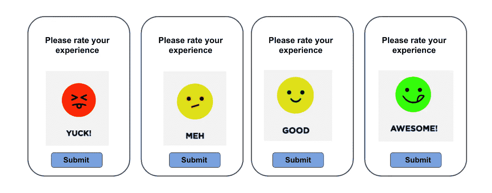
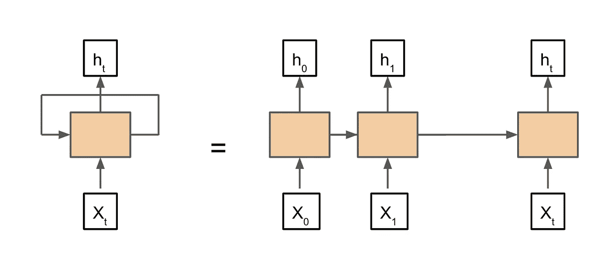
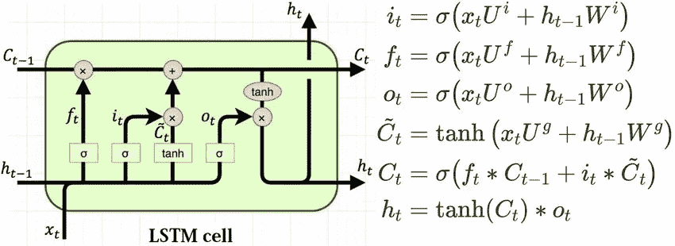

# Pytorch 中使用 LSTM 的多类文本分类

> 原文：<https://towardsdatascience.com/multiclass-text-classification-using-lstm-in-pytorch-eac56baed8df?source=collection_archive---------3----------------------->

## 基于客户评论预测项目评级

作者图片

人类的语言充满了歧义，很多时候，同一个短语可以根据上下文有多种解释，甚至会让人感到困惑。这些挑战使得自然语言处理成为一个有趣但难以解决的问题。然而，在过去的几年中，我们已经看到了 NLP 的许多进步，探索所使用的各种技术是非常令人着迷的。本文旨在使用 Pytorch 涵盖深度学习中的一种技术:长短期记忆(LSTM)模型。

这里有一个笔记本的链接，其中包含了我在本文中使用的所有代码:[https://jovian . ml/aakanksha-ns/lstm-multi class-text-classification](https://jovian.ml/aakanksha-ns/lstm-multiclass-text-classification)

如果您是 NLP 新手，或者需要深入了解预处理和单词嵌入，可以阅读下面的文章:

 [## 自然语言处理(NLP)入门

### 使用简单的 Python 库

towardsdatascience.com](/getting-started-with-natural-language-processing-nlp-2c482420cc05) 

# rnn 和 LSTMs 简介:

使语言模型不同于传统神经网络的是它们对上下文的依赖性。传统的前馈网络假设输入彼此独立。对于 NLP，我们需要一种机制，能够使用来自先前输入的顺序信息来确定当前输出。递归神经网络(RNNs)通过拥有循环来解决这个问题，允许信息在网络中持续存在。

展开的递归神经网络(图片由作者提供)

然而，传统的 rnn 有爆炸和消失梯度的问题，并且不擅长处理长序列，因为它们遭受短期记忆。

长短期记忆网络(LSTM)是一种特殊的 RNN，能够学习长期依赖关系。它们通过维持一种称为“细胞状态”的内部记忆状态来实现这一点，并通过称为“门”的调节器来控制每个 LSTM 单元内部的信息流。这里有一个很好的解释 LSTMs 细节的来源:

 [## 了解 LSTM 网络

### 2015 年 8 月 27 日发布人类不是每秒钟都从零开始思考。当你读这篇文章时，你…

colah.github.io](https://colah.github.io/posts/2015-08-Understanding-LSTMs/) 

LSTM 细胞的结构。([来源](https://www.researchgate.net/publication/329362532_Designing_neural_network_based_decoders_for_surface_codes):瓦萨莫普洛斯、萨瓦斯&贝特尔斯、科恩&阿尔穆德韦、卡门。(2018).设计基于神经网络的表面码解码器。)

# Pytorch 的基本 LSTM

在我们进入主要问题之前，让我们看看 Pytorch 中使用随机输入的 LSTM 的基本结构。在进入复杂的输入之前，这是一个有用的步骤，因为它帮助我们学习如何更好地调试模型，检查维度是否增加，并确保我们的模型按预期工作。

尽管我们将处理文本，但由于我们的模型只能处理数字，我们将输入转换成数字序列，其中每个数字代表一个特定的单词(下一节将详细介绍)。

我们首先将输入(3×8)通过一个[嵌入](https://en.wikipedia.org/wiki/Word_embedding)层，因为单词嵌入在捕捉上下文方面更好，并且在空间上比一键向量表示更有效。

在 Pytorch 中，我们可以使用`nn.Embedding`模块来创建这一层，它将词汇大小和期望的单词向量长度作为输入。您可以选择提供填充索引，以指示嵌入矩阵中填充元素的索引。

在下面的例子中，我们的词汇表由 100 个单词组成，所以我们对嵌入层的输入只能是从 0 到 100，它返回给我们一个 100x7 的嵌入矩阵，第 0 个索引代表我们的填充元素。

我们将嵌入层的输出传递到 LSTM 层(使用`nn.LSTM`创建)，它将单词向量长度、隐藏状态向量长度和层数作为输入。此外，如果我们的输入形状中的第一个元素具有批量大小，我们可以指定`batch_first = True`

LSTM 层输出三样东西:

*   序列中所有隐藏状态的合并输出
*   最后一个 LSTM 单元的隐藏状态—最终输出
*   细胞状态

我们可以验证在通过所有层之后，我们的输出具有预期的尺寸:

3x8 ->嵌入-> 3x8x7 -> LSTM(隐藏大小=3)-> 3x3

# 多类文本分类—根据评论预测评级

现在让我们来看看 LSTMs 的一个应用。

**问题陈述:**给定一个商品的评论，预测评分(取 1 到 5 的整数值，1 为最差，5 为最好)

**数据集**:我使用了以下来自 Kaggle 的数据集:

 [## 女性电子商务服装评论

### 23，000 条客户评论和评级

www.kaggle.com](https://www.kaggle.com/nicapotato/womens-ecommerce-clothing-reviews) 

# 公制的

对于大多数分类问题，我们通常以准确性作为衡量标准，然而，评级是有序的。如果实际值为 5，但模型预测值为 4，则不认为它与预测值 1 一样差。因此，我们选择**RMSE**——均方根误差作为我们的北极星度量标准，而不是精确。此外，评级预测是一个相当困难的问题，即使对人类来说也是如此，所以预测误差不超过 1 分就已经很不错了。

# 预处理

如前所述，我们需要将文本转换成数字形式，作为输入提供给模型。在删除标点符号、特殊字符和小写文本后，我使用了`spacy`进行标记化:

我们统计每个单词在语料库中出现的次数，并去掉不经常出现的单词:

我们丢了 6000 字左右！这是意料之中的，因为我们的语料库很小，不到 25k 条评论，出现重复单词的机会很小。

然后，我们创建一个词汇索引映射，并使用该映射对我们的评论文本进行编码。我选择任何评论的最大长度为 70 个字，因为评论的平均长度约为 60 个字。

# Pytorch 数据集

数据集非常简单，因为我们已经将编码存储在输入数据帧中。我们还输出每种情况下输入序列的长度，因为我们可以有接受可变长度序列的 LSTMs。

# Pytorch 训练循环

训练循环相当标准。我用过亚当优化器和交叉熵损失。

# LSTM 模型

我在模型中使用了三种变体:

1.  **固定输入大小的 LSTM:**

这与我们之前看到的基本 LSTM 的结构非常相似，只是增加了一个漏失层来防止过度拟合。由于我们有一个分类问题，我们有一个最终的线性层有 5 个输出。这种实现实际上在分类 LSTMs 中工作得最好，精确度约为 64%,均方根误差仅为 0.817

**2。可变输入尺寸的 LSTM:**

我们可以稍微修改一下我们的模型，让它接受可变长度的输入。这最终增加了训练时间，因为`pack_padded_sequence`函数调用返回一批填充的可变长度序列。

**3。具有固定输入大小和固定预训练手套词向量的 LSTM:**

代替训练我们自己的单词嵌入，我们可以使用预先训练的手套单词向量，其已经在大规模语料库上被训练并且可能具有更好的上下文捕获。然而对于我们的问题来说，这似乎帮助不大。

# 使用回归而不是分类来预测评级

由于评级是有顺序的，并且在许多情况下，3.6 的预测可能比四舍五入到 4 更好，因此将此作为回归问题进行探讨是有帮助的。不足为奇的是，这种方法给了我们最低的误差，仅仅是`0.799`，因为我们不再只有整数预测了。

我们的模型的唯一变化是，最终层没有 5 个输出，而是只有一个。训练循环也有点变化，我们使用`MSE`损失，我们不再需要使用`argmax`来获得最终预测。

# 结论:

理论上 LSTM 似乎参与其中，但是它的 Pytorch 实现非常简单。此外，在研究任何问题时，选择正确的指标非常重要，在我们的案例中，如果我们追求准确性，模型似乎做得非常糟糕，但 RMSE 显示它相差不到 1 个评分点，这与人类的表现相当！

**参考文献**:

*   [https://www . usfca . edu/data-institute/certificates/deep-learning-part-one](https://www.usfca.edu/data-institute/certificates/deep-learning-part-one)
*   【https://colah.github.io/posts/2015-08-Understanding-LSTMs/ 
*   [http://web.stanford.edu/class/cs224n/](http://web.stanford.edu/class/cs224n/)