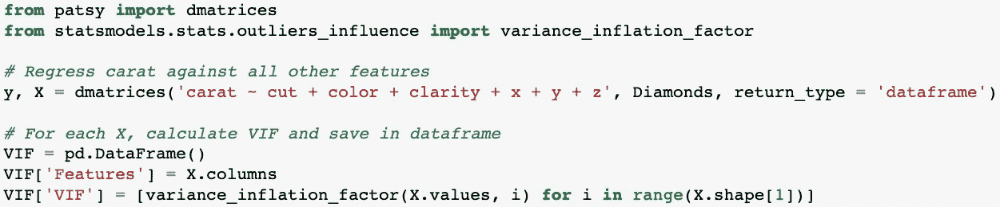

# 多重共线性

> 原文：<https://towardsdatascience.com/multicollinearity-83d3ec2c8acf?source=collection_archive---------19----------------------->

## 厨师多了烧坏汤

照片由 [Unsplash](https://unsplash.com?utm_source=medium&utm_medium=referral) 上的[迪佩什·古拉夫](https://unsplash.com/@how_it_feel?utm_source=medium&utm_medium=referral)拍摄

M 多重共线性是一个很容易出现在任何现实生活数据科学问题中的问题。在这篇短文中，我想说明什么是多重共线性，为什么它是一个问题，如何测量它以及一旦发现如何处理它。

## **是什么？**

当一个或多个自变量彼此高度相关时，存在多重共线性。这当然违反了多元线性回归(MLR)问题中必须满足的假设之一。影响回归系数标准误差的因素之一是 MLR 问题中自变量之间的相互依赖性。

## 钻石数据集

假设我们有一个数据集来预测圆形切割钻石的价格。目标变量是价格。预测因素包括克拉、切割、颜色、净度、x、y 和 z。变量 x、y 和 z 代表钻石直径的内部尺寸。

钻石数据集的前 10 条记录。

有序分类变量 cut、color 和 clarity 经过标签编码，因此可用于线性回归模型。相关矩阵允许我们看到数据集中每个变量之间的 ***皮尔逊相关系数*** 。有趣的是，我们能够看到在 ***克拉*** 和 ***x*** ， ***y*** 和 ***z*** 之间存在着很强的线性关系。该数据集高度怀疑这些变量之间存在多重共线性。

钻石数据集的相关矩阵。

## **为什么是问题？**

当变量之间的相关性变得更高时，这就产生了问题。随着共线性程度的增加，回归系数的大小和波动性也会增加。这导致更高的样品间可变性。这使得所讨论的变量作为回归方程中的预测值是不可靠的。所讨论的系数的置信区间变得非常大，这使得拒绝任何无效假设几乎是不可能的。由于研究问题是在交替假设中，我们得到它的机会受到回归系数缺乏统计意义的阻碍。

## 我们如何测试它？

如果怀疑存在多重共线性，可以使用方差膨胀因子(VIF)进行检查。有一会儿，因变量被从图片中删除。每个独立变量相对于所有其他独立变量进行回归。得到的 R 值用于数学上表示 VIF，如下式所示:

***【VIF = 1/(1-R)***

这意味着，当变量真正相互独立时，R 将非常小，方程趋向于 1。VIF 为 1 表示完全独立于任何其他变量。这是多元回归模型中的假设之一。介于 5 和 10 之间的 VIF 表示共线性非常高。这分别对应于 0.8 和 0.9 的 R 值。一般惯例规定，任何得分大于 10 的都必须排除在外。越接近 1，预测建模的场景越理想。

在 python 中，我们只差几个模块就能轻松评估这一点。考虑到钻石数据集，我们有一个多元线性回归问题，有 ***7 个自变量*** 和 ***1 个因变量*** 。我们对每个自变量进行相互回归，并确定一个 ***VIF 分数*** 。我们使用***d 矩阵功能*** 创建设计矩阵。

为了便于可视化，我将 VIF 放在一个 dataframe 对象中。

如此高的 VIF 分数证实了这种怀疑！变量 x、y 和 z 与克拉高度相关。在这种情况下，这些变量从 MLR 模型中删除。但是，我们可以通过多种方式来处理多重共线性。

## 我们如何对待它？

最终，必须进行某种形式的降维来解决多重共线性问题。

1.  有问题的变量可以从回归模型中删除。在上面的示例中，删除 x、y 和 z 是一个显而易见的选择，因为 VIF 值远高于 10，表明高度多重共线性。模型的最终性能具有 97.7%的 R 值。在较弱的模型中，即使 VIF 较低，也可能发生多重共线性。因此，重要的是要注意，没有硬性规定。除了统计数据之外，领域知识使得选择要消除的变量变得更加容易。选择可能不像示例中的数据那样明显。
2.  另一种可以考虑的方法是使用其他回归方法，如偏最小二乘法(PLS ),因为这不会在多重共线性面前崩溃。如果能够报告关于原始变量的发现很重要，这可能是一个好的选择。
3.  最后，您可以考虑主成分分析(PCA ),它将数据投影到新的成分中。作为警告，如果你的任务是深入解释变量如何影响目标，这可能不是最好的选择。

如您所见，多重共线性不一定是问题。一旦确定，你就有能力去管理它并控制它。

本文中的数据基于一个 [github 仓库](https://github.com/SiphuLangeni/Diamond-Price-Prediction)。

请在链接的[上与我连线！](https://www.LinkedIn.com/in/SiphuLangeni)