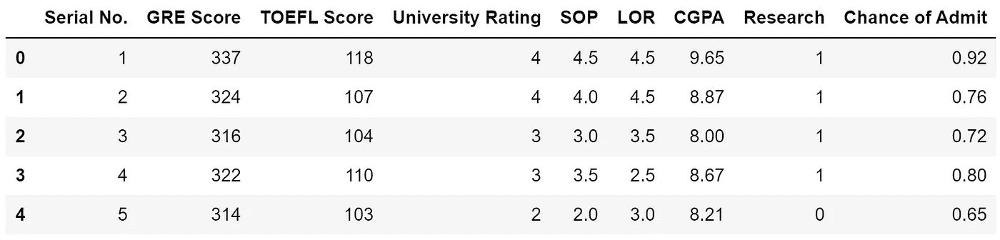
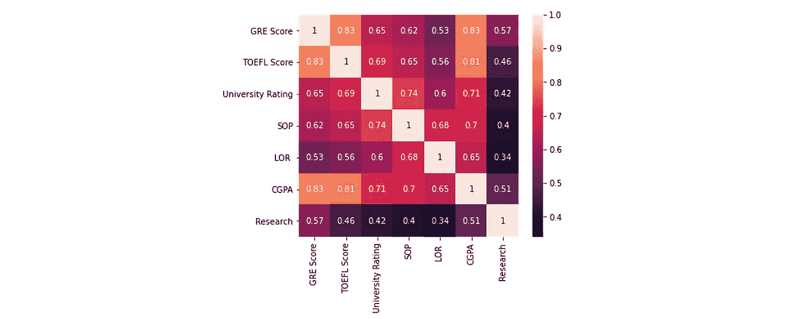
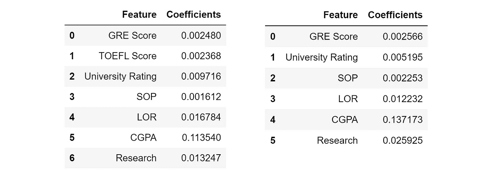

# 多重共线性对您的数据科学项目的影响超乎您的想象

> 原文：<https://towardsdatascience.com/multicollinearity-impacts-your-data-science-project-more-than-you-know-8504efd706f?source=collection_archive---------17----------------------->

来源: [Unsplash](https://unsplash.com/photos/w-9Rhh0Tgqo)

## 以下是识别和预防的方法

多重共线性很可能在要检查的事物的心理列表中处于很低的位置，如果它确实在列表中的话。然而，这种情况几乎总是出现在现实生活的数据集中，知道如何解决它很重要。

顾名思义，多重共线性是指两个(或多个)要素相互关联，或“共线”。这在真实数据集中经常发生，因为一个测量(例如家庭收入)可能与另一个测量(例如学校表现)相关。您可能没有意识到，许多算法和分析方法都依赖于没有多重共线性的假设。

让我们以这个数据集为例，它试图在给定各种因素的情况下预测学生的录取机会。

我们想达到一个静态的效果，比如“做研究能让你的录取几率增加 *x* 个百分点”或者“托福每增加一分，录取几率增加 *y* 个百分点”。第一个想法是训练线性回归模型并解释系数。

多元回归模型的平均绝对误差约为 4.5%，这是相当准确的。这些系数分析起来很有趣，我们可以做出这样的陈述:“GRE 上的每一分都会增加你 0.2%的录取机会，而 CGPA 上的每一分都会增加 11.4%的机会。”

由作者创建。

让我们看一下相关性矩阵，以确定哪些特征是相互关联的。通常，该数据集充满了高度相关的要素，但 CGPA 通常与其他要素高度相关。

由作者创建。

由于托福成绩与 GRE 成绩高度相关，所以我们去掉这个特征，重新训练一个线性回归模型。(也许)令人惊讶的是，平均绝对误差*减少*到 4.3%。系数的变化也很有趣——值得注意的是，大学排名的重要性下降了近一半，研究的重要性增加了一倍，等等。

由作者创建。

我们可以从中得出以下结论:

*   托福成绩，像任何其他特征一样，可以被认为有两个组成部分:信息和噪音。
*   它的信息成分已经在其他变量中表现出来了(也许在 GRE 考试中表现好需要在托福考试中表现好的技能，等等。)，所以没有提供任何新的信息。
*   它有足够的噪声，以至于为了最小的信息增益而保留该特征不值得将噪声量引入到模型中。

换句话说，托福成绩与许多其他特征是共线的。在基本层面上，模型的性能受到了损害，但此外，对线性模型的更复杂的分析(这可能非常有见地)需要进行调整，如系数的解释。

回归模型的系数是什么意思，值得探讨。例如，如果 GRE 分数的系数是 0.2%，这意味着*保持所有其他变量不变*，GRE 分数增加一个单位就意味着录取率增加 0.2%。然而，如果我们包括托福成绩(和其他高度相关的特征)，我们不能假设这些变量将保持不变。

因此，系数变得杂乱无章，完全无法解释，因为有大量的信息重叠。当这种情况出现时，建模能力也会受到限制。因为有如此多的重叠，一切都被放大了——如果一个部分有错误，它很可能通过重叠传播到其他几个部分。

通常，记住算法或技术是否能很好地处理多重共线性是不切实际的，但通常情况下，任何将要素视为“相同”(对要素关系做出假设)或不测量信息内容的模型都容易受到多重共线性的影响。

这是什么意思？

以决策树为例，它不容易受到多重共线性的影响，因为它明确地测量信息内容(与[熵](/understanding-entropy-the-golden-measurement-of-machine-learning-4ea97c663dc3)相反)，并且不对特征之间的关系进行其他假设或测量。如果 A 列和 B 列相互关联，决策树将简单地选择一个并丢弃另一个(或者将其放在很低的位置)。在这种情况下，要素按其信息内容来考虑。

另一方面，K-最近邻*是受多重共线性影响的*，因为它假设每个点可以在多维空间中表示为某个坐标(例如，在具有四维的`x`训练集上的`(3, 2.5, 6.7, 9.8)`)。它不测量信息内容，并且对特征一视同仁。因此，可以想象两个高度相关的特征之间的数据点会沿着一条线聚集在一起，这将如何干扰跨维距离。

主成分分析是一种无监督的方法，但我们仍然可以沿着这些标准来评价它！PCA 的目标是显式保留缩减数据集的方差或结构(信息)，这就是为什么它不仅通常不受多重共线性的影响，而且通常用于减少数据集中的多重共线性。

最有效的算法求解方法依赖于矩阵数学和线性代数系统——本质上是高维空间的表示，很容易被多重共线性干扰。

常见的技术，如重码编码(虚拟变量)，其中分类变量表示为 0 和 1，也可能是有害的，因为它们形成了完美的线性关系。假设我们有三个二进制列 A、B 和 C，表示一行是否属于其中一个类别。这些列的总和必须加到 1，因此建立了完美的线性关系`A+B+C=1`。

如何识别多重共线性？

*   使用回归模型上的 VIF(方差膨胀因子)得分来识别数据集中是否存在多重共线性。
*   如果标准误差太高，这可能表明由于信息重叠，一个误差正在重复传播。
*   添加或删除新功能时参数的较大变化表明存在大量重复信息。
*   创建相关矩阵。值始终高于 0.4 的要素表示多重共线性。

多重共线性有多种解决方案:

*   如果多重共线性是数据的固有特征，并且其他转换不可行，请使用不受多重共线性影响的算法。岭回归、主成分回归或偏最小二乘回归都是很好的回归选择。
*   使用 PCA 降低数据集的维数，只保留对保持数据结构重要的变量。如果数据集总体上非常多重共线性，这是有益的。
*   使用特征选择方法移除高度相关的特征。
*   获取更多数据—这是首选方法。更多的数据可以让模型保留当前的信息量，同时为噪声提供上下文和视角。

 [## 贝叶斯定理实际上是一个直观的分数

### 不使用术语，把定理拆开

towardsdatascience.com](/bayes-theorem-is-actually-an-intuitive-fraction-5f2803998006) 

感谢您的阅读，请在回复中告诉我您的想法！

如果你对最新的文章感兴趣，可以考虑订阅。如果你想支持我的写作，通过我的[推荐链接](https://andre-ye.medium.com/membership)加入 Medium 是一个很好的方式。干杯！