# 多维标度布朗桥——性质与模拟

> 原文：<https://towardsdatascience.com/multidimensional-scaled-brownian-bridge-properties-simulation-79425356f9bc?source=collection_archive---------35----------------------->

## [随机模拟](https://towardsdatascience.com/tagged/stochastic-modelling)

由[佩德罗·麦克](https://unsplash.com/@pistolpedro)在 Unsplash 上拍摄的照片

在[期货市场](https://www.investopedia.com/terms/f/futurescontract.asp#:~:text=A%20futures%20contract%20is%20a,trading%20on%20a%20futures%20exchange.)，通常可以观察到期货价格可能偏离标的资产的现货价格。如前面的[文章](https://medium.com/@timleungresearch/understanding-the-non-convergence-of-agricultural-futures-93161999265e)所示，**期货**和**现货**价格之间的差价，称为**，可以是正的，也可以是负的，但预计在期货合约到期时会收敛到零或接近零。**

**对于每种基础资产，都有多种不同期限的期货(从 1 个月到一年多不等)。对于每份期货合约，都有一个基本过程。因此，当我们考虑所有不同的现货资产及其相关期货时，有大量的基础过程。**

**此外，这些随机过程显然是**相关的**。首先，现货资产，如白银和黄金，可能(可能高度)相关。其次，在其他因素中，同一基础资产的期货显然是由一个共同的随机性来源驱动的。对于任何从事期货交易的人来说(基于相同或不同的资产)，理解这些过程之间的相关性是至关重要的。**

# **多维标度布朗桥**

**这促使我们开发一种新的模型来捕捉不同基础和不同期货合约的随机基础的联合动态。一旦这个模型建立起来，我们就把它应用到动态期货交易中，正如这篇[论文](https://papers.ssrn.com/sol3/papers.cfm?abstract_id=3467897)中所研究的。**

****多维标度布朗桥(MSBB)** 是由以下多维随机微分方程(SDE)描述的连续时间随机模型:**

****

**在哪里**

**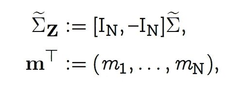****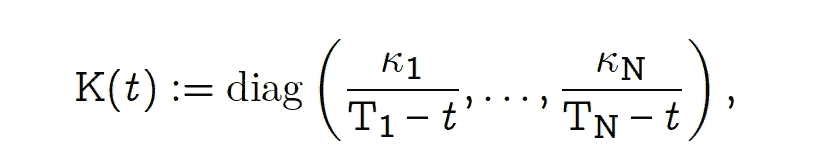**

**而 **W** 由布朗运动组成。**

**事实上， **Z** 是一个 N 维的过程，其中每个组件都是一个一维的[标度的布朗桥](https://medium.com/@timleungresearch/a-stopped-scaled-brownian-bridge-model-for-basis-trading-6b1af54cee7f):**

**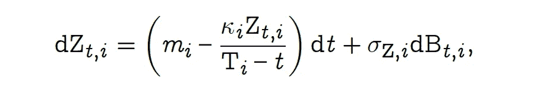**

**一维标度布朗桥的随机微分方程。注意标度布朗桥 Zᵢ是相关的。**

**多维标度布朗桥的 SDE 有唯一的解**

**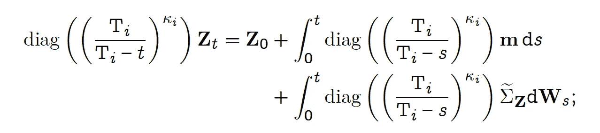**

**这里，我们使用对角矩阵的简写符号:diag (aᵢ ) = diag(a₁。。。，a_N)。**

****Z** 的**均值函数**由下式给出**

**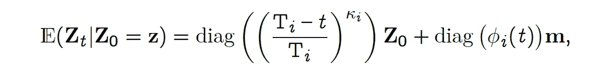**

**在哪里**

**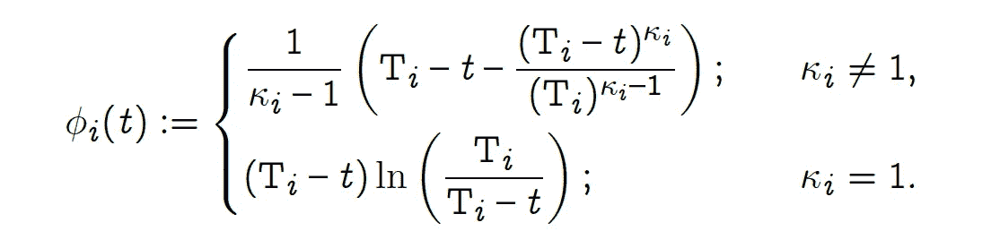**

**κᵢ是缩放参数。**

**并且**协方差函数**是**

**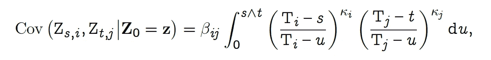**

**图 1 显示了两对期货和标的资产(即 N = 2)的 **Z** 、 **S** 和 **F** 的模拟路径。这里，每个 Z 是相应资产和期货合同的对数基础(即 log(F/S))。(Zt，1)和(Zt，2)的曲线也显示了对数基数的 95%置信区间。**

**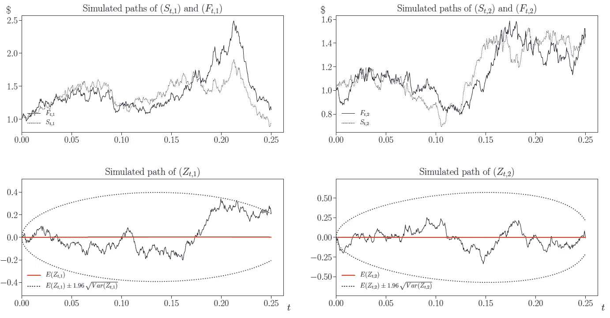**

**图 1:两对期货和现货(即 N = 2)的 S 和 F 的模拟样本路径，以及相应的二维基本过程 z .来源:[https://arxiv.org/pdf/1910.04943.pdf](https://arxiv.org/pdf/1910.04943.pdf)**

**这些图显示了对数基础的两个特征。首先，它们是**均值回复**，因为任何偏离其均值的情况都被纠正。第二，它们在交易期限结束时(T = 0.25)部分收敛到零，这从置信区间变窄可以明显看出。事实上，(Zt，1)和(Zt，2)是布朗桥，分别在 T₁ = 0.27 和 T₂ = 0.254 时收敛到零。这种收敛没有实现，因为在这个特定的例子中，交易在 T = 0.25 停止。**

**由于，Zt |Z₀是一个多元正态随机变量，这意味着**

**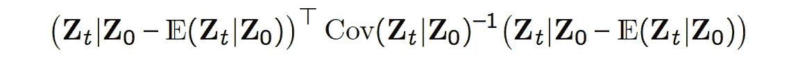**

**具有**卡方分布**和 *N* 自由度。该关系用于获得由蓝色虚线椭圆表示的 Zt 的 95%置信区域。这些图还显示了在时间范围结束时对数基础的部分收敛。**

**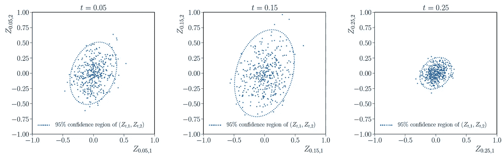**

**(z₂z₁)的模拟值基于在三个不同时间观察到的 400 条模拟路径:t = 0.05(左)、t = 0.15(中)和 t = 0.25(右)。虚线代表(Z₁，Z₂)的 95%置信区域的边界，条件是 Z₀ = (0，0)。来源:[https://arxiv.org/pdf/1910.04943.pdf](https://arxiv.org/pdf/1910.04943.pdf)**

# **模拟**

**多维标度布朗桥的 SDE 解实际上有助于模拟算法。我们参考论文了解详细信息，但主要思想是将时间范围离散为 M 个时间步长，模拟独立的高斯随机变量，并将其放在正确的位置，如下所示:**

**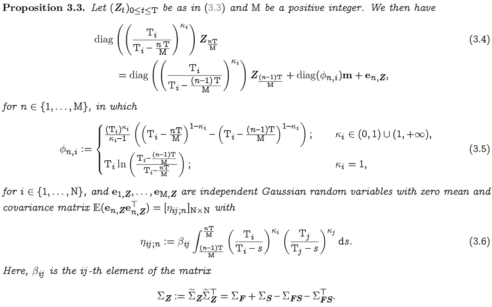**

**来源:https://arxiv.org/pdf/1910.04943.pdf**

**对于这里没有解释的任何符号，请参考下面的文件。**

# **外卖食品**

**对于涉及多种期货和资产的交易系统来说，恰当地捕捉价格过程之间的相关性是必要的。**这里描述的 MSBB** 是为期货和现货资产之间的联合动力学建模而设计的。通过对随机微分问题的求解，该模型易于模拟。通过模拟样本路径，人们可以测试交易策略的表现。**

# **参考**

**T.Leung 和 B. Angoshtari，**一篮子期货合约的最优交易**[[pdf](https://www.google.com/url?q=https%3A%2F%2Fpapers.ssrn.com%2Fsol3%2Fpapers.cfm%3Fabstract_id%3D3467897&sa=D&sntz=1&usg=AFQjCNEaXz7YASPCmsnHQ0UT827TPPNbDA)；[链接](https://www.google.com/url?q=https%3A%2F%2Fdoi.org%2F10.1007%2Fs10436-019-00357-w&sa=D&sntz=1&usg=AFQjCNGeWFV4cxyza8Vkhi6EFC6HCBfUsg)，*财政年报*，2020**

**[Linkedin 页面](https://www.linkedin.com/in/timstleung/) // [主页](https://sites.google.com/site/timleungresearch/research)**