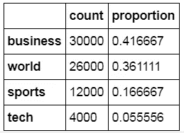
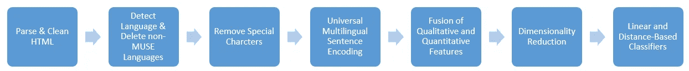
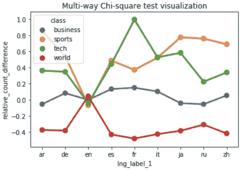
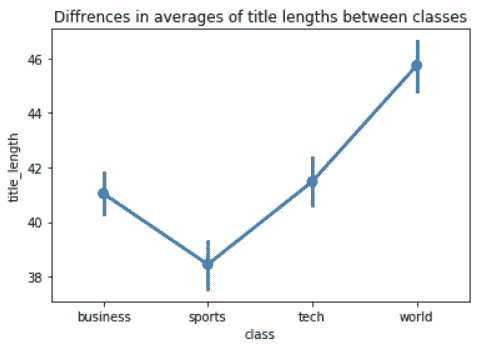
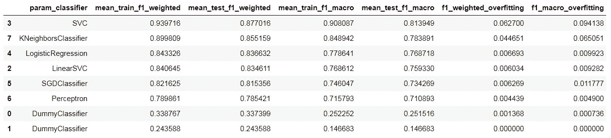

# 多语言文档分类

> 原文：<https://towardsdatascience.com/multilingual-document-classification-2731ce8c0163?source=collection_archive---------36----------------------->


作者图片

## 如何构建语言无关的 NLP 应用程序？

利用非结构化数据正成为在基于数据的业务中维持和超越的必要条件。开发能够提高 NLP 模型性能的文本特性需要语言学、数据科学和商业领域专业知识的结合。

这对一家初创企业来说已经足够了，但如果你的产品成为病毒，你走向全球，那该怎么办？

# 影响

想象一下，一家医疗保健服务机构根据英语临床研究为患者提供量身定制的剂量计划，从而提供最佳的医疗服务。如果你能添加其他语言，并利用中国或日本的最新研究成果，会怎么样？

# 挑战

对于数据科学家来说，开发一个成功的 NLP 模型意味着拥有带有文档标签的高质量语料库。不幸的是，大部分都是英文版本。当然，人们可以收集和标记其他语言的训练数据，但这将是昂贵和耗时的。

幸运的是，有一种有趣的替代方法叫做**跨语言文档分类**。

> 它的目的是在一种语言的数据集上训练一个文档分类器，并将其预测能力推广到其他语言，而不需要其他语言的数据集。
> 
> 这个想法是使用独立于语言的单词或整个句子的表示。

# 使用案例

不要再拖延了，让我们立即行动起来，构建一个多语言新闻标题分类器。

该数据集包括来自 35 种不同语言的各种媒体公司的 72000 篇文章标题。它们被分为 4 个互斥的主题标签。任务是预测给定任何语言标题的标签。



关于标签的高度不平衡的数据集

# NLP 管道

如何解决如此复杂的问题？我们分阶段一步一步分解吧。



NLP 管道

## 第一步。解析和清理 HTML

语料库似乎是从 HTML 代码中刮出来的，因为它包含许多 HTML 字符代码；有些坏了。已经创建了一个小型解析器来清理标题。

## 第二步。语言检测

似乎语言类型将是标题分类的一个极好的预测器。从[卡方检验](https://en.wikipedia.org/wiki/Chi-squared_test)的结果来看，文字新闻大部分是用英语写的，而体育和科技文章则是非英语语言写的。



现在让我们使用脸书的[快速文本](https://fasttext.cc/)库来检测语言。

```
import fastext
import pandas as pddef predict_language(text, language_classifier):
    language = language_classifier.predict(text)
    return languagelanguage_classifier = fasttext.load_model('lid.176.ftz')
df = pd.read_csv('headlines.csv').to_frame()df['language'] = (df['headline']
                  .apply(predict_language, 
                         args=(language_classifer)))
```

## 步骤 3–4。通用多语言句子编码(MUSE)

进一步的管道设计需要很好地理解 [MUSE 模型](https://tfhub.dev/google/universal-sentence-encoder-multilingual-large/3)以及它是如何被训练的。

> 简单明了的 MUSE 将句子转换成一个数字向量。不同语言中具有相似意义的句子向量之间有着密切的几何距离。

该模型已在 16 种语言中进行了训练，因此有必要应用过滤器来删除管道中的其他语言。这是可行的，因为只有 3%的数据集超出了 MUSE 的范围。

重要的是执行与在模型训练期间已经完成的相同的文本预处理步骤。好消息是它们已经嵌入到 TensorFlow 的 model `*predict*`函数中。因此，除了删除下面的特殊字符之外，不需要额外的预处理。

```
special_chars = [
    ',', '.', '"', ':', ')', '(', '-', '!', '?', '|', ';', "'", '/', 
    '[', ']', '>', '%', '=', '#', '*', '+', '\\', '•',  '~', '·', 
    '_', '{', '}', '©', '^', '®', '`',  '<', '→', '°', '™', '›','♥',
    '←', '×', '§', '″', '′', '█', '½', '…', '“', '★', '”','–', '●', 
    '►', '−', '¢', '²', '¬', '░', '¶', '↑', '±', '¿', '▾','═', '¦',
    '║', '―', '¥', '▓', '—', '‹', '─', '▒', '：', '⊕', '▼', '▪',  
    '†', '■', '’', '▀', '¨', '▄', '♫', '☆', '¯', '♦', '¤', '▲', '∞',
    '∙', '）', '↓', '、', '│', '（', '»', '，', '♪', '╩', '╚', '³',
    '・', '╦', '╣', '╔', '╗', '▬','❤', 'ï', 'Ø', '¹', '≤', '‡', '√'
]
```

TensorFlow 完成了这项工作，将句子嵌入为长度为 512 的数字向量变得毫不费力。

```
import tensorflow_hub as hub
import numpy as np
import tensorflow_textembed = hub.load("https://tfhub.dev/google/universal-sentence-encoder-multilingual-large/3")X_embeded = embed(df['filtered_cleaned_headline'].values)
```

## 第五步。定性和定量特征的融合。

寻找合适的特性来提高模型性能是商业经验、科学和艺术的结合。所以，让我们看看除了嵌入和语言特性之外我们还能做些什么。

从这三组平均值之间的差异来看，标题文本长度可能是区分“体育”、“商业+技术”和“世界”相关标题的良好预测指标。



方差分析(ANOVA)

## 第六步。编码的降维

拥有 512 个特征是一个相当大的数字，会导致很长的训练时间，它的内存和计算开销很大，并且容易导致模型过度拟合。

> 过度拟合意味着模型不学习。它只是记忆训练数据，但它无法准确预测尚未看到的数据。

考虑到嵌入/编码的维数减少，有几种选择:

1.  [t-分布式随机邻居嵌入(t-SNE)](https://en.wikipedia.org/wiki/T-distributed_stochastic_neighbor_embedding)
2.  [主成分分析](https://en.wikipedia.org/wiki/Principal_component_analysis) (PCA)
3.  [PCA +后处理算法](https://github.com/vyraun/Half-Size)

t-SNE 保持嵌入之间的相对距离，这是很大的，但它在计算上是昂贵的。PCA 用于快速原型制作，因为它快速且完全集成到 scikit-learn 管道中。但我会建议尝试选项 3，它在这篇[论文](https://arxiv.org/pdf/1708.03629.pdf)中被证明更优越。

## 第七步。分类器筛选

NLP 管道内置于 scikit-learn 中，支持测试不同类型的模型。

```
*# Design NLP pipeline*
pipeline = Pipeline([
    *# Fusion of features* 
    ('fuser', ColumnTransformer(
        [    
            *# Transform MUSE encodings*
            ('embedings', Pipeline([ # Standardize MUSE encodings                   
                ('emb_scaler', StandardScaler()),

                # Dimensionality reduction of encodings
                ('emb_reducer', PCA(
                    n_components=0.75,
                    random_state=random_state))]), # Apply to only encodings columns
              emb_idx),

            *# Standardize title length feature*
            ('title_length', StandardScaler(), ['title_length']), *# One-hot encode language feature*
            ('language', OneHotEncoder(drop='first'), ['language'])            
       ]    
   )), *# Determine classification model in the GridSearchCV*
    ('classifier', None)
])
```

由于不平衡的标签，`[f1_weigted](https://en.wikipedia.org/wiki/F1_score)`和`[f1_macro](https://scikit-learn.org/stable/modules/generated/sklearn.metrics.f1_score.html)`分数用于模型评估。前者考虑了标签在数据集中的分布，而后者侧重于类之间的模型判别能力，给予每个标签相同的权重。

将选定的模型与以下参考资料进行比较:

1.  考虑数据集中标签分布的随机分类器生成器
2.  最频繁分类器总是选择最频繁的标签。



最佳选择是逻辑回归。支持向量分类器(SVC)和 K-最近邻分类器(KNN)试图记忆数据集。尽管调整会改善过度拟合，但由于他们长期的训练和预测，这并不明智。所有模型的表现明显优于参考。

# 行动呼吁

就是这样！多语言文档分类在实践中。仍然有很多工作要做，以微调模型并使其为生产做好准备，但这是另一篇要讨论的文章。如果你想亲自尝试一下，我推荐以下资源:

*   [多语种通用句子编码器(MUSE)](https://medium.com/@d.salvaggio/multilingual-universal-sentence-encoder-muse-f8c9cd44f171) 作者:大卫·萨尔瓦吉奥
*   [八种语言的多语言文档分类语料库](https://www.aclweb.org/anthology/L18-1560.pdf)由李贤的 Holger Schwenk 开发
*   [谷歌的 TensorFlow 嵌入文档](https://www.tensorflow.org/tutorials/text/word_embeddings)
*   [简单有效的单词嵌入降维](https://arxiv.org/pdf/1708.03629.pdf)Vikas Raunak