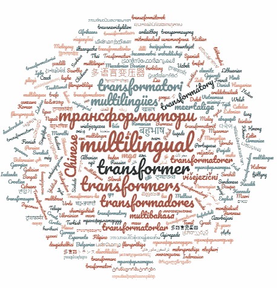
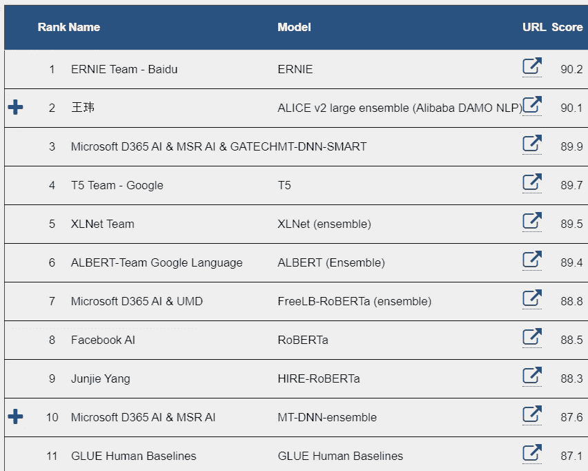
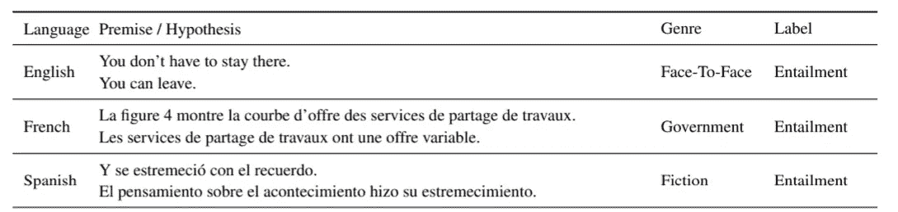
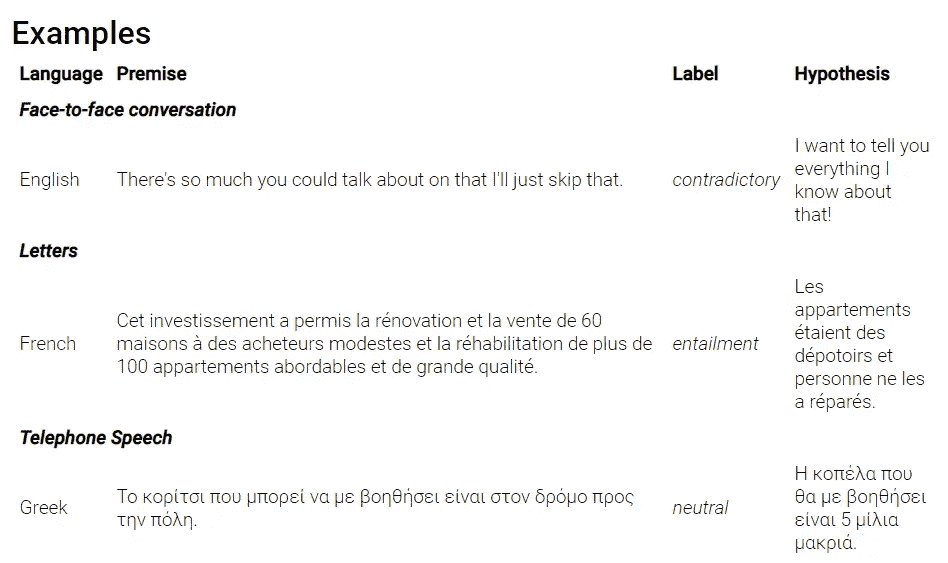
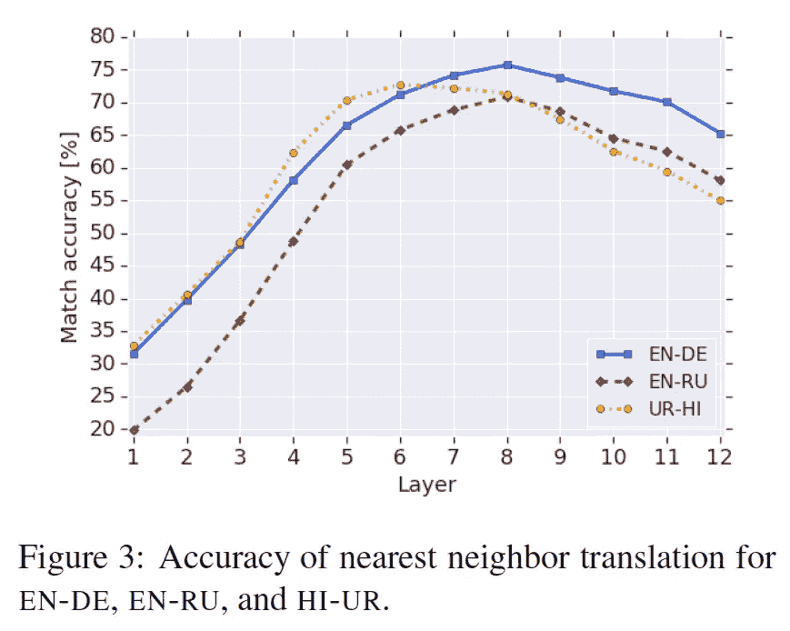
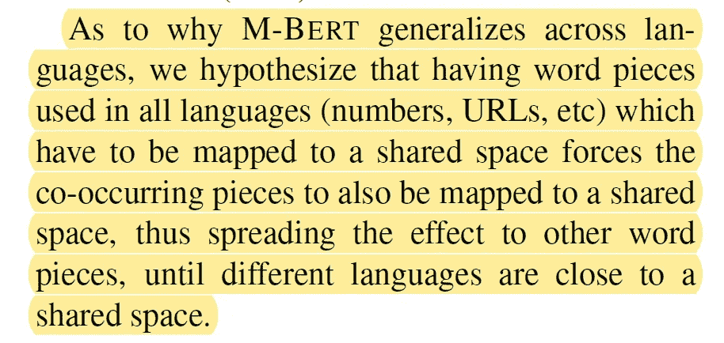
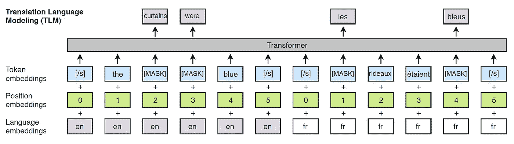
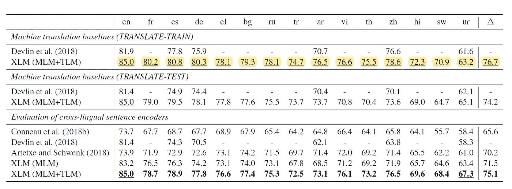
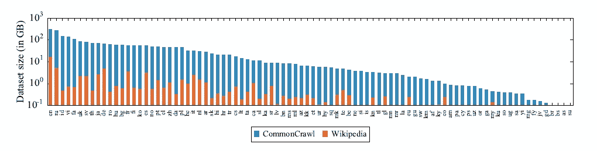
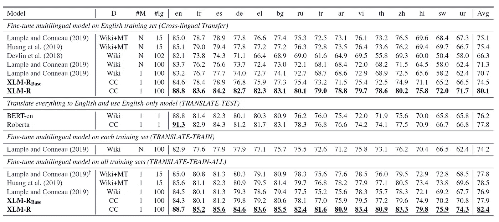

# 多语言变压器

> 原文：<https://towardsdatascience.com/multilingual-transformers-ae917b36034d?source=collection_archive---------11----------------------->

## 为什么 BERT 不是多语言任务的最佳选择

使用[https://translatr.varunmalhotra.xyz/](https://translatr.varunmalhotra.xyz/)和[https://www.wordclouds.com/](https://www.wordclouds.com/)翻译“多语言变形金刚”获得的图像

去年，我们看到了**变压器架构**的快速改进。作为最先进的语言理解任务的主要参考点，大多数研究工作都集中在英语数据上。 [BERT、RoBERTa、DistilBERT、XLNet——使用哪一个？](/bert-roberta-distilbert-xlnet-which-one-to-use-3d5ab82ba5f8)概述了最近的变压器架构及其优缺点。

跟踪 GLUE leader 板是一项挑战，因为语言理解任务的进度非常快。每个月都有不同的团队占据榜首。

胶水导板快照(2020 年 1 月初)[https://gluebenchmark.com/leaderboard/](https://gluebenchmark.com/leaderboard/)

与此同时，transformer 架构已经应用于多语言任务。为了评估这些任务，这里讨论的方法使用由 15 种语言的带标签句子组成的 [**跨语言自然语言推理(XNLI)语料库**](https://www.nyu.edu/projects/bowman/xnli/) 。每个数据点由一个前提和一个假设组成。前提和假设已经被标记为文本蕴涵:即假设如何与前提相关。

XNLI [论文](https://arxiv.org/pdf/1809.05053.pdf)中的例子

其他一些标签的例子是“矛盾的，中性的”。

来自[跨语言 NLI 系词(XNLI)](https://www.nyu.edu/projects/bowman/xnli/)

目前，没有关于多语言理解任务的商定基准。XNLI 数据集似乎是跟踪多语言模型发展的主要参考。在本笔记中，简要概述了用于多语言理解的**多语言转换器**的发展。

# 多语种伯特语

在提出 BERT 之后不久，Google research 就推出了一个多语言版本的 BERT，能够支持 100 多种语言。

## 参考资料:

*   来自谷歌的多语言 BERT，[链接](https://github.com/google-research/bert/blob/master/multilingual.md)。
*   [多语伯特的多语水平如何？](https://arxiv.org/abs/1906.01502)
*   [多语 BERT 跨语言能力实证研究](https://openreview.net/forum?id=HJeT3yrtDr)(ICLR 2020 接受)。

## 亮点:

*   110k 跨所有 104 种语言共享单词表。低资源语言被上采样。
*   它提供了跨不同语言的某种共享表示。

此图是一个代理，用于估计两种不同语言的表示之间的相似程度。例如，EN-DE 上的 100%将意味着英语和德语被映射到相同的表示。更多详情在[多语 BERT 到底有多多语言？](https://arxiv.org/abs/1906.01502)

*   然而，该模型没有被明确地训练成具有跨语言的共享表示。因此，上面的结果有点令人惊讶。

来自[多语伯特到底有多多语？](https://arxiv.org/abs/1906.01502)

*   最新的结果表明，语言之间的词汇重叠在跨语言表现中几乎不起作用。
*   相反，更深的网络提供了更好的跨语言性能。

## 所需资源:

预先接受了 4 到 16 个云 TPU 的培训。

## 许可证:

[阿帕奇许可证 2.0](https://github.com/google-research/bert/blob/master/LICENSE)

# XLM (croX 语言模型)

这个模型是由脸书的研究人员在 2019 年初提出的。

## 参考资料:

*   [跨语言语言模型预训练](https://papers.nips.cc/paper/8928-cross-lingual-language-model-pretraining.pdf)(neur IPS 2019 受理)。
*   脸书代码库，[链接](https://github.com/facebookresearch/XLM)

## 亮点:

*   使用定义翻译语言建模方法(TLM)进行平行语料库培训

英语和法语中的并列句举例。来自[跨语言语言模型预训练](https://papers.nips.cc/paper/8928-cross-lingual-language-model-pretraining.pdf)

*   在 95k 词汇表上训练的 80k **BPE** (字节对编码)令牌。BPE 非常类似于词块标记化的方法，[链接](https://medium.com/@makcedward/how-subword-helps-on-your-nlp-model-83dd1b836f46)。BPE 的工作方式是以一种层次化的方式对人物进行聚类，似乎更普遍地应用于跨语言模型。
*   在 XNLI 基准测试上，它在零拍上取得了非常好的性能。如果在训练期间使用翻译的数据，性能会更好。

从[跨语言语言模型预训练](https://papers.nips.cc/paper/8928-cross-lingual-language-model-pretraining.pdf)

## 所需资源:

*   在 64 个 GPU 上进行了预培训

## 许可证:

[归属-非商业性 4.0 国际版](https://github.com/facebookresearch/XLM/blob/master/LICENSE)

# XLM-R(XLM-罗伯塔)

脸书的研究人员在 2019 年底跟随[罗伯塔](https://arxiv.org/abs/1907.11692)的脚步提出了这个模型。至于罗伯塔，主要的贡献是关于选择一个更好的训练设置。(作为 RoBERTa 的补充说明，即使这推动了性能的提高，也被认为没有提供足够的技术贡献，无法在 2020 年 ICLR 奥运会上被接受。

## 参考资料:

*   [大规模无监督跨语言表征学习](https://arxiv.org/abs/1911.02116)

## 亮点:

*   更多的数据和更强的计算能力！

XLM 只在维基百科数据上接受训练，而 XLM-R 只在普通抓取数据上接受训练。来自[无监督的跨语言表征大规模学习](https://arxiv.org/abs/1911.02116)

*   **句子片段**250k 词汇上的标记化。他们也使用单语法语言模型而不是 BPE。
*   没有语言嵌入来更好地处理代码转换(即不同语言交替的文本)
*   实现最先进的结果(2019 年底)。

来自[无监督的跨语言表征大规模学习](https://arxiv.org/abs/1911.02116)

## 所需资源:

*   在 500 个 GPU 上进行了预培训

## 许可证:

[归属-非商业性 4.0 国际版](https://github.com/facebookresearch/XLM/blob/master/LICENSE)

# 总结与展望

XLM-R 似乎是迄今为止最好的解决方案。训练多语种变形金刚的 **TLM** (翻译语言模型)方法很有可能会与其他技术相结合。特别是，很容易预见的技术组合在顶部胶水董事会和 TLM。在机器学习社区中，对变形金刚还是很感兴趣的。比如 [**阿尔伯特**](https://openreview.net/forum?id=H1eA7AEtvS) 和 [**爱丽丝**](https://openreview.net/forum?id=BJgQ4lSFPH) 最近已经在 ICLR 2020 接受了。

这里讨论的多语言转换器可以分别在谷歌和脸书的库中找到**预先训练好的**:

*   谷歌的 M-BERT ，[链接](https://github.com/google-research/bert/blob/master/multilingual.md)。
*   **XLM** ，以及**脸书的 XLM-R** ，[链接](https://github.com/facebookresearch/XLM)

使用[hugging face Transformers code](https://github.com/huggingface/transformers)可以非常容易地测试出所有的模型。用 PyTorch 写的。许可证: [Apache 许可证 2.0](https://github.com/huggingface/transformers/blob/master/LICENSE)