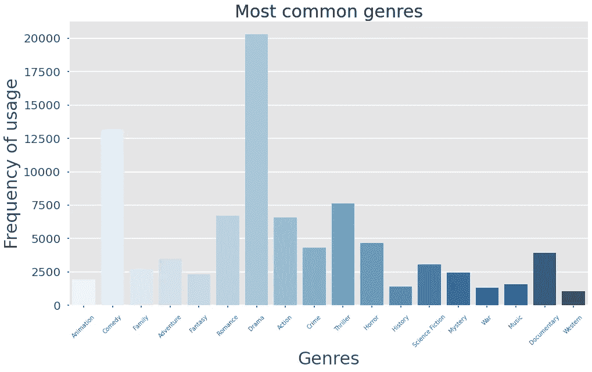
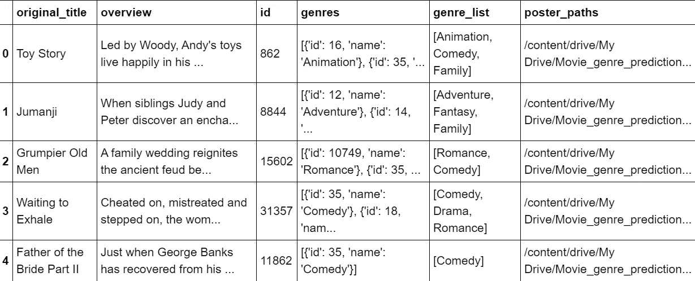
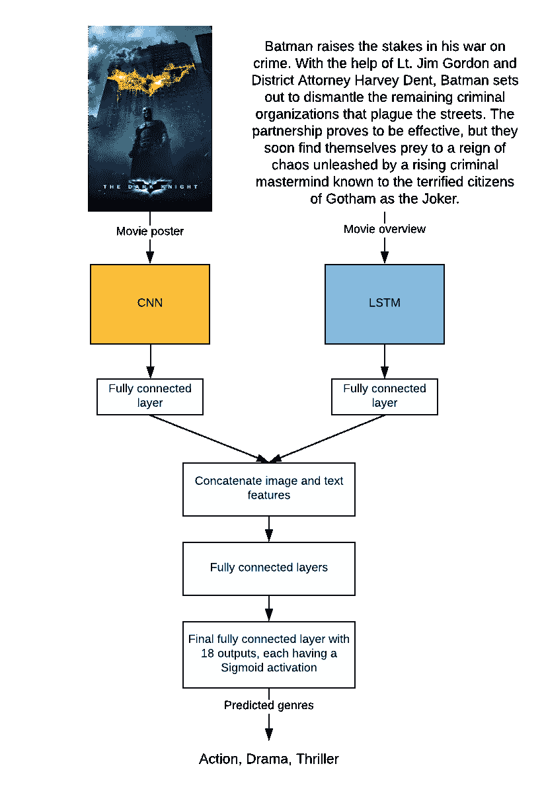

# 多模态深度学习预测电影类型

> 原文：<https://towardsdatascience.com/multimodal-deep-learning-to-predict-movie-genres-e6855f814a8a?source=collection_archive---------23----------------------->

## 多模态深度学习模型的 PyTorch 实现。它使用电影海报和概述来尝试和预测电影的类型。


黑暗骑士。图片来自 [TMDB](https://www.themoviedb.org/movie/155-the-dark-knight?language=en-US) 。

> “蝙蝠侠提高了他打击犯罪的赌注。在中尉吉姆·戈登和地方检察官哈维·登特的帮助下，蝙蝠侠着手摧毁困扰街头的剩余犯罪组织。这种伙伴关系被证明是有效的，但他们很快发现自己陷入了混乱的统治，这种混乱是由一个崛起的犯罪主谋引发的，这个犯罪主谋被惊恐的哥谭市民称为小丑。”——[TMDB](https://www.themoviedb.org/movie/155-the-dark-knight?language=en-US)

《黑暗骑士》——我最喜欢的电影之一。 [TMDB](https://www.themoviedb.org/?language=en-US) 将这部电影分为四类——剧情片、动作片、犯罪片、惊悚片。我训练的一个多模态深度学习模型将这部电影分类为——动作片、剧情片、惊悚片。让我们来看看这个模型是如何做到这一点的。

## 什么是多模态深度学习？

情态是做或经历某事的一种特殊方式。我们生活在一个多模态的环境中。我们看到东西，听到声音，闻到气味，感觉纹理。与此类似，多模态深度学习涉及一起使用的多个模态来预测一些输出。在这个项目中，我分别使用卷积神经网络(CNN)和长短期记忆(LSTM)网络连接从图像和文本序列中提取的特征。这些特征被用来尝试和预测电影类型。

## 数据集

为了这个项目，我使用了 Kaggle 的电影数据集。它包括 40，000 多部电影的概述，TMDB 的海报链接和来自 TMDB 网站的流派。拆分数据集后，训练集由 26864 个例子组成；测试集包括 7463 个样本，验证集包括 2986 个案例。

## 探索性数据分析

在对数据进行预处理之前，有必要了解每种体裁的类别分布情况。诸如“Aniplex”、“BROSTA TV”的一些类型似乎在整个数据集中只出现一次。因此，我删除了这些。除此之外，一些类似“电视电影”和“外国”的流派，海报和电影摘要也不容易让人察觉。因此，这些也被删除。下面的片段显示了从数据集中删除的流派列表。

```
invalid_genres = ['Aniplex', 'BROSTA TV', 'Carousel Productions', 'GoHands', 'Mardock Scramble Production Committee', 'Odyssey Media', 'Pulser Productions', 'Rogue State', 'Sentai Filmworks', 'Telescene Film Group Productions', 'The Cartel', 'Vision View Entertainment', 'TV Movie', 'Foreign']
```

我还扫描了数据集中没有指定流派的行。超过 2471 行在 genre_list 列中没有任何值。所以这些行被删除了。

除此之外，从流派标签的角度来看，了解数据集的平衡程度也很重要。从下图中可以清楚地看出，数据集中存在阶级不平衡。



作者图片

## 文本清洗和预处理

数据清理和预处理允许我们从数据中移除不相关的信息，比如 URL。这些熟悉的单词出现得非常频繁，但没有添加太多的语义，如英语中的冠词。文本处理包括以下步骤:

1.  从文本中删除所有标点符号。
2.  将文本转换为小写，删除非字母输入和所有 NLTK 停用词。
3.  使用 NLTK 的单词词汇化。变元化的目标是将一个词的屈折形式，有时是派生相关形式简化为一个共同的基本形式。例如，“查找”可以替换为“查找”。

使用 Keras Tokenizer API 对清理后的文本进行标记化。这个记号赋予器用于将所有文本转换成要输入到 LSTM 网络中的序列。通过用零填充，所有的序列都具有相同的长度。这样做是为了确保所有输入具有相同的尺寸。

## 下载和预处理海报

模型的输入之一是电影海报。因此，我必须下载对应于数据集中每部电影的一张海报。原始数据集还包含一个存储在 TMDB 的海报的 URL。然而，大多数链接似乎过时了，所以我不得不临时利用 TMDB API。我使用了 python 的 [tmdbv3api](https://pypi.org/project/tmdbv3api/) ，它包装了 TMDB API。使用原始数据集中的电影 id，我找到了对应于一部电影的单个海报。需要注意的一点是，有些电影可能没有 TMDB 的海报。

“电影”对象允许我们根据 TMDB ID 搜索电影。通过一个简单的 GET 请求下载海报，并保存到我的 Google Drive 中。对应于电影海报的路径保存在列表中，该列表作为列添加到数据集中。

如果下载海报时出现任何错误或电影的 poster_path 不存在，则该电影将从数据集中删除。

这是最终数据集的一瞥。



作者图片

最后的预处理步骤是调整海报的大小，并将它们附加到一个 NumPy 数组中。保存这个 NumPy 数组是为了更容易以有效的输入格式访问海报。这个过程需要很长时间，输出的 NumPy 数组大约为 2–3gb。需要大量的 RAM 来保存这个数组。我建议在整个过程中使用 Google colab。下面是将图像转换成 NumPy 数组的代码片段。如果在数据集中的指定路径找不到任何海报，则会删除相应的行。

所以我最终预处理了文本输入和图像输入。现在，开始训练模型。

## 预处理标签

每部电影都与数据集中一定数量的流派相关联。然而，这需要被制成一个独热编码向量，其中每个对应于一个流派标签。为此，我使用了 scikit-learn 库的 MultilabelBinarizer 类。它产生一个稀疏矩阵，其中每个行向量是一位热编码的。这意味着行向量在与其被分类的标签相关联的索引中具有 1，而在所有其他地方具有 0。因此，这是一个多标签分类问题。如下所示，数据集中总共有 18 个类。

## 模型架构

该模型由两个网络组成——一个堆叠的 LSTM 和一个 CNN。文本序列被输入到嵌入层。我用的是谷歌预先训练好的 Word2Vec 嵌入。然而，为了微调模型，我允许嵌入层是可训练的。嵌入层之后是两个堆叠的 LSTMs，其输出馈入全连接层。

这些图像被输入到 CNN。CNN 由连续的 2D 卷积层和最大池层组成。最后一个 max-pooling 层的输出被展平并馈入完全连接的层。

LSTM 和 CNN 的全连接层然后被连接并被前馈，直到最后的全连接层。最后一层的输出大小为 18，每个层对应一个流派。



模型的架构。图片由作者提供。

## 训练模型

DataLoader 对象初始化时的批处理大小为 64，它将输入传递给模型。TensorDataset 对象用于包装数据集输入和标签。然后，将每个 TensorDataset 提供给 DataLoader 对象。这将允许我们将数据集批量发送到模型进行训练、验证和测试。

我使用的损失是**二元交叉熵**和**亚当优化器**。梯度剪辑也被用来防止爆炸梯度。该模型被训练了 20 个时期。在训练期间，我计算了每个时期的准确度和损失，作为所有批次的准确度和损失的平均值。

最终历元的精度和损失如下:

```
Epoch 20: train_loss: 0.1340 train_acc: 0.9200 | val_loss: 0.3431 val_acc: 0.8726
```

在训练和保存模型之后，我在测试集上评估了准确性和损失:

```
acc: 0.8737 loss: 0.3406
```

## 评估指标

准确性和损失似乎表明该模型表现得相当好。然而，由于数据集中的类别不平衡，一些更好的评估指标将是精确度、召回率、 [F1 得分](https://en.wikipedia.org/wiki/F1_score)和受试者操作特征曲线下的计算面积(ROC AUC)得分。由属于一个流派的电影的非阈值概率组成的输出被转换成具有独热编码行向量的稀疏矩阵，以计算精确度、召回率和 F1 分数。这是使用 0.5 的任意阈值完成的。这个值可以通过使用马修的[相关系数](https://en.wikipedia.org/wiki/Matthews_correlation_coefficient)进一步提高。还可以通过绘制每个类别的 ROC 曲线来增强。

```
Precision on test set: 0.5732
Recall on test set: 0.5210
F1 score on test set: 0.5080
```

使用模型的非阈值输出计算 ROC AUC 得分。

```
roc auc macro score: 0.8021
```

使用的另一个评估指标是汉明损耗。汉明损失给出了标签总数中错误标签的一部分。

```
Hamming loss on the test set: 0.1078
```

从上面的评估指标可以明显看出，该模型在测试集上表现良好。通过为每个标签取一个优化的阈值而不是 0.5 的任意值，可以进一步提高精确度、召回率和 f1 值。改进模型的另一个方法是分别评估 CNN 和 LSTM，以判断两者的改进范围。

## 结论

1.  该项目探索了一种多模态深度学习方法，以解决从电影海报和概述中预测电影类型的多标签分类问题。
2.  测试集上的模型精度和损失都很好。然而，对于这个问题有更适合的评估指标——精确度、召回率、f1 分数和 ROC AUC 分数。
3.  这种模型可能能够区分喜剧电影的海报和概述的特征与恐怖电影的海报和摘要的特征。

感谢阅读这篇文章！这个项目的完整代码可以在[https://github . com/DH 1105/Multi-modal-movie-genre-prediction](https://github.com/dh1105/Multi-modal-movie-genre-prediction)找到。

**参考文献**

1.  [https://towards data science . com/multimodal-deep-learning-ce 7d 1d 994 f 4](/multimodal-deep-learning-ce7d1d994f4)
2.  [https://www.kaggle.com/rounakbanik/the-movies-dataset](https://www.kaggle.com/rounakbanik/the-movies-dataset)
3.  [https://towards data science . com/understanding-AUC-roc-curve-68b 2303 cc9 C5](/understanding-auc-roc-curve-68b2303cc9c5)
4.  [https://medium . com/@ kunalgupta 4595/predicting-movie-genders-based-on-plot-summaries-BAE 646 e 70 e 04](https://medium.com/@kunalgupta4595/predicting-movie-genres-based-on-plot-summaries-bae646e70e04)