# 超市购物者细分的多项式混合模型

> 原文：<https://towardsdatascience.com/multinomial-mixture-model-for-supermarket-shoppers-segmentation-a-complete-tutorial-268974d905da?source=collection_archive---------9----------------------->

## 完整的教程

彼得·邦德在 [Unsplash](https://unsplash.com?utm_source=medium&utm_medium=referral) 上的照片

在[我的上一篇文章](/gaussian-mixture-models-and-expectation-maximization-a-full-explanation-50fa94111ddd)中，我写了高斯混合模型(GMM)以及使用期望最大化(EM)算法训练它的方式的详细解释。这一次，我想展示混合模型不一定是高斯密度的混合。它可以是任何分布的混合。在这个例子中，我们将使用混合多项式分布。

此外，这一次的想法是，不要只关注数据科学项目的数学和计算机科学方面，还要关注业务方面。因此，我们将使用一个真实世界的数据集，并在营销领域进行具体应用。它有望让读者更好地理解我们为什么要做这些事情:-)。此外，我们将介绍一些关于描绘多项式分布的数据可视化。

> 这项工作**主要受到 Cadez 等人的一篇研究论文 [**的启发，该论文题为“使用有限混合模型**](http://www.datalab.uci.edu/papers/profiles.pdf) 预测交易数据的概况”。很大一部分功劳归于他们。**

# 构建业务环境

在这个超级计算机、机器学习和数据科学的时代，几乎每个企业都在收集关于其活动不同方面的数据，并试图利用这些数据为自己谋利。零售业，尤其是超级市场也不例外。超市收集购买数据或通常所说的交易数据。可以对其进行挖掘，以提取洞察力并提高整体运营的效率。

提取相关模式的一种方法是从聚类过程开始。这个想法是将相似的项目组合在一起。它可以被认为是以这样的方式将数据集分成聚类，使得聚类内的数据点具有高相似性，而聚类外的数据点具有低相似性。

在传统的营销应用中，这种聚类过程最重要的用途是探索性数据分析。为了更好地描述、解释和独立研究它们，我们希望将观察结果分成少量的组。常见的用法是进行客户细分。每个细分市场都有自己的一套特征。例如，在线电子商务网站的输出细分可以描述为“*30 岁以下的价格敏感型客户，主要通过数字渠道参与”*。由于其战略重要性，此类项目是营销分析中最常执行的项目之一。它允许围绕客户群及其典型需求和属性建立企业营销战略。

这个项目的目标是执行超市交易数据集的聚类，以建立个人的预测性档案。这样的配置文件支持许多不同类型的进一步分析。其中，我们发现为目标营销策略建立客户群、提取隐藏的产品关联、预测个人购买行为、变化检测、交叉销售、个性化等等…

在本文中，我们将:

1.  快速浏览数据集
2.  解释使用混合多项式随机变量的模型化
3.  推导期望最大化的数学更新规则
4.  描述选择最佳集群数量的方法
5.  用普通 Python 实现一切
6.  分析结果并得出一些见解
7.  探索问题的第二种表述方式，以更好地描述个人特征

# 数据集探索

这个项目的数据集是在 Kaggle 上找到的:“[dunhumby——全程](https://www.kaggle.com/frtgnn/dunnhumby-the-complete-journey)”。引用 Kaggle 的话来说，它:“*包含了一个由 2500 个家庭组成的小组在两年内的家庭级交易，这些家庭是一家零售商的常客。对于某些家庭，人口统计信息以及直接营销联系历史也包括在内”。*

在这项工作中，我们将把重点放在交易数据和相关产品上。因此，让我们看看最初的几个事务是什么样子的:

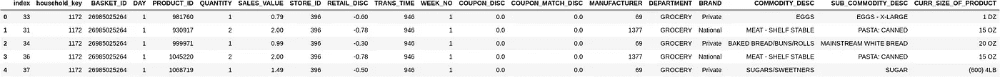

作者图片

每一行对应于给定家庭在特定购物篮中购买的一定数量的产品(一个购物篮对应于一个特定的收银台)。该数据集包含 276484 个购物篮中的 2595732 笔交易。这些交易是由 2500 个家庭在 44 家百货商店的 308 个类别和 2383 个子类别中的 92339 种不同产品进行的。

有很多有用的信息，但是我们没有兴趣使用所有的信息。本练习是关于使用多项式混合模型对交易数据集进行无监督聚类。正如我们将看到的，**多项式混合模型仅用于分类数据。**因此，我们不会考虑价格或零售折扣等连续估值的预测指标。

现在，为了理解我们将要执行的数据选择和准备过程，我们需要确保您正确理解了多项式分布(如果您已经精通多项式，可以跳过这一节)。

## 多项式分布的表述

[多项分布](https://en.wikipedia.org/wiki/Multinomial_distribution)是[二项分布](https://en.wikipedia.org/wiki/Binomial_distribution)的推广，后者本身是[伯努利分布](https://en.wikipedia.org/wiki/Bernoulli_distribution)的推广。让我们从伯努利方程开始。

伯努利随机变量 X 描述了具有两种可能结果的单次试验的结果，1 或 0，分别具有概率θ和 1-θ。

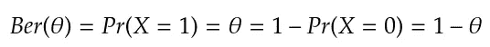

例如，我们可以描绘 Ber(0.3)的概率质量函数:

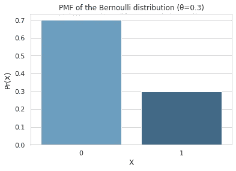

作者图片

在 frequentist 的观点中，参数的真实值是通过测量无数次实验中感兴趣的统计数据而获得的。在伯努利试验的情况下，如果我们无限次重复我们的单个实验，记录结果并平均阳性结果的数量，我们得到θ的真实参数值(在上面的例子中，我们有 30%的时间得到阳性结果)。

现在，如果我们不仅要计算一次伯努利试验的阳性结果数，还要计算一系列 n 次伯努利试验的阳性结果数。这就是二项式试验的目的。例如，将一枚硬币抛 10 次，我们想要测量硬币正面落地的次数。这一次，二项式试验的输出可以是 0 到 10 之间的任何离散值。概率质量函数的精确公式为:

让我们看看如何从伯努利分布推导出这个公式。为了简单起见，我们假设想要记录两次抛硬币(即两次伯努利试验)得到的人头数。有哪些可能性:

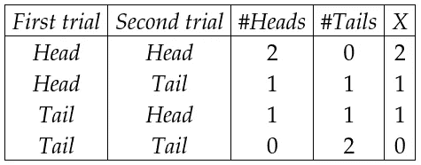

从这个枚举中，我们得到:

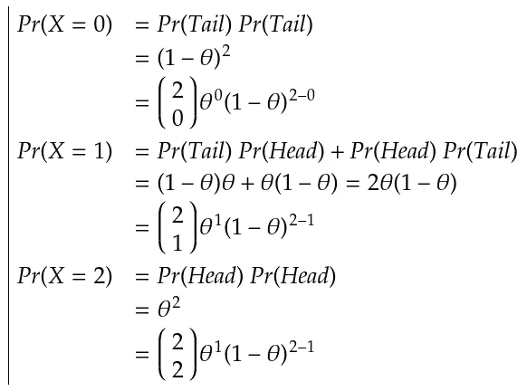

公式中的二项式系数抓住了这样一个事实:在一系列 *n* 次试验中，有不同的方式来分配 *k* 次成功。在上面的例子中，有两种方法在两次试验中分配一次成功。如果我们增加试验的次数，获得中心值的可能方法的数量比获得极值的可能方法的数量增加得更快。这就是为什么分布得到一个漂亮的钟形。

因此，在 20 次独立伯努利试验的概率θ = 0.3 的二项式试验中，概率质量函数可以用下面的条形图表示:

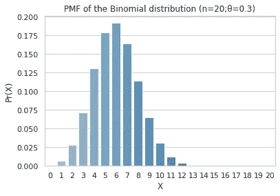

作者图片

对于有 20 个概率为 0.3 的独立伯努利试验的二项式试验，最可能的阳性结果数是 6。那就是上面分布的模式。

现在我们如何进一步推广这个分布呢？那么，如果我们考虑一系列 n 次试验，但这次有两种以上的可能结果，会怎么样呢？例如，我们有一个装有 3 种不同类型球(蓝色、红色和黄色)的袋子，我们想测量每种颜色在 2 次抽奖中得到的球数(替换)。让我们列举各种可能性:

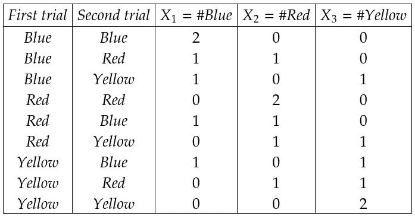

从这个计数中，并且给定我们可支配的蓝色、红色和黄色球的比例，分别为θ_1、θ_2 和θ_3，我们可以测量概率:

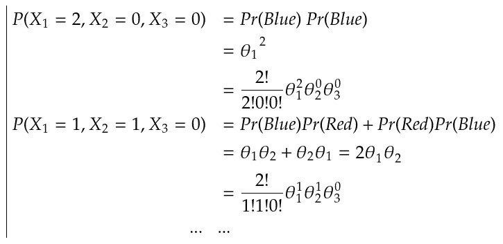

我们可以继续，但我希望你们明白，我们如何推导出多项式的概率质量函数的解析公式:

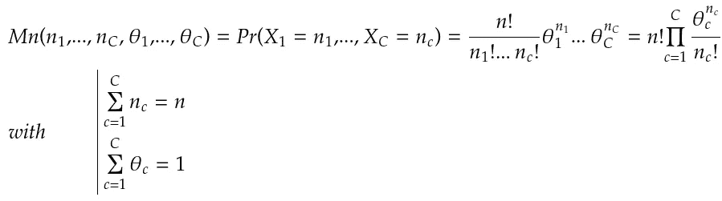

## 关于多项式的可视化

好，那么现在，如果我们想要画出概率质量函数，用一些柱状图，就像我们上面做的那样？嗯，这次会有点棘手。

> 这是一种表达，但重要的是你要理解多项式的这种表示，因为我们以后会用到它。

为了描绘一个分布图，我们需要一种方法将可能的结果放在图上，并且能够显示它们的相对重要性。这就是我们用于伯努利分布和二项式分布的柱状图的目的。在 x 轴上，我们放置有序的可能结果值，在 y 轴上放置相关的概率。

那么，多项式呢？这里的问题是，我们不能再用单一的随机变量来描述不同的可能性。在伯努利和二项式中，我们使用一个随机变量 X 来计算成功的次数。我们不使用第二个随机变量来表示失败次数，因为它显然是从 x 中推导出来的。但是在多项式的情况下，我们需要为单次试验的 C 个可能结果引入至少 C-1 个随机变量。注意，一般来说，我们甚至使用 C 个随机变量(X_1，X_2，…，X_C ),就像上述公式中的 PMF 一样，因为这样写起来不太麻烦(即使可以推导出最后的随机变量值)。

我们只对描绘至少有两个或更多可能结果的分布感兴趣(否则我们会回到二项式)。让我们首先考虑 3 种可能结果的情况。我说过，我们可以只用两个随机变量 x1 和 x2(x3 可以推导出来)。然后我们将需要 3 个维度(对于 X_1，X_2，联合概率 P(X_1，X_2)=P(X_1，X_2，X3))。好的，我们可以用一个三维条形图来实现这个目的:

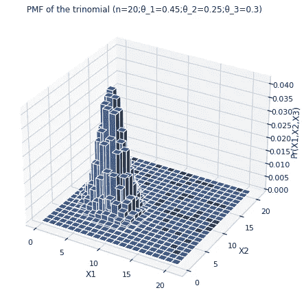

作者图片

好吧，那么这种视觉化有什么问题呢？首先，我们看不出 X3 的不同价值。我们可以推断出它们。例如，对于 X1=0 且 X2=0 的第一个箱，我们知道 X3=20。但是我们没有把它形象化。此外，该图一半的专用空间是无用的。例如，当 X2=20 时，我们肯定知道 X1 不会取除 0 以外的任何值。因此，该 3d 直方图底部一半的三角形将永远不会显示任何密度，因为概率为零。

那么怎样才能做得更好呢？首先，我们可以将直方图的底部简化为一个三角形，更准确地说是一个等边三角形。我们使用等边三角形，这样从顶点到重心的距离是相等的。这个三角形中任何一点的确切位置决定了 3 个随机变量的相对比例。这被称为单形，显示 3 个值的离散概率向量非常有用:

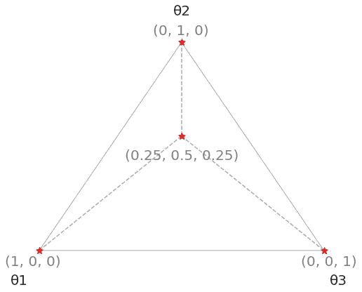

作者图片

此外，如果我们画出三角形边的每条平行线，也就是说，我们离散化整个三角形空间，每个交点可以用来描绘 3 值元组的相对比例。在下面的示例中，我们描绘了具有 16 个抽奖和 3 个概率为 0.25、0.5 和 0.25 的可能值的多项式:

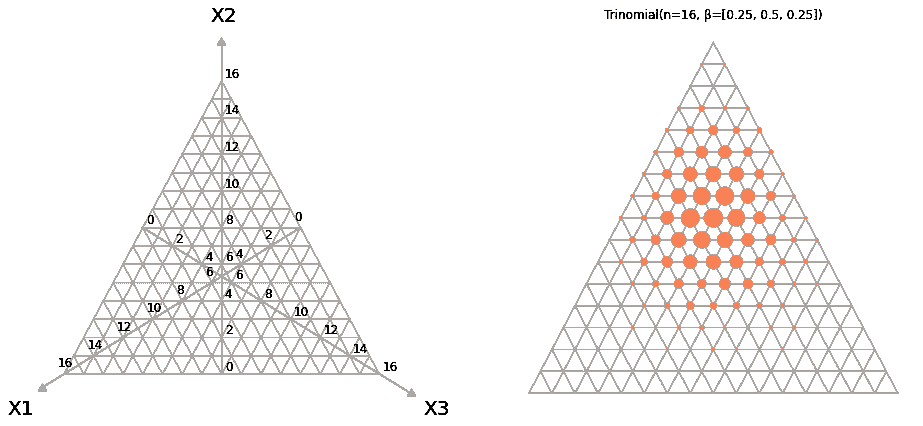

作者图片

最后，我将在这里停止这种表述，不可能将这种逻辑扩展到额外的维度来描绘阶数高于 3 的多项式。例如，我们可以尝试使用一个 4 维的正方形，但它不会工作，因为正方形中的一个点仅在 2 条线的交叉点上，并且我们需要 4 条线的交叉点作为这个位置的 4 值元组的比例的容器。

## 回到数据

正如我之前所说的，因为我们想要使用多项式混合模型来执行聚类，所以我们不考虑连续变量。在这个练习中，我们只考虑产品、家庭和篮子。因此，要考虑的列如下:

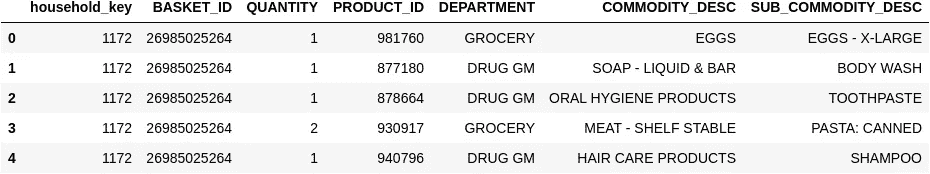

作者图片

有 4 列描述在特定交易中购买的产品(PRODUCT_ID、DEPARTMENT、COMMODITY_DESC 和 SUB_COMMODITY_DESC)。我们希望对交易进行分组，并对每个组计算产品的数量。

## 模型组成

那么我们为什么要统计产品的数量呢？这将允许我们应用以下通用模型:

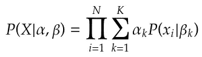

这代表观察完整数据集的联合概率。它是个体概率的乘积(因为观察值是独立数据收集的)。观测到一个观测值 x_i 的概率是一个多项分布的混合。x 表示所购买产品的计数矩阵。矩阵的每一行 x_i 对应于一个特定的购物篮(例如，一个购物者在超市结账)。每个多项式分布表示获得我们在特定篮子中看到的计数的概率，假设它是由特定的聚类 k 生成的:

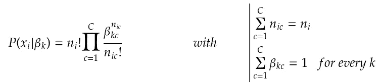

在上面的公式中，n_i 表示在给定的篮子中购买的产品总数。c 表示不同产品的总数，因此多项式 k 和产品 c 有一个参数β_kc。这意味着β是 k 维参数乘以 c 的矩阵，β_k 是 c 维向量。n_ic 表示在给定篮子 I 中购买的特定产品 c 的数量。

我们的模型使用了多项式分布的混合。它基本上假设存在 K 个簇。这意味着在任何给定的篮子里，商品被购买的概率是 K 个典型篮子的组合。这个项目的目标是提取那些典型的篮子。

## 回到数据

因此，我们需要按篮子对交易进行分组，并对每个篮子计算不同产品的数量。但正如我们刚刚看到的，我们将用于该模型的参数数量高度依赖于不同产品的数量。我们的产品越多，参数的数量就越多。这意味着，如果我们有太多的产品，我们可能会在优化过程中遇到麻烦，无法找到参数或集群数量的最佳值。但是我们没有义务按不同的产品来计数(有 92339 种)。我们可以按百货商店(44)、类别(308)或子类别(2383)来计数。这一选择将决定上述公式中的数字 C。

显然，理想的场景是对数据建模，一直到产品级别。事实上，我已经试过了，我的笔记本电脑内存不够了。更不用说多项式有这么多不同的组成部分，我们在选择正确的聚类数时可能面临的问题会大大增加(我们将在后面看到)。因此，为了区分产品，我们必须在百货商店、类别和子类别之间进行选择。让我们看看每个部门的交易数量的分配情况:

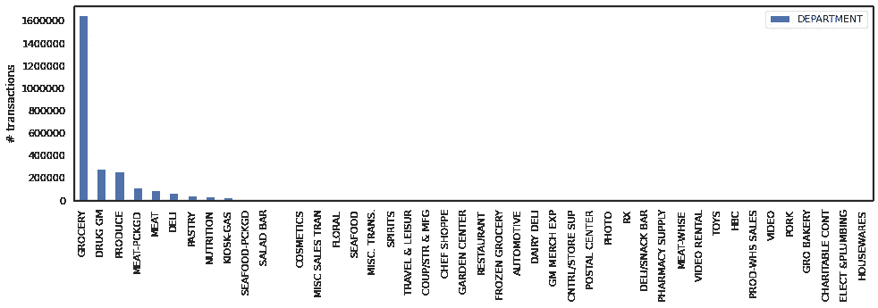

作者图片

如我们所见，绝大多数的交易都是在食品部完成的。因为这是一个练习，所以我决定不去管杂货店以外的交易。现在让我们看看杂货店的交易是如何分布在不同类别中的:

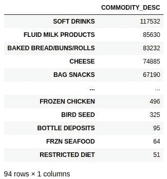

作者图片

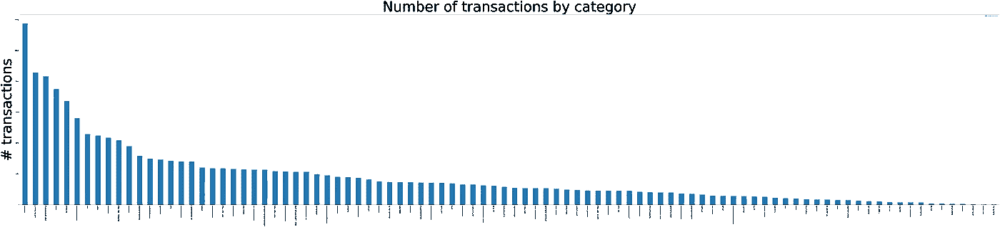

作者图片

共有 94 个类别，尽管类别之间的交易数量不一致，但提供最少的类别仍有 51 笔交易。现在，让我们看看子类别有哪些内容:

作者图片

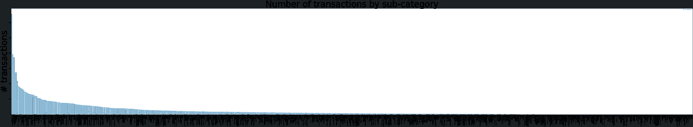

作者图片

我们有相同的递减模式。但是现在子类目那么多，交易最少的也只有 1 笔交易。单次交易显然不足以准确估计参数。

因此，我们将按类别(而不是子类别)区分产品，并生成计数 X 的矩阵，我们将使用它来解决聚类问题。让我们看看前 10 行是什么样子的:

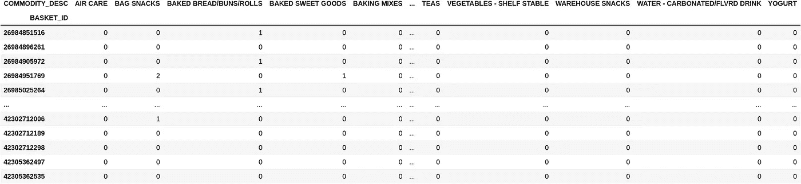

作者图片

如你所见，矩阵非常稀疏。但这对于多项式混合模型来说不是问题。

# 数学推导

如前所述，观察数据集的完全可能性由下式定义:

为了理解这一部分，你需要熟悉期望值最大化算法(如果没有，我强烈建议你阅读我的文章。对于 EM，我们首先需要定义一个潜在变量 t，它通过定义一个观察值是从哪个集群生成的来描述这个观察值。

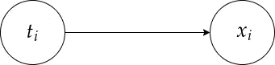

作者图片

潜在变量 t_i 定义了观察值 x_i 是由哪个聚类生成的。此外，变分分布 q 用于描述潜在变量的后验分布，取可能值的范围(从 1 到 K)。所以我们可以写:

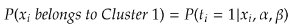

回想一下，EM 算法定义了对数似然的下限:

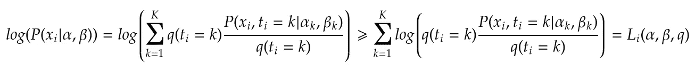

EM 算法交替进行以下两个步骤，直到收敛:

***期待步骤:***

我们最大化关于 q 的下限，以更新潜在变量的后验分布:

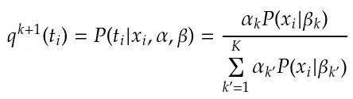

如您所见，期望步骤的形式与混合高斯分布的情况相同，只是给定聚类 k，即 P(x_i | β_k)的观测值的可能性现在具有多项式密度:

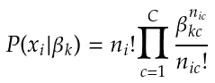

***最大化步骤:***

我们将α和β的下界最大化。我们尝试解决以下优化问题:

下限定义为:

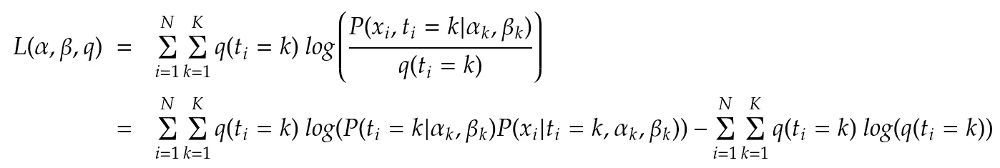

为了解决这个优化问题，我们将偏导数设置为 0，并求解方程。注意，上面减法中的第二项不依赖于α或β，所以我们可以用一个常数来代替它。同样，我们将使我们的[拉格朗日乘数](https://en.wikipedia.org/wiki/Lagrange_multiplier)摆脱约束。所以我们需要解下面的方程组:

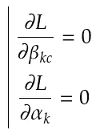

使用:

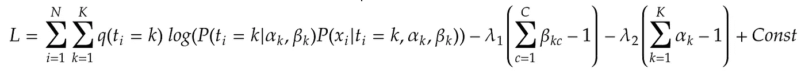

让我们从多项式参数β_kc 开始:

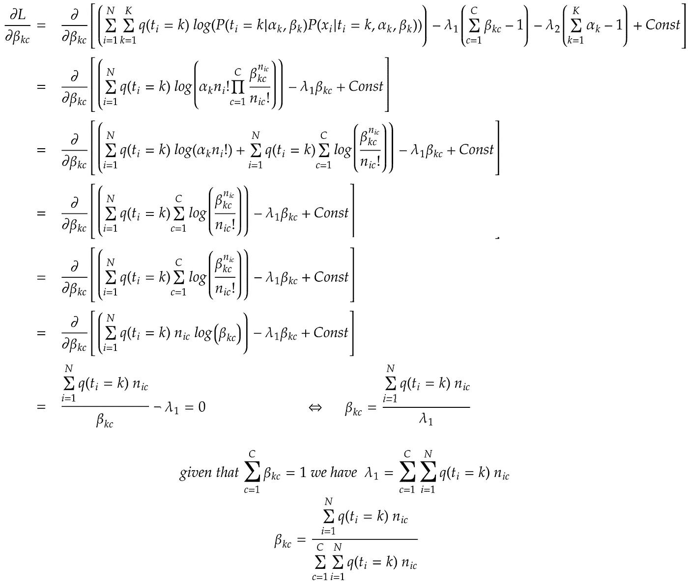

现在混合物的重量为αk:

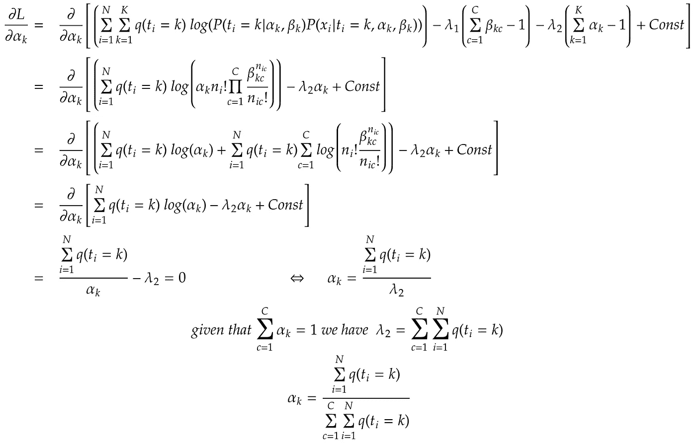

好了，现在我们有了 E 步中变分分布的更新规则和 M 步中参数的更新规则。让我们来看看具体的材料。

# 履行

期望最大化算法不能保证我们在第一次运行时会找到似然函数的全局最大值。为了增加我们的机会，建议用不同的随机初始化多次启动算法。每次，我们将把我们的最大值与前一个进行比较，并保留与最佳损失相关的参数。让我们实现这个例程:

所以我为这个模型创建了一个类，它需要用我们想要尝试的集群数量来实例化。我还添加了一些参数:

*   rtol:将在比较当前损失和先前损失时使用，以决定我们是否应该停止算法(从一个周期到下一个周期的改进变得很小，因此没有必要继续)
*   max_iter:为了保证算法不会永远运行，我们可以告诉它在一定次数的迭代后停止
*   重新启动:我们希望使用不同的初始化重新启动完整 EM 程序的次数

接下来，我们需要实现 *_train_once* 方法，顾名思义，该方法将为 EM 算法运行一个完整的迭代周期。

算法的形状没有什么大的惊喜。我们从随机初始化参数开始。我们迭代到 max_iter 迭代，并且每次我们在计算潜在变量 t(γ)的后验分布的 e 步骤和更新混合物参数(α和β)的 m 步骤之间交替。

注意，β参数使用与多项式分布共轭的[狄利克雷分布](https://en.wikipedia.org/wiki/Dirichlet_distribution)进行初始化。我不会在这里深入讨论细节，但是您只需要知道 Dirichlet 将根据需要产生一组总计为 1(对于每个集群)的参数。

现在还有一件事我们还没有谈到。这是损失。记住，在每次迭代中，EM 算法都试图最大化下界。所以我们将使用的跟踪算法收敛的损失函数是下限:

这为我们提供了以下实现:

请注意，计算并没有完全矢量化。我们仍然遍历不同的 K 个集群。这是因为我们使用了 scipy.stats 中多项式的实现。该实现接受计数的观察值矩阵，但不接受参数的观察值矩阵。所以你可以计算所有观测值的多项式概率，但只是针对一个特定的集群，而不是一次全部。

现在是电子步骤:

这就是我们在上一节中数学推导出的更新规则的矢量化实现。不过要注意的一点是，当计算观察计数向量的多项式概率(即可能性)时，概率有时非常接近于 0，以至于我们会得到数字下溢，并且值被舍入到 0。这是不好的，因为我们必须归一化这些值来得到后验概率。为了避免被 0 除，我们用 Python 中允许的最小浮点值替换空值。

现在是 m 步:

没什么大不了的。这些是我们数学推导的更新规则的矢量化实现。

## 在模拟数据集上运行

我们将运行该算法，看看它在各种值下的表现如何。好的做法是首先使用模拟数据集，以便我们控制数据生成过程。然后，我们可以看到当我们修改参数的真值(即，聚类的数量、混合权重、多项式参数和数据集的大小)时，算法是如何执行的。数据集通过以下程序生成:

所以我们首先要做一个简单的测试。数据集是由 10000 个观察值混合而成的，这些观察值来自 3 个分离得很好的多项式，可以取多达 16 个不同的值。此外，我们将生成的数据集分成 80 %用于训练，20 %用于测试。然后我们计算测试数据的可能性:

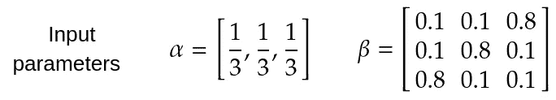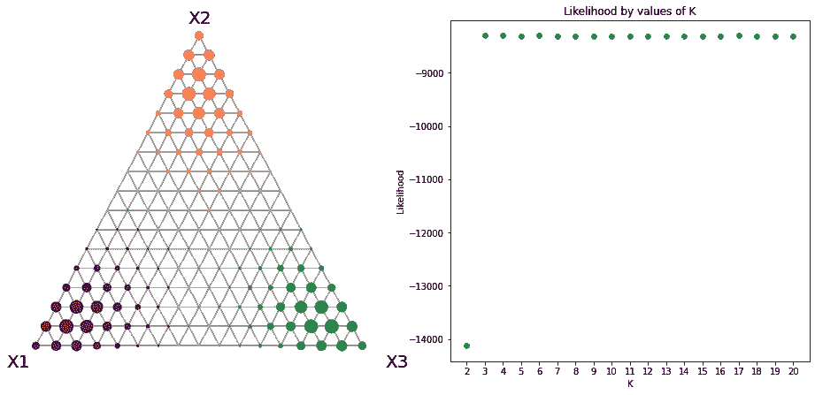

作者图片

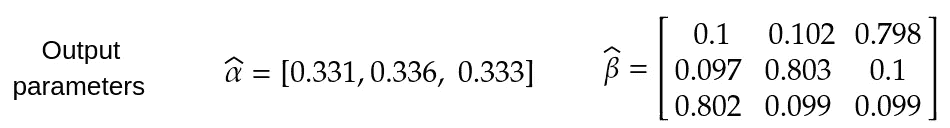

正如我们所看到的，估计的参数非常接近真实的参数。此外，现在我们看到了关于多项式可视化的工作的价值。从上面的图中可以很明显地看出，这些簇被很好地分开了。因此，该算法在估计真实的聚类数方面应该没有问题。如果我们观察当我们增加集群数量时的可能性演变，我们可以清楚地看到[肘形模式](https://en.wikipedia.org/wiki/Elbow_method_(clustering))。当我们从 2 个集群到 3 个集群时，匹配的可能性更大。但是一旦我们到达 3 个集群，可能性就达到了一个平台。这清楚地表明聚类的最佳数量是 3。为什么？嗯，因为当我们增加聚类的数量时，我们增加了模型的复杂性，但对可能性没有额外的好处。

现在，当我们修改混合物重量时会发生什么:

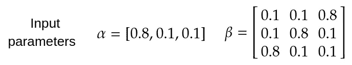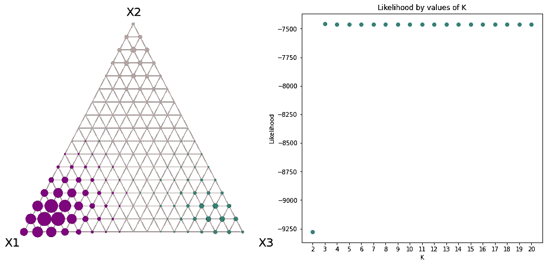

作者图片

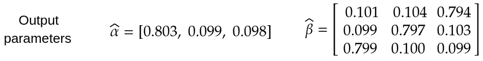

再次，混合权重被很好地估计，这证实了更新规则是正确的。

现在，当集群没有很好的分离时会发生什么？让我们看看:

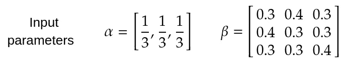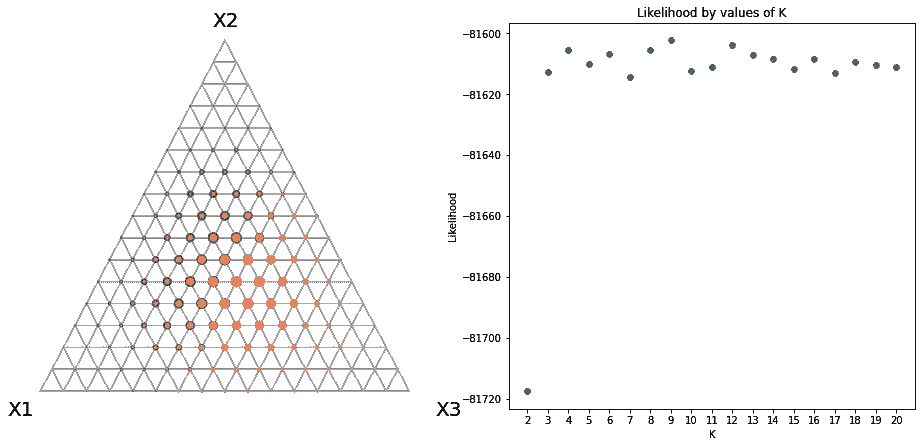

作者图片

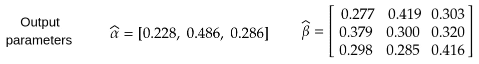

这一次，混合物重量的推断不太正确。不过多项式分量权重更好。此外，我们仍然可以在似然值中看到肘形模式，但是它们的分布更加嘈杂。从可能性的分布中，我们可以清楚地看到，从 2 到 3 个聚类的跳跃是在拟合优度方面获得最大值的一个。所以我们还是选择 3 个集群。

现在，如果我们用 10 个不同的多项式来填充参数空间呢？

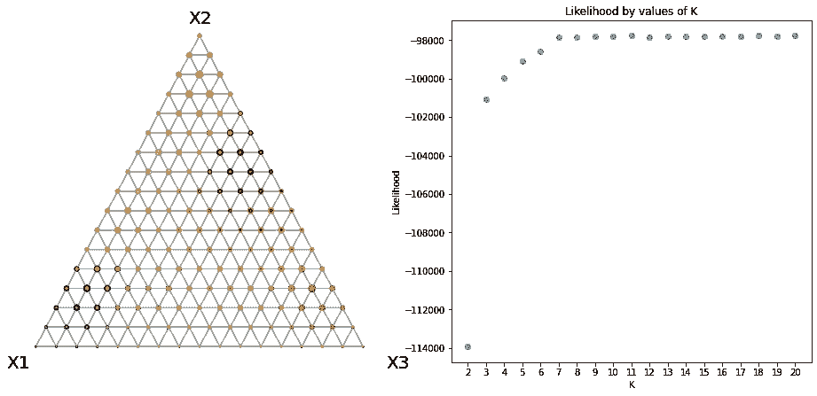

作者图片

好了，这一次，仅仅基于可能性的提高来选择最佳的聚类数目要复杂得多。可能是 3 个集群，也可能是 7 个……这显然是不正确的。好的，那么我们如何做得更好呢？我们将使用另一个选择标准。它被称为[贝叶斯信息准则](https://en.wikipedia.org/wiki/Bayesian_information_criterion)(或简称 BIC)。其计算公式如下:

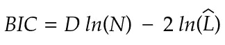

d 表示由模型估计的参数的数量，N 表示观察值的总数，L_hat 表示模型的似然性。它引入了一个与观察数量和参数数量成比例的惩罚。我们想要做的是最小化 BIC 值，从而使可能性最大化，但同时保持参数的数量尽可能少。在多项式的混合的情况下，对于 C 个分量的 K 个多项式，参数的数目 D 等于(K-1)+K*(C-1)。知道混合物重量和组分重量加起来都是 1，我们可以推导出最后的参数。

将这一新的选择标准应用于具有 10 个多项式的生成数据集，我们得到:

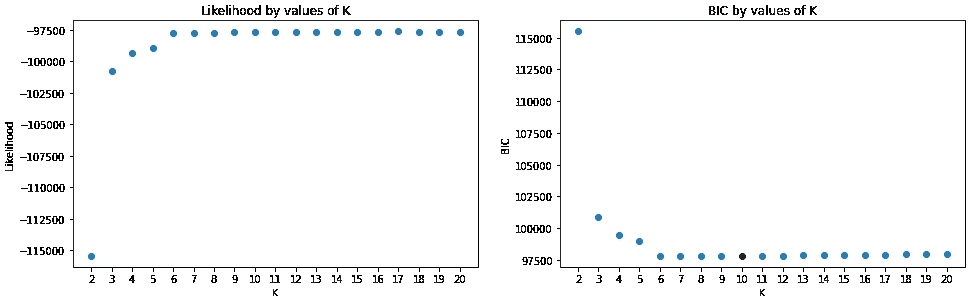

作者图片

通过 BIC 标准正确地选择了 10 个簇的最佳数量。但是我们看到这是一场势均力敌的比赛。事实上，再次运行相同的程序，我们可能会得到不同数量的集群。这表明选择正确的数字是非常困难的，没有灵丹妙药。最后，没有什么能打败业务分析师的判断。因此，检查集群并尝试查看是否应该合并其中的一些集群是一件好事(因为它们彼此非常接近，并且具有非常相似的属性)。

## 对百货商店数据集进行拟合

好了，现在我们有了执行杂货店交易数据集聚类的要素。回想一下，我们已经为按篮子分组的不同产品类别的交易计数准备了一个矩阵:

作者图片

在按 80/20 规则(按购物篮交易时间排序)拆分该矩阵后，我们将模型拟合到训练数据，并记录测试数据上从 2 到 100 的一组可能聚类值的可能性和 BIC 值。我们得到以下结果:

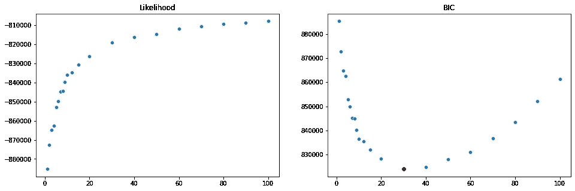

作者图片

从上面的图中，我们理解了为什么对于真实世界的数据集，仅仅基于可能性来选择最佳聚类数是不太可靠的，以及为什么我们需要对模型的复杂性进行惩罚。这是因为集群通常没有很好的分离。使用贝叶斯信息标准，我们选择 30 个集群。

# 结果

## 聚类分析

首先，我们可以根据产品类别的概率分布来可视化集群。我们绘制了 6 个第一组:

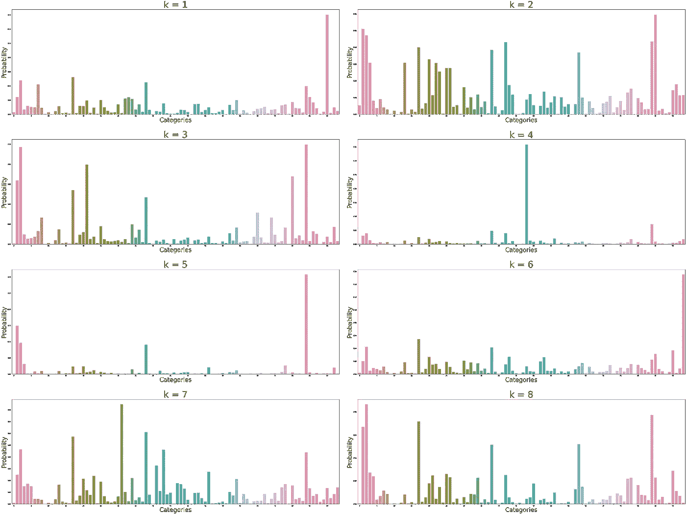

作者图片

重要的是要理解上面的分布代表了典型的篮子。他们可以帮助我们预测产品的购买量。

此外，我们可以注意到，一些典型的购物篮由一个或少数几个类别主导，而其他一些典型的购物篮由更多样化的类别组成。这突出了购物行为。有时候，一个人会很快去一趟商店，为某个特定的场合(周六早午餐、周日晚餐、和朋友喝酒……)购买食材，或者可能是每周购物的较长时间。

接下来，我们希望通过可视化它们的相对距离来评估聚类质量。考虑到有 30 个集群，看不出它们彼此之间有很好的分离。为了可视化它们之间的距离，理想的场景是建立一个 30 维的空间，我们可以在其中放置观察结果。当然，这是不可行的，所以我们将依靠一种降维技术。我们使用的技术叫做[多维缩放](https://en.wikipedia.org/wiki/Multidimensional_scaling)。像 PCA 一样，它依赖于输入矩阵的特征分解。但是这次，输入矩阵将是聚类参数的成对距离矩阵(使用[曼哈顿距离)](https://en.wikipedia.org/wiki/Taxicab_geometry)。我们得到以下结果:

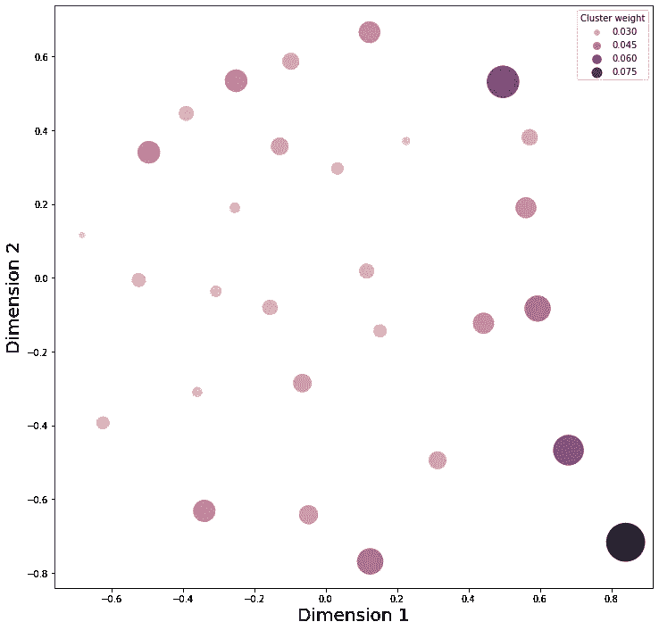

作者图片

聚类大小在混合权重上同步，这突出了它们的不平等性。尽管由于降维技术丢失了一些信息，我们仍然可以得出结论，聚类被很好地分开了。

## 高升程项目

描述聚类的一个好方法是计算购买量高的单个产品的提升率。产品和集群的提升率被定义为以集群为条件的购买概率与总购买概率之间的比率。因此，首先我们需要计算每个产品的购买概率，可以定义为:

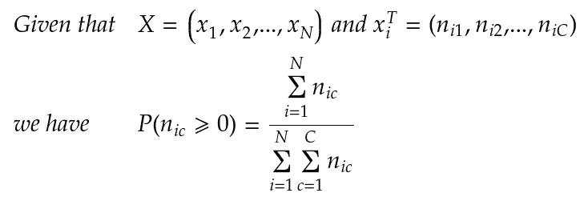

它是特定产品的总数量与所有产品的总数量之比。它可以被定义为在数据集的所有篮子中随机选择的篮子中找到产品的概率。让我们看看所有产品的概率分布:

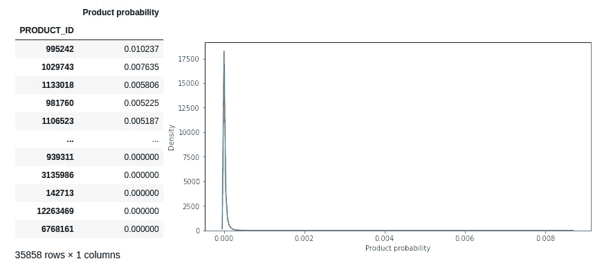

作者图片

如您所见，非常低的值高度集中。此外，很大一部分概率非常低，以至于他们的计算受到数值下溢的影响(这基本上导致概率为 0)。我们只想考虑经常购买的商品，因为它们最具特色。所以我们将把这个分析限制在购买概率高于 0.0001 的产品(2019 年产品)。

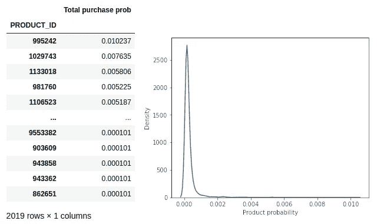

作者图片

接下来，为了计算提升率，我们需要计算这些物品的购买概率，但是对于特定的集群。这意味着我们希望获得在特定分类 k 的篮子中随机选择的篮子中找到产品的概率(而不是在所有篮子中):

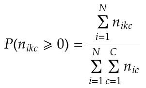

这个计算的问题是，严格地说，谈论一个集群的篮子**是不正确的。事实上，在当前的模型化中，一个篮子同时属于几个集群。请记住，我们执行的软聚类是由参数上的潜在变量的后验概率分布定义的，即 P(t_i|x_i，α，β)。例如，让我们设想前 6 个篮子的潜在变量的后验分布:**

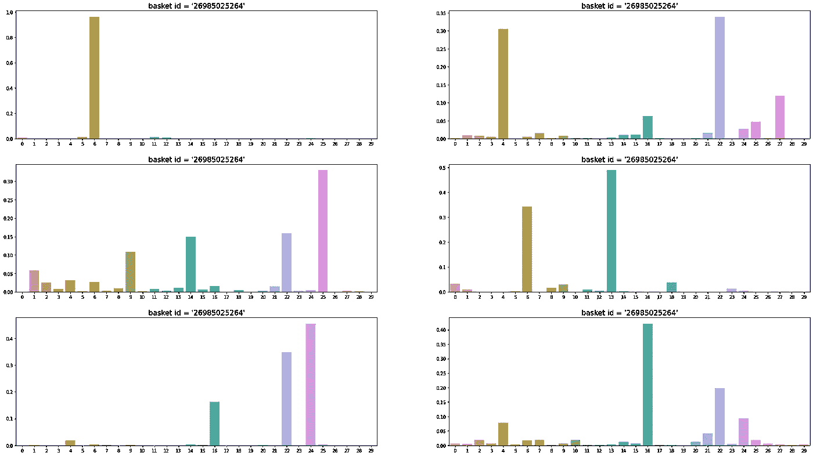

作者图片

聚类过程的目标是通过将最典型的购物篮分组在一起来提取它们。一些篮子将位于集群的核心(在分配概率空间中)。然后，该分布显示特定分类的单个高值(就像上面左上的篮子)。但是一些篮子将位于分配有点模糊的区域。因此，为了准确地计算基于一个分类的购买概率，我们首先要在不同的分类中分配篮子产品的数量。因此，我们使用以下规则计算一个新的大小为 N 乘以 K 乘以 C 的浮点矩阵:

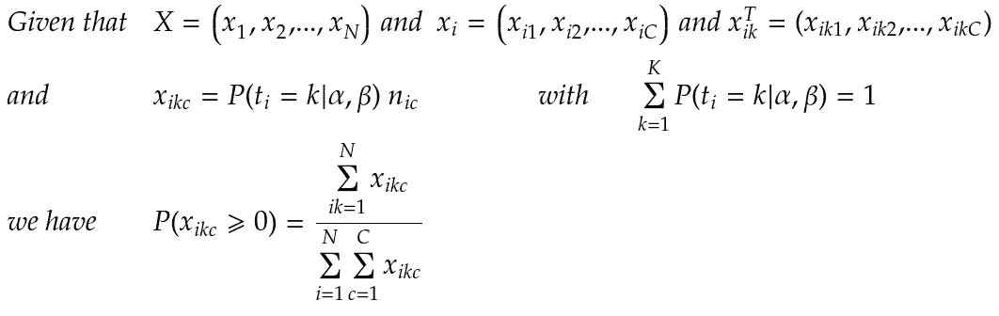

最后，我们可以计算升力比，即:

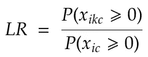

显示提升比大于 10 的项目，我们可以开始描述具有特定产品的集群。例如，第一组的高升程项目如下:

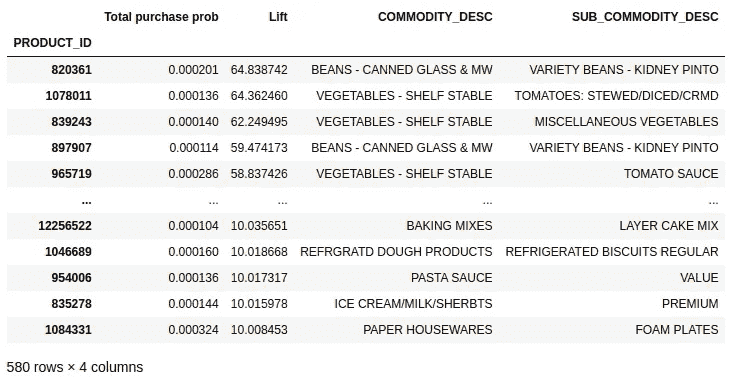

作者图片

第一类提升最高的项目是罐装豆类和番茄。

此外，为了更直观地描述聚类，我们可以根据高提升项目的类别(也考虑购买频率)来制作单词云。让我们看看前 6 个集群的结果:

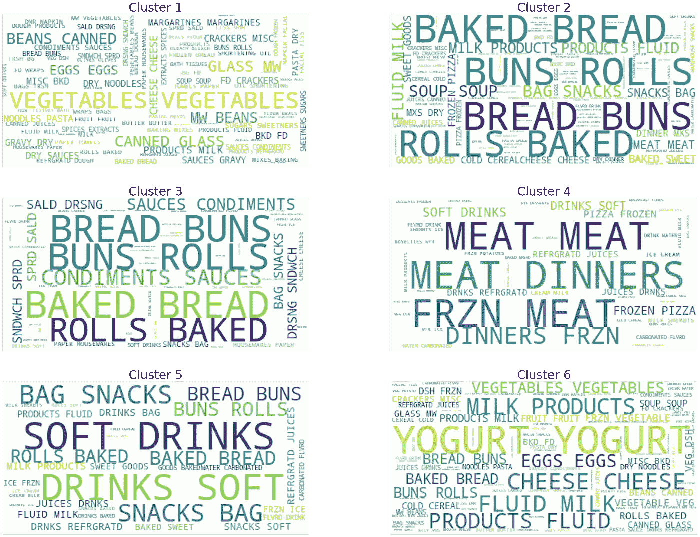

作者图片

从上面的单词 clouds 我们可以描述星团。第一组是一个很好的组合，虽然主要话题是蔬菜。第二和第三类主要是烘焙食品，第四类是与晚餐相关的产品，第五类是小吃，第六类是乳制品。

## 产品关联

现在，通过计算高升力项目对，高升力项目分析可以更进一步。概率的计算是一样的，只是这次我们是针对成对的项目来计算的。例如，从群集 1 的随机篮子中找到“杂种豆-肾平托”和“番茄酱”的可能性是从一般随机篮子中找到的可能性的 17.2 倍。

通过首先将数据集缩小到特定聚类的交易，然后检查成对产品的购买概率，我们发现了原本不相关的关联！

# 个人预测简档

到目前为止，我们一直在使用的模型将观察值的可能性描述为多项分布的混合:

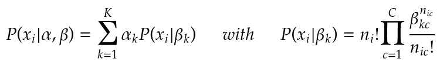

完整数据可能性写为:

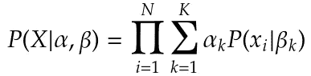

正如我之前所说，这个模型独立考虑每个篮子，不同个人的篮子没有区别。我们以相同的方式考虑每一个人，这意味着他们具有相同的预测特征，由模型参数的估计产生。在我们的例子中，这给了我们以下一般概况(通过采样模拟):

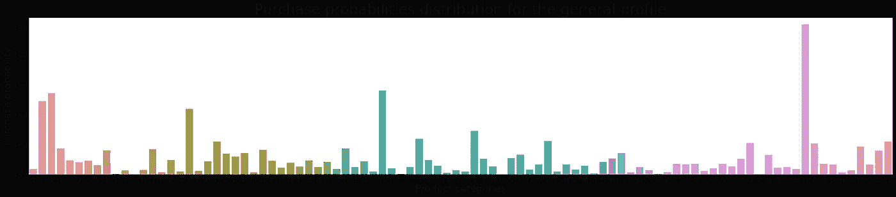

作者图片

一般来说，这种描述更准确地描述了购买概率。现在，它可能非常适合一些人，但在大多数情况下，它是一个糟糕的预测。那么如何才能做得更好呢？首先，我们将通过重写完整的数据可能性来介绍个人篮子之间的区别:

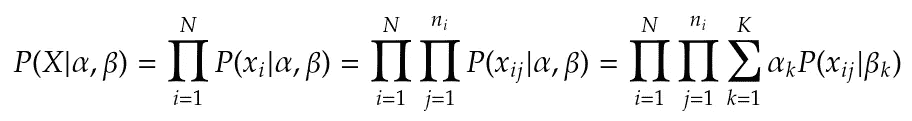

指数 I 指的是一个特定的个体。指数 j 指的是那个人的当前篮子(从 1 到篮子总数 n_i)。我们没有对模型做任何修改。上面这个模型已经是我们实现的了。我们刚刚介绍了个人篮子之间的区别。请记住，我们正在使用一个潜在变量模型。潜在变量的每个实例描述了来自个体 I 的篮子 j 由聚类 k 生成的概率。因此，我们可以考虑分类似然性而不是似然性，这是混合模型的 EM 框架内的完全数据似然性:

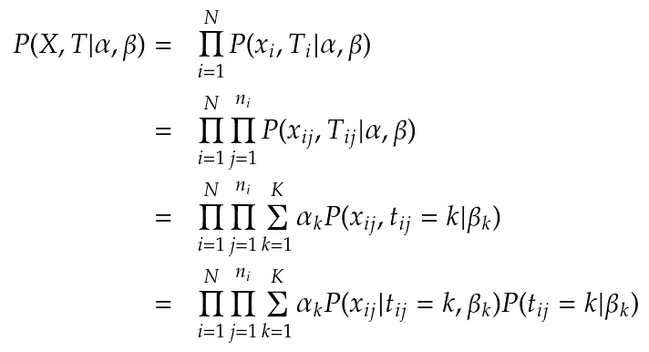

因此，对于特定的个人，完整数据的可能性计算如下:

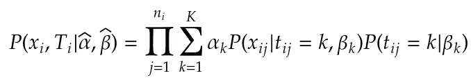

现在，我们可以做的是，通过从测试集和从上面的预测分布中抽样获得的预测中面对他们的购买，来检查特定个人的实现。

为了构建给定个体的预测分布，我们迭代通过该个体的训练集的所有篮子，对于每个篮子，我们迭代通过每个混合成分 k，并且每次我们从相应的多项式采样。然后用混合权重和属于该聚类的观察值的潜在概率对样本进行加权。最后，将所有样本相加，并通过总计数进行归一化，以得到合适的概率分布。此外，为了对预测进行评分，我们计算预测和测试集的标准化购买计数之间的 L1 距离。这里有两个例子:

作者图片

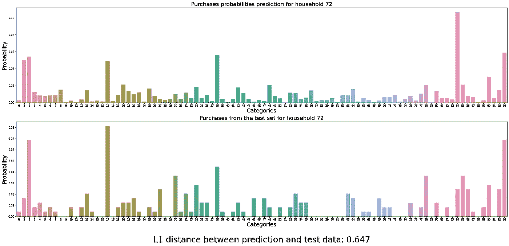

作者图片

我们可以看到，结果并不总是对每个人都好。对于经常购物的人来说，这个预测显然比不经常购物的人要好。

## 个体重量

好吧，那么有没有更好的方法呢？答案是肯定的，可以在我在本文开头提到的研究论文中找到:“使用有限混合模型 预测交易数据的 [**”。**](http://www.datalab.uci.edu/papers/profiles.pdf)

其思想是用个性化的权重代替全局混合权重。然后，完整数据可能性变为:

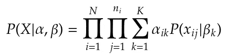

这一次，我不会讨论更新规则的数学推导。您唯一需要知道的是，除了在 m 步骤中混合物重量的更新之外，它们保持不变，即:

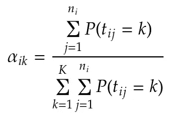

如果我们用全局模型与以前的更新规则进行比较，不同的是，现在我们只对个体的篮子而不是所有的篮子使用潜在变量的后验分布。

在训练该模型之后，我们可以将新的训练结果(在可能性和 BIC 值方面)与先前的结果进行比较:

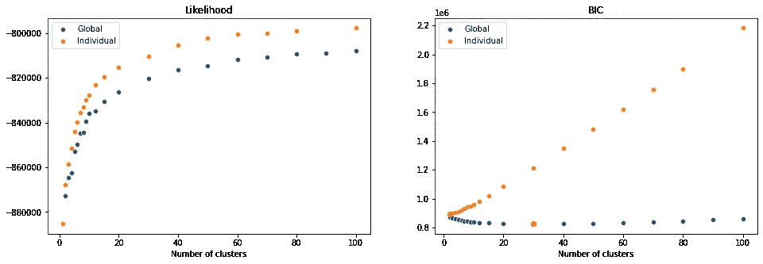

作者图片

我们看到，使用这个新模型，测试集上的可能性对于任何数量的聚类都是更好的，这意味着更有可能适合。我们现在的问题是，BIC 标准建议只选择两个集群。鉴于这些数据的性质，这似乎真的不合适。这就是我们触及 BIC 标准极限的地方。在这种模型化中，我们用 K 乘以 N 个单独的混合权重来代替 K 个全局混合权重。这意味着参数数量的惩罚现在在公式中的权重要大得多。

存在大量不同的标准来评估要选择的集群的数量。以下是我找到的一些:

*   似然比检测
*   阿凯克信息准则
*   基于自举的信息准则
*   基于交叉验证的信息准则
*   最小信息比率标准
*   信息复杂性标准
*   拉普拉斯近似法
*   贝叶斯信息标准(我们使用的)
*   拉普拉斯-大都会准则
*   拉普拉斯-经验准则
*   可逆跳跃法
*   最小消息长度原则
*   分类似然准则
*   归一化熵准则
*   综合分类标准

我确信还有其他的标准，它仍然是一个活跃的研究课题。选择最佳聚类数的新方法仍在出现。所以我们看到了这个主题的广度和复杂性。但是正如我之前所说的，没有什么能打败领域专家的判断。

无论如何，通过这种新的模型化，我们获得了上一节中选择的 2 个人的以下结果:

作者图片

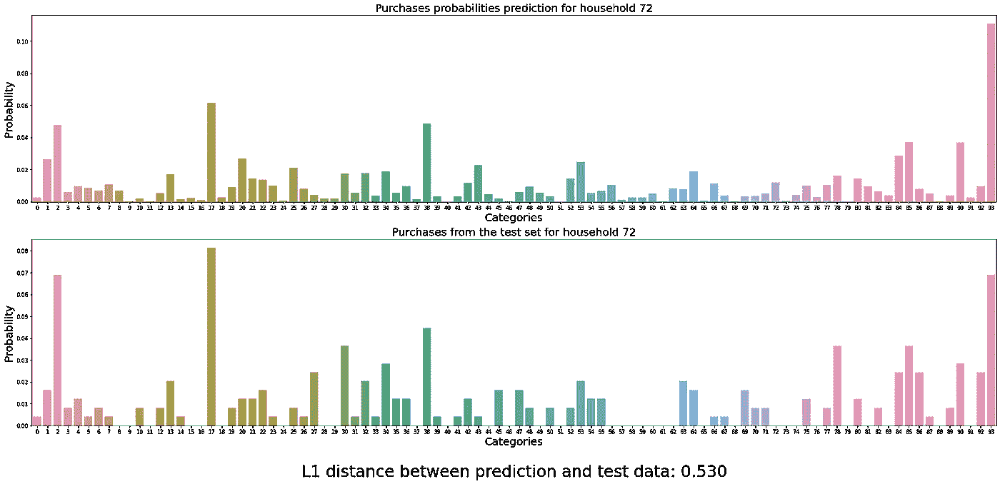

作者图片

在 L1，892 户家庭的距离从 1.625 增加到 1.564，72 户家庭的距离从 0.647 增加到 0.530。现在对每个家庭进行同样的练习，我们可以记录获得的距离，并在散点图上进行对比:

作者图片

对角线下方的每个点对应于使用个性化模型预测距离较小的家庭。从上面的图中不一定明显，但我们对 61.57%的家庭进行了更好的预测。

所以最后，我们认为第二种模型化是一种更好的模型，因为它在测试集上给出了更好的预测性能。我们只是还没有找到正确评估集群数量的方法(虽然我可能会选择 30 个集群，就像我们对全局模型所做的那样)，我把它留给有兴趣的读者做练习。

关于这最后一点，你可以使用我的 github 上的代码(以及用于数据探索、模型选择和结果分析的笔记本)= >[https://github.com/biarne-a/MNMM](https://github.com/biarne-a/MNMM)

## 关于模型的最终想法

这个模型可以预测一个人可能会购买哪些产品，但不能预测会购买多少或何时购买。多项式分布给出已购买商品的计数，但需要输入购物篮中已购买商品的总数。因此，理想情况下，我们需要另一个模型来预测个人在某一天会购买的商品总数。此外，为了对商店的访问率建模，我们可以使用[泊松过程](https://en.wikipedia.org/wiki/Poisson_point_process)，我们还必须考虑季节性模式。

重要的一点是，在启发本文的论文中，作者使用 EM 算法来找到模型参数的[最大后验概率](https://en.wikipedia.org/wiki/Maximum_a_posteriori_estimation) (MAP)估计，而我们找到的是 MLE 估计。这更符合贝叶斯哲学。这意味着他们声明了模型的参数α和β的先验(都是 Dirchlet 先验)。这种方法更好，因为它允许正则化模型。我们可以把它看作是，从对参数的合理猜测开始，我们根据我们所掌握的数据量来提炼这些值。对于个性化模型，我们从模型的全局估计开始。如果我们没有太多关于个人的数据，那么它的估计值将接近全球的估计值。为了这篇文章，我不想采用这种方法，因为它会使事情变得更加复杂(而且我还必须介绍 Dirichlet 分布和其他一些东西)。

## 最后的话

这是一段不平凡的旅程！如果你读到这里，这可能意味着你已经发现这很有趣，也许你在这个过程中学到了一些东西(至少我希望如此)。

无论如何，照顾好你自己和你爱的人！