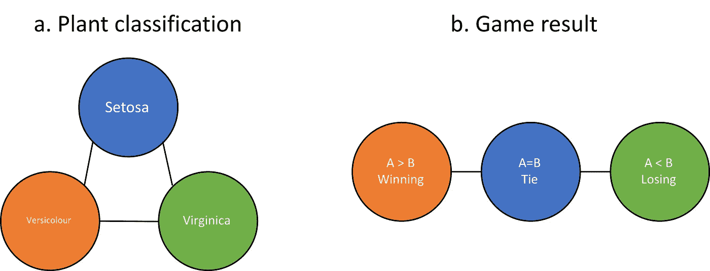
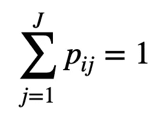
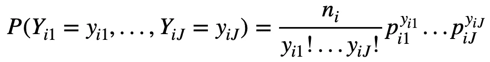
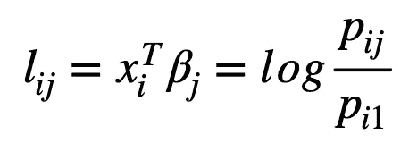
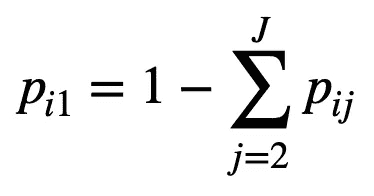

# 名义数据的多项式模型

> 原文：<https://towardsdatascience.com/multinomial-models-for-nominal-data-8b7467201ca9?source=collection_archive---------35----------------------->

## 广义线性模型

## 在多项式建模之前，再看一下你的反应变量。


斯特凡诺·阿莱马尼在 [Unsplash](https://unsplash.com?utm_source=medium&utm_medium=referral) 上拍摄的照片

T 流行的多项逻辑回归被认为是[二项式逻辑回归模型](/why-is-logistic-regression-the-spokesperson-of-binomial-regression-models-54a65a3f368e)的扩展，以处理两个以上可能的离散结果。

然而，多项式逻辑回归并不是设计成一个通用的多类分类器，而是专门为**名义**多项式数据设计的。

注意，**名义**数据和**序数**数据是多项数据的两个主要类别。不同之处在于，名义多项式数据中的类别没有顺序，而有序多项式数据中的类别有顺序。

例如，如果我们的目标是区分 [IRIS](https://archive.ics.uci.edu/ml/datasets/iris) 数据集中的三类植物，我们需要将植物类别视为名义结果，因为植物类别中没有特定的顺序。然而，如果我们想将 NBA 决赛上半场结束时的比分预测为三类，“赢”、“输”或“平”，我们需要将其视为有序结果，因为这三类之间的成对距离不相同。



(a)名义数据和(b)顺序数据的例子

因此，在多项式建模之前，有必要弄清楚结果的类型。

在这篇文章中，我将简要地谈谈名义数据的多项式回归模型。希望对你的现实工作有所帮助。

## 多项式逻辑回归模型

如上所述，多项式逻辑回归是专门为名义数据设计的。这个想法与二进制数据的逻辑回归非常相似，即把属于某个类别的概率与预测值联系起来。

对于那些努力理解链接功能的人，你可以参考[我以前的一个帖子](/why-is-logistic-regression-the-spokesperson-of-binomial-regression-models-54a65a3f368e)了解一下。

设 *Yi* 是一个随机变量，可以落在类 *1，2，…，J* 中的一个。我们将 pij 定义为第 j 个类中的第 I 个变量。


所以，我们有



上面的公式是针对一般情况的，所以当 J=2 时，就变成了二进制数据的情况。

如果我们的观察总数为 *ni* ，那么多项式分布可以描述如下。



在多项式逻辑回归中，链接函数被定义为



在哪里



这样，我们*将 *J* 类概率和*1*T8*类概率之间的对数优势比与预测因子的线性组合联系起来。现在让我们看看多项式逻辑回归的真实数据和编码。

这个例子来自远方的书，描述了 1996 年美国大选的研究。响应变量包括三个类别，民主党、共和党和无党派。预测因素包括受访者的年龄、教育程度和收入群体。

```
# R code
> head(nes96)
##   popul TVnews selfLR ClinLR DoleLR     PID age  educ   income    vote
## 1     0      7 extCon extLib    Con  strRep  36    HS $3Kminus    Dole
## 2   190      1 sliLib sliLib sliCon weakDem  20  Coll $3Kminus Clinton
## 3    31      7    Lib    Lib    Con weakDem  24 BAdeg $3Kminus Clinton
## 4    83      4 sliLib    Mod sliCon weakDem  28 BAdeg $3Kminus Clinton
## 5   640      7 sliCon    Con    Mod  strDem  68 BAdeg $3Kminus Clinton
## 6   110      3 sliLib    Mod    Con weakDem  21  Coll $3Kminus Clinton
```

在对数据集进行一些预处理后，我们建立 R 中的多项式逻辑回归，如下所示。

```
# R codelibrary(nnet)
mulmod = multinom(sPID ~ age + educ + nincome, nes96)
```

其中“sPID”是响应变量，“年龄”、“教育程度”和“收入”分别对应于受访者的年龄、教育水平和收入。nes96 只是数据集名称。

然后我们检查拟合模型的概要。

```
# R codesummary(mulmod)
```

这产生了，

```
## Call:
## multinom(formula = sPID ~ age + educ + nincome, data = nes96)
## 
## Coefficients:
##             (Intercept)          age     educ.L     educ.Q    educ.C
## Independent   -1.197260 0.0001534525 0.06351451 -0.1217038 0.1119542
## Republican    -1.642656 0.0081943691 1.19413345 -1.2292869 0.1544575
##                  educ^4     educ^5      educ^6    nincome
## Independent -0.07657336  0.1360851  0.15427826 0.01623911
## Republican  -0.02827297 -0.1221176 -0.03741389 0.01724679
## 
## Std. Errors:
##             (Intercept)         age    educ.L    educ.Q    educ.C    educ^4
## Independent   0.3265951 0.005374592 0.4571884 0.4142859 0.3498491 0.2883031
## Republican    0.3312877 0.004902668 0.6502670 0.6041924 0.4866432 0.3605620
##                educ^5    educ^6     nincome
## Independent 0.2494706 0.2171578 0.003108585
## Republican  0.2696036 0.2031859 0.002881745
## 
## Residual Deviance: 1968.333 
## AIC: 2004.333
```

模型摘要报告了估计的系数以及标准误差。输出与线性模型中的输出略有不同。

摘要中仅列出了“独立”和“共和党”的统计数据，因为此处“民主党”被用作基线类别，并且回归正在针对该基线类别对对数优势比进行建模。

您可能会注意到，模型中没有显示预测值显著性的指标。我们可以从两个方面来评价它们。

*首先*，我们可以用流行的 *Z-score* 来评估预测器的重要性。

```
# R code
z = summary(mulmod)$coefficients/summary(mulmod)$standard.errors
p = (1 - pnorm(abs(z), 0, 1))*2
```

这个过程易于实现，因为它有一个简化的正态分布假设，该假设适用于粗略估计。让我们看看 p 值。

```
##              (Intercept)        age     educ.L     educ.Q    educ.C    educ^4
## Independent 2.464850e-04 0.97722232 0.88951010 0.76893540 0.7489628 0.7905471
## Republican  7.107723e-07 0.09464069 0.06630235 0.04189165 0.7509449 0.9374990
##                educ^5    educ^6      nincome
## Independent 0.5854128 0.4774294 1.751402e-07
## Republican  0.6505832 0.8539066 2.165977e-09
```

毫无疑问，收入似乎是一个强有力的预测因素，但并不是所有的教育变量都有意义。这也是使用 Z 分布来评估系数的缺点，这使得它很难解释。

更精确的方法是建立一个新的模型，减少预测因子的数量，然后检查可能性的变化。首先，让我们建立没有变量教育的模型。

```
# R code
mulmod_noedu = multinom(sPID ~ age + nincome, nes96)
```

然后，我们使用卡方分布来评估两个多项式模型之间的可能性变化。p 值可以计算如下。

```
# R code
pchisq(deviance(mulmod_noedu)-deviance(mulmod),mulmod$edf - mulmod_noedu$edf, lower.tail = F)
```

这产生了，

```
0.1819634
```

这表明变量'*教育*'相对于完整模型不显著。如果我们对变量' *income* '做同样的事情，我们会得到下面的结果。

```
# R code
mulmod_noinc = multinom(sPID ~ age + educ, nes96)
pchisq(deviance(mulmod_noinc)-deviance(mulmod),mulmod$edf - mulmod_noinc$edf, lower.tail = F)
```

这产生了，

```
1.267249e-10
```

这些结果表明，“收入”是完整模型中的一个重要预测因素。

该系数的解释应该是这样的:某个预测值的一个单位变化将导致目标类别与基线类别之间的对数优势比的 k 个单位变化(本例中为“民主党”)。这部分的细节我就不探讨了。

## 等级制还是非等级制？

在多项式建模之前，对响应变量的另一个非常重要的检查是响应结果是否具有层次性。

让我们看一个来自[farage 的书](https://www.amazon.com/Extending-Linear-Model-Generalized-Nonparametric/dp/158488424X)的中枢神经系统疾病数据的例子。

```
data(cns)
head(cns)
```

产量，

```
##         Area NoCNS An Sp Other Water      Work
## 1    Cardiff  4091  5  9     5   110 NonManual
## 2    Newport  1515  1  7     0   100 NonManual
## 3    Swansea  2394  9  5     0    95 NonManual
## 4 GlamorganE  3163  9 14     3    42 NonManual
## 5 GlamorganW  1979  5 10     1    39 NonManual
## 6 GlamorganC  4838 11 12     2   161 NonManual
```

在这里，“NoCNS”是指没有中枢神经系统疾病，“An”是指无脑畸形，“Sp”是指脊柱裂，“其他”是指其他类型的中枢神经系统。“面积”、“水”和“工作”描述了家庭的特征。

如果我们想要使用家族的特征来模拟 CNS 状态，我们可以简单地对四个类别实施多项逻辑回归。

然而，我们可以看到，“an”、“Sp”和“其他”只是 CNS 的亚型，反应变量由健康个体(NoCNS)主导。在这种情况下，我们最好将响应变量视为分层变量，其中“CNS”和“NoCNS”形成二项式分布，“An”、“Sp”和“其他”在“CNS”类别内形成多项式分布。

让我们比较代码和结果。

让我们首先在“CNS”和“NoCNS”之间建立一个二项式逻辑回归。

```
# R code
cns$CNS = cns$An + cns$Sp + cns$Other
binom_mod = glm(cbind(CNS,NoCNS) ~ Water + Work, cns, family=binomial)
summary(binom_mod)
```

这产生了，

```
## 
## Call:
## glm(formula = cbind(CNS, NoCNS) ~ Water + Work, family = binomial, 
##     data = cns)
## 
## Deviance Residuals: 
##      Min        1Q    Median        3Q       Max  
## -2.65570  -0.30179  -0.03131   0.57213   1.32998  
## 
## Coefficients:
##                 Estimate Std. Error z value Pr(>|z|)    
## (Intercept)   -4.4325803  0.0897889 -49.367  < 2e-16 ***
## Water         -0.0032644  0.0009684  -3.371 0.000749 ***
## WorkNonManual -0.3390577  0.0970943  -3.492 0.000479 ***
## ---
## Signif. codes:  0 '***' 0.001 '**' 0.01 '*' 0.05 '.' 0.1 ' ' 1
## 
## (Dispersion parameter for binomial family taken to be 1)
## 
##     Null deviance: 41.047  on 15  degrees of freedom
## Residual deviance: 12.363  on 13  degrees of freedom
## AIC: 102.49
## 
## Number of Fisher Scoring iterations: 4
```

我们可以发现“水”和“非体力劳动”都是预测中枢神经系统与否的重要变量。

然后，我们对中枢神经系统的亚型进行多项逻辑回归。

```
# R code
cns_mod = multinom(cbind(An,Sp,Other) ~ Water + Work, cns)
z = summary(cns_mod)$coefficients/summary(cns_mod)$standard.errors
p= (1 - pnorm(abs(z), 0, 1))*2
p
```

这产生了，

```
##        (Intercept)     Water WorkNonManual
## Sp    4.833577e-02 0.5234640     0.5791105
## Other 5.935107e-05 0.4511663     0.4052210
```

我们可以看到，无论是“水”还是“非人工”对于区分中枢神经系统的不同亚型都没有意义。

这些结果表明，水质和体力劳动确实对新生儿的中枢神经系统状况有影响，但它们都不能解释中枢神经系统的亚型。

但是，如果把所有东西都扔给一个四品类全模型，结果就不一样了。

```
# R code
full_mod = multinom(cbind(NoCNS, An, Sp, Other) ~ Water + Work, cns)
z = summary(full_mod)$coefficients/summary(full_mod)$standard.errors
p= (1 - pnorm(abs(z), 0, 1))*2
p
```

这表明，

```
##       (Intercept)       Water WorkNonManual
## An              0 0.066695285    0.02338312
## Sp              0 0.001835095    0.07077816
## Other           0 0.840643368    0.02348335
```

这一次，预测者在解释具有不同 p 值的 CNSs 亚型时显示出一些混合的结果。这两个变量不能预测中枢神经系统亚型的事实在完整模型中没有披露。

## 外卖食品

总之，我介绍了多项式回归模型及其应用场合。最重要的一点是在建模之前检查响应变量。

1.  多项式逻辑回归只能应用于名义数据，而不能应用于有序数据。
2.  具有潜在等级结构的响应变量应谨慎对待。将所有内容汇集到一个完整的模型中有时并不是最佳的。

## 参考

[](https://www.analyticsvidhya.com/blog/2016/02/multinomial-ordinal-logistic-regression/) [## R 中如何使用多项式和序数 Logistic 回归？

### 引言我们大多数人对回归的了解有限。其中，线性回归和逻辑回归是我们的最爱…

www.analyticsvidhya.com](https://www.analyticsvidhya.com/blog/2016/02/multinomial-ordinal-logistic-regression/) 

遥远的 Julian J. *用 R 扩展线性模型:广义线性、混合效应和非参数回归模型*。CRC 出版社，2016。

https://archive.ics.uci.edu/ml/datasets/iris


照片由[乔·凯恩](https://unsplash.com/@joeyc?utm_source=medium&utm_medium=referral)在 [Unsplash](https://unsplash.com?utm_source=medium&utm_medium=referral) 上拍摄