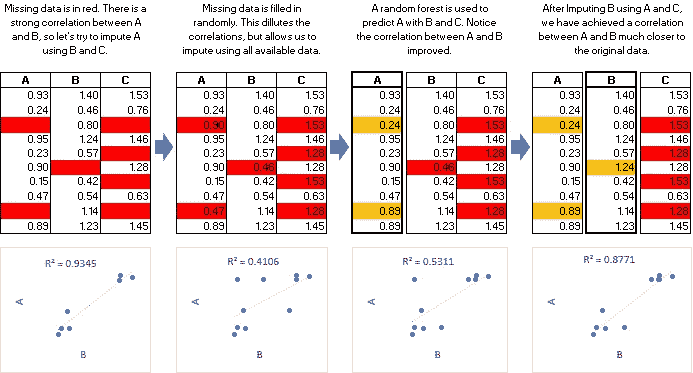
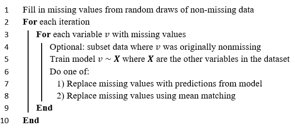
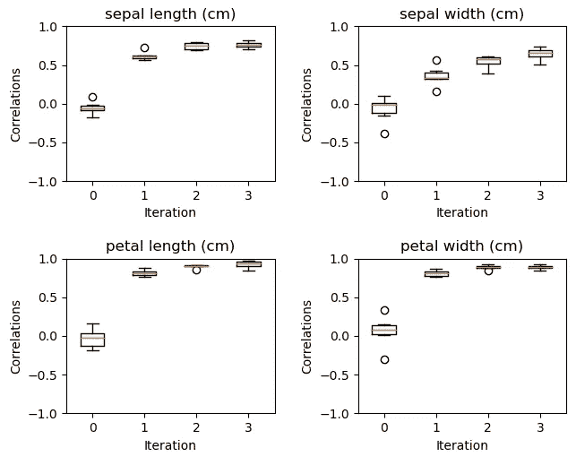
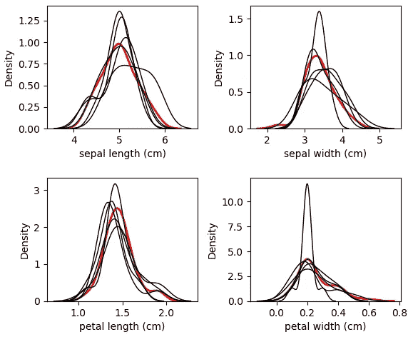
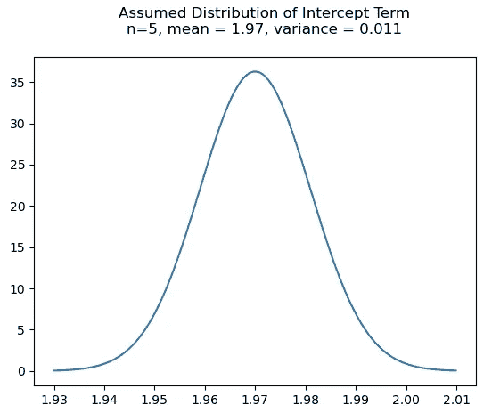

# Python 中 lightgbm 的多重插补

> 原文：<https://towardsdatascience.com/multiple-imputation-with-random-forests-in-python-dec83c0ac55b?source=collection_archive---------13----------------------->


戴维·科瓦连科在 [Unsplash](https://unsplash.com?utm_source=medium&utm_medium=referral) 上拍摄的照片

缺失数据是数据科学中的一个常见问题，这往往会导致很多令人头疼的问题。有些算法根本处理不了。线性回归、支持向量机和神经网络都是算法的例子，这些算法需要巧妙的解决方法来使丢失的值变得可消化。其他算法，如梯度推进，对缺失值有很好的解决方案。然而，这并不意味着它们不会造成问题。

在几种情况下，缺失数据会导致预测偏差，即使在对缺失值进行了本机处理的模型中也是如此:

*   丢失的数据被覆盖，并且仅在推断时有时可用。这在漏斗建模中尤其常见，随着他们在漏斗中的深入，对客户的了解也越来越多。
*   导致丢失数据更改的机制—例如网站上的新问题、新供应商等。如果机制与您最终想要建模的目标相关，这尤其是一个问题。

如果我们能知道那些丢失的值实际上是什么，并使用它们就好了。我们不能。但是我们可以做下一个最好的事情:通过链式方程(小鼠)用多重插补来估计它们的值:



图片来自 [miceforest Github](https://github.com/anothersamwilson/miceforest)

# MICE 算法

链式方程的多重插补，也称为“完全条件说明”，定义如下:



作者上传

对所需数量的数据集重复这一过程。第 8 行提到的方法，均值匹配，用于产生更像原始数据的插补。这个想法在 Stef van Buuren 的在线书籍中有深入的探讨。在 [miceforest Github 页面](https://github.com/AnotherSamWilson/miceforest#Effects-of-Mean-Matching)上也可以找到均值匹配影响的可再现示例。

插补收敛有时需要多次迭代。有几个因素会影响实现收敛所需的迭代次数，例如[缺失数据的类型、](https://www.displayr.com/different-types-of-missing-data/)数据集中的信息密度以及用于估算数据的模型。

从技术上讲，任何能够进行推理的预测模型都可以用于小鼠。在本文中，我们用 **miceforest** Python 库估算一个数据集，该库默认使用 lightgbm 随机森林(尽管这是可以改变的)。随机森林很适合 MICE 算法，原因有几个:

1.  不需要太多的超参数调整
2.  轻松处理数据中的非线性关系
3.  能便宜地回报 OOB 的表现
4.  是可以并行化的
5.  可以返回特征对诊断的重要性

# 实际例子

让我们加载我们的包和数据。我们使用从 sklearn 导入的虹膜数据集:

```
import miceforest as mf
from sklearn.datasets import load_iris
import pandas as pd

# Load and format data
iris = pd.concat(load_iris(as_frame=True,return_X_y=True),axis=1)
iris.rename(columns = {'target':'species'}, inplace = True)
iris['species'] = iris['species'].astype('category')

# Introduce missing values
iris_amp = mf.ampute_data(iris,perc=0.25,random_state=1991)
```

我们只需要创建一个 MultipleImputedKernel 并执行几次鼠标迭代:

```
# Create kernels. 
kernel = mf.ImputationKernel(
  data=iris_amp,
  save_all_iterations=True,
  random_state=1991
)

# Run the MICE algorithm for 3 iterations on each of the datasets
kernel.mice(3,verbose=True)
```

我们所做的是用不同的估算值创建 5 个独立的数据集。我们永远无法确定原始数据是什么，但是如果我们不同的数据集都得出相似的估算值，我们可以说我们对估算很有信心。让我们来看看数据集之间估算值的相关性:

```
kernel.plot_correlations(wspace=0.4,hspace=0.5)
```



作者上传

每个点代表两个数据集之间估算值的相关性。数据集的每个组合都包含在图表中。如果估算值之间的相关性很低，这意味着我们没有很大的信心估算值。看起来我们的模型在花瓣长度和花瓣宽度的插补上非常一致。如果我们运行更多的迭代，我们也许能够得到更好的萼片长度和萼片宽度的结果。

# 输入新数据

链式随机森林的多重插补可能需要很长时间，尤其是如果我们要插补的数据集很大。如果我们想在生产中使用这种方法呢？事实证明，我们可以保存在原始 MICE 过程中拟合的模型，并使用它们来估算新的数据集:

```
# Our new dataset
new_data = iris_amp.iloc[range(50)]# Make a multiple imputed dataset with our new data
new_data_imputed = kernel.impute_new_data(new_data)# Return a completed dataset
new_completed_data = new_data_imputed.complete_data(0)
```

miceforest 在新数据上重新创建原始过程的流程，而无需在每次迭代时更新模型。这节省了大量时间。我们还可以查询这个新数据集，以查看相关性是否收敛，甚至绘制插补的分布:

```
new_data_imputed.plot_imputed_distributions(wspace=0.35,hspace=0.4)
```



作者上传

# 建立置信区间

现在我们已经有了 5 个数据集，您可能会尝试使用平均估算值来创建一个单一的最终数据集，并完成它。如果您正在执行传统的统计分析，不建议这样做——具有更多方差的插补将趋向于向平均值回归，并且总体插补的方差将降低，导致最终数据集的*行为与原始数据集不同*。最好执行多重分析，并跟踪这些多重分析产生的差异。

由于我们有 5 个不同的数据集，我们现在可以训练多个模型，并根据结果建立置信区间。这里，我们在“萼片长度(cm)”上训练 5 个不同的线性回归模型，并使用从我们的 5 个模型获得的截距的平均值和方差建立截距项分布的假设:

```
from sklearn.linear_model import LinearRegression
# For each imputed dataset, train a linear regression
# on 'sepal length (cm)'
intercepts = []
target = 'sepal length (cm)'
for d in range(kernel.dataset_count()):
    comp_dat = kernel.complete_data(d)
    comp_dat = pd.get_dummies(comp_dat)
    X, y = comp_dat.drop(target,1), comp_dat[target]
    model = LinearRegression()
    model.fit(X,y)
    intercepts.append(model.intercept_)
# Load packages for plotting
import numpy as np
import matplotlib.pyplot as plt
from scipy.stats import norm

# Make plot.
avg_intercept = round(np.mean(intercepts),2)
var_intercept = round(np.var(intercepts),4)
x_axis = np.arange(
    avg_intercept - 3 * var_intercept,
    avg_intercept + 3 * var_intercept,
    0.0001
)
plt.plot(
    x_axis,
    norm.pdf(x_axis,avg_intercept,var_intercept)
)
plt.title(f"""
    Assumed Distribution of Intercept Term
    n=5, mean = {avg_intercept}, variance = {var_intercept}
    """
)
```



作者上传

如果我们没有丢失值，我们不知道真正的截距项是什么，但是我们现在可以(弱)声明如果我们没有丢失数据，截距可能是什么。如果我们想在这种情况下增加 n，我们需要添加更多的数据集。

可以对线性模型中的系数以及每个样本的实际预测运行类似的置信区间。缺失数据越多的样本在最终模型中的预测偏差越大，因为数据集之间的估算值差异越大。

# 最后

我们已经看到了 MICE 算法是如何工作的，以及它如何与随机森林相结合来精确地估算缺失数据。我们还通过一个简单的例子说明了如何使用多个估算数据集来帮助我们建立一个关于模型参数分布的假设。