# 多元线性回归

> 原文：<https://towardsdatascience.com/multiple-linear-regression-8cf3bee21d8b?source=collection_archive---------4----------------------->

## 一个完整的研究—模型解释→假设检验→特征选择


[斯蒂夫·约翰森](https://unsplash.com/@steve_j?utm_source=medium&utm_medium=referral)在 [Unsplash](https://unsplash.com?utm_source=medium&utm_medium=referral) 上拍照

线性回归是最受欢迎和讨论最多的模型之一，当然是深入机器学习(ML)的门户。这种简单、直接的建模方法值得作为您进入 ML 的第一步来学习。

在继续之前，让我们回忆一下，线性回归可以大致分为两类。

*   **简单线性回归**:这是线性回归的最简单形式，当输出变量只有一个输入变量时使用。

如果你是回归的新手，那么我强烈建议你首先从下面的链接中阅读简单的线性回归，在那里你会理解背后的数学原理以及使用有趣的数据和亲自动手编码的方法。

[](/simple-linear-regression-35b3d940950e) [## 简单线性回归

### 关于简单线性回归你需要知道的一切

towardsdatascience.com](/simple-linear-regression-35b3d940950e) 

*   **多元线性回归:**是线性回归的一种形式，当有两个或两个以上的预测因子时使用。

我们将看到多个输入变量如何一起影响输出变量，同时也了解计算如何不同于简单的 LR 模型。我们还将使用 Python 构建一个回归模型。

最后，我们将更深入地学习线性回归，并将学习诸如共线性、假设检验、特征选择等等。

现在有人可能会想，我们也可以使用简单的线性回归来分别研究所有独立变量的输出。那会让生活变得容易得多，对吗？

不，不会的。

## 为什么要多元线性回归？

“从多个输入变量中预测结果。咄！”。但是，就这样吗？好吧，保持这种想法。

考虑一下这个，假设你要估算你想买的某套房子的价格。你知道建筑面积，房子的年龄，离你工作地点的距离，这个地方的犯罪率等等。

现在，这些因素中的一些会积极地影响房价。例如面积越大，价格越高。另一方面，距离工作场所的距离和犯罪率等因素会对你对房子的估计产生负面影响(除非你是一个对机器学习感兴趣的有钱罪犯，正在寻找藏身之处，是的，我不这么认为)。

*简单线性回归的缺点* →当我们只对一个感兴趣时，运行单独的简单线性回归会导致不同的结果。除此之外，可能还有一个输入变量本身与其他一些预测因素相关或依赖于其他一些预测因素。这会导致错误的预测和不令人满意的结果。

这就是多元线性回归发挥作用的地方。

## 数学上…

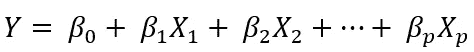

这里， ***Y*** 为输出变量， ***X*** 项为对应的输入变量。注意，这个方程只是简单线性回归的扩展，每个预测因子都有一个对应的斜率系数(***【β】***)。

第一个 *β* 项( *βo* )是截距常数，是没有所有预测值时 *Y* 的值(即当所有 *X* 项都为 0 时)。在给定的回归问题中，它可能有意义，也可能没有意义。它通常在那里给回归的线/平面一个相关的推动。

现在让我们借助一些数据来理解这一点。

## 可视化数据

我们将使用南加州大学马歇尔商学院网站上的广告数据。你可以在这里下载[。](http://faculty.marshall.usc.edu/gareth-james/ISL/Advertising.csv)

如果你看过我关于[简单线性回归](/simple-linear-regression-35b3d940950e)的帖子，那么你对这个数据已经很熟悉了。如果你没有，让我给你一个简短的介绍。

广告数据集包括一种产品在 200 个不同市场的销售额，以及三种不同媒体的广告预算:电视、广播和报纸。它看起来是这样的:

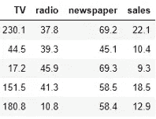

销售额(*1000 台)与广告预算(*1000 美元)

数据的第一行表示电视、广播和报纸的广告预算分别为 230.1k 美元、37.8k 美元和 69.2k 美元，相应的售出数量为 22.1k(或 22，100)。

在简单的线性回归中，我们可以看到在没有其他两种媒体的情况下，每种广告媒体是如何影响销售的。然而，在实践中，这三者可能会共同影响净销售额。我们没有考虑这些媒体对销售的综合影响。

多元线性回归通过在一个表达式中考虑所有变量来解决这个问题。因此，我们的线性回归模型现在可以表示为:


求这些常数的值(*β*)**)**就是回归模型通过最小化误差函数，拟合最佳直线或超平面(取决于输入变量的数量)所做的事情。

这是通过最小化[残差平方和](/simple-linear-regression-35b3d940950e/#32ff) (RSS)来实现的，残差平方和是通过对实际结果和预测结果之间的差求平方来获得的。

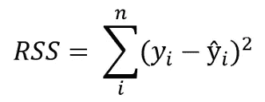

## 普通最小二乘法

因为这种方法求最小平方和，所以也被称为普通最小二乘法(OLS 法)。在 Python 中，有两种实现 OLS 算法的主要方法。

*   **SciKit Learn:** 只需从 Sklearn 包中导入线性回归模块，并在数据上拟合模型。这个方法非常简单，你可以在下面看到如何使用它。

```
from sklearn.linear_model import LinearRegressionmodel = LinearRegression()
model.fit(data.drop('sales', axis=1), data.sales)
```

*   **StatsModels:** 另一种方法是使用 StatsModels 包来实现 OLS。Statsmodels 是一个 Python 包，允许对数据执行各种统计测试。我们将在这里使用它，以便您可以了解这个伟大的 Python 库，因为它将在后面的章节中对我们有所帮助。

## 建立模型并解释系数

```
**# Importing required libraries** import pandas as pdimport statsmodels.formula.api as sm**# Loading data - You can give the complete path to your data here**
ad = pd.read_csv("Advertising.csv")**# Fitting the OLS on data**
model = sm.ols('sales ~ TV + radio + newspaper', ad).fit()
print(model.params)
```

您应该得到以下输出。

```
Intercept    2.938889
TV           0.045765
radio        0.188530
newspaper   -0.001037
```

我鼓励您也使用 Scikit Learn 运行回归模型，并使用*model . coef _*&*model . intercept _ 找到上述参数。*你看到了同样的结果吗？

既然有了这些价值观，又该如何解读呢？方法如下:

*   如果我们固定电视和报纸的预算，那么增加 1000 美元的广播预算将导致销售额增加约 189 台(0.189*1000)。
*   类似地，通过修正广播和报纸，我们推断电视预算每增加 1000 美元，大约会增加 46 个产品单位。
*   然而，对于报纸预算来说，由于这个系数可以忽略不计(接近于零)，很明显报纸没有影响销售。事实上，它在零的负侧(-0.001)，如果幅度足够大，可能意味着该代理导致销售下降。但是我们不能用如此微不足道的价值来做这样的推论。

我在这里告诉你一件有趣的事。如果我们运行[简单线性回归](/simple-linear-regression-35b3d940950e)，仅使用报纸预算对比销售额，我们将观察到约为 0.055 的系数值，这与我们在上面看到的相比非常显著。这是为什么呢？

## 共线性

为了理解这一点，让我们看看这些变量是如何相互关联的。

```
ad.corr()
```

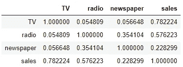

广告数据的相关矩阵

让我们用热图来形象化这些数字。

```
import matplotlib.pyplot as plt
%matplotlib inline> plt.imshow(ad.corr(), cmap=plt.cm.GnBu,        interpolation='nearest',data=True)
> plt.colorbar()
> tick_marks = [i for i in range(len(ad.columns))]
> plt.xticks(tick_marks, data.columns, rotation=45)
> plt.yticks(tick_marks, data.columns, rotation=45)
```

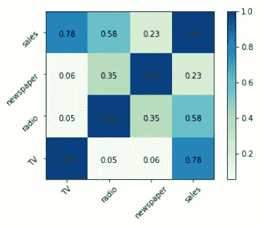

广告数据的关联热图

这里，深色方块代表强相关性(接近 1)，而浅色方块代表弱相关性(接近 0)。就是这个原因，所有的对角线都是深蓝色的，作为一个变量与自身完全相关。

这里值得注意的是报纸和广播的相关性是 0.35。这表明了报纸和广播预算之间的公平关系。因此，可以推断出，当一种产品的广播预算增加时，也有在报纸上花更多钱的趋势。

这被称为 ***共线性*** ，是指两个或多个输入变量线性相关的情况。

因此，即使多元回归模型显示对报纸的销售没有影响，简单回归模型仍然有影响，因为多重共线性和其他输入变量的缺乏。

> 销售和广播→可能的原因
> 
> 报纸和广播→多重共线性
> 
> 销售和报纸→传递相关性

好吧！我们理解线性回归，我们建立模型，甚至解释结果。到目前为止，我们所学的是线性回归的基础。然而，在处理现实世界的问题时，我们通常会超越这一点，对我们的模型进行统计分析，并在需要时进行必要的更改。

## 预测值的假设检验

运行多元线性回归时应该回答的一个基本问题是，*是否至少有一个预测因子对预测输出有用。*

我们看到电视、广播和报纸这三个预测因素与销售有不同程度的线性关系。但是，如果这种关系只是偶然的，并且由于任何预测因素而对销售没有实际影响，那该怎么办呢？

该模型只能给我们一些数字，以便在响应变量和预测变量之间建立足够密切的线性关系。但是，它不能证明这些关系的可信度。

为了获得一些信心，我们从统计学中获得帮助，做一些被称为 ***假设检验的事情。*** 我们首先形成一个 ***零假设*** 和一个相应的 ***替代假设*** 。

由于我们的目标是找出是否至少有一个预测因子对预测输出有用，所以我们希望至少有一个系数(不是截距)非零，这不仅仅是随机的，而是由于实际原因。

为了做到这一点，我们首先形成一个零假设:所有的系数都等于零。

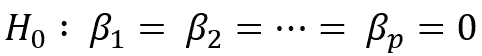

多元线性回归的一般零假设

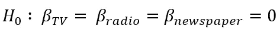

广告数据的零假设

因此，另一个假设是:至少有一个系数不为零。通过寻找强有力的统计证据来拒绝零假设，从而证明了这一点。

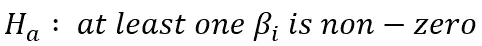

替代假设

使用 ***F 统计量进行假设检验。*** 这个统计量的公式包含残差平方和(RSS)和总平方和(TSS)，我们不必担心，因为 Statsmodels 包会处理这些。上面我们拟合的 OLS 模型摘要包含了所有此类统计信息的摘要，可以通过下面简单的代码行获得:

```
print(model.summary2())
```

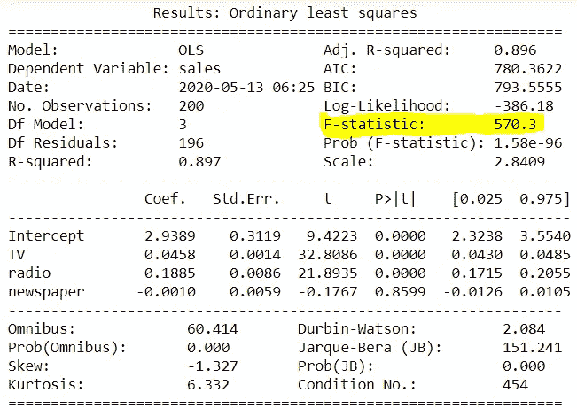

*如果 F 统计量的值等于或非常接近 1，那么结果是有利于零假设的，我们无法拒绝它。*

但是正如我们可以看到的，F 统计量比 1 大很多倍，因此提供了反对零假设(所有系数都为零)的有力证据。因此，我们拒绝零假设，并且确信至少有一个预测因子在预测输出时是有用的。

> 注意，当预测值( *p* )的数量很大时，或者如果 *p* 大于数据样本的数量( *n* )时，F 统计量不适用。

因此，我们可以说，三个广告代理商中至少有一个对预测销售是有用的。

但是哪一个或者哪两个重要呢？它们都很重要吗？为此，我们将执行 ***特征选择或变量选择。*** 现在，一种方法是尝试所有可能的组合，即

*   只有电视
*   只有收音机
*   只有报纸
*   电视和广播
*   电视和报纸
*   广播和报纸
*   电视、广播和报纸

在这里，尝试所有 7 种组合看起来仍然可行，但如果有更多的预测因素，组合的数量将呈指数增长。例如，在我们的案例研究中只增加一个预测因子，总的组合将变成 15 个。想象一下有十几个预测者。

因此，我们需要更有效的方法来执行特征选择。

## 特征选择

进行特征选择的两种最流行的方法是:

*   **正向选择:**我们从一个没有任何预测器，只有截距项的模型开始。然后，我们对每个预测值进行简单的线性回归，以找到最佳表现(最低 RSS)。然后，我们向它添加另一个变量，并通过计算最低 RSS(残差平方和)再次检查最佳的 2 变量组合。之后，检查最佳的三变量组合，依此类推。当满足某个停止规则时，停止该方法。
*   **反向选择:**我们从模型中的所有变量开始，去掉统计意义最小的变量(更大的 p 值:查看上面的模型摘要，找出变量的 p 值)。重复这一过程，直到达到停止规则。例如，当模型分数没有进一步提高时，我们可以停止。

在这篇文章中，我将带你了解正向选择方法。首先，让我们了解如何选择或拒绝添加的变量。

在每次添加之后，我们将使用 2 个度量来评估我们的新模型: **RSS** 和 **R** 。

我们已经熟悉了 RSS，它是残差平方和，通过对实际输出和预测结果之间的差值求平方来计算。这应该是模型性能良好的最低要求。

r 是模型解释数据差异的程度的量度。从数学上讲，它是实际结果和预测结果之间相关性的平方。r 接近 1 表明模型是好的，并且很好地解释了数据中的差异。接近零的值表示模型不佳。

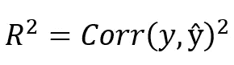

幸运的是，它是由 Statsmodels 中的 OLS 模块为我们计算出来的。让我们开始吧。

```
**# Defining a function to evaluate a model**
def evaluateModel(model):
    print("RSS = ", ((ad.sales - model.predict())**2).sum())
    print("R2 = ", model.rsquared)
```

我们先从电视开始，一个一个的评估单个预测器的模型。

```
**# For TV**
model_TV = sm.ols('sales ~ TV', ad).fit()
evaluateModel(model_TV)
```

> r^2 = 0.605831313512
> 19986.866686666667

```
**# For radio**
model_radio = sm.ols('sales ~ radio', ad).fit()
evaluateModel(model_radio)
```

> r^2 = 0。46860 . 86686868686

```
**# For newspaper**
model_newspaper = sm.ols('sales ~ newspaper', ad).fit()
evaluateModel(model_newspaper)
```

> r^2 = 0.00000000001

我们发现，在所有模型中，model_TV 的 RSS 最小，R 值最大。因此，我们选择 model_TV 作为我们前进的基础模型。

现在，我们将逐个添加收音机和报纸，并检查新值。

```
**# For TV & radio** model_TV_radio = sm.ols('sales ~ TV + radio', ad).fit()
evaluateModel(model_TV_radio)
```

> rss =，76184。18667 . 868686868667

我们可以看到，我们的价值观有了巨大的提高。与 model_TV 相比，RSS 下降，R 进一步增加。这是个好兆头。现在让我们看看电视和报纸也是如此。

```
**# For TV & newspaper** model_TV_radio = sm.ols('sales ~ TV + newspaper', ad).fit()
evaluateModel(model_TV_newspaper)
```

> r^2 = 0。19860 . 9868275。19867 . 888686868667

通过增加报纸，价值也有所提高，但没有收音机提高得多。因此，在这一步，我们将继续使用电视和广播模型，并在将报纸添加到该模型时观察差异。

```
**# For TV, radio & newspaper** model_all = sm.ols('sales ~ TV + radio + newspaper', ad).fit()
evaluateModel(model_all)
```

> r^2 = 0。18960 . 866868686867

这些值没有任何显著的提高。因此，当务之急是不要添加报纸，并最终确定以电视和广播为选择功能的模式。

因此，我们的最终模型可以表示如下:

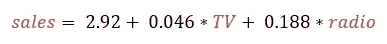

在 3D 图中绘制变量 TV、radio 和 sales，我们可以直观地看到我们的模型如何将回归平面拟合到数据中。

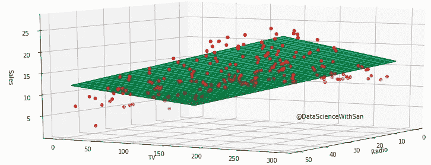

**3D 绘图了解回归平面**。图片由 [Sangeet Aggarwal](https://medium.com/u/db3258338f2f?source=post_page-----8cf3bee21d8b--------------------------------) 提供

多元线性回归就是这样。你可以在这里找到这篇文章[后面的完整代码。我希望你在阅读和学习中过得愉快。欲知详情，敬请关注。](https://github.com/datasciencewithsan/Multiple-Linear-Regression)

如果你是数据科学和机器学习的新手，不知道从哪里开始你的旅程，请查看下面的链接，在那里我提到了学习数据科学的一步一步的方法，有很多资源可供你选择。

[](/data-science-from-scratch-4343d63c1c66) [## 从零开始的数据科学

### 作为一个完全的初学者如何步入数据科学

towardsdatascience.com](/data-science-from-scratch-4343d63c1c66) 

等不及了？如果你想一头扎进一门课程，请点击下面的[链接](https://www.datacamp.com/?tap_a=5644-dce66f&tap_s=910084-843f05&utm_medium=affiliate&utm_source=sangeetaggarwal)查看适合你的数据科学职业轨迹。

[](https://www.datacamp.com/?tap_a=5644-dce66f&tap_s=910084-843f05&utm_medium=affiliate&utm_source=sangeetaggarwal) [## 在线学习 R、Python 和数据科学

### 使用 DataCamp 的视频教程&编码，按照您自己的步调，在您的浏览器中舒适地学习数据科学

www.datacamp.com](https://www.datacamp.com/?tap_a=5644-dce66f&tap_s=910084-843f05&utm_medium=affiliate&utm_source=sangeetaggarwal)