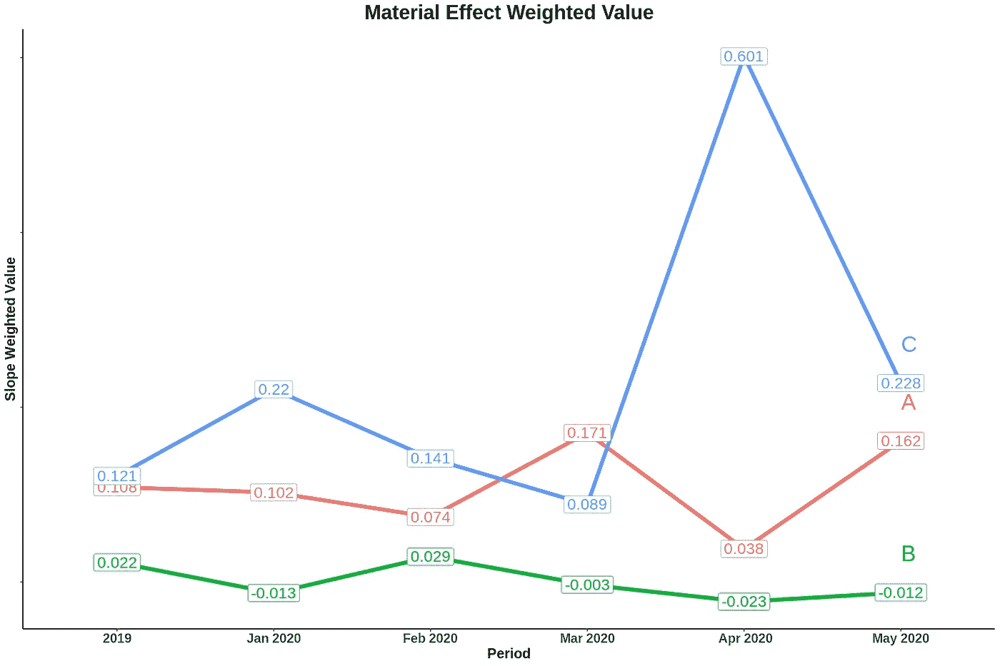

# 用于制造分析的多元线性回归

> 原文：<https://towardsdatascience.com/multiple-linear-regression-for-manufacturing-analysis-c057d4af718b?source=collection_archive---------15----------------------->

安特·罗泽茨基在 [Unsplash](https://unsplash.com/s/photos/industry?utm_source=unsplash&utm_medium=referral&utm_content=creditCopyText) 上的照片

## 关于如何找到生产流程中最重要因素的案例研究

> **回归**是测量自变量/预测变量与其因变量/目标变量之间关系的数学方法之一。

回归广泛用于至少两个主要目的。首先，回归通常被用作预测或预报工具。其次，在某些情况下，回归可以用作数据分析中的分析方法。在本文中，我们将使用回归作为次要目的，并深入了解回归模型如何用于分析过去的事件，而不是预测未来的事件。

**多元线性回归**是最简单的工具之一，可用于分析因变量和多个自变量/预测变量。这种回归经常被使用，因为现实中的一些过程不仅仅是由一个因素建立的，而是其他几个因素也参与到每一个活动中。

图一。多元线性回归公式

线性回归公式的**斜率**也可以解释为自变量 *与其因变量*之间的*线性关系强度。基于这个定义，我们可以轻松地说，自变量的斜率值越高，这个变量对因变量的影响就越显著。*

这将是我们分析和确定哪个因素在我们的制造业案例中影响最大的基础。

## 案例研究:

> *分析原材料对生产质量的影响*

案例定义:

公司“P”生产一种需要满足某些质量要求的产品；基本要求之一是它应该具有小于 30 的**缺陷值**。为了生产这种产品，公司“P”使用三种原料；**材料 A、材料 B 和材料 C。**这些材料之间的成分为 *0-10 % A、0-10% B 和 80-100% C* 。

根据理论，由于这些原材料的清洁度，缺陷值总是存在的。公司唯一能做的就是把缺陷值压制在最大限值以下。

与 2019 年相比，2020 年每件产品的平均缺陷值有所增加，并开始接近我们的最大限制(30)，这是我们不希望发生的。公司不确定是哪种材料导致了这个问题。为了回答这个问题，我们将进行回归分析，以了解哪种材料对这个问题负有最大责任。

图二。2020 缺陷值条件

## 数据准备

图二。生产数据集

功能解释:

1.  月份:制造物料的期间
2.  Production_No:产品的批号
3.  a、B、C:原材料投入(吨)
4.  缺陷值:质量状态，应低于 30

利用这些数据，我们将进行回归计算，找出每种材料的斜率。考虑到原材料成分(10:10:80)，斜率值将作为加权值重新计算。该加权值用于查找哪种材料对该问题负有最大责任。

## 回归建模

我们将使用**多元线性回归**方法，并使用以下公式作为我们的数学线性模型:

图三。生产数据的数学模型

这种情况下的数学模型与其他回归模型的不同之处在于，我们假设*“没有其他因素影响缺陷值”，*这就是为什么我们从我们的模型中移除截距变量，并且仅从原材料中预期缺陷值。

图 4。斜率回归结果

这些代码将返回每个时间段的斜率，在本例中，2019 年全年和 2020 年 1 月至 5 月。

由于我们需要将这些值重新计算为它们的加权值，并且我们还希望获得数据框，以便更容易地可视化和分析结果，为此，我们需要添加以下代码，并获得我们想要的结果:

图五。结果数据帧

## **可视化与分析**

图五。加权斜率值图表

那么，如果我们看到上面的图表，哪种材料的影响最大？根据图表，可以说材料 C 对缺陷值的影响大大增加了。2020 年五分之四的材料 A 加权值高于 2019 年，其峰值位于 2020 年 4 月。

有了这些信息，公司就可以准备对策。

此问题对策的一些示例如下:

1.  由于责任最大的是物料 C，公司可以在 2020 年评估采购物料 C 的质量。
2.  努力减少材料 C 的用量，并增加材料 B 的用量。
3.  在生产开始前严格监控材料质量。

本案例研究到此结束，本案例是基于一个制造业的实际问题编写的，使用回归来支持决策也是解决问题的真正方法。每个人和每个公司都可以有自己的方法来找到每个问题的解决方案，只要能解决问题就好。使用回归斜率的方法仅来自解决现实世界中的工业案例的许多方法。