# 使用 Python 的多元线性回归模型:机器学习

> 原文：<https://towardsdatascience.com/multiple-linear-regression-model-using-python-machine-learning-d00c78f1172a?source=collection_archive---------4----------------------->

## 学习如何使用 python 中的 Jupyter notebook 在机器学习中构建基本的多元线性回归模型

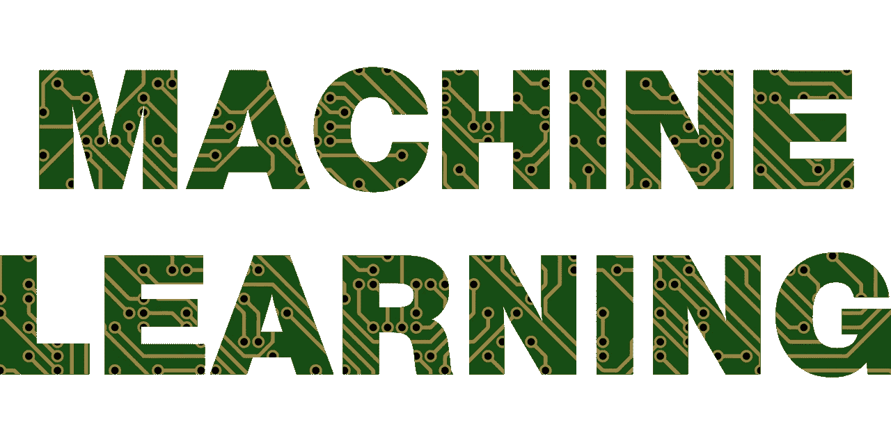

[图片由来自 Pixabay 的 Gordon Johnson 拍摄](https://pixabay.com/vectors/a-i-ai-anatomy-2729781/)

线性回归根据给定数据中的独立变量对目标变量执行回归任务。它是一种机器学习算法，通常用于查找目标和独立变量之间的关系。

[**简单线性回归**](/simple-linear-regression-model-using-python-machine-learning-eab7924d18b4) 模型是用一个自变量来预测目标变量。

当数据集中的一个变量/列不足以创建好的模型并做出更准确的预测时，我们将使用多元线性回归模型，而不是简单的线性回归模型。

多元线性回归模型的直线方程为:

`y = β0 + β1X1 + β2X2 + β3X3 + .... + βpXp + e`

在继续使用 python 构建模型之前，我们需要考虑一些事情:

1.  添加更多的变量并不总是有用的，因为模型可能会“过度拟合”，而且会太复杂。经过训练的模型不会使用新数据进行归纳。它只对训练好的数据起作用。
2.  数据集中的所有变量/列可能都不是独立的。这种情况称为`**multicollinearity**`，其中预测变量之间存在关联。
3.  我们必须选择合适的变量来构建最佳模型。这个选择变量的过程叫做`**Feature selection**` **。**

我们将使用 python 代码讨论第 2 点和第 3 点。

现在，让我们深入到`Jupyter notebook`中，看看我们如何构建 Python 模型。

## 阅读和理解数据集

我们将数据读入我们的系统，了解数据是否有任何异常。

> 对于本文的其余部分，我们将使用数据集，可以从这里的[下载。](https://github.com/Kaushik-Varma/mlr)

数据集中的目标变量/列是`Price`。

我们将导入必要的库来读取数据并将其转换成 pandas 数据帧。

样本数据帧看起来像这样，

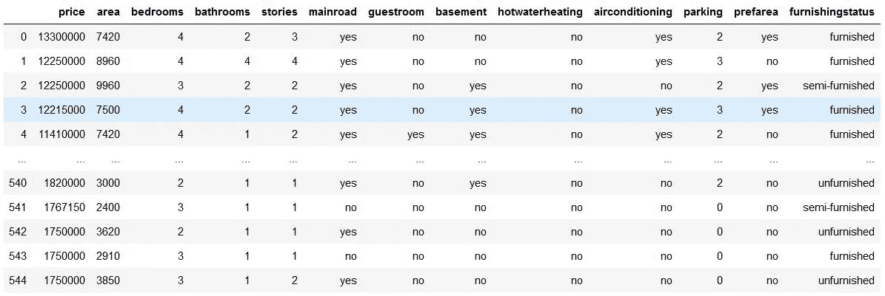

按作者分类的图像-样本数据集

让我们使用`.info()`查看数据集中的任何空值，并且我们必须使用`.describe()`检查任何异常值。

输出是，

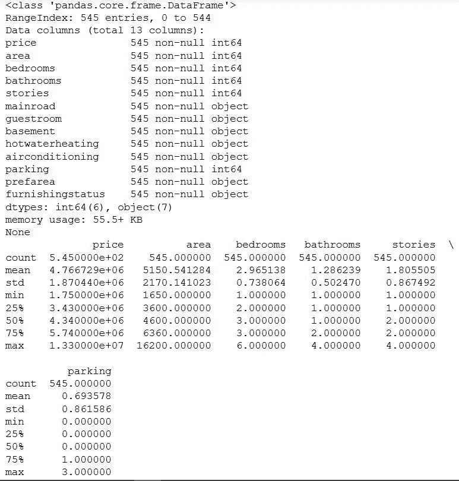

按作者分类的图像-检查空值和异常值

请注意，数据中没有空值，数据中也没有异常值。

## 数据准备

如果我们观察数据集，会发现有数值和值为“是”或“否”的列。但是为了拟合回归线，我们需要数值，因此我们将“是”和“否”转换为 1 和 0。

现在让我们看看数据集，

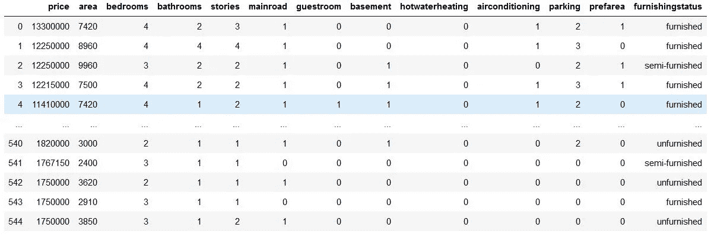

按作者分类的图像—将类别变量转换为数字变量

`furnishingstatus`列有三个级别`furnished`、`semi_furnished`和`unfurnished`。

我们还需要将这个列转换成数字。为此，我们将使用`dummy`变量。

当您有一个带有`n-levels`的分类变量时，创建虚拟变量的想法是构建`‘n-1’ variables`，指示级别。

我们可以在 pandas 中使用`get_dummies`方法创建一个虚拟变量。

让我们看看`furnishstatus`列在数据集中是什么样子。

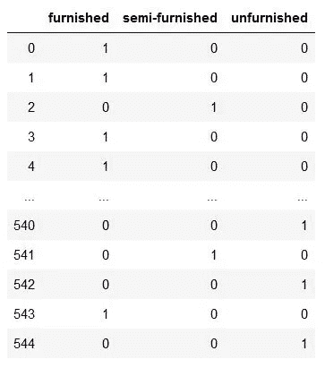

作者图片—提供状态 `column into dataset`

现在，我们不需要三列。我们可以删除`furnished`列，因为它可以用最后两列值来标识，其中:

*   `00`将对应于`furnished`
*   `01`将对应于`unfurnished`
*   `10`将对应于`semi-furnished`

让我们删除`furnished`列，并将状态数据集添加到原始数据集中。之后，我们将从数据集中删除`furnishstatus`列。

修改后的数据集看起来像，

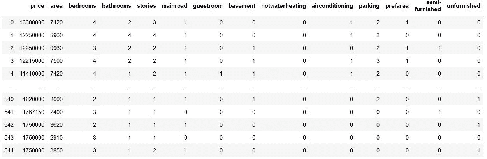

按作者分类的图像-添加虚拟变量后的样本数据集

现在让我们建立模型。正如我们在 [**简单线性回归**](/simple-linear-regression-model-using-python-machine-learning-eab7924d18b4) 模型文章中看到的，第一步是将数据集拆分成训练和测试数据。

## 将数据分成两个不同的集合

我们将以 7:3 的比例将数据分成两个数据集。

## 重新缩放特征

我们可以看到，除了`area`列之外，数据集中的所有列都具有较小的整数值。因此，重要的是重新调整变量，使它们都有一个可比较的范围。如果我们没有相对比例，那么与其他系数相比，一些回归模型系数将具有不同的单位。

为此，我们使用`MinMax`缩放方法。

训练数据集看起来像这样，

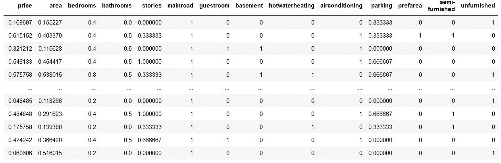

按作者分类的图像-重新缩放后的训练数据集

## 构建线性模型

在建立模型之前，我们需要将数据分为 X 和 Y 两个集合。

首先，我们将除目标变量之外的变量添加到模型中。

**将所有变量添加到模型中**

该模型的总结是，

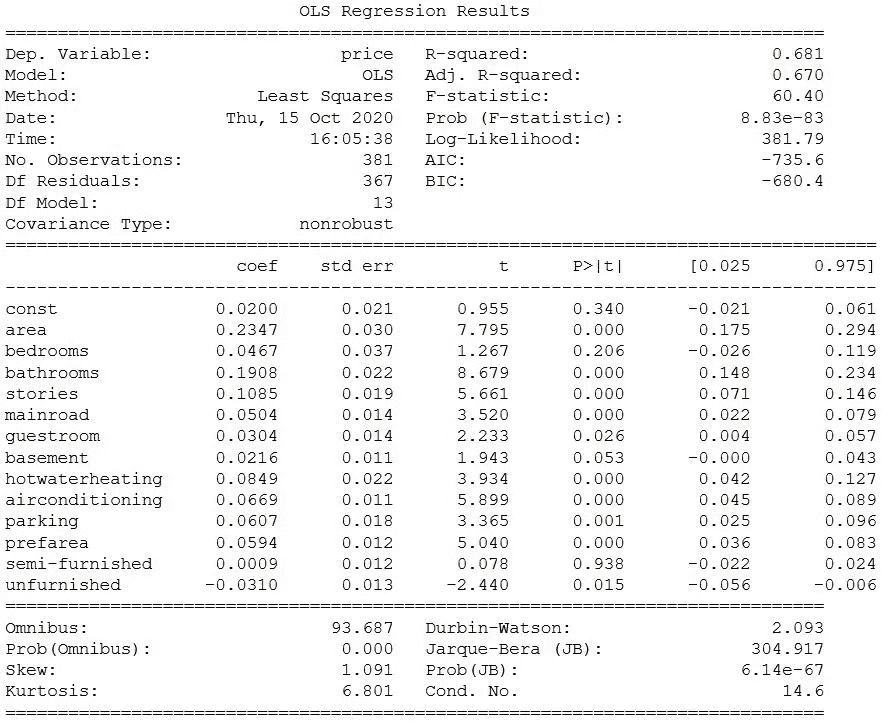

按作者分类的图片-模型摘要

如果我们观察一些变量的`p-values`，这些值似乎很高，这意味着它们并不重要。这意味着我们可以从模型中去掉这些变量。

在丢弃变量之前，如上所述，我们必须看到变量之间的`multicollinearity`。我们通过计算 **VIF** 值来实现。

**方差膨胀因子**或 **VIF** 是一个量化值，表示特征变量之间的相关程度。这是检验我们的线性模型的一个极其重要的参数。`VIF`的公式为:

`VIF = 1/(1-Ri²)`

在 python 中，我们可以通过从`statsmodels`导入`variance_inflation_factor`来计算 VIF 值

每列的 VIF 值是，

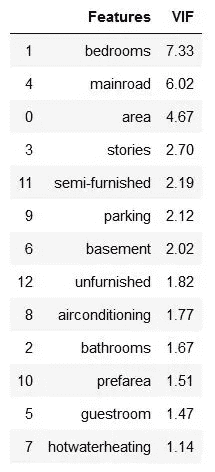

按作者分类的图片-每个变量的 VIF 值

我们认为变量通常有一个值<5\. If we observe the above image clearly, there are some variables we need to drop.

While dropping the variables, the first preference will go to the 【 . Also, we have to drop one variable at a time.

**丢弃变量并更新模型**从总结和 VIF 中可以看出，一些变量仍然是无关紧要的。其中一个变量是`semi-furnished`，因为它具有非常高的 p 值`0.938`。让我们继续下去，放弃这个变量。

新创建的模型的概要是，

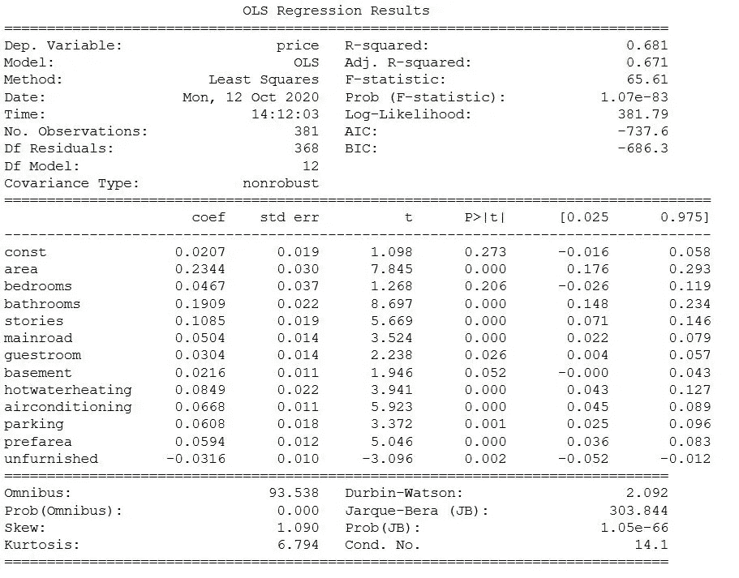

作者图片—删除`semi-furnished`变量后的模型摘要

现在，让我们计算新模型的 VIF 值。

新模型的 VIF 值是，

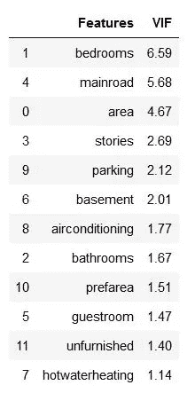

作者提供的图片—丢弃半装配色谱柱后的新 VIFs

现在，变量`bedroom`具有高 VIF `(6.6)`和 p 值`(0.206)`。因此，它没有多大用处，应该从模型中删除。我们将重复和以前一样的过程。

模型的总结，

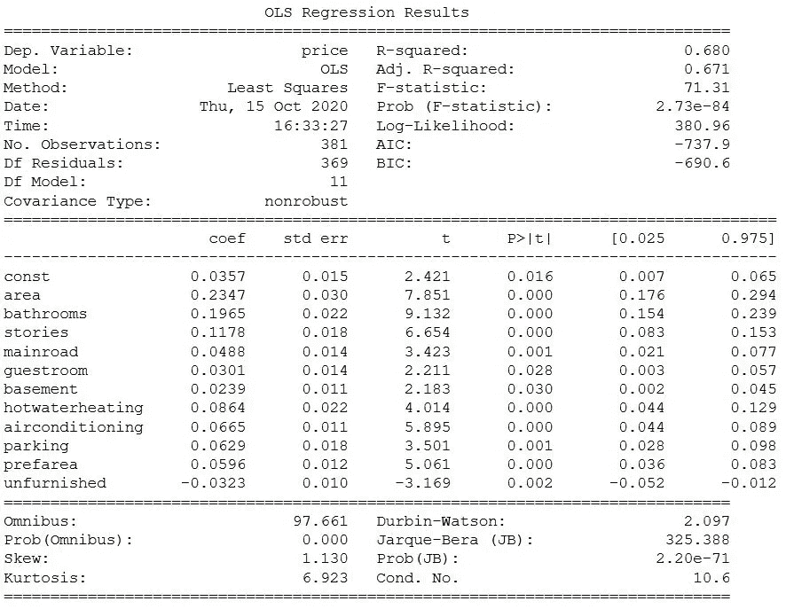

按作者分类的图片-模型摘要

下一步是计算 VIF，

VIF 值如下所示，

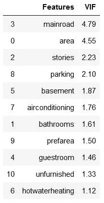

作者图片-删除卧室栏后的 VIF 值

我们将重复这个过程，直到每一列的`p-value is <0.005`和`VIF is <5`

在一个接一个地去掉所有必要的变量之后，最终的模型将会是，

最终模型的概要看起来像，

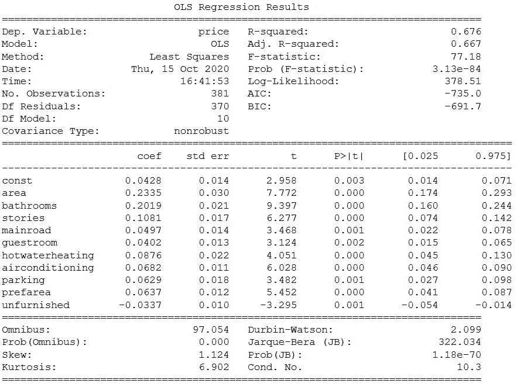

作者提供的图片——删除所有必要变量后的最终模型

最终模型的 VIFs 是，

VIF 值如下所示，

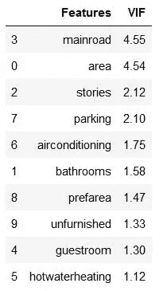

作者图片—最终模型的 VIF 值

我们可以看到，`p-value`和`VIF`都在可接受的范围内。现在是我们继续使用最终模型进行预测的时候了。这就是我们选择`Feature variables`的方式，我们之前已经讨论过了。

现在，在进行预测之前，我们必须看看`error terms`是否正态分布。我们将通过使用`Residual Analysis`来做到这一点。

`Error-terms = y_actual - y_predicted`

实际 y 值与使用该特定 x 值的模型预测的 y 值之间的差异就是误差项。

## 训练数据的残差分析

我们要检查误差项是否正态分布(这是线性回归的主要假设之一)；让我们画出误差项的直方图。

直方图如下所示，

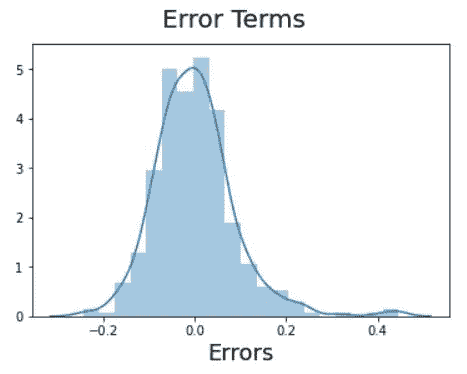

按作者分类的图像-错误术语直方图

正如我们所见，误差项非常接近正态分布。因此，我们可以继续使用测试数据集中的模型进行预测。

## 使用最终模型进行预测

我们拟合了模型并检验了误差项的正态性。让我们使用最终模型进行预测。

类似于训练数据集。首先，我们必须缩放测试数据。

测试数据集看起来像这样，

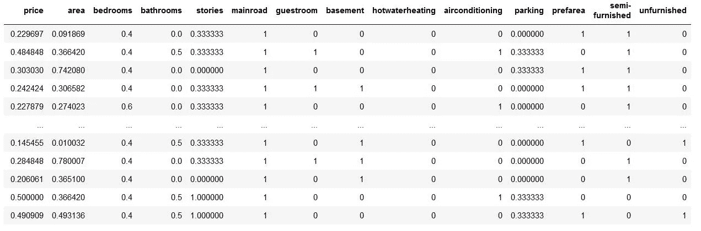

按作者分类的图像-测试数据集

将测试数据分为 X 和 Y，之后，我们将根据我们的模型从测试数据中删除不必要的变量。

现在，我们必须看看最终预测的模型是否是最佳拟合的。为此，我们将计算预期测试模型的 R 值。

我们通过从`sklearn`导入`r2_score`库来做到这一点

测试数据的 R 值= 0.660134403021964，
训练数据的 R 值= 0.667；我们可以从上面的最终模型总结中看到价值。

因为训练和测试数据的 R 值几乎相等，所以我们建立的模型是最适合的模型。

这是一种建立多元线性回归模型的过程，我们手动选择和删除变量。还有一个过程叫做**递归特征消除(RFE)。**

## 递归特征消除(RFE)

RFE 是一个自动过程，我们不需要手动选择变量。我们遵循与之前相同的步骤，直到**重新缩放特征**和**将数据分成 X 和 y。**

我们将使用来自`**sklearn**`的`**LinearRegression**` 函数用于 RFE(这是来自`sklearn`的一个实用程序)

我们必须跑 RFE。在代码中，我们必须提供 RFE 在构建模型时必须考虑的变量数量。

上面代码的输出是，

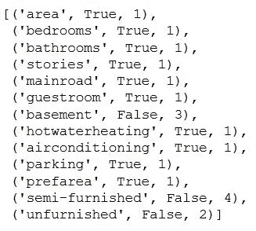

按作者分类的图像-所有变量的 RFE 值

正如我们所看到的，显示`True`的变量对于模型是必不可少的，而`False`变量是不需要的。如果我们想将`False`变量添加到模型中，那么也有一个与它们相关联的等级来按照这个顺序添加变量。

## 建筑模型

现在，我们使用`statsmodel`建立模型，进行详细的统计。

该模型的总结是，

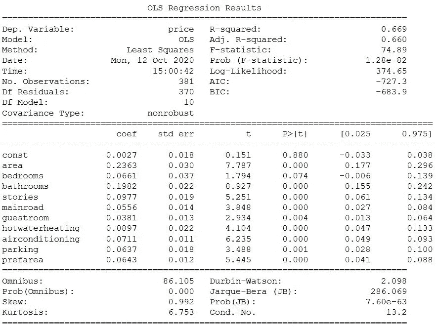

作者图片—初始模型摘要

由于`bedrooms`列对于其他变量来说无关紧要，因此可以将其从模型中删除。

删除`bedroom`变量后的模型摘要

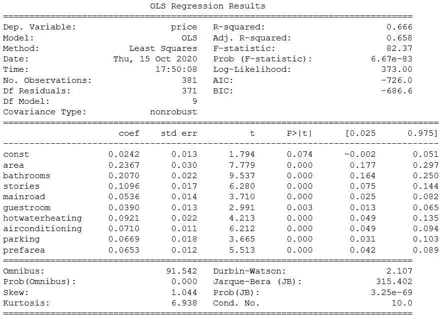

作者图片-删除卧室栏后的模型摘要

现在，我们计算模型的 Vif。

上述代码的 VIF 值是，

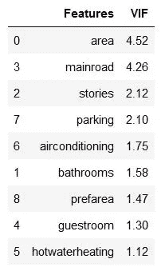

作者图片— VIF 价值观

由于 p 值和 VIF 在理想范围内，我们将继续进行分析。

下一步是误差项的残差分析。

## 残差分析

因此，让我们使用直方图来检查误差项是否也呈正态分布。

直方图看起来像，

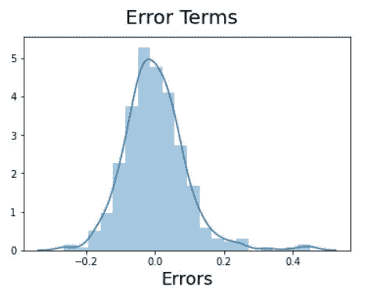

作者图片

## 根据测试数据评估模型

对测试集应用缩放并将数据分成 X 和 y。

之后，我们来评估模型，

测试数据的 R 值= 0.6481740917926483，这与训练数据非常相似。

因为训练和测试数据的 R 值几乎相等，所以我们建立的模型是最适合的模型。

# 结论

我们在机器学习中手动建立了一个基本的多元线性回归模型，并使用了自动 RFE 方法。大多数时候，我们使用多元线性回归而不是简单的线性回归模型，因为目标变量总是依赖于多个变量。

因此，了解多元线性回归在机器学习中的工作方式至关重要，如果不知道简单的线性回归，理解多元线性回归模型是很有挑战性的。

**感谢您阅读**和**快乐编码！！！**

# 点击这里查看我以前的文章

*   [**使用 Python 的简单线性回归模型:机器学习**](/simple-linear-regression-model-using-python-machine-learning-eab7924d18b4)
*   [**线性回归模型:机器学习**](/linear-regression-model-machine-learning-9853450c8bce)
*   [**探索性数据分析(EDA): Python**](/exploratory-data-analysis-eda-python-87178e35b14)
*   [**中心极限定理(CLT):数据科学**](/central-limit-theorem-clt-data-science-19c442332a32)
*   [**推断统计:数据分析**](/inferential-statistics-data-analysis-e59adc75c6eb)
*   [**Seaborn:Python**](/seaborn-python-8563c3d0ad41)
*   [**熊猫:蟒蛇**](https://levelup.gitconnected.com/pandas-python-e69f4829fee1)
*   [**Matplotlib:Python**](https://levelup.gitconnected.com/matplotlib-python-ecc7ba303848)
*   [**NumPy: Python**](https://medium.com/coderbyte/numpy-python-f8c8f2bbd13e)

# 参考

*   **多元线性回归:**【https://acadgild.com/blog/multiple-linear-regression】T42
*   **ML |多元线性回归:**[https://www . geeks forgeeks . org/ML-Multiple-Linear-Regression-using-python/](https://www.geeksforgeeks.org/ml-multiple-linear-regression-using-python/)
*   **多元线性回归:**[https://www . coursera . org/lecture/machine-learning-with-python/Multiple-Linear-Regression-0y8Cq](https://www.coursera.org/lecture/machine-learning-with-python/multiple-linear-regression-0y8Cq)
*   **多元线性回归:**[https://www . tutorialspoint . com/machine _ learning _ with _ python/machine _ learning _ with _ python _ Multiple _ Linear _ Regression . htm](https://www.tutorialspoint.com/machine_learning_with_python/machine_learning_with_python_multiple_linear_regression.htm)