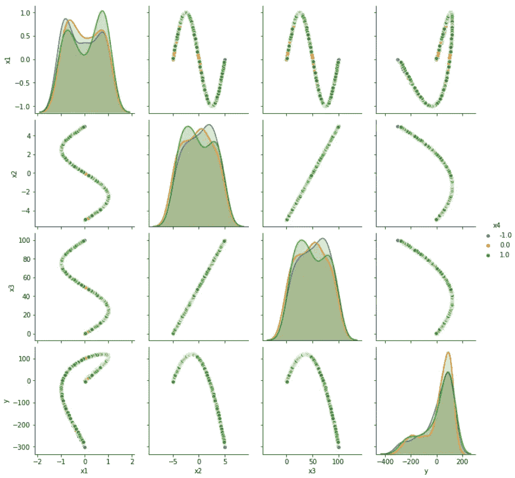
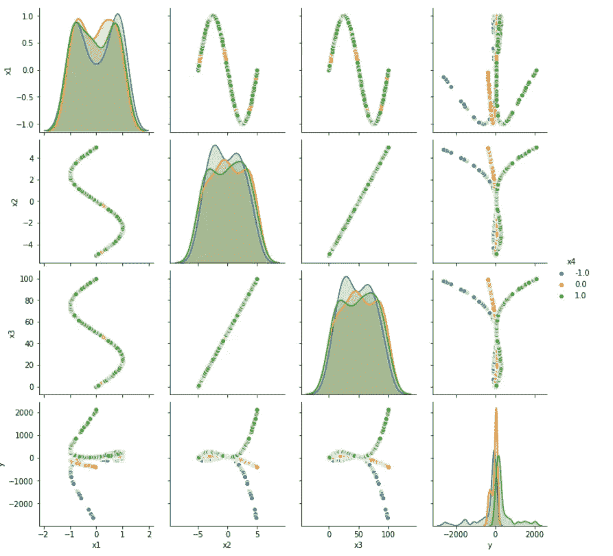
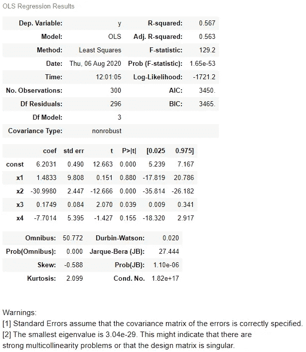
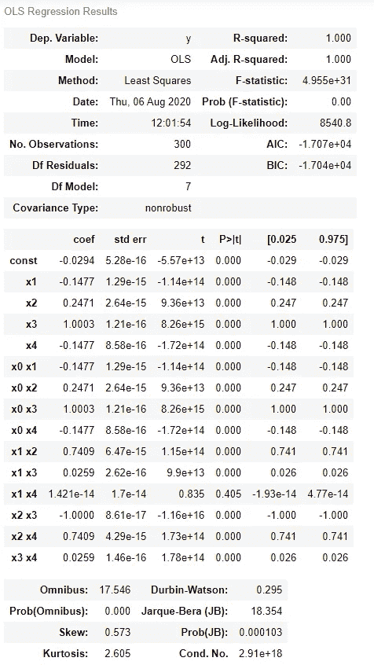
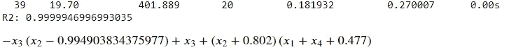
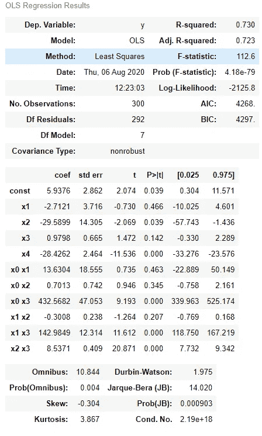
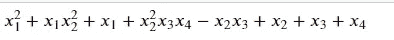
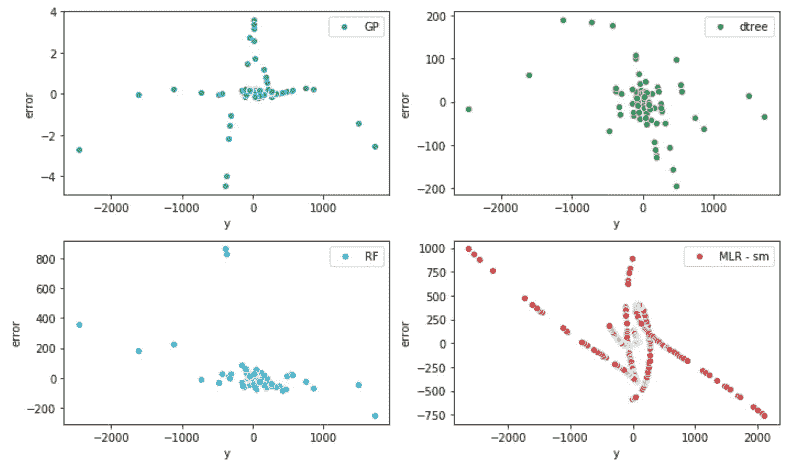

# 遗传编程揭示的多重线性回归与交互作用

> 原文：<https://towardsdatascience.com/multiple-linear-regression-with-interactions-unveiled-by-genetic-programming-4cc325ac1b65?source=collection_archive---------3----------------------->

## 当有更多的变量和变量之间的交互时，如何使用最常见的 python 库处理线性回归，以及使用遗传编程的新方法，这极大地改善了结果。


约翰·莫塞斯·鲍恩在 [Unsplash](https://unsplash.com?utm_source=medium&utm_medium=referral) 上拍摄的照片

我们都有一些线性回归的经验。这是最常用的回归技术之一。为什么？因为它很容易解释，也很容易实现。但是当你有不止一个变量时会发生什么呢？你如何处理这种增加的复杂性，并且仍然像这样使用一个容易理解的回归？如果系统更加复杂，会发生什么？让我们想象一下当两个变量相互作用时。

这就是多元线性回归发挥作用的地方，我们将看到如何使用 python 中一些方便的库来处理交互。最后，我们将尝试用符号回归来处理同样的问题，我们将享受随之而来的好处！

如果你想重温一下线性回归，有很多可用的资源，我还写了一个[简介和代码](https://medium.com/analytics-vidhya/linear-regression-in-python-from-scratch-with-scipy-statsmodels-sklearn-da8e373cc89b)。符号回归呢？在本文中，我们将使用 [gplearn](https://gplearn.readthedocs.io/en/stable/) 。查看它的文档以获得更多信息，或者，如果你喜欢，查看我的另一篇关于如何在 python 中使用复杂函数的文章[这里](https://medium.com/analytics-vidhya/python-symbolic-regression-with-gplearn-cbc24dbbc271)。

## 数据准备

我们将探索回归的两个用例。在第一种情况下，我们只有四个变量(x1 到 x4 ),加上一些预定的相互作用:x1*x2，x3*x2 和 x4*x2。

注意，在我们的数据集“out_df”中，我们没有交互项。我们要做的是尝试用我们的工具发现这些关系。这是我们用 seaborn 绘制变量时的样子，使用 x4 作为色调(图 1):



图 1:一阶相互作用:数据框架变量对绘图



图 2:二阶相互作用:数据帧对绘图；

第二种情况(图 2)的 y 由下式给出:

```
y_true = x1+x2+x3+x4+ (x1*x2)*x2 - x3*x2 + x4*x2*x3*x2 + x1**2
```

相当复杂的场景！

## 案例 1:多元线性回归

第一步是更好地理解这些关系，因此我们将尝试我们的标准方法，并对此数据集进行多元线性回归。我们将为此使用统计模型。在图 3 中，我们有 OLS 回归的结果。

```
import statsmodels.api as sm Xb = sm.add_constant(out_df[['x1','x2','x3','x4']])
mod = sm.OLS(y_true, Xb)
res = mod.fit()
res.summary()
```



图 3:统计模型的拟合总结。

哎哟，这显然不是我们希望的结果。r 仅为 0.567，此外，我惊讶地发现 x1 和 x4 的 P 值高得令人难以置信。我们需要一些不同的策略。

## 多项式特征

我们可以做的是从 sklearn 导入一个名为**多项式特征**的 python 库，它将生成多项式和交互特征。例如，如果输入样本是二维的并且形式为[a，b ]，则 2 次多项式特征为[1，a，b，a，ab，b]。

```
from sklearn.preprocessing import PolynomialFeatures
import scipy.specialpoly = PolynomialFeatures(interaction_only=True)
X_tr = poly.fit_transform(Xb)
Xt = pd.concat([Xb,pd.DataFrame(X_tr,columns=poly.get_feature_names()).drop([‘1’,’x0',’x1',’x2',’x3',’x4'],1)],1)
```

当“interaction_only=True”时，仅产生交互特征:最多为`degree` *个不同的*个输入特征的乘积的特征(因此不是`x[1] ** 2`、`x[0] * x[2] ** 3`等)。).默认的度数参数是 2。

使用和以前一样的代码，但是现在使用 **Xt** ，产生下面的结果。

```
mod = sm.OLS(y_true, Xt)
res = mod.fit()
res.summary()
```



图 4:带插值的 statsmodels 回归结果。

现在图 4 中的 R 是 1，这是完美的。太完美而不完美？事实上，在汇总统计数据中有很多交互术语。有些我们甚至不知道。我们的方程是这样的:
y = x₁+05*x₂+2*x₃+x₄+x₁*x₂—x₃*x₂+x₄*x₂
所以我们的拟合引入了我们在函数中没有明确使用的相互作用。即使我们除去那些高 p 值的国家(x₁ x₄)，我们还是会有一个复杂的情况。这可能是一个一般化的问题。我们可以利用基因编程给我们一些建议。

## 遗传编程:GPlearn

通过遗传编程，我们基本上是在告诉系统尽最大努力以分析的形式在我们的数据中找到关系。如果你读了另一个教程，我在这里调用的一些函数会更清楚。然而，我们主要想做的是从 gplearn.genetic 导入 SymbolicRegressor，我们将使用 sympy 来格式化我们的方程。
既然我们已经完成了，我们还将导入 RandomForest 和 DecisionTree 回归器，以便稍后比较所有这些工具的结果。下面的代码来让它工作:

转换器字典可以帮助我们用相应的 python 函数映射方程，让 simpy 完成它的工作。我们还对我们的数据进行 train_test 分割，这样我们就可以单独比较我们对测试数据的预测。我们定义了一个函数集，其中使用了 gplearn 集合中的标准函数。
在第 40 代，代码停止，我们看到 R 几乎是 1，而生成的公式现在非常容易阅读。



图 5: gplearn 结果

如果你将它与我们实际使用的公式进行比较，你会发现它非常匹配，重构我们的公式变成:

y =-x₃(x₂–2)+x₂(x₁+x₄+0.5)+x₁+x₄

所有算法在这项工作中都表现良好。

```
statsmodels OLS with polynomial features 1.0, 
random forest 0.9964436147653762, 
decision tree 0.9939005077996459, 
gplearn regression 0.9999946996993035
```

## 案例 2:二阶相互作用

在这种情况下，随着交互顺序的增加，关系变得更加复杂:

```
X = np.column_stack((x1, x2, x3, x4))y_true = x1+x2+x3+x4+ (x1*x2)*x2 - x3*x2 + x4*x2*x3*x2 + x1**2out_df['y'] = y_true
```

我们的步骤与第一种情况基本相同，但这里我们已经从多项式特征开始:

```
poly = PolynomialFeatures(interaction_only=True)
X_tr = poly.fit_transform(out_df.drop('y',1))
Xt = pd.concat([out_df.drop('y',1),pd.DataFrame(X_tr,columns=poly.get_feature_names()).drop(['1','x0','x1','x2','x3'],1)],1)Xt = sm.add_constant(Xt)
mod = sm.OLS(y_true, Xt)
res = mod.fit()
res.summary()
```



图 6:案例 2 的 statsmodels 总结

在这种情况下，我们的方法不再有回报。很明显，我们的数据集中没有正确的预测值。我们可以使用多项式特征来研究更高阶的相互作用，但维数可能会增加太多，我们将不会获得比以前更多的知识。此外，如果你有一个真实的数据集，你不知道目标的公式，你会增加相互作用的顺序吗？我猜不是！

在下面的代码中，我们再次使用决策树和随机森林算法来拟合和预测数据集，但也使用了 gplearn。

```
X_train, X_test, y_train, y_test = train_test_split(out_df.drop('y',1), y, test_size=0.30, random_state=42)est_tree = DecisionTreeRegressor(max_depth=5)
est_tree.fit(X_train, y_train)
est_rf = RandomForestRegressor(n_estimators=100,max_depth=5)
est_rf.fit(X_train, y_train)y_gp = est_gp.predict(X_test)
score_gp = est_gp.score(X_test, y_test)
y_tree = est_tree.predict(X_test)
score_tree = est_tree.score(X_test, y_test)
y_rf = est_rf.predict(X_test)
score_rf = est_rf.score(X_test, y_test)
y_sm = res.predict(Xt) est_gp.fit(X_train, y_train)
print('R2:',est_gp.score(X_test,y_test))
next_e = sympify((est_gp._program), locals=converter)
next_e
```

结果是不可思议的:40 代之后，我们又一次得到了令人难以置信的高 R，甚至更好的是一个简单的解析方程。


图 7:上一代，R 和解析公式。

原来的公式是这样的:



所以我们看到，在涉及 x1 及其相互作用的术语上，确实存在差异。而不依赖于它的项则完全存在。然而，如果与多项式特征方法相比，我们在这里处理的是一个简单得多的公式。

不同系统的误差是多少？嗯，对于 gplearn 来说，如果和其他公司相比，这个数字低得令人难以置信。图 8 显示了 y 坐标相对于实际 y 坐标的误差。当 x 轴被共享时，你可以注意到 y 轴变得多么不同。GPlearn 的最大误差约为 4，而其他方法可以显示高达 1000 的峰值。



图 8:用作 y 函数的不同方法的误差图。图例显示了方法。

## 结论

在本文的第一部分，我们看到了如何处理存在交互的多元线性回归。我们使用 statsmodels OLS 进行多元线性回归，使用 sklearn 多项式特征生成交互作用。然后，我们用一种不同的算法来处理同一问题，即遗传编程，它易于导入和实现，并给出了一个解析表达式。

在第二部分中，我们看到当事情变得混乱时，我们在使用标准工具时会有一些不确定性，即使是那些来自传统机器学习的工具。然而，使用 gplearn 更容易面对这类问题。有了这个库，我们可以直接得到问题的解析公式。

## 参考

[1][stats models](https://www.statsmodels.org/stable/index.html)
【2】[sk learn 多项式特性](https://scikit-learn.org/stable/modules/generated/sklearn.preprocessing.PolynomialFeatures.html)
【3】[gp learn](https://gplearn.readthedocs.io/en/stable/)