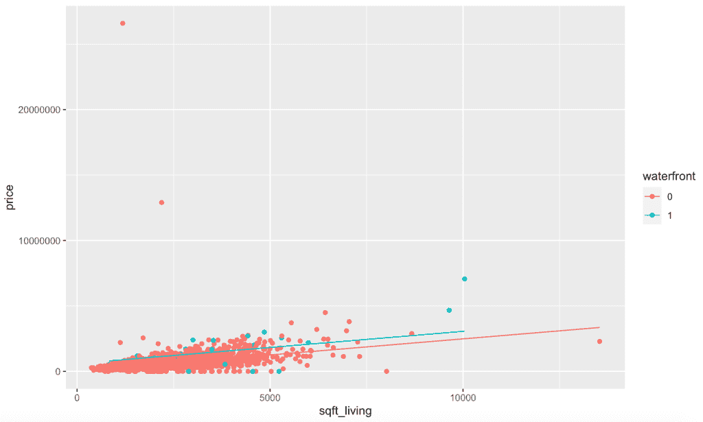
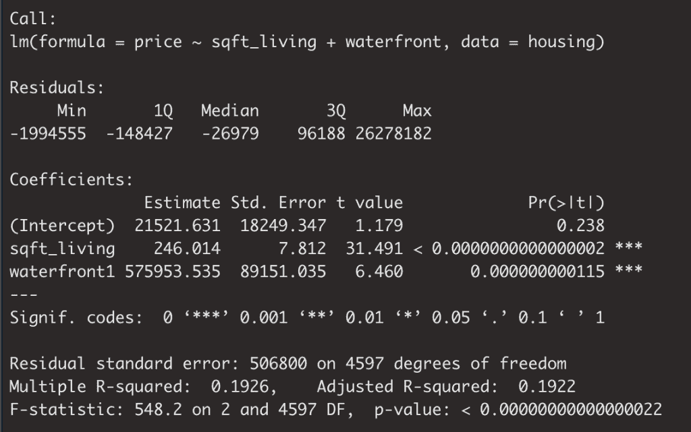

# 学习多元回归:平行斜率模型入门

> 原文：<https://towardsdatascience.com/multiple-regression-a-primer-on-parallel-slopes-models-137d114e314e?source=collection_archive---------41----------------------->


图片由 [Elias Sch 提供。](https://pixabay.com/users/EliasSch-3372715/?utm_source=link-attribution&utm_medium=referral&utm_campaign=image&utm_content=2966569)来自 [Pixabay](https://pixabay.com/?utm_source=link-attribution&utm_medium=referral&utm_campaign=image&utm_content=2966569)

# 介绍

不管你对数据科学和统计世界有多了解，在某个时候，你可能至少听说过回归。作为多元回归快速课程的前奏，您应该对简单线性回归有所了解。如果不是，可以[从这里开始](/build-evaluate-and-interpret-your-own-linear-regression-model-in-minutes-e6a3e8253501)！否则，让我们开始多元线性回归。

我们在简单线性回归和多元线性回归之间的区别仅仅是帮助我们理解因变量的解释变量的数量。

多元线性回归是数据科学家非常流行的统计技术，也是数据科学家使用的许多更复杂方法的基础。

# 多元线性回归

在我关于简单线性回归的[帖子](/build-evaluate-and-interpret-your-own-linear-regression-model-in-minutes-e6a3e8253501)中，我举了一个用一个数字变量——平方英尺来预测房价的例子。

让我们在已有成果的基础上继续努力。我们将构建相同的模型，只是这一次，我们将包括一个额外的变量。

```
fit <- lm(price ~  sqft_living + waterfront, 
   data = housing)
summary(fit)
```

与您之前看到的类似，我们通过平方饲料居住空间来预测价格，只是现在我们还包括一个滨水变量，请注意我们新变量的数据类型。

# 平行斜坡模型

我们刚刚创建了一个平行斜坡模型。平行斜率模型是多元线性回归模型的结果，该模型同时具有一个数字解释变量和一个分类解释变量。

由线性回归导出的公式是一条直线的方程。

`y = mx + b`

*   `y`是我们的因变量
*   `m`是分配给我们的解释变量的系数
*   `x`是解释变量的值
*   `b`是 y 轴截距

记住与直线方程的相似性；当我们试图仅根据卧室的数量来模拟房价时，我们推导出一个与`x`相关的系数和一个 y 截距，该截距通过最小化误差来最接近价格。

留给我们的问题是……当我们在回归公式中引入当前数值预测值之外的分类变量时，它是如何被处理或反映在模型的输出中的？

如果您曾经仅使用分类解释变量构建了一个简单的线性回归模型，您可能会对分类的不同级别上的组平均值的概念很熟悉，这些组平均值通知了分配的系数。你可以在这里阅读关于那个[更详细的解释。](/predicting-home-prices-using-regression-with-categorical-factors-b521a569788c)

在平行坡度模型中，分类变量的包含现在反映在 y 截距值的变化中。

你可能会问自己，为什么这些多元回归模型被称为平行斜率模型。

# 让我们建立一个模型

让我们创建一个模型的可视化，然后分解其含义！

首先，让我们建立我们的平行斜坡模型

```
fit <- lm(price ~  sqft_living + waterfront, 
   data = housing)
summary(fit)
```

然后，我们将在住房数据集中添加一个字段来表示我们的拟合值。

```
housing$pred_price <- predict(fit, housing)
```

现在我们可以想象了！

```
ggplot(housing, aes(x = sqft_living, y = price, col = waterfront)) + 
  geom_point()+
  geom_line(aes(y = price_pred))
```

请注意以下视觉效果。我们看到两条线分别代表我们对有无滨水区情况下`sqft_living`的每个值的预测。



我想在这里强调的关键点是，每个数据点都有相同的分配给`sqft_living`的系数，或者换句话说，相同的斜率。基于每条预测线的斜率，这是显而易见的，它们是平行的，因此我们知道斜率是相同的。

我们所看到的是，滨水区为正的情况比没有滨水区的情况要高。

让我们看一下模型摘要，以获得一些额外的背景信息。

```
summary(fit)
```



为了理解这里发生了什么，让我们首先考虑没有滨水部分的模型。所有记录都有相同的 y 截距，21，522，所有记录的`sqft_living`值都将乘以系数 246。

然后，将进一步区分滨水区值为“1”的记录的是，它们的 y 截距将增加滨水区 1 估计值的量-575，954。同样，两条记录具有相同的`sqft_living`，但是`waterfront`的值不同，只是 y 轴截距的增量值不同。

# 结论

在过去的几分钟里，我们讲述了以下内容:

*   多元回归的定义
*   多元回归和简单线性回归的区别
*   平行边坡模型的定义
*   如何建立自己的平行斜坡模型
*   平行斜坡模型是如何形成的

我希望这篇关于多元回归和平行斜率模型的文章对你有所帮助。

祝数据科学快乐！