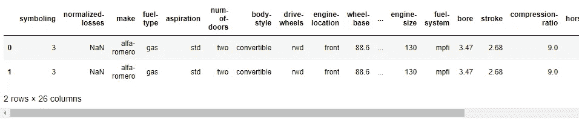

# 多元回归作为机器学习算法

> 原文：<https://towardsdatascience.com/multiple-regression-as-a-machine-learning-algorithm-a98a6b9f307b?source=collection_archive---------13----------------------->

## 使用 Sci-kit 学习模块在 Python 中完全实现


诺贝特·昆德拉在 [Unsplash](https://unsplash.com?utm_source=medium&utm_medium=referral) 上的照片

# 介绍

以前我写过几篇关于多元建模的文章，但它们都专注于时间序列预测。如果好奇，可以去看看[向量自回归](/multivariate-time-series-forecasting-653372b3db36)和[面板数据建模](/panel-data-regression-a-powerful-time-series-modeling-technique-7509ce043fa8)上的帖子。写多元回归(即多元线性回归)一直在我的清单上，但其他事情正在进行中——我开始了一个关于异常检测技术的系列！一旦开始那个系列，我就停不下来，直到我连续写了 [11 个帖子](/supervised-machine-learning-technique-for-anomaly-detection-logistic-regression-97fc7a9cacd4)。

今天我带着多元回归回来了，计划是这样的——首先我将从广义上定义什么是多元回归，然后列出一些真实世界的用例作为例子。第二部分是用 Python 快速实现多元回归，只是给出一个大概的直觉。在第三部分，我将按照典型的机器学习工作流程进行更深入的探讨。最后，在实现线性回归时，我要记住一些额外的要点

# 什么是多元回归？

在说**多元回归**之前先说一下**简单线性回归**。

简单线性回归有一个因变量，只有一个自变量。如果“收入”可以用个人的“教育”来解释，那么回归可以用简单的线性回归来表示，如下所示:

*收入= B0+B1 *学历+ e*

多元回归更进一步，不再是一个，会有两个或更多的自变量。如果我们在上面的等式中有一个额外的变量(假设“经验”)，那么它就变成了一个多元回归:

*收入= B0+B1 *学历+B2 *经验+ e*

# 用例

那么为什么多元回归有用，它们是如何在现实世界的数据科学中使用的呢？

基于回归的机器学习应用程序可以分为(至少)三个不同的问题领域:

1) *量化关系*:我们知道，通过相关性，我们可以发现两个变量之间关系的强度(用 0-1 之间的数字表示)和方向(正或负)。但是多元回归更进一步，实际上量化了这种关系。

*2)预测*:机器学习就是预测。由于回归具有量化关系的能力，我们可以将这种能力转化为解决预测问题。这意味着，如果我们知道一个人的教育水平和经验年限，我们应该能够使用回归方程(如上式)预测该个人的工资水平。

*3)预测*:多元回归的第三个问题域是用时间序列分析进行预测。[向量自回归](/multivariate-time-series-forecasting-653372b3db36)和[面板数据回归](/panel-data-regression-a-powerful-time-series-modeling-technique-7509ce043fa8)是两种使用多元回归原理的强大预测技术。

下面是多元回归的一些实际应用案例:

*   根据品牌、型号、年份、档位、mpg 和颜色预测二手车价格

*【品牌、型号、年份、档位、mpg】→汽车价格*

*   根据位置、地段大小、床位数量、浴室数量、社区特征等对市场上房屋价格的预测。

*【位置、地段大小、床位数量、浴室数量、犯罪率、学校评级】→房价*

*   根据历史数据预测未来收入，如广告支出、营销、客户特征等。

*[过去的广告支出美元、营销美元、订阅率] →时间 T 的收入*

现在是时候在数据科学家的笔记本上展示多元回归是如何工作的了。首先，我将通过消防演习给出一个直觉，然后再深入一点。如果你想跟进，你可以从 [UCI 机器学习库](https://archive.ics.uci.edu/ml/datasets/automobile)下载汽车数据集。

机器学习 ***目标*** 这里是根据二手车的特征来预测价格。

# 消防演习

## **1。导入库**

```
import pandas as pd
import numpy as np
from sklearn import linear_model
```

## **2。加载数据&选择功能**

```
# import data
df = pd.read_csv("../automobile.csv")# select features 
X = df[["horsepower", "highway-mpg"]]
y = df["price"]
```

## 3.建模

```
# instantiate model
model = linear_model.LinearRegression()# fit model
model.fit(X, y)
```

## 4.预言；预测；预告

```
# predicting price based 90 horsepower and 30 mpg
model.predict([[90, 30]])# predicted price
>> 11454.03
```

# 深潜

通过一个简单的例子，你可以直观地了解多元回归是如何根据两个特征预测二手车的价格的:马力和高速行驶的英里数。

但是我们生活的世界是复杂而混乱的。我上面展示的每个步骤都需要进一步扩展。例如，在步骤 2 中，我们导入数据并将特征分配给 *X，y* 变量，而没有做任何进一步的分析。但是谁不知道在任何机器学习项目中，光是数据争论就可以占据所有任务的 80%以上？

作为一名数据科学家，我不会详细介绍你在现实世界中遇到的每一种情况，但我会谈谈一些不可避免的基本问题。

## **1。导入库**

我将使用一些库和模块来完成一些强制性的任务。

*   数据角力:`pandas`和`numpy`
*   多元回归模型:`linear_model`来自`sklearn`
*   拆分培训和测试数据:`train_test_split`
*   型号评估:`r2_score`

```
import pandas as pd
import numpy as np
from sklearn import linear_model
from sklearn.model_selection import train_test_split
from sklearn.metrics import r2_score
```

## **2。数据争论**

首先，我在我的环境中读取数据集(顺便说一句，我使用的是 Jupyter notebook ),作为一种惯例，偷看前几行。

```
# import data
data = pd.read_csv("../automobile.csv")
data.head(2)
```



如您所见，有许多列勉强适合窗口。所以我要得到所有列的列表。

```
# all column name
data.columns>> 'symboling', 'normalized-losses', 'make', 'fuel-type', 'aspiration', 'num-of-doors', 'body-style', 'drive-wheels', 'engine-location', 'wheel-base', 'length', 'width', 'height', 'curb-weight', 'engine-type', 'num-of-cylinders', 'engine-size', 'fuel-system', 'bore', 'stroke', 'compression-ratio', 'horsepower', 'peak-rpm', 'city-mpg', 'highway-mpg', 'price'
```

(我不是汽车专家，所以我真的不知道其中一些列代表什么，但在现实世界的数据科学中，这不是一个好的借口，一些领域知识是必不可少的)。

作为数据探索和准备的一部分，我做了一些其他的事情(比如检查和转换数据类型，删除几行像“？”这样的符号)等等。)，但重申我之前的观点就足够了，即以正确的格式获取数据可能是一件非常棘手的事情。

## **3。准备输入数据**

我们想预测价格，所以因变量已经设定。接下来是使用哪些特征进行预测。理想情况下，我会包括初始模型中的所有功能，但对于这个演示，我选择 1 个分类功能(即品牌)和 2 个数字功能(即马力和公路里程),我认为大多数人在选择汽车时都会关心这些功能。

遵循 ML 惯例，我将自变量指定为 *X* ，因变量指定为 *y.*

```
# select data subset
df = data[["make", "horsepower", "highway-mpg", "price"]]# select data for modeling
X = df[["make", "horsepower", "highway-mpg"]]
y = df["price"]
```

我特意选择了一个分类变量(即 make)来强调您需要做一些额外的工作来将其转换成机器可读的格式(也就是数字！).有几种方法可以做到这一点，例如使用[标签编码器](https://scikit-learn.org/stable/modules/generated/sklearn.preprocessing.LabelEncoder.html)或[一个热编码器](https://scikit-learn.org/stable/modules/generated/sklearn.preprocessing.OneHotEncoder.html)——两者都可以在`sklearn`模块中获得。但是我将使用经典的“虚拟变量”方法，这种方法将分类特征转换为数值二分变量(0 和 1)。

在这个阶段，我还将数据分为训练集和测试集，用于模型评估。

```
# create dummy variables
make_dummy = pd.get_dummies(X["make"], drop_first = True)
X = X.drop("make", axis = 1)
X = pd.concat([X, make_dummy], axis = 1)# split data into train and test
X_train, X_test, y_train, y_test = train_test_split(X, y, test_size = 0.3, random_state = 0)
```

## 4.模型结构

想到在整个复杂的机器学习管道中最简单的部分是(在我看来当然是！)实际指定型号。和大多数 ML 算法一样，这只是三个简单的步骤*实例化—拟合—预测*。当然，您必须对模型进行参数化，并对其进行多次迭代，直到您得到满足您的标准的模型，但是，模型构建过程的这一步仍然是最让我头疼的。

```
# instantiate 
model = LinearRegression()
# fit
model.fit(X_train, y_train)
# predict
y_pred = model.predict(X_test)
```

## 5.模型评估

现在到了关键时刻——这个模型表现如何？评估模型性能的方法有很多，但在经典统计学中，线性回归模型的性能是用 R 来评估的，R 的值介于 0 和 1 之间，R 越高，模型越好。

```
# model evaluation
score = r2_score(y_test, y_pred)
print(score)# score
>> 0.8135478081839133
```

在我们的演示中，我们得到的 R 值为 0.81，这意味着因变量(即二手车价格)的 81%的变化可以由三个自变量(即品牌、马力和公路里程)来解释。当然，可以通过包含更多变量、尝试不同的变量组合以及调整模型参数来改进这一指标——这是单独讨论的主题。

# 附加清单

我觉得我可以永远写多元回归，有这么多领域要涵盖，但我必须在某个地方停下来。在为现实世界的应用程序开发构建线性回归模型时，需要记住以下几点:

*   选择特征时，分别检查因变量和每个自变量之间的相关性。如果它们不相关，则从模型中移除该特征；
*   检查多重共线性，独立变量之间的关系。移除相关特征以避免模型过度拟合；
*   有几种方法可以为模型选择变量。正向选择和反向淘汰就是其中的两种。顾名思义，在这个过程中，您一次添加或删除一个变量，并检查模式性能；
*   我使用 R 进行模型性能评估，但有些人选择其他指标，如 AIC、BIC、p 值等。

# 总结和最后的思考

概括一下:

*   多元回归是一种机器学习算法，通过两个或多个预测器来预测因变量。
*   多元回归在三个问题领域中有许多实际应用:检查变量之间的关系，进行数值预测和时间序列预测。
*   如果您已经为模型构建做好了一切准备，那么它的实现就像“防火练习”中演示的 4 个简单步骤一样简单。然而，真正艰苦的工作是与数据争论，并通过迭代过程找到正确的模型。

我希望这是一个有用的职位。如果你有意见，请随意写在下面。你可以在 [Medium](https://medium.com/@mab.datasc) 、 [Twitter](https://twitter.com/DataEnthus) 或 [LinkedIn](https://www.linkedin.com/in/mab-alam/) 上关注我。