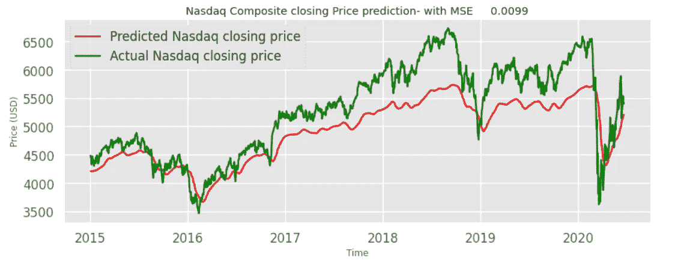
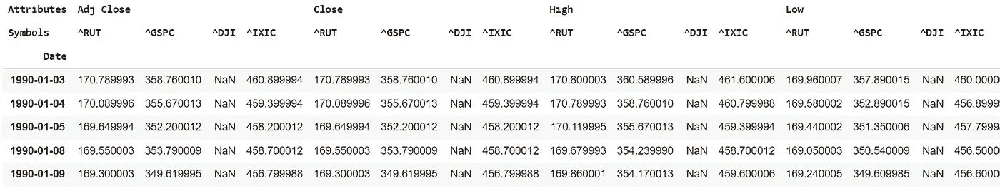
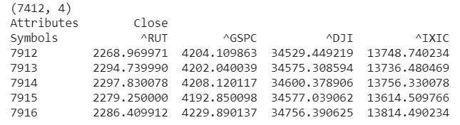
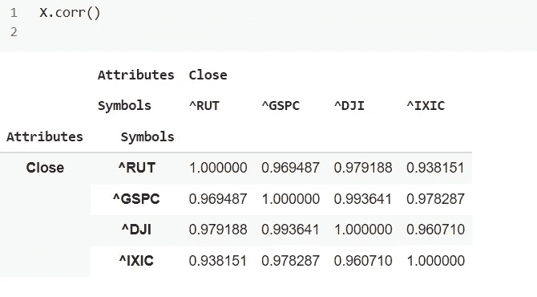
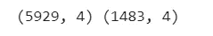
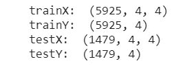
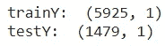
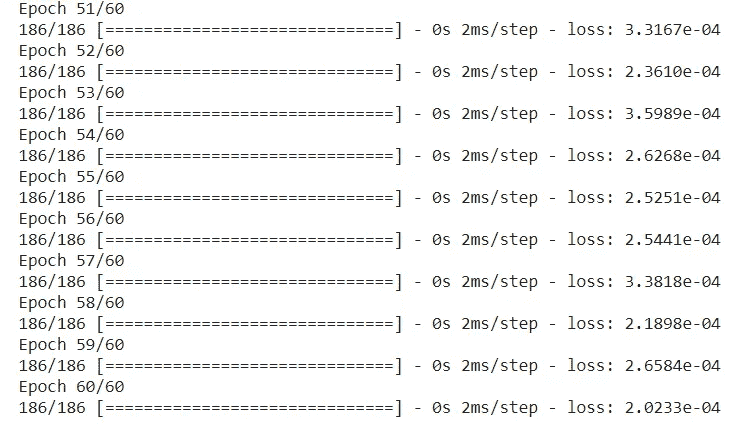
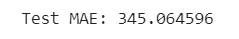
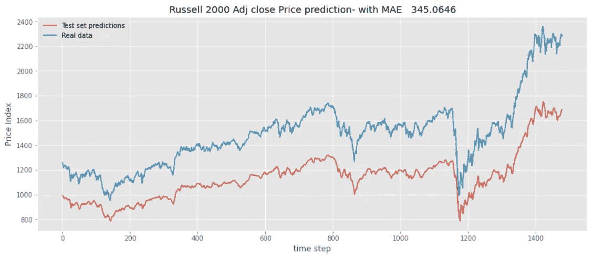

# 用神经网络预测多个时间序列

> 原文：<https://towardsdatascience.com/multiple-stock-prediction-using-deep-learning-network-d19a7acd8551?source=collection_archive---------13----------------------->

## 多股票指数单神经网络

## 利用 LSTM 进行时间序列预测



作者图片

[https://sarit-maitra.medium.com/membership](https://sarit-maitra.medium.com/membership)

S 股票预测是一项艰巨的任务，因为产生的数据量巨大且高度非线性。建模这样的动态数据需要有效的建模技术，可以分析隐藏的模式和潜在的动态。神经网络是一种深度学习算法，能够通过自我学习过程识别和利用数据中存在的相互作用和模式。

我们将集中讨论一个简单的预测模型，该模型使用包含多个时间序列的长短期记忆结构。为了便于说明和更好地理解，我们将把整个练习保持为一个简单的过程。

让我们考虑四个不同的系列标准普尔 500 指数(^GSPC)、道琼斯工业平均指数(^DJI)、纳斯达克综合指数(^IXIC)和罗素 2000 指数(^RUT)，也就是芝加哥期权。我们的数据是从 1990 年至今。从 yahoo finance 检索到的数据被格式化为 Pandas DataFrame 对象。

```
stock = ['^RUT', '^GSPC', '^DJI', '^IXIC' ]
start = pd.to_datetime('1990-01-03')
df = web.DataReader(stock, data_source = 'yahoo', start = start )
print(df.head())
```



让我们在一个神经网络结构中拟合该系列的所有收盘价，并从那里预测一个系列。

```
X = data.copy()
X = X.drop(columns = [‘Date’])
print(X.shape)
print(X.tail())
```



如果我们看到相关性分析，我们就会知道为什么选择这 4 个系列。



## 数据分割:

该时间序列分为训练集(80%)和测试集(20%)，如下所示。

```
split_ratio = 0.2
X = X.values # Convert to NumPy array
split = int(len(X) * (1-split_ratio))
train_set = X[: split]
test_set = X[split:]
print(train_set.shape, test_set.shape)
```



## 监督学习:

让我们以这样的方式格式化，监督学习可以应用于 ML 模型。这里，训练集和测试集将经历相同的转换。我们将实现以下功能的目标。

```
def supvervisedSeries(data, n, h):
  x, y = list (), list ()
  for i in range (len(data)-n-h+1):
    x.append(data[i:(i+n)])
    y.append(data[i+h+n-1])
  return np.array(x), np.array(y)h = 1
n = 4
trainX, trainY = supvervisedSeries(training_set, n, h)
testX, testY = supvervisedSeries(test_set, n, h)
print("trainX: ", trainX.shape)
print("trainY: ", trainY.shape)
print("testX: ", testX.shape)
print("testY: ", testY.shape)
```

h =时间范围& n =特征数量；这些参数是在转换之前选择的。



现在，trainY 和 testY 必须按照所需的特征预测进行修改，因为默认情况下它包含所有 4 个特征。

```
testY = np.reshape(testY[:, 0], (testY [:, 0].shape[0], 1))
trainY = np.reshape(trainY[:, 0], (trainY[:, 0].shape[0], 1))
print(“trainY: “, trainY.shape)
print(“testY: “, testY.shape)
```



在这里，我们选择了指数[0]，这是^RUT 每日调整收盘价格。

## 数据缩放:

ML 模型要求数据位于范围(0，1)内。我们使用了最小最大缩放器，它重新缩放数据集，使得所有特征值都在范围[0，1]内。它通常保持数据集的形状。

```
scalers = {}
for i in range (trainX.shape[2]):
  scalers[i] = MinMaxScaler()
  trainX[:, :, i] = scalers[i].fit_transform(trainX[:, :, i])for i in range(testX.shape[2]):
  testX[:, :, i] = scalers[i].transform(testX[:, :, i])# The target values are 2D arrays, which is easy to scale
scalerY = MinMaxScaler()
trainY = scalerY.fit_transform(trainY)
testY = scalerY.transform(testY)
```

## 前馈神经网络；

在下面，每层只有 100 个神经元用于处理我们的小数据集。此外，辍学作为一种正规化技术被用来减少过度拟合。密集类表示完全连接的图层。

```
# Flatten input (to support multivariate input)
n_input = trainX.shape[1] * trainX.shape[2]
trainX = trainX.reshape((trainX.shape[0], n_input))n_input = testX.shape[1] * testX.shape[2]testX = testX.reshape((testX.shape[0], n_input))# Create multilayered FFNN model
model = Sequential()
model.add(Dense(100, activation='relu', input_dim=trainX.shape[1]))
model.add(Dropout(0.2))
model.add(Dense(100, activation='relu'))
model.add(Dropout(0.2))
model.add(Dense(100, activation='relu'))
model.add(Dense(trainY.shape[1]))
model.compile(loss='mean_squared_error', optimizer='adam')
model.summary()# Fit model
history = model.fit(trainX, trainY, epochs =60, verbose =1)# Predict the test set
predictions = model.predict(testX)
```



## 模型评估:

我们必须使用最初用于缩放数据的同一缩放器来缩放数据，以恢复原始值。

```
# Descale
predictions = scalerY.inverse_transform(predictions)
testY = scalerY.inverse_transform(testY)# Mean absolute error
mae = mean_absolute_error(testY, predictions)
print("Test MAE: %.6f" % mae)
```



## 图预测值与实际值:

```
plt.figure(figsize=(15,6))
plt.plot(predictions, label="Test set predictions" )
plt.plot(testY, label="Real data")
plt.legend()
plt.ylabel('Price Index')
plt.xlabel('time step' )
plt.title ("Russell 2000 Adj close Price prediction- with MAE {:10.4f}".format(mae))
plt.show()
```



这里可以看出，我们的网络架构能够提取数据中隐藏的趋势；同样，其他系列也可以通过选择合适的尺度来预测所选的系列。

# 结论

我们可以看到，深度神经网络架构能够捕捉隐藏的动态，并能够做出预测。为了简单起见，我们只是拟合了一个简单的 LSTM 网络，没有优化网络的任何参数。为了建立一个健壮的网络，我们必须研究正确的参数，如时期数、批量、神经元数、隐藏层数等。

**接我这里**[](https://www.linkedin.com/in/saritmaitra/)***。***