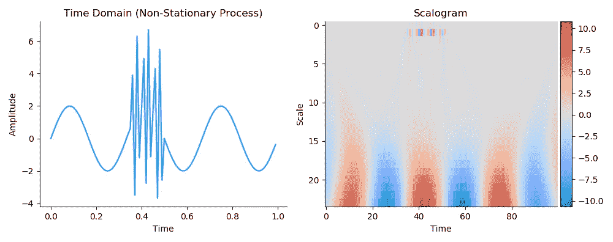
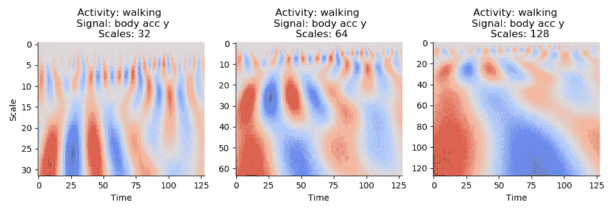
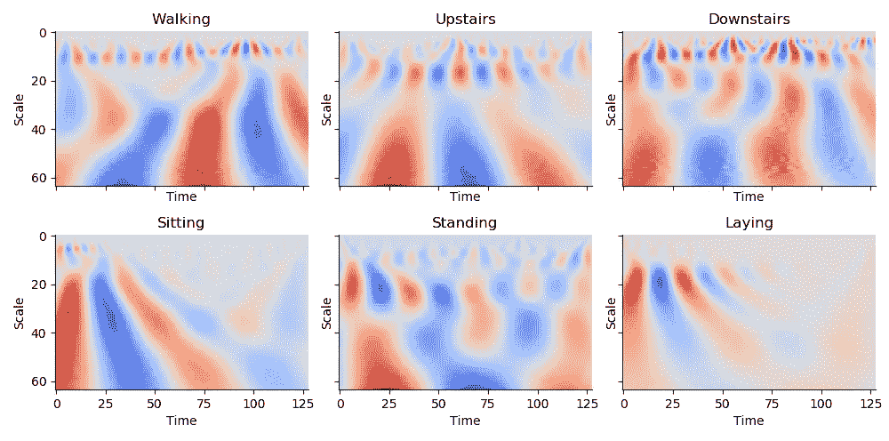
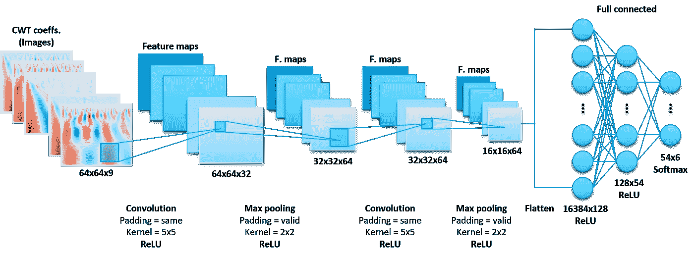
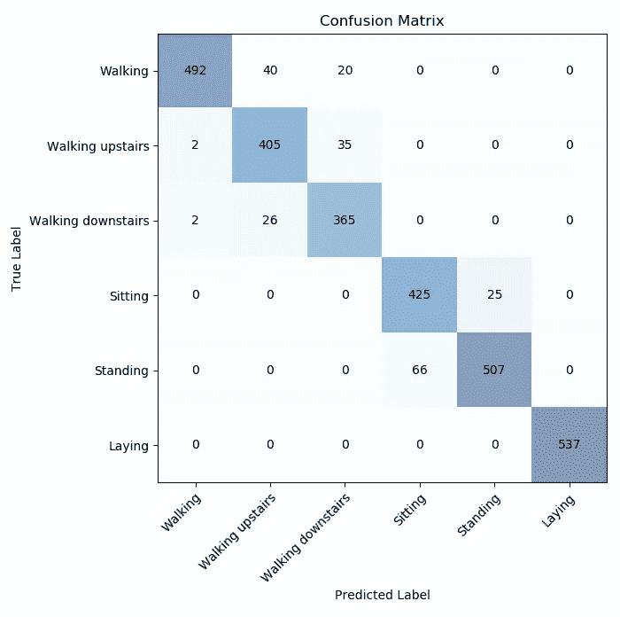

# 基于连续小波变换的多时间序列分类

> 原文：<https://towardsdatascience.com/multiple-time-series-classification-by-using-continuous-wavelet-transformation-d29df97c0442?source=collection_archive---------2----------------------->


希法兹·沙蒙在 [Unsplash](https://unsplash.com/s/photos/waves?utm_source=unsplash&utm_medium=referral&utm_content=creditCopyText) 上拍摄的照片

## 这篇文章的目的是展示为什么连续小波变换如此强大，以及如何使用它来分类多个非平稳信号和时间序列。

# 1 简介:连续小波变换的重要性

在数字化和第四次工业革命的时代，公司越来越重视开发数据驱动的应用程序来创建新的商业模式。通常，产生新服务的先决条件是记录非平稳数据或信号(随时间动态变化的数据)和时间序列，如金融趋势或声音、振动、电、加速度计或其他类型的传感器信号。为了产生期望的商业价值，通常必须通过这些数据来检测和理解事件。

这就是机器和深度学习的用武之地。这些数学模型能够以非常高效的方式对物联网设备的状态进行分类和预测。不幸的是，经常需要多个非平稳信号(时间序列)，这些信号非常复杂，容易产生噪声和误导值。为了提高模型的预测精度，使用数字信号处理技术通常是有帮助的。一种非常有效的技术是连续小波变换。

> 连续小波变换(CWT)在确定振荡信号的阻尼比方面非常有效(例如，识别动态系统中的阻尼)。CWT 对信号中的噪声也有很强的抵抗力
> 
> 卡门·赫尔利&贾登·麦克林:小波、分析和方法(2018)。第 73 页

赞美诗除了 CWT 之外，还有[离散小波变换](https://en.wikipedia.org/wiki/Discrete_wavelet_transform) (DWT)，在这篇文章中我就不再详细解释了。

不可思议的是，CWT 在数据科学中并不是很受欢迎。出于这个原因，在下面的帖子中，我想展示 CWT 可以多么容易地用于机器和深度学习(第 3 节)。首先，我想概述一些关于连续小波变换的基本理论(第 2 节)。

# 2 使用连续小波变换的信号处理

在本节中，我将简要概述小波变换为何对分析非平稳信号如此有用(2.1 节)，例如其背后的概念(2.2 节)。

# 2.1 傅立叶变换的局限性

傅立叶变换(FT)通过使用一系列正弦波将信号分解成频率。它有助于在时域和频域之间转换。为了更好的了解 FT，我推荐这个有用的[视频](https://www.youtube.com/watch?v=spUNpyF58BY&t=4s)。

为了说明 FT 的局限性，我们需要一个非常简单的平稳和非平稳信号。与动态非平稳信号不同，平稳信号不随时间改变其均值、方差和协方差。在 FT 中，我们必须考虑时域和频域。时域显示信号幅度/强度与时间的函数关系，可以表示为傅立叶变换后频域中的独立频率(图 1)。


图一。使用傅立叶变换分析非平稳信号无法获得其时域和频域的完整图像

如您所见(图 1)，FT 非常适合正弦波，正弦波是由稳定过程产生的，因为信号始终包含其所有频率(本例中只有一个频率)。现在让我们关注非平稳信号中的突发，它可能是一种异常或特征模式。与静态过程一样，您也可以使用 FT 来识别频率，尽管您无法识别哪些频率代表信号中的突发。FT 的问题在于，它只在频域分解信号，而没有任何关于时域的信息。这解释了为什么不可能在特定时刻确定哪些频率是信号的一部分，反之亦然。总的来说，非平稳信号与傅立叶变换相结合，会被限制在时域或频域内，但你永远无法了解信号的全貌。为了以智能的方式处理这个问题，让我们在下一节中更仔细地研究连续小波变换。

# 2.2 连续小波变换(CWT)的功能

小波是数学函数，通常被称为迷你小波。与用于 FT 的无穷大(-无穷大至+无穷大)正弦函数相比，WT 包含:

1.  具有不同紧性和光滑性的不同族和类型的小波
2.  其均值为零且时间有限

不同的小波形状使我们能够选择最适合我们在信号中寻找的特征的一个。CWT 最常见的小波是“墨西哥、莫尔莱特和高斯”小波(图 2)。他们也被称为“小波妈妈”。


图 2:墨西哥帽、Morlet 和高斯母小波的形状。

Ps:使用的 Python 包“PyWavelets”提供了更多与 CWT 兼容的母小波。因此，请阅读[py wavelet](https://pywavelets.readthedocs.io/en/latest/ref/cwt.html#continuous-wavelet-families)API 参考资料。

图 2 还展示了母小波的零均值和时间限制。这两个条件都允许同时从时间和频率进行定位。此外，它们使得必要的可积和逆小波变换成为可能。CWT 可以用下面的等式来描述:


因此，小波变换使用母小波将 1D 到 ND 时间序列或图像划分成缩放的分量。在这方面，转换是基于缩放和移位的概念。

*   缩放:通过缩放因子在时间上拉伸或收缩信号。
*   移位:将不同尺度的小波从信号的开头移动到结尾。

比例因子对应于信号在时间上的缩放程度，并且与频率成反比。这意味着标度越高，标度精度越好(图 3)。


图 3:演示了一个收缩和一个拉伸的 Morlet 母小波。比例因子与频率成反比。

因此，这有助于:

*   拉伸小波以捕捉缓慢变化；和
*   收缩小波以捕捉信号中的突变。

尺度和时间上的不同小波沿着整个信号移动，并乘以其采样间隔，以获得物理意义，从而得到作为小波尺度和移位参数的函数的系数。例如，100 个时间步长乘以 32(在 1 到 33 的范围内)的信号会产生 3，200 个系数。这使得能够用 CWT 更好地表征信号中的振荡行为。

如果我们将 CWT 应用于非平稳信号示例，并在标量图中显示结果系数，我们将获得以下结果。



图 4:具有突发的非平稳信号(时域)和其 CWT(时域和频域)之间的比较

图 4 中的比例图显示了原始信号的大部分能量(见比例图右侧的颜色条)包含在时间和频率中的位置。此外，我们可以看到，信号的特征现在显示在高分辨率的细节。因此，您可以看到尺度为 1 和 2 的收缩小波检测到的突发的突然变化，以及尺度为 15 到 25 的拉伸小波检测到的正弦波的缓慢变化。

Ps:突然的变化通常是数据中最重要的部分，无论是从感觉上还是从它们所提供的信息来看。

像 2D 尺度图这样的 CWT 系数的可视化可以用来改善不同类型信号之间的区别。在工业环境中，这有助于区分机器中的不同生产过程(过程监控)，识别轴承等组件以及机器或工具故障(状态监控),例如基于非平稳振动传感器信号的质量问题(质量监控)。我希望这能让您更好地理解 CWT 在数据分析方面有多么强大。现在相关的是看你如何在机器和深度学习中使用这项技术。

# 3 通过连续小波变换分类

在 2.2 节中，我们已经看到连续小波变换将 1D 时间序列转换成 2D 系数。因此，系数代表信号的时间、频率和特征，因此比时间序列或 FT(图 4)包含更多信息。本节的目标是通过使用模式识别(3.3 节)或特征提取(3.4 节)，将生成的信息用作分类的基础。之前，我已经提供了所选示例数据集的简要概述(3.1 节)以及如何对该数据应用 CWT(3.2 节)。

# 3.1 使用的人类活动识别(HAR)数据集

开放 HAR 数据集包含一个智能手机传感器(加速度计和陀螺仪),用于测量正在进行以下活动的不同人员:


有 7，532 个训练样本和 2，947 个测试样本(测量)，每个样本之间有 50%的重叠。每个样本包括 9 个固定大小的信号，有 128 个读数和时间步长。


您可以在 this [链接](https://archive.ics.uci.edu/ml/datasets/human+activity+recognition+using+smartphones)下载并阅读更多关于数据集的信息。

我们正在加载几乎原始的惯性信号，其中只有重力效应被过滤掉了。

有用信息:X_train: (7352，128，9)和 X_test: (2947，128，9)的形状(n_samples，n_steps，n_signals)所有 X 的平均值为:0.10，标准偏差为:0.40

如你所见，信号几乎是正常的。

如果绘制两种不同活动的身体加速度计和身体陀螺仪信号，您将看到每个样本的动态变化(非平稳)信号(图 5)。为了更清楚起见，我们将不绘制总加速度计值。


图 5:HAR 数据集中人体加速度计和人体陀螺仪智能手机信号的活动可视化示例

根据信号的动态行为(图 5)，该数据集似乎非常适合应用小波变换。

# 3.2 CWT 在 Python 中的应用

正如已经提到的(2.2 节)，我们可以通过 CWT 系数的可视化手动区分不同的事件。这对于 HAR 数据集也是可能的吗？

为了找出这个问题，我们必须首先安装 Python 包[py wavelet](https://pywavelets.readthedocs.io/en/latest/)和“pip install PyWavelets”或“conda install pywavelets”，我们可以使用它们在我们的数据集上应用小波变换。

其次，我们必须为连续小波函数 [pywt.cwt](https://pywavelets.readthedocs.io/en/latest/ref/cwt.html) 定义一个方便的母小波和尺度大小。对于这种信号(图 5)，我们根据其最合适的形状选择 Morlet 母小波(图 2)。为了选择合适的比例范围，让我们考虑三个不同范围 32、64 和 128 的 CWT 系数，用比例图表示(图 6)。



图 6:随着尺度范围的扩大，关于信号行为的信息越来越多。

一般来说，规模较小的规模(在我们的例子 32)使更多的突然变化的焦点。如前所述，这些突然的变化往往是最重要的特征。否则，大范围的标度(在我们的例子中，64 或 128)提供了更多的信息(关于缓慢变化)，这可以提供更好的分类精度。然而，对于第二个选项，你需要一个更深入的 CNN。

对于下一个示例，64 的比例似乎是达到良好预测精度的一个有用的折衷方案。



图 7:基于通过尺度图的连续小波变换传感器数据的可视化来区分不同的 HAR 活动

正如您所看到的(图 7)，通过 scalogram 可视化 CWT 系数，手动区分不同的活动是可行的。请随意选择其他信号或样本，然后你会看到每个信号或多或少方便区分六个活动。例如，对于坐着、站着和躺着等非移动活动，仅使用 x、y 和 z 方向上的总加速度传感器数据，您将达不到良好的分类精度。

我敢肯定，你不愿意考虑和手动比较成千上万的标量图来确定每个样品的活性。为此，我们首先使用传统的神经元网络(3.3 节)，其次使用特征提取技术加上分类器(3.4 节)来自动分类 HAR 数据集的不同活动。

# 3.3 使用传统神经元网络(CNN)的模式检测

CNN 对于学习图像中标签的特征模式是非常有效的。这种神经元网络还可以像处理图像像素一样处理 2D 连续小波变换系数，以预测相应的活动。让我们看看这个组合是如何工作的。

但是，在我们开始向 CNN 提供信息之前，我们必须:

1.  使用 [pywt.cwt](https://pywavelets.readthedocs.io/en/latest/ref/cwt.html) 函数转换 HAR 数据集的信号；和
2.  将得到的系数转换成合适的格式。

在这种情况下，我们也将为 pywt.cwt 函数选择 Morlet 母小波和尺度大小 64，就像在 3.2 节中一样。此外，我们将所有系数矩阵(64x128)调整为正方形(64x64)。这个步骤不是绝对必要的，但是可以节省许多参数和计算资源，同时我们不应该丢失太多的图像细节(图 8)。


图 8:使用标量图对连续小波变换的 2D 系数进行下采样的影响的描述

作为第二点，我们仍然必须澄清如何将得到的 CWT 系数矩阵馈送到 CNN。这里，最好的方法是将九个信号的 2D 系数(图像)相互叠加，就像彩色图像的三个通道红、绿、蓝(RGB)一样。因此，可以同时考虑不同传感器数据之间的所有相关性，这是非常重要的。这里请注意:如果你把 9 个不同信号的 CWT 系数连接成一个 Numpy 数组(图像)，它们之间会有突变。这可能导致这样的效果，即由于突变，CNN 聚焦于边界，而不是每个信号的重要特征模式。因此，你需要一个更深入的 CNN 来忽略这种噪音。

为了便于说明，我们使用 LeNet-5 架构构建了一个简单的 CNN(图 9 ),并进行了两项改进:



图 9:具有最大池化和 ReLU 激活的传统神经元网络(CNN) LeNet-5 架构

*   最大池而不是平均池，因为当您想要提取极端特征(突变)以及当图像具有高像素密度(由于九个通道)时，最大池可能会达到更好的性能。
*   用修正线性单元(ReLU)激活函数代替双曲正切(Tanh)来克服消失梯度问题，加速训练并获得更好的性能。

让我们对模型进行训练和评估！

培训…


评估…

```
Accuracy: 94.91%
```


还不错！对于这个数据集来说，几乎 95%的准确性是非常好的，因为对于一个简单的模型来说，不同的人进行的类似的非运动(停留、躺下和坐着)和类似的运动(走路、上楼和下楼)之间的区别是不容易的。这个结果应该被认为是 CWT 和 CNN 的组合对于非平稳多时间序列/信号的分类是一个有用的选择的证据。我确信，通过 CNN 的改进(增加正则化、更多神经元等等)，其他 CNN 架构、超参数调谐或其他尺度大小(有或没有下采样)可以达到更好的结果。所以，让我们尝试另一种方法。

# 3.4 使用主成分分析(PCA)的特征提取

虽然我们在上一节中使用了所有 2D CWT 系数，如 CNN 的图像，但这次我们将选择每个尺度中最重要的系数来输入分类器。因此，我们应用 PCA 来提取具有最高变化的特征。如果你不熟悉 PCA 背后的逻辑，我向你推荐这个[来源](https://medium.com/@aptrishu/understanding-principle-component-analysis-e32be0253ef0)。

要选择每个标度变化最大的系数，我们必须:

1.  像以前一样应用 [pywt.cwt](https://pywavelets.readthedocs.io/en/latest/ref/cwt.html) 函数；和
2.  仅对单个分量应用 PCA，以获得每个尺度的最重要系数。

这样，我们对每个信号使用 64 个特征，而不是 64*128。生成的新要素数据集的 2D 形状为(n_samples，576 (= 64 个要素* 9 个信号)。

对于分类，我选择 XGBoost(e**X**treme**G**radient**B**oosting)，这是目前最成功的 Kaggle 竞争分类器之一。 [XGBoost](https://xgboost.ai/) 是一种针对速度和性能而设计的梯度推进、基于决策树的集成机器学习算法。想知道 XGBosst 为什么表现这么好，你可以看看这篇[帖子](/https-medium-com-vishalmorde-xgboost-algorithm-long-she-may-rein-edd9f99be63d)。

在 HAR 数据集的背景下，重要的是选择目标“multi:softmax ”,以便能够对不止二进制类进行分类。此外，我们应用子采样(也称为 bagging)来减少方差和过度拟合。由此，子采样部分随机选择用于拟合每棵树的训练样本。

```
Accuracy: 92.67%
```



几乎 93%的准确率也是不错的结果。显然，这种方法在非运动活动(如坐着和站着)之间的分离稍好，因此在不同的行走活动之间的分离明显较差。与每个机器学习模型一样，您可以通过超参数调整来提高性能，在这种情况下，可以通过增加规模大小来获得更多输入特征。XGBoost 分类器足够强大，可以处理 576 个输入特征。大多数分类器可以独立地确定哪些特征是有用的，哪些是无用的。但是，当使用高得多的比例时，您应该考虑选择重要性最高的要素。

# 4 结论

在本文中，您已经看到了为什么以及如何使用强大的 CWT 来处理非平稳信号。CWT 与 CNN 或 PCA 以及分类器相结合的良好结果证明了这些方法是对每个事件的多个时间序列进行分类的极好选择。有如此多的不同算法和模型的可调配置会影响输出结果，以至于无法为此目的命名任何普遍有效的过程。根据我的经验，对于非平稳信号，连续(也包括离散)小波变换的性能大多优于其他信号处理技术，并且优于其他类型的模型(如使用原始 HAR 数据的简单递归神经元网络)的分类精度。

最后，我希望这篇文章让(连续)小波变换在数据科学中更受欢迎，就像在机器和深度学习中一样，并鼓励你尝试一下。