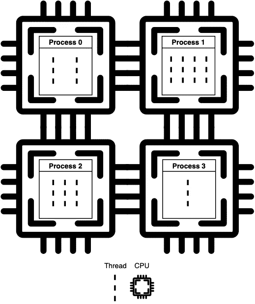
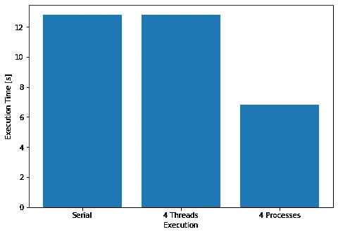
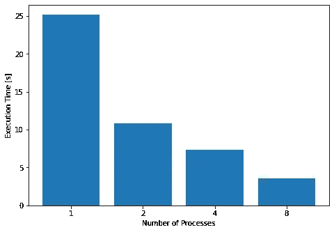
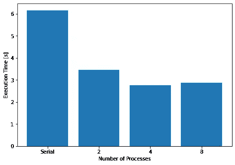

# Python 中的多线程与多处理

> 原文：<https://towardsdatascience.com/multithreading-vs-multiprocessing-in-python-3afeb73e105f?source=collection_archive---------0----------------------->


劳尔·卡乔·奥斯在 [Unsplash](https://unsplash.com?utm_source=medium&utm_medium=referral) 上的照片

## [入门](https://towardsdatascience.com/tagged/getting-started)

## 两者之间的区别，以及如何和何时使用它们

Python 通常被认为是一种近乎淫秽的编程语言。一个自由主义的地方，在这里一切都被允许，我们最狂野的梦想都得以实现。忘记标签和定义，尤其是括号。这是一种欢迎所有人的语言，从最有经验的程序员(那个因为某些你不想知道的原因仍然使用 Fortran 的古怪家伙)到自负的千禧一代新手。嗯，除非你和`multiprocessing`或`multithreading`一起工作。

在 Python 中处理并行性和并发性的挑战始于这样一个事实，即使是互联网也不太了解它是如何工作的。事实上，我在 stackoverflow 回复上发现了多个错误的陈述(有些有很高的向上票数)，甚至是看起来非常严肃的博客。因此，不同于其他情况，其中*编程*也可能被称为*堆栈溢出*，在开始使用 Python 中的`multiprocessing`或`multithreading`之前，你最好至少知道你正在做的事情的基础。

否则，你可能会过得不好。

# 基础知识

当寻找 python `multiprocessing`和`multithreading`之间的区别时，人们可能会有这样的印象:它们的工作方式非常相似。这真是大错特错。主要区别在于:

*   进程是在处理器内核中执行的独立实例。线程是进程的组件，并发运行(在该进程内部)。
*   进程不共享同一个内存空间，而线程共享(它们妈妈的内存，诗意吧？).
*   线程更轻，导致的开销更少。此外，因为它们在一个进程中共享相同的内存，所以共享数据更容易、更快、更安全。
*   只有使用`multiprocessing`才能实现真正的平行。这是因为在一个进程时间空间内，一个给定的时间只能执行一个线程。这是由 Python 的全局解释器锁(GIL)保证的(见 [Python GIL 在 RealPython](https://realpython.com/python-gil/) )。
*   进程的执行由操作系统调度，而线程由 GIL 调度。

我们还应该理解并发和并行的区别。

*   **并发**执行是指两个或两个以上的任务同时进行。
*   并行执行意味着两个或更多的任务同时被执行。

现在记住:`multithreading`实现并发，`multiprocessing`实现并行。流程在独立的处理节点上运行。



*流程并行运行。线程并发执行。*作者图片

# 使用案例

那么我们如何在`multiprocessing`和`multithreading`之间做出选择呢？简短的回答是:

*   用于 I/O 密集型任务的多线程技术；
*   针对 CPU 密集型任务的多处理(如果您有多个内核可用)

但是为什么呢？

# 多线程:I/O 绑定任务

假设你有一个任务，它依赖于系统的另一部分或者用户的输入。

没有理由为那项工作指定一个进程，因为它会花费大部分时间等待刺激开始工作。如果将一个计算节点专用于此，那将是一种资源浪费，而且不会带来任何加速，因为瓶颈不在执行上，而在第三方调用上。在这种情况下，`multithreading`就是要走的路。

的确，`multithreading`通常被实现来处理 GUI。例如，在文本编辑器程序中，一个线程将负责从键盘获取输入，而另一个线程将检查拼写，第三个线程可以处理格式配置。

I/O 密集型程序也可以直接从`multithreading`中受益，因为它们的瓶颈通常是读或写操作(例如，在 web scrappers 中是下载)。查看以下示例:

这个函数将一些 URL 地址加载到内存中，并将它们写入一个本地文本文件(50 次，总是覆盖同一个文件)。这是相当愚蠢的，但它的目的只是强调 I/O 绑定的执行。你可以在[这个笔记本](https://github.com/gennsev/Python_MultiProc_Examples/blob/master/Example.ipynb)里查看这段代码并自己执行。

让我们在 16 个地址的列表上运行该方法，并检查一些不同线程数的执行时间。这将为我们带来以下图表(在 MacBook Air 2019 上执行)。


作者图片

其中一个线程的结果代表代码的串行执行。从图中我们可以看出,`multithreading`能够大大减少算法的执行时间。我们可以继续增加线程的数量，但是一旦达到每个地址都由一个线程处理的程度，这种增加就会停止。

# 多重处理:CPU 限制的任务

现在想象一下，你在内存中加载了大量的数据，这些数据都需要处理。受计算限制的程序将从多重处理中受益，因为它们的瓶颈是时间和资源。图像和图形处理就是一个很好的例子。它们由大量的数学运算组成，因为它们的数据是独立的，所以通常可以分成单独的任务。在这方面，GPU 是最先进的硬件，旨在并行处理大块数据。

为了模拟计算密集型算法，我们将使用以下代码:

同样，你可以在[这个笔记本](https://github.com/gennsev/Python_MultiProc_Examples/blob/master/Example.ipynb)中检查这个代码，然后自己执行它(我 ***强烈*** 建议你看一下，因为我们必须做一些变通办法才能在 windows 上正确执行它)。

我的 MacBook 采用了带超线程的双核处理器，因此没有必要强制在其上运行 4 个以上的进程。以下是该基准测试的性能测试结果:



作者图片

`multithreading`没有提供加速(执行时间实际上是相同的)。然而，当使用`multiprocessing`时，我们有了显著的加速。由于流程管理花费的时间，将执行时间减少到原来的四分之一是不够的。请记住，进程比线程重得多。

## I/O 密集型任务的多重处理

即使这不是他们的最佳用例，也没有理由期望`multiprocessing`在 I/O 密集型任务上表现不佳。这是一种资源浪费:想象一下，将一个处理器内核专用于一个函数，该函数在执行的很大一部分时间里，只是等待输入。一个处理器，即使是一个集群，也只有这么多的处理节点。我们最好将它们用于真正的应用并行化，只有通过这些方法才能加速。

但是为了科学起见，如果我们使用`multiprocessing`执行第一个 I/O 绑定代码，会发生什么呢？下图显示了这一点。



作者图片

正如所料，`multiprocessing`也能够加速 I/O 限制的计算。同样值得注意的是，我们保持了 8 个进程的加速。原因是在这种情况下，进程开始像线程一样执行。加速不是来自并行性，而是来自并发性。

# 数据科学示例

现在，让我们更深入地了解如何在 Python 中实现多处理和多线程，以及数据科学家如何从中获益。有许多不同的方法可以做到这一点，我鼓励您从文档中获得一些想法([这里](https://docs.python.org/3/library/concurrent.futures.html)、[这里](https://docs.python.org/3.8/library/threading.html)、[和这里](https://docs.python.org/3.8/library/multiprocessing.html))，并在我在[本笔记本](https://github.com/gennsev/Python_MultiProc_Examples/blob/master/Example.ipynb)中作为练习提供的示例模型上尝试它们。

从广义上讲，数据科学项目遵循四个步骤:

1.  获取数据；
2.  处理数据；
3.  对数据做点什么；
4.  存储其他数据

现在，你可能会说:“不，我的项目完全不同”。嗯，恕我不敢苟同，但我相信你可以通过这篇博文获得一些关于如何加速你自己与众不同的项目的想法。

> 记住黄金法则:`multithreading`用于 I/O 绑定任务，而`multiprocessing`用于 CPU 绑定任务。

现在，不难理解“获取数据”和“存储其他数据”步骤可能是我们应该使用`multithreading`的步骤。所有其他的(“处理数据”和“用数据做点什么”)使用`multiprocessing`可能会更好。您可能认为处理大量数据可能会出现 I/O 瓶颈，在某些情况下，您可能是对的。如果是这种情况，您应该尝试将这种处理分成“获取数据”和“处理数据”两部分，以便可以将最佳策略应用于每一部分。

# 文本分类

让我们看看如何在一个经典的自然语言处理(NLP)问题中应用我们所学的知识:文本分类。这个想法是通过文本找出一篇新闻文章的类别(例如:它是否应该被分类为“体育”、“金融”、“经济”等)。

> 如果您只是想了解如何在实际项目中使用多重处理和多线程，就跟着做吧，您不需要了解 NLP 的任何知识就能理解这个例子。但是，如果你对主题感兴趣，你应该从研究什么是[单词向量](https://en.wikipedia.org/wiki/Word_embedding)开始。喜欢[这篇文章](https://medium.com/@jayeshbahire/introduction-to-word-vectors-ea1d4e4b84bf)。你也可以关注这个 GitHub 库[,我和我的一个同事正在那里开发一些文本分类模型(那里有一些很酷的笔记本)。](https://github.com/gennsev/tclass)

我们的项目非常简单，我们将:

1.  从路透社获取一些包含新闻及其各自标签的数据(定义它们是什么类型的新闻)([数据源](https://www.cs.umb.edu/~smimarog/textmining/datasets/))；
2.  使用`GloVe`预训练的单词向量(从维基百科训练而来)对它们进行矢量化([GloVe project page](https://nlp.stanford.edu/projects/glove/))；
3.  使用带有`scikit-learn`的随机森林训练一个模型，在给定的标签下对文本进行分类。

到目前为止，应该很容易看出在 Python 中使用`multithreading`可以加速步骤 1，而步骤 3 应该使用`multiprocessing`。

## 加载数据

让我们从预训练的手套单词向量加载开始。你可以在[这个笔记本](https://github.com/gennsev/Python_MultiProc_Examples/blob/master/Example-2.ipynb)里查看完整代码并自己执行。加载这个预先训练好的单词向量文件会花费很多时间。这个文件相当长，我们必须逐行处理。每行包含一个单词，然后是单词向量的每个维度的值列表。

`GloveVectorizer()`在其`__init__`函数中加载预训练向量，可以异步或串行完成。这是它执行基本的逐行文件读取的方式:

下面是`multithread`的实现:

我再次强烈建议你检查一下它是如何在[完整代码](https://github.com/gennsev/Python_MultiProc_Examples/blob/master/Example-2.ipynb)中实现的。

`ThreadPoolExecutor`异步运行它的线程。最后一个`for`循环用于保证只有在提交给执行器的所有线程完成后，执行才会继续。查看 [Python 文档](https://docs.python.org/3/library/concurrent.futures.html#concurrent.futures.ThreadPoolExecutor)了解更多关于`ThreadPoolExecutor`如何工作的细节。

但是用`multithreading`加载向量的速度有多快呢？在我的 MacBook Air 中，第一个串行版本在大约`269.19898986816406s`处加载了 40 万个单词向量。异步方法在`27.559515953063965s`中加载 400000 个字向量，使用 10 个工人(它可能用更少的工人达到相同的执行时间，因为瓶颈是读取行，而不是处理)。

## 训练模型

现在酷的部分:培训和测试。

对我们来说幸运的是，`scikit-learn`本身就提供了`multiprocessing`，只需在模型的参数上进行设置。下面的两个代码示例用相同的数据串行地或使用一组`jobs`(映射到`scikit-learn`中的流程)训练一个相同的模型。

在`scikit-learn`中使用多重处理就像设置`n_jobs`模型参数一样简单。在这里，我们将它设置为两个:

这太简单了，你可能会怀疑它是否有用。但确实如此。下面的条形图显示了同一型号在不同工作数量下的培训时间:



作者图片

哦，如果你好奇的话，这个模型的准确性(`RandomForestClassifier.scoreTrain`)一点也不差:

```
Train score: 0.9992707383773929
Test score: 0.9346733668341709
```

## 结论

我认为它涵盖了几乎所有的东西。最后一个例子展示了如何使用 Python 多处理和多线程特性来加速实际项目，有时只需很少甚至不需要修改代码。然而，并非所有闪光的东西都是金子。当期待 python 中更复杂的并行和异步执行时，您很快就会发现，事情会变得相当混乱。