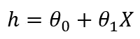
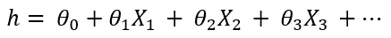
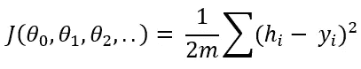
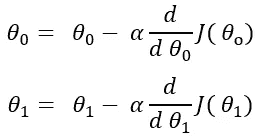
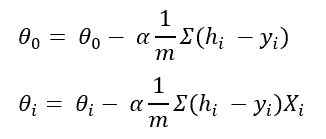
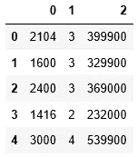
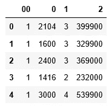
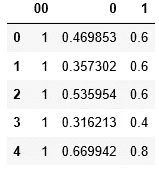
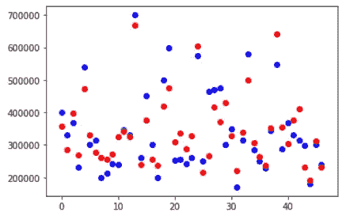
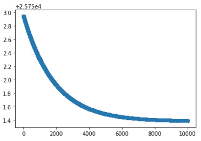

# Python 中多元线性回归的逐步实现

> 原文：<https://towardsdatascience.com/multivariate-linear-regression-in-python-step-by-step-128c2b127171?source=collection_archive---------1----------------------->


迈克尔·泽兹奇在 [Unsplash](https://unsplash.com?utm_source=medium&utm_medium=referral) 上的照片

## 学习用 Python 从头开始开发任意数量变量的多元线性回归。

线性回归可能是最简单的机器学习算法。它对初学者来说非常好，因为它使用简单的公式。所以，这对学习机器学习概念是有好处的。在这篇文章中，我将尝试一步一步地解释多元线性回归。

## 概念和公式

线性回归使用我们在学校都学过的简单公式:

Y = C + AX

提醒一下，Y 是输出或因变量，X 是输入或自变量，A 是斜率，C 是截距。

对于线性回归，我们遵循相同公式的这些符号:



如果我们有多个独立变量，线性回归的公式将如下所示:



在这里，‘h’被称为假设。这是预测的输出变量。**θ0 是偏置项**，所有其他θ值是系数。它们在开始时是随机初始化的，然后用算法进行优化，使该公式能更接近地预测因变量。

## 成本函数和梯度下降

当θ值在开始时被初始化时，该公式不被训练来预测因变量。假设与原始输出变量“Y”相差甚远。这是估计所有训练数据的累积距离的公式:



这被称为**成本函数**。如果你注意到了，它从假设(预测输出)中减去 y(原始输出)，取平方省略负数，求和除以 2 乘以 m，这里 m 是训练数据的个数。你可能会看到，成本函数是原始产量和预测产量之间的差异。机器学习算法的思想是最小化成本函数，使得原始输出和预测输出之间的差异更接近。为此，我们需要优化θ值。

这是我们更新θ值的方法。我们取成本函数相对于每个θ值的偏导数，并从现有的θ值中减去该值，



这里，α是学习率，它是一个常数。我没有给出所有θ值的相同公式。但是对于所有的θ值，公式都是一样的。微分后，公式为:



这叫做梯度下降。

## 逐步实现算法

我要用的数据集来自 Andre Ng 在 Coursera 上的机器学习课程。我会在本页底部提供链接。请随意下载数据集并使用本教程进行练习。如果对你来说是新的，我鼓励你在阅读的时候用数据集来练习。这是理解它的唯一方法。

在这个数据集中，只有两个变量。但是我为任意数量的变量开发了算法。如果对 10 个变量或 20 个变量使用相同的算法，应该也可以。我会用 Python 中的 Numpy 和 Pandas 库。所有这些丰富的 Python 库使得机器学习算法变得更加容易。导入包和数据集:

```
import pandas as pd
import numpy as npdf = pd.read_csv('ex1data2.txt', header = None)
df.head()
```



1.  为偏置项添加一列 1。我选择 1 是因为如果你把 1 乘以任何值，那个值都不会改变。

```
df = pd.concat([pd.Series(1, index=df.index, name='00'), df], axis=1)
df.head()
```



2.定义输入变量或自变量 X 和输出变量或因变量 y。在该数据集中，列 0 和 1 是输入变量，列 2 是输出变量。

```
X = df.drop(columns=2)
y = df.iloc[:, 3]
```

3.通过将每列除以该列的最大值来规范化输入变量。这样，每列的值将在 0 到 1 之间。这一步不是必需的。但它使算法更快地达到最优。另外，如果您注意到数据集，与列 1 的元素相比，列 0 的元素太大了。如果对数据集进行规范化，就可以防止第一列在算法中过于突出。

```
for i in range(1, len(X.columns)):
    X[i-1] = X[i-1]/np.max(X[i-1])
X.head()
```



4.初始化θ值。我把它们初始化为 0。但是任何其他数字都可以。

```
theta = np.array([0]*len(X.columns))#Output: array([0, 0, 0])
```

5.计算训练数据的数量，在上式中表示为 m:

```
m = len(df)
```

6.定义假设函数

```
def hypothesis(theta, X):
    return theta*X
```

7.使用上面解释的成本函数的公式来定义成本函数

```
def computeCost(X, y, theta):
    y1 = hypothesis(theta, X)
    y1=np.sum(y1, axis=1)
    return sum(np.sqrt((y1-y)**2))/(2*47)
```

8.写出梯度下降的函数。该函数将 X，y，theta，学习率(公式中的 alpha)和时期(或迭代次数)作为输入。我们需要不断更新θ值，直到成本函数达到最小值。

```
def gradientDescent(X, y, theta, alpha, i):
    J = []  #cost function in each iterations
    k = 0
    while k < i:        
        y1 = hypothesis(theta, X)
        y1 = np.sum(y1, axis=1)
        for c in range(0, len(X.columns)):
            theta[c] = theta[c] - alpha*(sum((y1-y)*X.iloc[:,c])/len(X))
        j = computeCost(X, y, theta)
        J.append(j)
        k += 1
    return J, j, theta
```

9.使用梯度下降函数获得最终成本、每次迭代中的成本列表以及优化的参数θ。我选择α为 0.05。但是你可以尝试使用其他值，比如 0.1，0.01，0.03，0.3，看看会发生什么。我反复运行了 10000 次。请尝试更多或更少的迭代，看看有什么不同。

```
J, j, theta = gradientDescent(X, y, theta, 0.05, 10000)
```

10.使用优化的 theta 预测输出

```
y_hat = hypothesis(theta, X)
y_hat = np.sum(y_hat, axis=1)
```

11.绘制原始 y 和预测输出“y_hat”

```
%matplotlib inline
import matplotlib.pyplot as plt
plt.figure()
plt.scatter(x=list(range(0, 47)),y= y, color='blue')         
plt.scatter(x=list(range(0, 47)), y=y_hat, color='black')
plt.show()
```



一些输出点几乎与预测输出重叠。有些接近但不重叠。

12.绘制每次迭代的成本，以观察行为

```
plt.figure()
plt.scatter(x=list(range(0, 10000)), y=J)
plt.show()
```



成本随着每次迭代而不断下降。这表明该算法运行良好。

我希望，这是有帮助的，你也在为自己尝试。如果你正在阅读这篇文章以学习机器学习概念，我鼓励你下载数据集并尝试自己运行所有代码。以下是数据集的链接:

[](https://github.com/rashida048/Machine-Learning-With-Python/blob/master/ex1data2.txt) [## rashida 048/用 Python 进行机器学习

### 通过在 GitHub 上创建一个帐户，为 rashida 048/用 Python 进行机器学习开发做出贡献。

github.com](https://github.com/rashida048/Machine-Learning-With-Python/blob/master/ex1data2.txt) 

我希望它有帮助。请随时在[推特](https://twitter.com/rashida048)上关注我，并喜欢我的[脸书](https://www.facebook.com/Regenerative-149425692134498/)页面。