# Python 中的多元逻辑回归

> 原文：<https://towardsdatascience.com/multivariate-logistic-regression-in-python-7c6255a286ec?source=collection_archive---------11----------------------->

## 用于分类的机器学习技术

你很可能一天用几十次机器学习，甚至都不知道。在谷歌上进行简单的网络搜索效果如此之好，是因为其背后的 ML 软件已经学会了计算出哪些页面应该被排名以及如何排名。同样，你也不用费力地阅读大量的垃圾邮件，因为你的电脑已经学会区分垃圾邮件和非垃圾邮件。

机器学习是分析大量数据的一种聪明的替代方法。根据执行的任务和输出的性质，您可以将机器学习模型分为三种类型:

1.  **回归:**待预测的输出变量为连续变量
2.  **分类:**待预测的输出变量为分类变量
3.  **聚类:**没有预先定义的标签概念分配给所形成的组/聚类。

分类领域中的大量重要问题领域——监督机器学习的一个重要领域。尽管逻辑回归中有“回归”一词，但事实上，它是最基本的分类算法之一。与输出连续数值的线性回归不同，逻辑回归使用逻辑 sigmoid 函数来转换其输出，以返回一个概率值，然后可以将该概率值映射到两个或多个离散类。

## **逻辑回归的类型:**

1.  二进制(对/错，是/否)
2.  多类(羊、猫、狗)
3.  序数(工作满意度——不满意、满意、高度满意)

在我们开始构建多元逻辑回归模型之前，我们需要熟悉一些概念前提。

# **乙状结肠功能**

前面我们谈到了将值映射到概率。这可以通过调用 sigmoid 函数来实现，该函数会将任何实数值映射到 0 和 1 之间的另一个值。机器学习使用这个函数将预测映射到概率。

数学上，

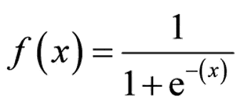

其中，f(x)= 0 和 1 之间的输出(概率估计值)

从图形上看，

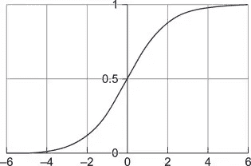

代码:

```
**def** sigmoid(z):
  **return** 1.0 / (1 + np.exp(-z))
```

# **决定边界**

为了更好地理解逻辑回归假设函数所计算的内容，我们需要知道一个叫做“决策边界”的概念。我们使用的预测函数将返回一个介于 0 和 1 之间的概率分数。为了将这个分数映射到一个离散的类(正/负，真/假)，我们选择一个阈值，比如 0.5，高于这个阈值，我们将值分类为类 1，低于这个阈值，值将属于类 2。

例如，假设预测函数返回值 0.8，这将被分类为真/正(因为它高于选定的阈值)。另一方面，值 0.3 将被归类为假/负。在处理多元逻辑回归时，我们选择预测概率最高的类。

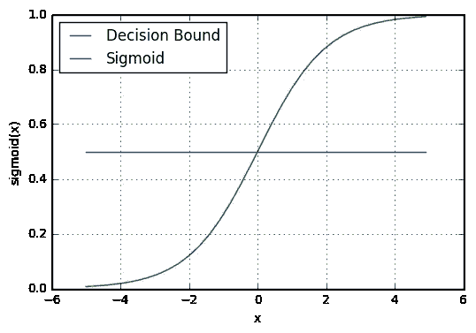

来源:[https://ml-cheat sheet . readthedocs . io/en/latest/logistic _ regression . html # sigmoid-activation](https://ml-cheatsheet.readthedocs.io/en/latest/logistic_regression.html#sigmoid-activation)

# **赔率和对数赔率**

逻辑回归使用的是概率而不是比例。几率简单地计算为两种可能结果的比例之比。设 p 是一个结果的比例，那么 1-p 就是第二个结果的比例。

数学上，

赔率= p/1-p

逻辑回归的统计模型是

log (p/1-p) = β0 + β1x

# **多元逻辑回归**

为了理解多变量逻辑回归的工作原理，我们将考虑一个在线教育平台的问题陈述，在该平台上，我们将查看帮助我们选择最有希望的潜在客户的因素，即最有可能转化为付费客户的潜在客户。

***注:*** *请按照下面给定的链接(GitHub Repo)查找数据集、数据字典和详细的解决这个问题的语句。*

[](https://github.com/sowmya20/LeadConversion_LogReg) [## sowmya20/LeadConversion_LogReg

### 在 GitHub 上创建一个帐户，为 sowmya20/LeadConversion_LogReg 开发做贡献。

github.com](https://github.com/sowmya20/LeadConversion_LogReg) 

**数据清理&准备**

一旦加载了必要的库和数据集，让我们使用 head()命令来看看前几个条目。

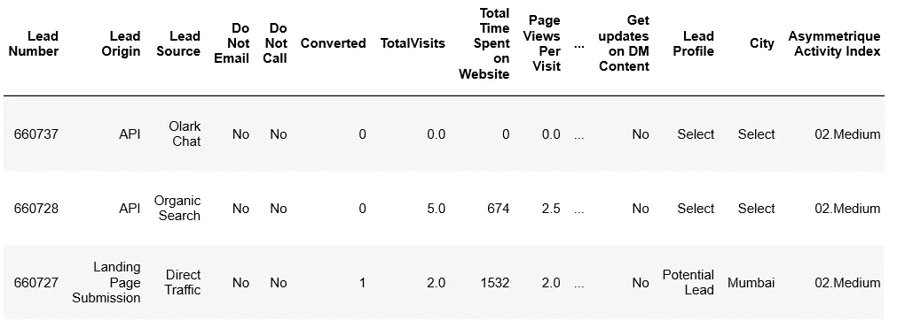

shape 命令告诉我们数据集总共有 9240 个数据点和 37 列。下面列出了该数据集中的列名:

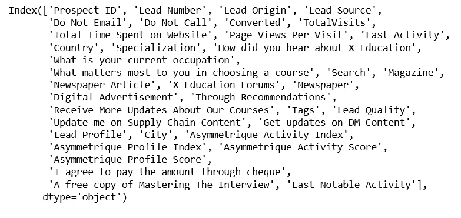

正如您所看到的，列出的大多数特性变量都非常直观。请查阅数据字典，以便更好地理解它们。

进一步的分析揭示了数据集中分类变量的存在，我们需要为其创建虚拟变量。在此之前，我们处理数据集以删除空值列和行以及我们认为对该分析不必要的变量(例如，城市、国家)。快速检查保留行的百分比告诉我们 69%的行已被保留，这看起来足够好了。

**测试列车拆分**

此数据集的目标变量是“Converted ”,它告诉我们过去的销售线索是否被转换，其中 1 表示它被转换，0 表示它没有被转换。

导入 test_train_split 库，对数据集进行 70%训练和 30%测试分割。

数据集中很少有数值变量具有不同的比例，因此使用最小最大比例缩放器缩放这些变量。变量将以这样的方式缩放，即使用数据中的最大值和最小值，所有值都位于 0 和 1 之间。

**模型建立**

转到模型构建部分，我们看到这个数据集中有许多我们无法处理的变量。因此，我们将使用 RFE 从该池中选择一小部分要素。下面是相同的代码:

```
# Import 'LogisticRegression' and create a LogisticRegression objectfrom sklearn.linear_model import LogisticRegression
logreg = LogisticRegression()# Import RFE and select 15 variablesfrom sklearn.feature_selection import RFE
rfe = RFE(logreg, 15)             
rfe = rfe.fit(X_train, y_train)
```

我们现在将使用 statsmodels 来创建基于 p 值和 Vif 的逻辑回归模型。首先，我们将在添加一个常数后在训练集上创建一个模型，并输出摘要。这是广义模型回归结果的样子:

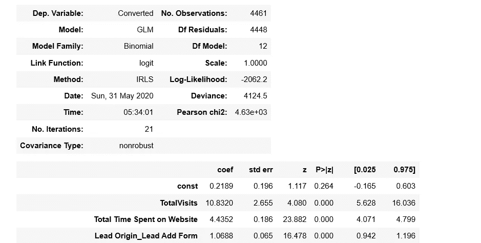

我们还将以类似的方式计算所有要素的 VIF，并删除具有高 p 值和高 VIF 的变量。在用新的特征集重新拟合模型之后，我们将再次检查 p 值和 Vif 所在的范围。如果合适，下一步我们将继续进行模型评估。

**车型评测**

我们现在将预测训练集上的概率，并创建一个包含实际转换标志和模型预测的概率的新数据帧。添加一个列来捕获条件等于 1(如果支付概率的值大于 0.5)或 0 的预测值。

在开始评估模型之前，需要熟悉一些重要的概念:

**混乱矩阵**

我们将分类准确度定义为正确预测与总预测的比率。这种方法的一个主要问题是，它常常隐藏了您可能需要更好地理解模型性能的细节。一个很有可能遇到这个问题的例子是当你处理一个超过两个类的数据时。你可以达到 85%的准确率，但是你不知道这是因为你的模型忽略了一些类还是所有的类都预测的一样好。

> ***混乱矩阵解决了这个问题。它告诉你你的模型在做预测时被混淆的确切次数。***

它是对分类模型预测结果的总结。

在两类问题中，我们通过将事件行指定为“正”并将非事件行指定为“负”来构建混淆矩阵。预测的事件列被指定为“真”，非事件列被指定为“假”。

该矩阵将由以下要素组成:

(I)真阳性——用于正确预测的事件值

(ii)真阴性-对于正确预测的无事件值

(iii)假阳性——错误预测的事件值

(iv)假阴性——错误预测的无事件值

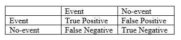

从混淆矩阵中得出的一些基本性能指标有:

(a) **灵敏度:**灵敏度(SN)的计算方法为正确的阳性预测数除以阳性总数。它也被称为回忆(REC)或真阳性率(TPR)。

数学上，

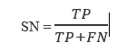

(b) **特异性:**特异性(SP)计算为正确阴性预测数除以阴性总数。它也被称为真实负利率(TNR)。

数学上，

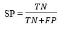

(c) **精度:**精度(PREC)的计算方法是正确的肯定预测数除以肯定预测总数。它也被称为阳性预测值(PPV)

数学上，

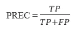

(d) **回忆:**这是我们正确预测的所有现有阳性的分数。

数学上，

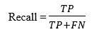

我们将使用上述矩阵和指标来评估模型。0.5 是随机选择的值，用于测试模型性能。我们需要优化阈值以获得更好的结果，我们将通过绘制和分析 ROC 曲线来做到这一点。

**接收器工作特性曲线**基本上是位于 0 和 1 之间的多个阈值的假阳性率和真阳性率之间的曲线。

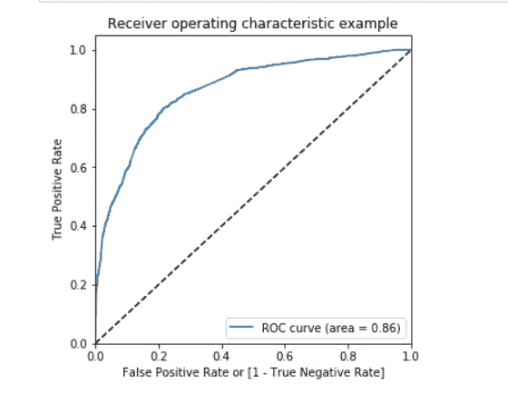

***ROC 曲线帮助我们比较具有不同阈值的不同模型的曲线，而 AUC(曲线下面积)为我们提供了模型技巧的总结。***

在这里，AUC 是 0.86，这似乎很好。为了找到最佳分界点，让我们也检查不同概率分界点下模型的灵敏度和特异性，并绘制相同的图。

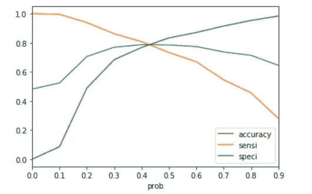

在 0.42 处，三个指标的曲线似乎相交，因此我们将选择它作为临界值。(您可能希望再次使用这一点来计算指标)我们将按照相同的方法对测试集进行预测。

**精确召回权衡**

在建立分类模型时，我们需要同时考虑精度和召回率。牺牲一个值来增加另一个值总是可能的(侧重于召回的模型/侧重于精度的模型)。在为这两个指标选择最佳值时，我们应该始终牢记我们要解决的问题类型。

让我们检查一下我们选择的临界值(即 0.42)的权衡。

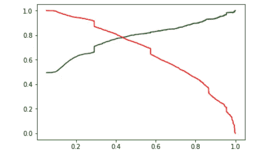

权衡曲线和指标似乎表明我们选择的截止点是最佳的。因此，我们将在测试集上运行最后一次预测，并确认指标。

```
# Let's check the overall accuracymetrics.accuracy_score(y_pred_final['Converted'], y_pred_final.final_predicted)TP = confusion2[1,1] # true positive 
TN = confusion2[0,0] # true negatives
FP = confusion2[0,1] # false positives
FN = confusion2[1,0] # false negatives# Calculate PrecisionTP/(TP+FP)# Calculate RecallTP/(TP+FN)
```

度量标准似乎适用于测试数据。看起来我们已经创建了一个不错的模型，因为测试和训练数据集的指标都不错。

现在，您已经熟悉了使用 Python 构建和评估逻辑回归模型的基础知识。通常，这是一种简单的方法:

(i) **导入**必要的包和库

(二)**数据**清洗、转换

(三)**分类**用现有数据创建和训练模型

(四)**评估**并检查模型性能

(v) **对测试集进行预测**