# 多元正态分布

> 原文：<https://towardsdatascience.com/multivariate-normal-distribution-562b28ec0fe0?source=collection_archive---------7----------------------->

## 多元正态分布呢？它们基本上是几个正态分布的变量捆绑在一起吗？让我们来看看。

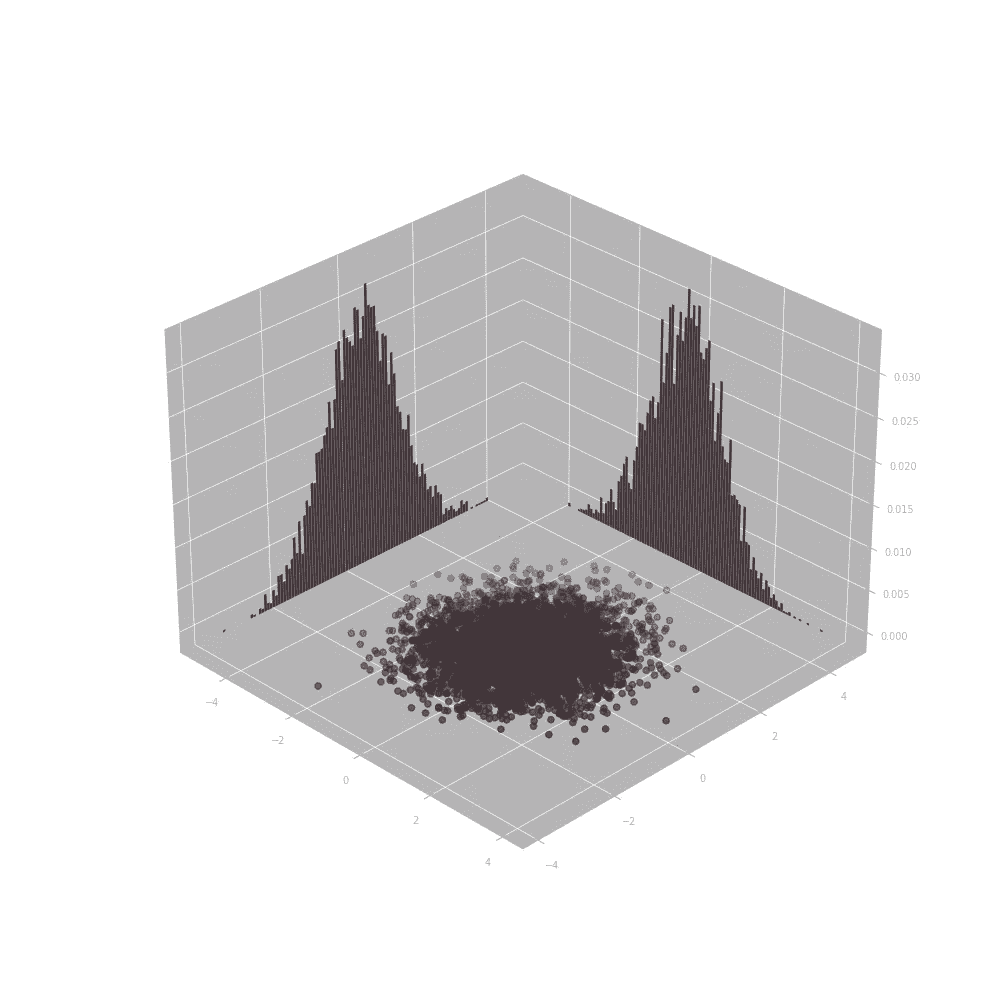

正态分布，也称为高斯分布，是最常见的分布之一。一个主要原因是，独立随机变量的归一化和趋向于正态分布，而不管单个变量的分布如何(例如，您可以添加一组仅取值为-1 和 1 的随机样本，然而随着样本数量的增加，和本身实际上变成正态分布)。这就是所谓的中心极限定理。但是当你有几个正态分布的时候，情况就变得有点复杂了(别担心，没那么多)。

# **常态分布**

先说单个正态分布。

假设我有一个随机变量(比如我吃完午餐所花的时间…)，我对它进行 10000 次采样(28 年来每天都做记录…)，结果会是什么样？

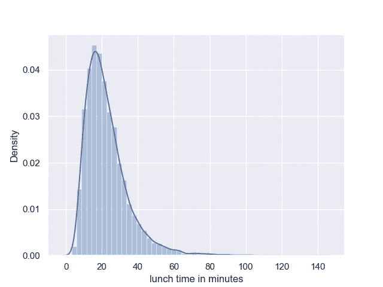

图一

对我来说，它可能看起来像上面的东西。由于明显的原因，它将高于 0 分钟，并将在 20 分钟左右达到峰值。当我没有太多事情要做的时候，有时我会花更长的时间来完成，有时我可能会在桌子上吃得很快，这样我就可以去工作了。

这是正态分布吗？号码

然而，它的对数(自然对数)是正态分布:

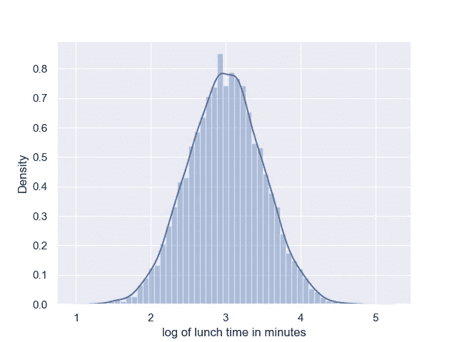

图 2

注意:

1.  它是对称的。
2.  它的平均值是 3。
3.  它的标准差大约是 0.5(相信我，我把它弄糊涂了)

**概率密度函数**可以表示为:

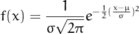

这就是著名的正态分布，注意钟形！(顺便说一下，图 1 被称为对数正态分布，因为它的对数是正态分布)。

如果你的正态分布的均值是 0，标准差是 1，那么它就叫做**标准正态分布**。

一些看似随机但实际上定义了正态分布特征的事情:

*   样本有 68.3%的概率在平均值的 1 个标准差之内(或 31.7%的概率在平均值之外)。
*   峰度为 3。

下面是生成它们的 python 代码:

```
import numpy as np
import pandas as pd
from scipy.stats import normnum_samples = 10000
samples = norm.rvs(loc=3, scale=.5, size=(1, num_samples))[0]

lunch_time = pd.Series(np.exp(samples),
                       name='lunch time in minutes')

log_lunch_time = pd.Series(samples,
                           name='log of lunch time in minutes')
```

# 不相关正态分布

现在我们已经复习了正态分布，什么是多元正态分布？

首先想到的是两个或更多的正态分布变量，这是真的。假设我生成两个正态分布变量的样本，每个样本 5000 个:

```
import numpy as np
from scipy.stats import norm

num_samples = 5000

signal01 = norm.rvs(loc=0, scale=.5, size=(1, num_samples))[0]
signal02 = norm.rvs(loc=0, scale=1, size=(1, num_samples))[0]
```

信号 01 和信号 02 肯定是正态分布的:

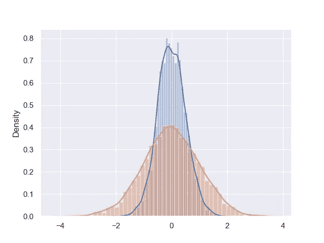

不要介意蓝色直方图顶部的怪异，样本数量不够多

但是，还有更多的东西，让我们将它们绘制成散点图来看看:

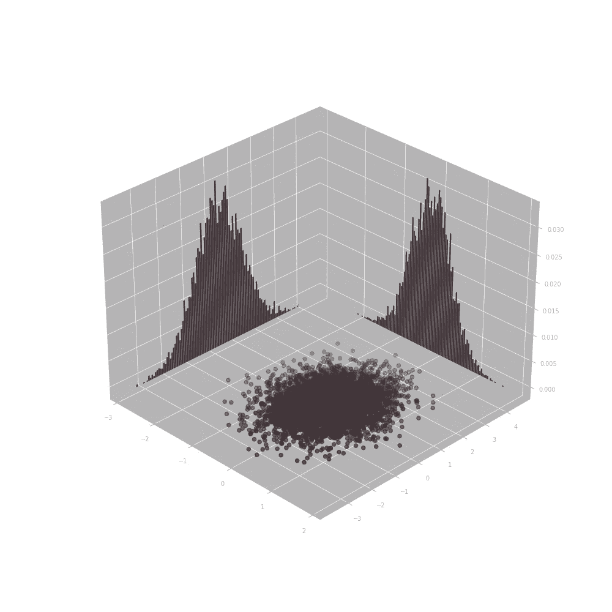

你看到这两个分布的散点图是如何关于 x 轴和 y 轴对称的了吗？这是因为这两种分布完全不相关:

```
np.corrcoef(signal01, signal02)
'''
Out[1]: 
array([[1\.        , 0.00384419],
       [0.00384419, 1\.        ]])
'''
```

这是实现多变量正态分布的棘手部分，即使向量中的每个变量本身都是规则的正态分布，它们也可以彼此相关。

# 多元正态分布

让我们生成一些相关的二元正态分布。

你会问，你如何着手做这件事？

第一步是生成 2 个样本标准法向量:

```
import numpy as np
from scipy.stats import normnum_samples = 5000

signal01 = norm.rvs(loc=0, scale=1, size=(1, num_samples))[0]
signal02 = norm.rvs(loc=0, scale=1, size=(1, num_samples))[0]
```

创建所需的**方差-协方差(vc)矩阵**:

```
# specify desired std
std01 = 11.2
std02 = 0.5

std_m = np.array([
    [std01, 0],
    [0, std02]
])

# specify desired correlation
corr_m = np.array([
    [1, .75],
    [.75, 1]
])

# calc desired covariance (vc matrix)
cov_m = np.dot(std_m, np.dot(corr_m, std_m))
```

然后用 Cholesky 的算法分解 vc 矩阵:

```
from scipy.linalg import cholesky
cky = cholesky(cov_m, lower=True)
```

现在，只需将该矩阵乘以不相关信号，即可获得相关信号:

```
corr_data = np.dot(cky, [signal01, signal02])

signal01 = corr_data[0]
signal02 = corr_data[1]

np.corrcoef(signal01, signal02)'''
Out[1]: 
array([[1\.        , 0.75279088],
       [0.75279088, 1\.        ]])
'''
```

让我们来看看由此产生的散点图:

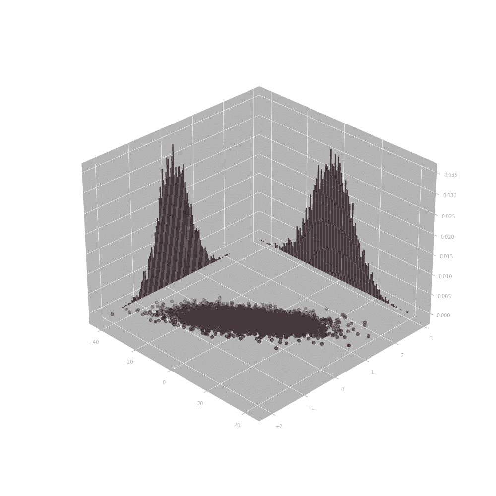

看到散点图不再关于 x 轴或 y 轴对称，而是变得更像一条线了吗？这就是关联的效果。

# 衍生物

这个过程为什么有效？

这实际上是**线性协方差**定义的一个非常简单的结果:

给定一个随机变量向量:

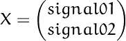

向量的方差协方差定义为:

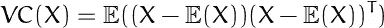

如果我们将 X 乘以矩阵 C，则所得向量的方差协方差为:

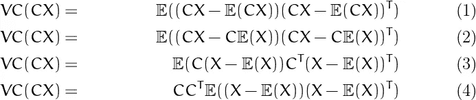

你看，由于原始 X 向量的分量是不相关的，方差协方差矩阵就等于:

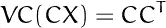

这就是我们使用 Cholesky 分解的原因！我们定义了一个期望的方差协方差矩阵:

```
# calc desired covariance (vc matrix)
cov_m = np.dot(std_m, np.dot(corr_m, std_m))
```

它的乔莱斯基分解正好满足上面的等式！

# **不是多元正态分布吗？**

你可能会问:

> 什么时候随机向量不是多元正态分布的？

嗯，首先，如果向量中的随机变量分量本身不是正态分布的，那么结果肯定不是多元正态分布的。

协方差矩阵也必须是半正定的，这意味着它必须是对称的:

```
# specify desired correlation
corr_m = np.array([
    [1, .75],
    [.75, 1]
])
```

如果你把它改成这样:

```
# specify desired correlation
corr_m = np.array([
    [1, .75],
    [.11, 1]
])
```

那么您得到的结果也肯定不是多元正态分布，因为这将意味着信号 01 和信号 02 的相关性不同于信号 02 和信号 01 的相关性…

哦，是的，你可以使用 numpy 的内置函数:multivariate _ normal:

```
mean = [0, 0]
cov = [[1, .5], [.5, 1]]
s1, s2 = np.random.multivariate_normal(mean, cov, 5000).T
```

但是它一点也不酷。