# 高维光谱数据中的多元异常检测

> 原文：<https://towardsdatascience.com/multivariate-outlier-detection-in-high-dimensional-spectral-data-45878fd0ccb8?source=collection_archive---------14----------------------->

## 高维数据对于离群点检测尤其具有挑战性。稳健的 PCA 方法已经被开发来建立不受高维离群点影响的模型。这些异常值通常以它们偏离 PCA 子空间为特征。

图片由 [Ricardo Gomez Angel](https://unsplash.com/@ripato) 在 Unsplash 上拍摄

# 介绍

在[激光光谱](https://science.howstuffworks.com/laser-analysis3.htm)领域，异常值通常表现为明显偏离其他观察值的值，异常高或异常低——例如，湿度变化、样品表面的空间异质性、仪器参数漂移、人为误差等。或者是以前没有考虑到的光谱特征的细微变化，因为[校准模型](/first-order-multivariate-calibration-in-laser-induced-breakdown-spectroscopy-ca5616dd5b38)通常是在具有相对*相似*化学和物理属性的样品上训练的——我们称之为基质效应。

> “异常值是一个与其他观测值相差如此之大的观测值，以至于让人怀疑它是由不同的机制产生的。”戴维·霍金斯

前一种情况的解决方案——被称为总异常值或极端值——通常很简单:我们修复错误并在必要时重复测量。后一种情况通常更复杂，需要先进的统计方法。然而，正如后面讨论的，除了在高维空间中无效之外，这些细微的变化通常很难用传统方法检测到。因此，面临的挑战是找到可靠的方法，既:
●快速
●对异常值或污染鲁棒
●适用于高维数据

在高维空间中，数据点非常稀疏，以至于所有点之间几乎都是等距的。换句话说，欧几里得距离的使用变得毫无意义。结果是数据点的突出程度彼此无法区分。由于这个原因，通过使用低维局部子空间可以最好地检测异常值，在该子空间中只有一个特征子集可能是相关的。

> “离群值往往隐藏在低维子空间的异常局部行为中，这种越轨行为被全维分析所掩盖。”阿加尔瓦尔

# **马氏距离**

标准且广泛使用的基于距离的方法包括计算马哈拉诺比斯距离。这类方法仅使用距离空间来标记异常观察值。第 *i-* 次观察的马氏距离(MD)由下式给出:

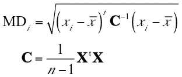

马哈拉诺比斯距离。

**X** 是大小为 *n* × *p、*的数据矩阵，其中 *p* 是变量的个数， *n* 是观测值的个数。 ***x*** *ᵢ* 是一个观察值(一行 **X** )， ***x̄*** 是均值向量， **C** 是样本协方差矩阵，它给出了关于数据的协方差结构的信息——即由协方差矩阵指定的椭球形状。

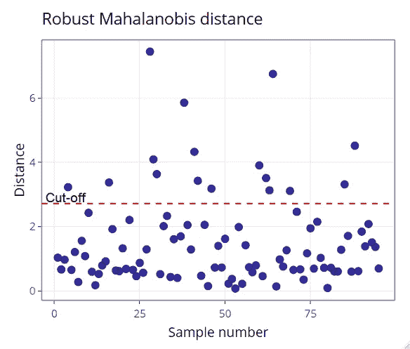

稳健的 Mahalanobis 距离与样本(观察)数量的关系。

为了识别异常值候选，计算 MD 并与等于卡方分布的 0.975 分位数的**截止值**进行比较，其中 *m* 自由度， *m* 是变量的数量。这是因为多元正态数据的多维度遵循卡方分布。尽管, [Hardin 和 Rocke (2005)](https://www.jstor.org/stable/27594157?seq=1) 已经报告使用 *F* 分布找到了更好的近似值，特别是对于小样本量。尽管如此，卡方分布对于近似马哈拉诺比斯距离的平方仍然是相当好的。因此，如果出现以下情况，观察值将被视为异常值候选值:

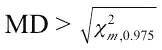

马哈拉诺比斯距离的截止值。

然而，这种方法有两个主要问题:(1)算术平均值和样本协方差矩阵对异常值敏感,( 2)协方差矩阵 **X** ᵗ **X** 必须是可逆的——更正式地说是非奇异的。前者通过应用稳健统计学来解决，而后者显然是化学计量学中经常遇到的高维数据的严重限制，其中 *p* ≫ *n.* 事实上，即使选择使用稳健版本的 MD，也存在相同的限制，该 MD 源自最小协方差行列式(MCD)估计器，而不是经典的 MD。

# 稳健主成分分析

在化学计量学中，主成分分析(PCA)广泛用于探索性分析和降维，并可用作离群点检测方法。

事实上，PCA 得分经常与 Mahalanobis 距离(或 95%置信水平下的 Hotelling T)结合使用，以确定一个观测值离包含大多数观测值的椭圆区域的质心有多远。

植物样品的 LIBS 光谱的 PCA 得分，霍特林的 *T* 的置信限为 95%。数据点的透明度显示了每个样品对第一组分的贡献。最暗的样本是贡献最大的样本。

然而，这种方法并不稳健，因为传统的 PCA 依赖于样本协方差矩阵 **C** ，因此对异常值观测极为敏感，如上图所示。这样做的后果是双重的:一方面，由主成分解释的方差向异常值方向膨胀，因此掩盖了偏离常规观察值的观察值——所谓的 ***掩盖*效应**。另一方面，常规观测可能被错误地标记为异常值——所谓的 ***淹没*效应**。

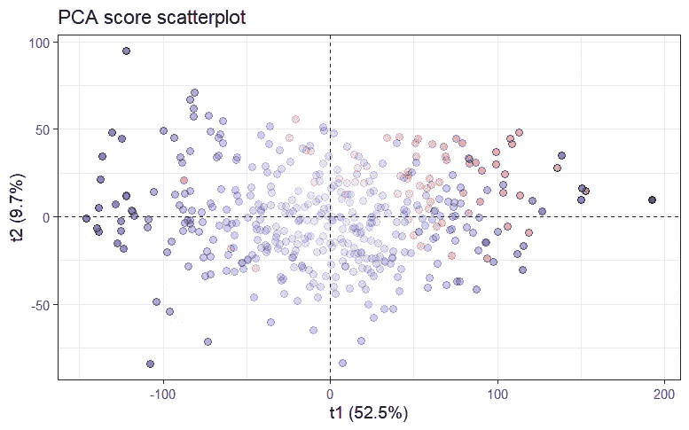

相同的 PCA 分数，但是增加了两种颜色:(红色)和(蓝色)没有测量误差。前者(70 个样本)与无误差测量值(369 个样本)无法区分，尽管它们似乎集中在右上角，这可能指示类似的误差。

因此，为了避免这些影响，在过去的几十年中，已经提出了许多鲁棒版本的 PCA，它们基于协方差矩阵的鲁棒估计(每个都以它们的崩溃点为特征)，借助于 S 估计器、MM 估计器、(快速)MCD 估计器或重新加权的 MCD- (RMCD)估计器。然而，这些方法仅限于小规模或中等规模，因为稳健估计仅适用于观测值数量至少为变量数量两倍的情况(*n*2*p*)。

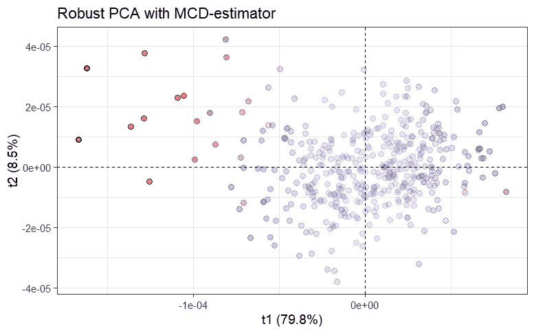

植物样本的稳健 PCA (Fast-MCD)评分。在进行稳健主成分分析之前，进行特征选择以降低维数。在这里，我们可以更好地区分有(红色)和没有(蓝色)误差的测量。结果是前者对第一分量的贡献最大(暗红色)。

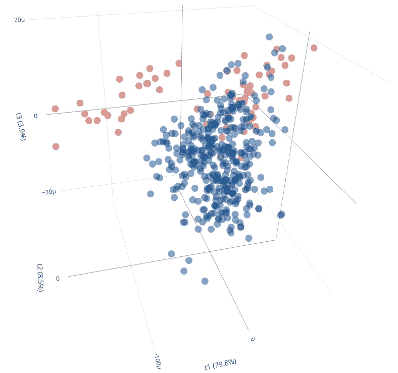

植物样本的 3D 得分图。现在我们可以看到红色样本形成了两个独立的集群。第一个明显地与无误差的测量分开，而第二个仍然难以辨别，但是聚集在常规值之上。

已经开发了另一组健壮的 PCA 方法，它们更适合于在样本大小低于维度的情况下处理高维数据( *p ≫ n* )。这些方法是:
●投影寻踪鲁棒 PCA(PP-PCA)
●球形 PCA (SPCA)
●鲁棒 PCA (ROBPCA)
●鲁棒稀疏 PCA (ROSPCA)

稳健主成分分析的投影寻踪方法最初由[李和陈(1985)](https://www.jstor.org/stable/2288497?seq=1) 提出，其基础是寻找使投影指数最大化的方向。PP-PCA 使用中间绝对偏差(MAD)或 Qn 估计量作为投影指数，而不是方差。SPCA 是由[洛坎托雷*等人*衍生出来的。(1999)](https://link.springer.com/article/10.1007/BF02595862) 旨在将数据投影到单位球面上以减轻离群点影响。像 PP-PCA 一样，SPCA 使用 MAD 或 Qn-估计量作为对价差的稳健估计。

最近， [Hubert *等人*引入了 ROBPCA 和 ROSPCA。2005 年](https://www.tandfonline.com/doi/abs/10.1198/004017004000000563)和由[休伯特*等人*出版。2015](https://amstat.tandfonline.com/doi/abs/10.1080/00401706.2015.1093962#.Xgpdb2aZMnU) 。ROBPCA 将投影寻踪方法与基于低维空间 RMCD 的稳健协方差估计相结合。有趣的是，ROBPCA 比上述方法快得多，并且具有适用于对称分布数据和偏斜数据的优点。 2009) 。另一方面，ROSPCA 源于 ROBPCA，但使用稀疏 PCA ( [邹*等* 2006](https://amstat.tandfonline.com/doi/abs/10.1198/106186006X113430#.Xg90xWaZMnV) )代替 PCA。

# 不同类型的异常值

在简要回顾了基于鲁棒 PCA 的离群点检测方法之后，值得一提的是离群点可以分为两类:**杠杆点**和**正交离群点**。如下图所示，杠杆点类别可分为**好** **杠杆点**和**坏杠杆点**。顾名思义，一个可以有正面效果，而另一个有负面效果。

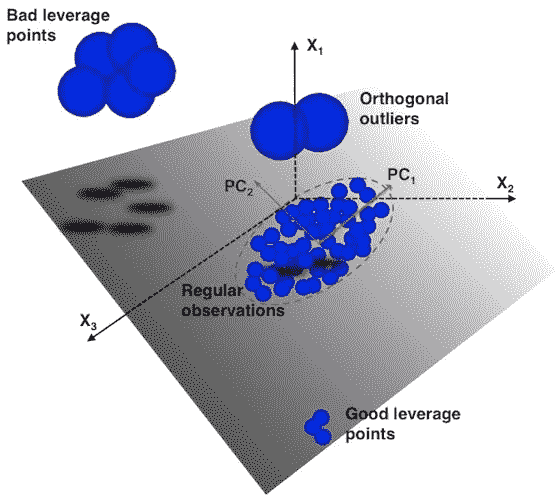

二维 PCA 子空间上不同类型异常值的图示。图片来源:克里斯蒂安·古吉。

杠杆点和正交异常值通过它们各自的**分数和正交距离来区分。**这些距离告诉我们一个观察距离常规观察定义的椭圆中心有多远(得分= 0)。得分距离(SD)是属于 *k* 维 PCA 子空间的观测值和该子空间的原点之间的距离的度量。正交距离(OD)测量来自 *k* 维 PCA 子空间的观察的偏差，即缺乏拟合。

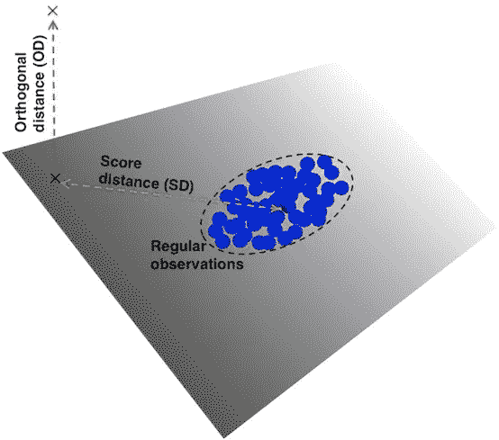

分数和正交距离的图示。图片来源:克里斯蒂安·古吉。

因此，杠杆点的特征在于高得分距离，而正交异常值的特征在于高正交距离。同样，好的和坏的杠杆点通过它们各自的正交距离来区分。不良杠杆点比良好杠杆点显示更高的正交距离。

在第 *k* 维 PCA 子空间上第 *i-* 次观察的得分距离由下式给出

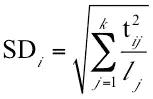

得分距离

其中 ***l*** 是 MCD 散布矩阵的特征值，并且 **t** 是鲁棒分数，对于每个 *j* = 1，.。。， *k* 。像马哈拉诺比斯距离一样，远离平方得分距离的截止值是从具有 *k* 自由度的卡方分布的 0.975 分位数获得的。

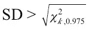

得分距离的临界值。

相应的正交距离由下式给出

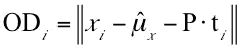

正交距离。

其中 **P** 是加载矩阵，③*ₓ*是中心的稳健估计。使用卡方分布的[威尔逊-希尔弗蒂近似法](https://www.rasch.org/rmt/rmt162g.htm)获得正交距离的截止值。因此，正交距离的 2/3 次方近似呈正态分布。因此，异常值观察值的临界值由下式给出

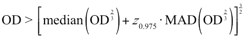

正交距离的截止值。

其中 *Z* ₀.₉₇₅是标准正态分布的 0.975 分位数。

## 离群图

离群图提供了一个强大的图形工具，可以直观地识别不同类型的离群值。

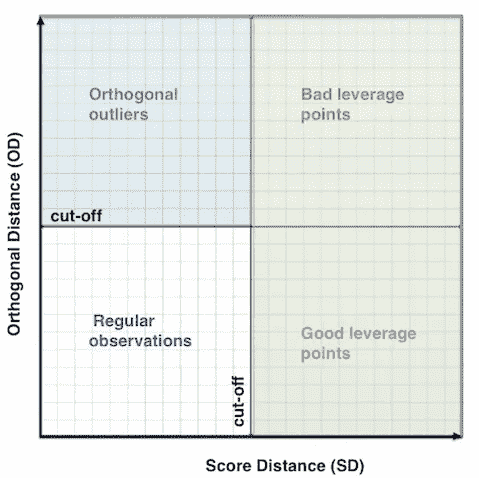

异常值地图的插图。

对于数据集中的每个观察，分数距离和正交距离绘制在 *x-* 和 *y* 轴上。它们各自的截止值将地图分为四个象限:
—常规观测值在地图的左下角，
—正交异常值在地图的左上角，
—杠杆点在右侧，好的杠杆点在底部，不好的杠杆点在顶部。

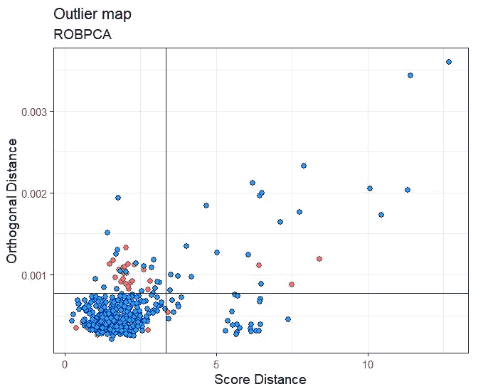

使用植物样本的 LIBS 光谱从 ROBPCA 获得的异常值图。

上图是用 ROBPCA 得到的。处理大小为 439×7153 的数据矩阵需要 15.86 秒的执行时间(笔记本电脑，2.80GHz)。我们可以看到，大多数测量值都在常规观测值的象限内，而一些测量值被标记为正交异常值和不良杠杆点。其中一些是很好的杠杆点。另一方面，有误差的测量值大多是正交异常值，尽管有些被认为是常规观测值。