# 向量自回归(VAR)模型的现实应用

> 原文：<https://towardsdatascience.com/multivariate-time-series-forecasting-456ace675971?source=collection_archive---------1----------------------->

## 多元时间序列分析与预测的综合研究


维克多·罗德里格兹在 [Unsplash](https://unsplash.com?utm_source=medium&utm_medium=referral) 上的照片

**多元时间序列分析**

单变量时间序列数据只包含一个时间相关变量，而多变量时间序列数据包含多个时间相关变量。我们通常使用多元时间序列分析来建模和解释变量之间有趣的相互依赖和共同运动。在多变量分析中，假设与时间相关的变量不仅依赖于它们过去的值，还显示出它们之间的相关性。多变量时间序列模型利用相关性为特定的给定数据提供更可靠和准确的预测，尽管单变量分析通常优于多变量分析[1]。在本文中，我们应用了一种多变量时间序列方法，称为真实世界数据集上的向量自回归(VAR)。

**向量自回归(VAR)**

VAR 模型是一个随机过程，它将一组与时间相关的变量表示为它们自己的过去值和该组中所有其他变量的过去值的线性函数。

例如，我们可以考虑双变量时间序列分析，该分析将每小时温度和风速之间的关系描述为过去值的函数[2]:

*温度(t) = a1 + w11*温度(t-1) + w12*风(t-1) + e1(t-1)*

*风(t) = a2 + w21*温度(t-1)+w22 *风(t-1) +e2(t-1)*

其中 a1 和 a2 是常数；w11、w12、w21 和 w22 是系数；e1 和 e2 是误差项。

**数据集**

Statmodels 是一个 python API，允许用户探索数据、估计统计模型和执行统计测试[3]。它还包含时间序列数据。我们从 API 下载一个数据集。

要下载数据，我们必须安装一些库，然后加载数据:

```
import pandas as pd
import statsmodels.api as sm
from statsmodels.tsa.api import VAR
data = sm.datasets.macrodata.load_pandas().data
data.head(2)
```

输出显示了整个数据集的前两个观察值:

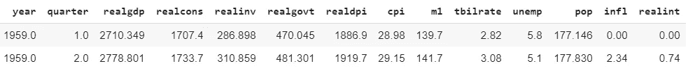

数据集的片段

该数据包含许多时间序列数据，我们仅采用两个时间相关变量“realgdp”和“realdpi”进行实验，并使用“year”列作为数据的索引。

```
data1 = data[["realgdp", 'realdpi']]
data1.index = data["year"]
```

输出:

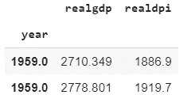

数据片段

让我们将数据可视化:

```
data1.plot(figsize = (8,5))
```

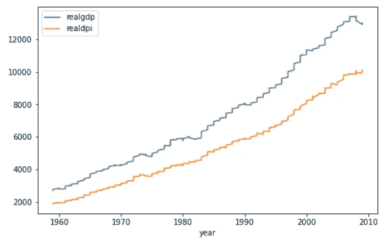

随着时间的推移，这两个系列都显示出略有起伏的增长趋势。

**静止**

在应用 VAR 之前，两个时间序列变量都应该是平稳的。这两个序列都不是稳定的，因为这两个序列都不显示随时间变化的恒定均值和方差。我们也可以执行一个统计测试，如扩展的 Dickey-Fuller 测试(ADF ),使用 AIC 标准来寻找序列的平稳性。

```
from statsmodels.tsa.stattools import adfuller
adfuller_test = adfuller(data1['realgdp'], autolag= "AIC")
print("ADF test statistic: {}".format(adfuller_test[0]))
print("p-value: {}".format(adfuller_test[1]))
```

输出:

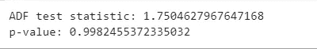

平稳性的统计测试结果

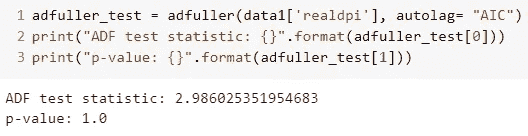

在这两种情况下，p 值都不够显著，这意味着我们不能拒绝零假设并得出序列是非平稳的结论。

**差异**

由于两个序列都不是平稳的，我们进行差分，然后检查平稳性。

```
data_d = data1.diff().dropna()
```

**“实际国内生产总值”**序列在对原始序列进行第一次差分后变得稳定，因为测试的 p 值具有统计显著性。

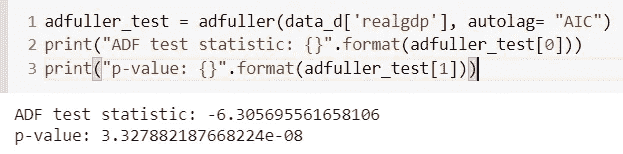

一元差分实际 gdp 数据的 ADF 检验

**“real dpi”**系列在对原始系列进行第一次差分后变得平稳，因为测试的 p 值具有统计显著性。

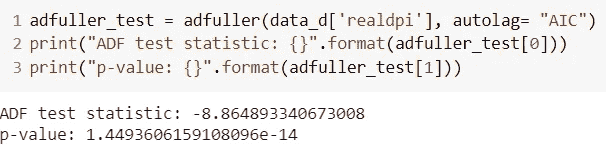

一个差分 realdpi 数据的 ADF 测试

**型号**

在本节中，我们将 VAR 模型应用于一个差分序列。我们对数据进行训练测试分割，并将最近 10 天的数据作为测试数据。

```
train = data_d.iloc[:-10,:]
test = data_d.iloc[-10:,:]
```

**寻找 VAR 模型的最优阶**

在 VAR 建模过程中，我们选择使用 AIC 的信息准则作为模型选择准则来进行最优模型识别。简而言之，我们根据最佳 AIC 分数选择 VAR 的阶数(p)。一般来说，AIC 会因模型过于复杂而对其进行惩罚，尽管复杂的模型在其他一些模型选择标准上可能表现得稍好一些。因此，我们期望在搜索顺序(p)时出现拐点，这意味着，AIC 分数应该随着顺序(p)变大而降低，直到某个顺序，然后分数开始增加。为此，我们执行网格搜索来研究最佳顺序(p)。

```
forecasting_model = VAR(train)results_aic = []
for p in range(1,10):
  results = forecasting_model.fit(p)
  results_aic.append(results.aic)
```

在代码的第一行:我们用训练数据训练 VAR 模型。剩下的代码:执行一个 for 循环，找出从 1 到 10 的拟合顺序的 AIC 分数。我们可以将结果可视化(AIC 相对于订单的得分)以更好地理解拐点:

```
import seaborn as sns
sns.set()
plt.plot(list(np.arange(1,10,1)), results_aic)
plt.xlabel("Order")
plt.ylabel("AIC")
plt.show()
```

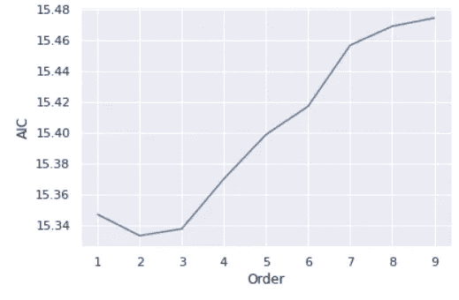

研究 VAR 模型的最优阶

从图中可以看出，最低的 AIC 分数是在 2 的数量级上获得的，然后 AIC 分数显示出随着数量级 p 变大而增加的趋势。因此，我们选择 2 作为 VAR 模型的最优阶。因此，我们将订单 2 拟合到预测模型中。

让我们检查一下模型的概要:

```
results = forecasting_model.fit(2)
results.summary()
```

摘要输出包含很多信息:

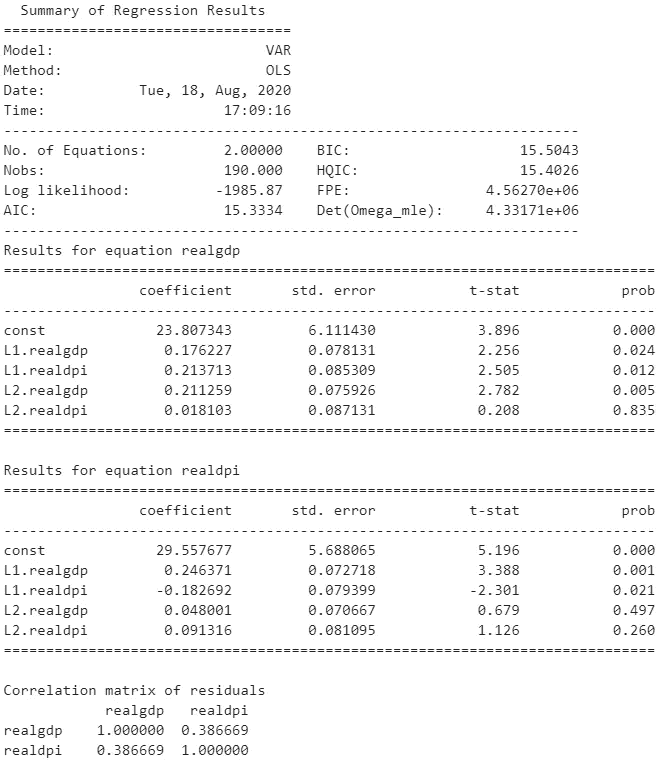

**预测**

我们使用 2 作为拟合 VAR 模型的最佳阶数。因此，我们采用训练数据中的最后两步来预测下一步(即测试数据的第一天)。

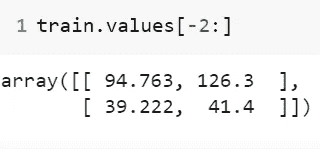

预测测试数据

现在，在拟合模型后，我们预测测试数据，其中最后 2 天的训练数据设置为滞后值，步骤设置为 10 天，因为我们希望预测接下来的 10 天。

```
laaged_values = train.values[-2:]forecast = pd.DataFrame(results.forecast(y= laaged_values, steps=10), index = test.index, columns= ['realgdp_1d', 'realdpi_1d'])forecast
```

输出:

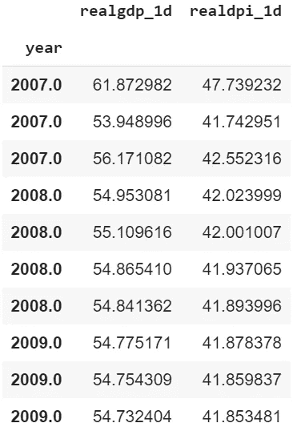

一阶差分预测

我们必须注意，上述预测是针对一个差分模型的。因此，我们必须将第一个差异预测转换为原始预测值。

```
forecast["realgdp_forecasted"] = data1["realgdp"].iloc[-10-1] +   forecast_1D['realgdp_1d'].cumsum()forecast["realdpi_forecasted"] = data1["realdpi"].iloc[-10-1] +      forecast_1D['realdpi_1d'].cumsum() 
```

输出:

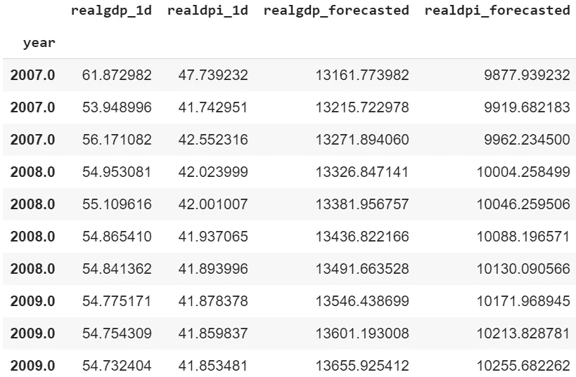

1 个差异系列和原始系列的预测值

前两列是 1 个差异系列的预测值，后两列显示原始系列的预测值。

现在，我们通过 VAR 可视化原始测试值和预测值。

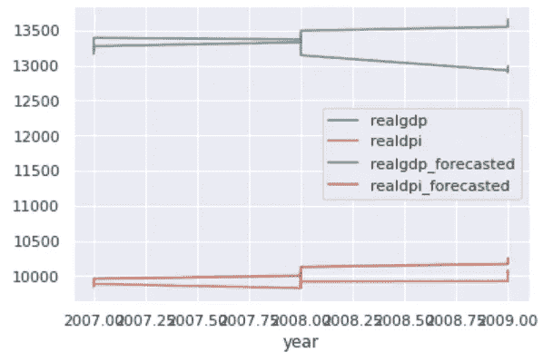

realgdp 和 realdpi 的原始值和预测值

原始的 realdpi 和预测的 realdpi 在预测的日子里显示出相似的模式。对于实际 gdp:预测值的前半部分显示出与原始值相似的模式，另一方面，预测值的后半部分不遵循相似的模式。

总之，在本文中，我们讨论了多元时间序列分析，并在真实世界的多元时间序列数据集上应用了 VAR 模型。

也可以阅读文章— [*一个真实世界的时间序列数据分析与预测*](/a-real-world-time-series-data-analysis-and-forecasting-121f4552a87) *，*其中我应用了 ARIMA(单变量时间序列分析模型)对单变量时间序列数据进行预测。

**参考**

[1][https://homepage.univie.ac.at/robert.kunst/prognos4.pdf](https://homepage.univie.ac.at/robert.kunst/prognos4.pdf)

[2][https://www . aptech . com/blog/introduction-to-the-fundamentals-of-time-series-data-and-analysis/](https://www.aptech.com/blog/introduction-to-the-fundamentals-of-time-series-data-and-analysis/)

[3][https://www.statsmodels.org/stable/index.html](https://www.statsmodels.org/stable/index.html)