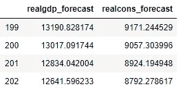

# 多元时间序列预测

> 原文：<https://towardsdatascience.com/multivariate-time-series-forecasting-653372b3db36?source=collection_archive---------3----------------------->

## Python 中向量自回归(VAR)的实现


照片由[阿伦视觉](https://unsplash.com/@aronvisuals?utm_source=medium&utm_medium=referral)在 [Unsplash](https://unsplash.com?utm_source=medium&utm_medium=referral) 上拍摄

使用时间序列数据来了解过去和预测未来是经济和公共服务的每个部门的商业决策的一个基本部分。零售企业需要了解下个月他们需要多少存货；电力公司需要知道他们是否应该增加容量以跟上未来 10 年的需求；呼叫中心需要知道他们是否应该雇佣新员工来应对更高的呼叫量——所有这些决策都需要进行短期和长期预测，而时间序列数据分析是预测过程的重要组成部分。

单变量时间序列建模是最常用的预测方法。例如，如果您知道历史收入数据的增长率、趋势和季节性，您就可以预测未来一段时间的收入。然而，这一过程背后有一个很大的假设，即影响收入的所有其他因素(如产品需求)将继续以类似的方式产生影响。但是，当影响产品需求的因素发生变化时(例如，新的竞争产品进入市场)，这种假设往往会失效。理解这种复杂的行为需要的不仅仅是简单的单变量时间序列预测，这就是多变量时间序列分析发挥作用的地方。

本文的目的是逐步实现一种叫做[向量自回归](https://www.statsmodels.org/dev/vector_ar.html) (VAR)的多元时间序列预测技术。首先，我会给出一个直觉，并展示它如何在一个简短的 4 步实施中工作，然后我会像一个典型的机器学习算法实施一样稍微深入一点，例如探索性数据分析和可视化，将数据分成训练和测试集，模型构建，性能评估等。

所以让我们开始吧。

# 简短版

短版真的很短；不应该超过 10 行 Python 代码，我只用 4 个简单的步骤就展示了这些代码

**1)导入库**

此时只需要两个库:`pandas`用于处理数据，和`statmodels` API 用于导入向量自回归模型。

```
import pandas as pd
import statsmodels.api as sm
from statsmodels.tsa.api import VAR
```

**2)加载数据:**

我正在从`statsmodels` API 加载一个玩具数据集。该数据有几个变量，但我只加载其中的几个进行演示。

```
macrodata = sm.datasets.macrodata.load_pandas().data
data = macrodata.iloc[:, 2:4]
data.tail(2)
```


**3)合体模特**

首先，用`VAR()`实例化模型，然后用`fit()`方法拟合模型。

```
model = VAR(data)
model_fit = model.fit()
```

**4)做一个预测**

现在，您可以使用模型提前一步进行预测了。结果打印出两个变量的数组。

```
pred = model_fit.forecast(model_fit.y, steps=1)
print(pred)
```


# 长篇版本

短版本很短，但长版本可能很长，这取决于你想在哪里停下来。您可以从将时间序列数据转换成一个 *ts* 对象开始，根据项目目标，进行各种各样的[时间序列 EDA](/introduction-to-interactive-time-series-visualizations-with-plotly-in-python-d3219eb7a7af) (探索性数据分析)来调整和评估模型性能。

## 1)导入库

所需的初始库集与“短”版本相同，但是我们添加了一个绘图库`matplotlib`来可视化时间序列对象。

```
# loading essential libraries first
import pandas as pd
import statsmodels.api as sm
from statsmodels.tsa.api import VAR
import matplotlib.pyplot as plt
```

## 2)导入、检查和争论数据

导入数据后，您应该经历您通常的数据争论仪式(选择感兴趣的列、重命名、汇总统计等。).但是一个必要的步骤是找出是否有 NA 值，如果有，你需要处理它们([见这里](https://pandas.pydata.org/pandas-docs/stable/user_guide/missing_data.html))。作为数据争论的一部分，出于可视化的目的，您可能还想以不同的方式分割/转换数据。

```
# data
mdata = sm.datasets.macrodata.load_pandas().data
df  = mdata.iloc[:, 2:4]
df.head()
```


## 3)想象

如果您想对时间序列数据进行 EDA，您还需要做一些额外的工作，比如将数据转换成时间序列对象。但至少，您可能希望将数据可视化，以查看趋势线的样子以及它们之间的比较。它为您提供了模型评估所需的必要直觉。

```
plt.plot(df)
```


## 3)因果关系测试

你会想看看变量之间是否有关联。为此，你可以运行格兰杰因果关系测试。虽然顾名思义，这真的不是一个“因果关系”的测试，你不能说一个是另一个的原因，你只能说变量之间是否有关联。

```
# import for Granger's Causality Test
from statsmodels.tsa.stattools import grangercausalitytestsgranger_test = sm.tsa.stattools.grangercausalitytests(df, maxlag=2, verbose=True)
granger_test
```


## 4)拆分数据

与大多数机器学习算法一样，将数据分成训练集和测试集是一个好主意。

```
nobs = 4
df_train, df_test = df[0:-nobs], df[-nobs:]
```

## 5a)检查稳定性

对于时间序列建模，数据需要是静态的——这意味着如果数据中有趋势，你需要摆脱它。为了检查数据是否是稳定的，有一种测试叫做扩展的 Dickey-Fuller (ADF)测试。

```
# Augmented Dickey-Fuller Test (ADF Test)/unit root test
from statsmodels.tsa.stattools import adfullerdef adf_test(ts, signif=0.05):
    dftest = adfuller(ts, autolag='AIC')
    adf = pd.Series(dftest[0:4], index=['Test Statistic','p-value','# Lags','# Observations'])
    for key,value in dftest[4].items():
       adf['Critical Value (%s)'%key] = value
    print (adf)
        p = adf['p-value'] if p <= signif:
        print(f" Series is Stationary")
    else:
        print(f" Series is Non-Stationary")#apply adf test on the series
adf_test(df_train["realgdp"])
adf_test(df_train["realcons"])
```


## 5b)制作数据文具

如果数据不是稳定的，你可以用几种方法，但最简单的一种是采用[一阶差分](https://people.duke.edu/~rnau/411diff.htm)。在进行第一次差分后，您需要返回到上一步，再次测试数据现在是否是稳定的。如果不是，第二个区别可能是必要的。

```
# 1st difference
df_differenced = df_train.diff().dropna()# stationarity test again with differenced data
adf_test(df_differenced["realgdp"])
```


## 6)建模

现在，您可以用`VAR()`实例化模型，然后使模型适合第一个差异数据。运行模型后，您可以查看下面的总结结果。

```
# model fitting
model = VAR(df_differenced)
results = model.fit(maxlags=15, ic='aic')
results.summary()
```


## 7)预测

既然你已经建立了你的模型，是时候玩它并做实际的预测了。在这里，我要求模型预测未来 5 步。该模型为这两个变量返回 5 个预测值的数组。

```
# forecasting
lag_order = results.k_ar
results.forecast(df.values[-lag_order:], 5)
```


## 8)绘图

现在可以绘制预测值以及相关的标准误差。

```
# plotting
results.plot_forecast(20)
```


## 9)评估

这是使用`fevd()`函数的预测误差方差分解(FEVD)方法评估预测模型的额外步骤。

```
# Evaluation
fevd = results.fevd(5)
fevd.summary()
```


## 10)反转

还有最后一步。您没有使模型适合原始数据，因为您必须在步骤 5b 中转换(第一次差分)它以使数据稳定。所以预测结果需要倒回到原来的形式。

```
# forecasting
pred = results.forecast(results.y, steps=nobs)
df_forecast = pd.DataFrame(pred, index=df.index[-nobs:], columns=df.columns + '_1d')
df_forecast.tail()# inverting transformation
def invert_transformation(df_train, df_forecast, second_diff=False):
    """Revert back the differencing to get the forecast to original scale."""
    df_fc = df_forecast.copy()
    columns = df_train.columns
    for col in columns:        
        # Roll back 2nd Diff
        if second_diff:
            df_fc[str(col)+'_1d'] = (df_train[col].iloc[-1]-df_train[col].iloc[-2]) + df_fc[str(col)+'_1d'].cumsum()
        # Roll back 1st Diff
        df_fc[str(col)+'_forecast'] = df_train[col].iloc[-1] + df_fc[str(col)+'_1d'].cumsum()
    return df_fc# show inverted results in a dataframe
df_results = invert_transformation(df_train, df_forecast, second_diff=True)        
df_results.loc[:, ['realgdp_forecast', 'realcons_forecast']]
```



# 离别笔记

时间序列数据分析是商业决策的基本组成部分，因此决策者和数据科学家/分析师可以从对预测模型机制的某种程度的熟悉中受益。文章首先介绍了多元时间序列的概念及其在不同行业中的应用。然后，我提供了一个简短的 python 实现，作为一种使用机器学习方法为更复杂的实现提供直觉的方式。

如有任何相关问题，可以通过[推特](https://twitter.com/DataEnthus)联系我。