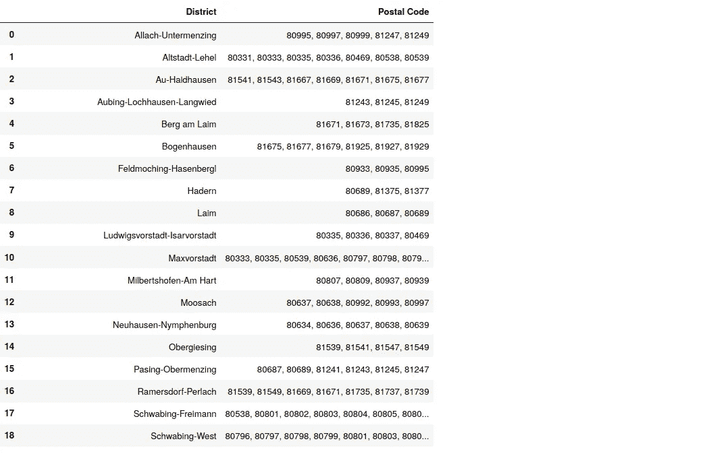
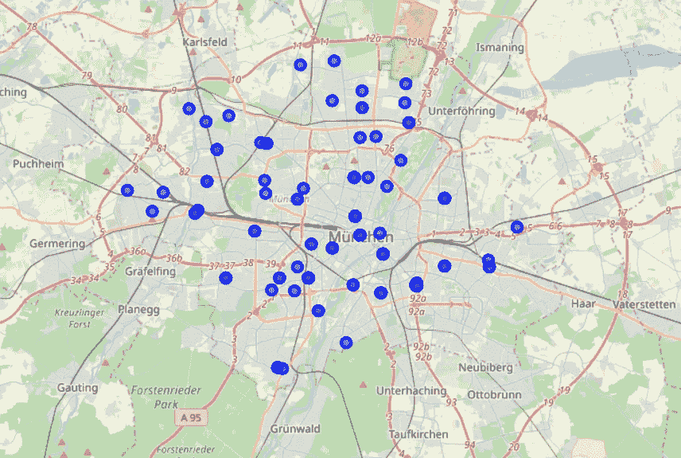
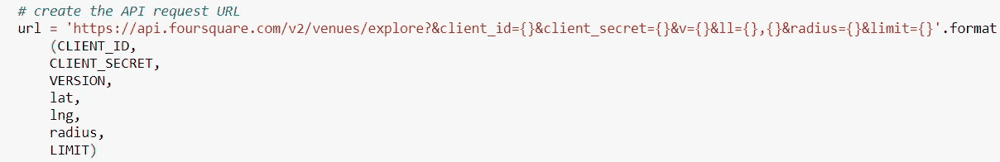
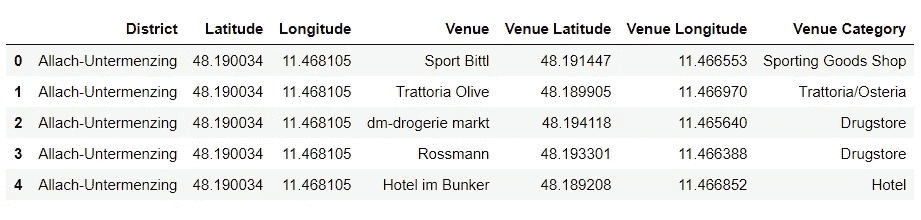
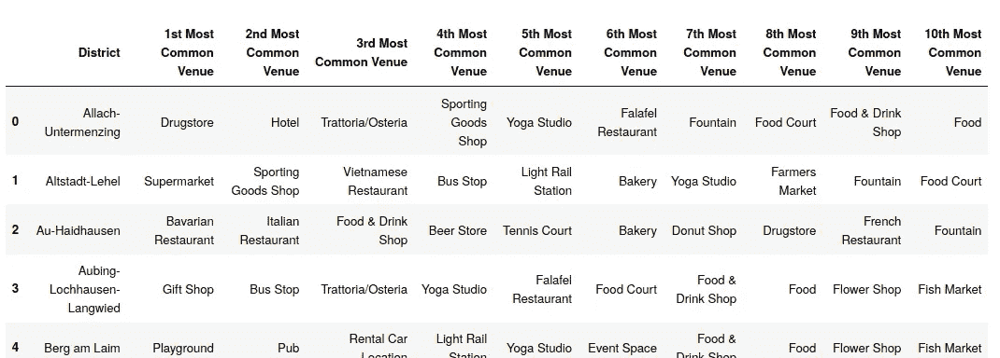
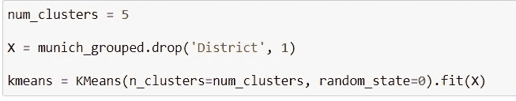
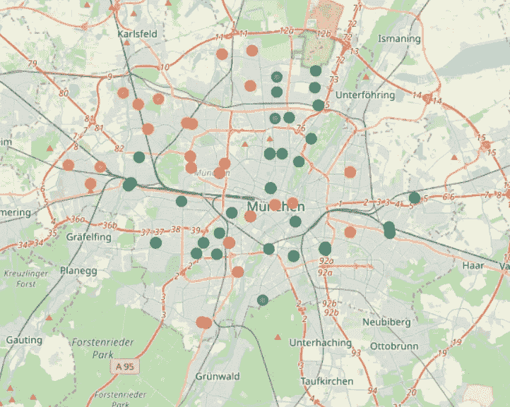

# 使用 K-Means 算法的慕尼黑邻域聚类

> 原文：<https://towardsdatascience.com/munich-neighborhood-clustering-using-k-means-cde98a6e3199?source=collection_archive---------38----------------------->

克里斯托夫·基尔在 [Unsplash](https://unsplash.com?utm_source=medium&utm_medium=referral) 上的照片

# 介绍

这篇博客文章总结了 Coursera 上 IBM 数据科学专业的顶点项目的结果。在本项目中，德国慕尼黑的街区将根据其场馆数据使用 K 均值聚类算法进行聚类。代码是使用 jupyter 笔记本环境用 python 编写的，可以在我位于 https://github.com/patrickbrus/Coursera_Capstone[的 Github 仓库中找到。第一部分描述了业务问题以及如何解决它。第二部分描述了用于创建邻域聚类的数据及其来源和方法。第三部分介绍了结果并对其进行了讨论。最后一部分对所有的工作和结果进行了总结。](https://github.com/patrickbrus/IBM_DataScience_Capstone)

# 商业问题

慕尼黑是德国的一个大城市，拥有大约 150 万人口。它是德国联邦州巴伐利亚的首府。慕尼黑以慕尼黑啤酒节而闻名，在巴伐利亚被称为“Wiesn ”,每年九月底举行。现在，让我们假设一个人已经住在慕尼黑，并想搬到一个新的公寓。但是这个人是如此热爱他的邻居，以至于他或她想搬到一个和原来非常相似的邻居家。但是很难找到一个和旧街区相似的街区。应该使用哪个标准来衡量相似性？如何收集数据？应该使用哪些数据？一种想法是使用慕尼黑所有地区的场馆数据，以便为每个街区创建聚类。然后可以使用这些聚类来基于地点数据找到相似的邻域。这项任务对于一些机器学习来说听起来很完美，作为算法，将使用 K-Means 无监督聚类算法。

# 数据和方法

需要慕尼黑所有区的邮政编码和区名来解决该任务。在[https://www.muenchen.de/int/en/living/postal-codes.html](https://www.muenchen.de/int/en/living/postal-codes.html)发布的数据用于获取必要的数据。使用熊猫库和内置的***PD . read _ html()****函数获取数据。该函数抓取网站上的可用数据，并将所有表存储在数据框中。在图 1 中可以看到该页面数据的概览，因此可以看到所有地区和相应的邮政编码。*

**

*图 1:慕尼黑所有地区及其邮政编码概览*

*可以看出，每个地区都有不止一个邮政编码。这是因为所有地区都很大，为了更好地定位，需要进一步划分。因此，作为第一步，每个邮政编码在一个新的 pandas 数据框中获得自己的条目，以便获得关于每个邮政编码中心周围小半径范围内的场馆的更详细信息。此外，提取每个邮政编码的纬度和经度值，并将其存储在新的数据框中。稍后需要它们来获取每个地区的场馆数据。python geopy 库用于获取纬度和经度值。这个库只需要一个街区的名称，也接受邮政编码，并返回给定地址的纬度和经度值。图 2 显示了慕尼黑所有唯一邮政编码及其经度和纬度位置的地图。*

**

*图 2:按邮政编码划分的慕尼黑地区地图*

*下一步，为每个邮政编码提取可用的前 100 个地点。对于这个任务，执行对 Foursquare API 的 API 调用。Foursquare API 为商业目的和开发者提供来自世界各地的位置数据。图 3 显示了执行对 Foursquare API 的 API 调用所需的 URL 格式。一个开发者只需要一个免费的开发者账号。*

**

*图 3:创建请求 URL 以调用 Foursquare API 的 Python 代码*

*接收到的每个地区的地点被存储在具有 **(3561，7)** 形状的新数据帧中。图 4 显示了这个新数据帧的头部。*

**

*图 4:包含每个邮政编码区内的场馆的新数据帧的头部*

*总共有 200 个独特的场地类别可用。作为下一步，必须为聚类算法准备数据。一般来说，K-Means 算法只适用于数字数据，而我们有分类数据。为了能够应用 K-Means 算法，场所类别首先必须得到一个热编码。此外，独热码编码数据帧按区分组，以便每个区有一行和一个簇。当数据被分组时，如果一个场馆类别在一个区内出现不止一次，则一次性编码的类别被汇总。为了获得相同比例且小于 1 的值，每个类别出现频率的平均值将存储在数据框中。为了更深入地了解数据，我们计算了每个地区最常见的 10 个场馆，并将其存储在一个名为“district _ venues _ sorted”的新数据框中。图 5 显示了这个数据帧的摘录。*

**

*图 5:每个地区十大最常见的场馆*

*现在，K-Means 聚类算法得到应用。作为输入，该算法获得包含一次性编码场馆类别的数据帧，其中取类别出现频率的平均值，并按每个地区分组。district 列本身被删除，集群的数量被设置为 5。图 6 显示了相应的 python 代码。作为库，使用 scikit-learn 库。*

**

*图 6:K 均值聚类算法的 Python 代码*

*最后，使用库 Folium 再次创建所有集群的映射。图 7 显示了包含慕尼黑所有聚集街区的结果地图。*

**

*图 7:慕尼黑聚集区地图*

*最后一步，根据最常出现的场馆对每个集群进行检查，并对集群进行相应的命名。*

# *结果和讨论*

*如图 7 所示，绿色集群是慕尼黑最常见的集群，因此慕尼黑似乎有很多类似的区域。蓝色集群更多地位于慕尼黑的外部边界，而其他集群更多地分布在城市的整个区域。因此，用户现在可以查看各个地区，并可以将他喜欢的地区与其他地区进行比较。这可以帮助他在他喜欢的地区找到一个新的公寓，或者在另一个社区找到活动，这个社区与他喜欢的已经知道的社区相似。
经过对集群的进一步探索，每个集群可以得到一个最常见的场地。因此，集群可以通过其最常见的地点来命名。在我们的例子中，编号为 0 的聚类(绿色聚类)具有最多的咖啡馆，因此是咖啡馆聚类。在第一个集群(红色集群)中，广场和教堂是最常见的场所，因此它被命名为广场+教堂集群。第二个集群(蓝色集群)有许多巴伐利亚餐馆，因此得名巴伐利亚集群。这个集群将是我最喜欢的，因为它也包含了许多爱尔兰酒吧。第三个集群(紫色集群)是最小的一个，包含了很多汤的场地。因此这就是汤串。最后一个集群(黄色集群)是游乐场集群，特别适合有孩子的家庭。*

# *结论*

*慕尼黑的街区现已聚类，包含结果的地图也已可用。此外，每个聚类值都绘制在相应的 jupyter 笔记本中，以便为用户提供所有聚类的更多详细信息。*