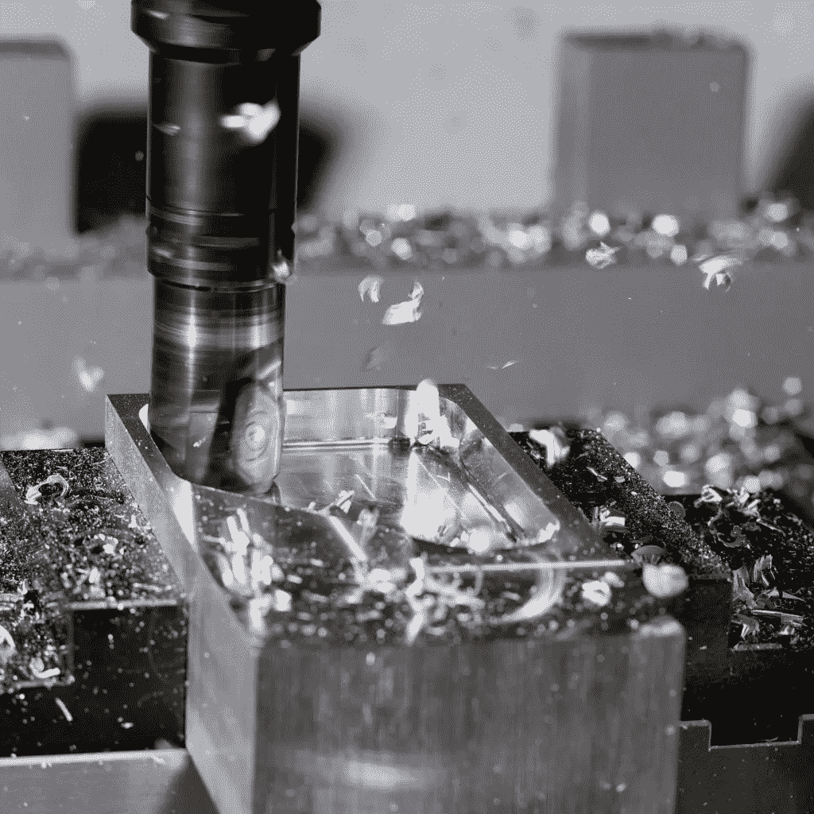
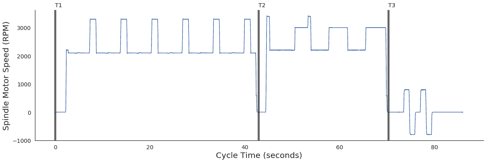
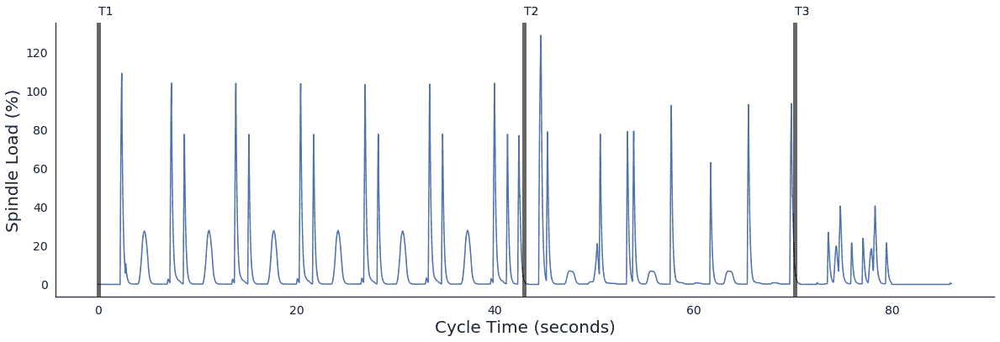
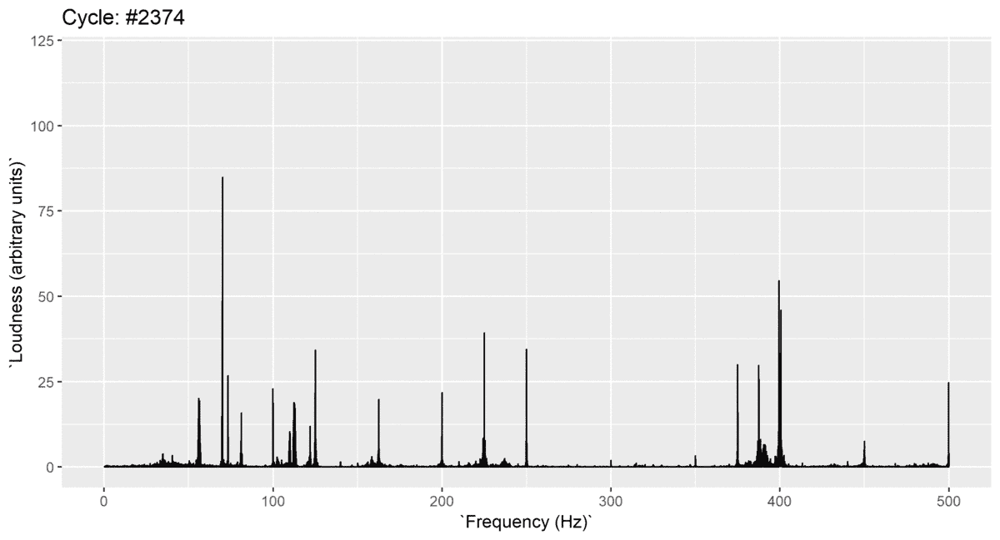

# 介绍..首届机器度量 8 分会场🎵

> 原文：<https://towardsdatascience.com/music-f-9dd7c44d713f?source=collection_archive---------51----------------------->

## 我们应用数字信号处理技术，在没有任何传感器或麦克风的情况下，从机床的控制中提取声音，这样你就可以听到机器的声音，而无需踏上工厂的地板。这使我们更接近预测加工的可扩展大规模部署。

来源:Monashee 制造公司

**简介**

在我们的上一篇博客[帖子](https://medium.com/machinemetrics-techblog/unlocking-the-power-of-high-frequency-control-data-ad2608aac10f?source=collection_home---4------0-----------------------)中，我们将机器 PLC(可编程逻辑控制)数据比作能够听到来自机器的完整交响乐。我们最近发现，我们的比喻并不遥远…我们可以通过我们收集的原始 PLC 数据听到机器发出的声音，而无需任何麦克风。使用数字信号处理的方法，这些是我们提取的纯加工声音的一些例子。在这里随便逛逛。

接受更好标题的建议。

这是“值得注意的”🥁，因为我们从机械师那里听到的最常见的重复是，在机器发生故障之前，他们可以听到指示其操作有问题的听觉线索。

在我们公司的早期，我们尝试过使用安装在机床机柜内部的 MEMS 麦克风，结合深度学习方法来复制操作者的耳朵，但我们的实验最终没有成功，因为在一个机械车间里有其他噪音的干扰。一个真实的、活跃的机器车间是一个高度异构的环境，受到各种喧嚣的影响。

为了解决这个问题，我们提出了一种不使用*任何*外部传感器的方法。我们目前在研究方面的进步已经使我们能够仅利用 PLC 数据创建模拟声音，使我们能够提取没有工厂噪音的纯净、纯正的加工声音。

实质上，我们应用了一种技术，可以提取从 PLC 获得的负载和主轴速度数据中的潜在谐波，结果我们只通过这两个信号就能“听到”机器。在这篇文章中，我们将回顾我们是如何做到这一点的，以及它对行业的一些启示。

**为什么从 PLC 加工数据开始？**

机器控制必须保持加工过程的准确实时图像，以便正常运行并使其操作者获得适当的信息。为此，控制器不断发送由嵌入(预装)在机器主轴和轴电机中的传感器产生的更新信号。我们以“高频”(1 kHz)收集这些数据，这简单地意味着它代表了一个数字化信号流，这个信号流来得如此之快，以至于对我们人类来说是连续的，就像互联网上的音频或视频流一样。

事实上，这种极其丰富的数据是通过控制手段，这意味着它有可能捕捉到它没有额外的传感器安装。这对可伸缩性有着不可思议的影响，例如:

1.  这不再需要安装传感器所涉及的集成开销
2.  我们的数据来源是标准化的——不受传感器定位、混淆等因素的影响。
3.  通过远程软件推送，我们的算法升级可以在云上实现

可以使用一套现代软件工具和算法来分析高频数据，从而对加工质量进行极其详细的监控。

对于某些控制类型，我们可以使用其现有的即插即用边缘硬件接入高频数据流。高频加工数据可以通过简单的软件升级获得，详见我们上一篇博文。

作为一个说明性的例子，让我们看看加工汽车零件的立式铣床的主轴速度和负载信号:

为了给原始信号添加一些上下文，我们选择了一个有代表性的零件周期，并覆盖了不同工具使用期之间的边界。通过我们的 edge 设备与控制装置的连接，还可以检测到袋内刀具号和 ATC(自动刀具更换器)刀具交换，因此我们可以有意义地跟踪哪个刀具在哪个时间被接合。(原始信号甚至可以根据单独的加工**操作**进行调查，通过合并我们记录的额外机器数据，但这是未来帖子的主题！)

通过查看主轴和刀库之间的一次刀具交换，我们可以快速了解这些数据有多敏感。虽然上面的速度图涵盖了 80 秒内数千 RPM 的范围，但我们放大到两秒内仅几 RPM 的范围。

我们在这里看到的是，主轴首先完全停止，然后是 T2(垂直线)交换命令，然后随着 T1 的移除，主轴方向有些抖动，最后随着 T2 就位，主轴略微旋转。

上述内容的可视化表示。数控培训中心提供

正是高频数据中的这种精细层次的细节使我们能够探测可能影响加工质量的极其细微的影响。

**机器里的音乐**

进一步放大主轴速度平稳段可以揭示这样一个微妙的影响。

虽然工厂在这段时间内很好地保持了主轴转速的稳定，但它并不完美。该速度在其编程值 2100 转/分左右摆动，幅度不到 1 转/分。粗略一看，主轴速度信号中的“噪声”似乎包含一些结构。例如，这里最大的摆动周期约为 14 毫秒。

高质量的主轴实际上通过电子反馈机制保持一致的转速，鉴于加工过程中经历的不规则扭矩，这一点至关重要。因此，主轴在努力保持其编程速度时产生的波动也可以作为切割金属所施加力的*反映。通过仔细研究这些波动，我们可以获得关于工具面和材料之间时刻相互作用的线索。因为主轴速度可以在高频率下非常稳定地监控，这为我们提供了一个独特的加工条件探头。*

为了从控制命令的总体主轴速度趋势中分离出短时间尺度反馈效应，我们首先执行一个数学平滑操作，该操作趋向于平均化波动。让我们看看在一个稍微复杂一点的切入主轴速度信号上是什么样的，其中整体趋势并不完全恒定。原始信号是蓝色的，而我们的平滑拟合是橙色的。

然后，我们获取原始信号和平滑信号之间的差异，并将它们链接在一起，以获得“纯噪声”的新信号

当声音被表示为数字信号时，这些图开始类似于声音的模式。我们可以期待类似的信息密度，但现在有效地代表了主轴电机产生的声音。事实上，这一过程涵盖的频率范围从大约 10 赫兹到 500 赫兹，与人类的听觉有很大的重叠，从三角钢琴上最低的音符到中音以上大约一个八度音。实际上，我们可以将虚拟耳朵放在主轴电机上，听它播放的曲子！

**关注加工质量**

一个周期接一个周期持续生产的零件会在主轴电机上转换成特定的旋律。就像我们在弹奏熟悉的曲子时很容易听出任何走音一样，刀具磨损或断裂导致的加工问题也可能表现为主轴速度波动模式，与符合规格的加工相比，这听起来很不寻常。

前面例子中使用的特殊铣刀在钻孔时由于工具磨损而经历过不稳定性。一旦操作员发现问题所在，这通常需要报废或返工零件。仅在一个例子中，就有 16 个连续的零件不得不扔掉，损失了数百美元的收入。

在 R&D 阶段，我们通过高频数据收集对这一事件进行了监测。作为其程序的一部分，工厂按顺序制作六个孔，我们在正常和报废零件的加工期间收集了一些声音片段。

你能听出区别吗？

从主轴速度得出的声音模式来看，这是第一个坏周期以及紧接在它之前和之后的这些切削的样子。

你能看出区别吗？

从这个角度回顾发生的事情，我们可以发现有问题的不稳定性出现的确切时刻，在质量保证发现问题之前整整 20 分钟。

**自动故障检测**

开发自动和通用检测此类事件的算法现在是我们公司正在进行的一个主要项目。通过以这种方式表示数据，我们为在录音中使用来自数字信号处理和模式识别领域的丰富的分析工具集开辟了许多可能性。但是我们已经用一些简单的技巧来测量一个给定模式有多“嘈杂”取得了重大进展。

通过在正常加工过程中监控主轴的噪声水平，可以自动了解其总体趋势和典型工作范围。然后，大量偏离可以立即被标记为有问题。应用这样的程序，我们发现导致损坏事件的几个小时的正常零件周期，随后是一连串明显的异常周期，最终由操作员更换工具。

通过根据各种音调或频率的流行来研究这些声音模式，可以获得进一步的诊断洞察力。这是通过另一种常见的数学运算完成的，即傅立叶变换。对于每个单独的周期，我们可以绘制不同频率的响度，然后检查这个图寻找线索。如果我们想象把一堆这样的图一个接一个地堆叠起来，然后制作一个动画书，我们就可以制作一个小电影，展示不同频率的响度是如何随着周期的变化而变化的。

这里明显的模式是一个信号尖峰，它在损坏事件时突然出现，然后在工具被替换后完全消失。这告诉我们，额外噪声主要以 35 Hz 的频率进入。并非巧合的是，这与主轴旋转的频率相同:35 Hz 转换为 2100 RPM。由于工具受损，主轴正经历越来越不稳定的扭矩，每转一次都会被馈送一个**额外的补偿功率**脉冲，以保持其速度稳定。跟踪主轴速度和其他指标的频率峰值可能很快成为我们自动化加工质量监控的标准功能——实际上就是留意异常声音。

**对行业的影响**

在 20 世纪中期之前，机器健康监控几乎完全依靠机器操作员的耳朵。一个好的机械师不仅有非常灵巧和不可思议的灵活的手，而且有敏锐的耳朵的细微差别的机器和伟大的技能学习系统的模式，他往往。

在 20 世纪 60 年代 MEMS 和传感器技术出现后，该系统得到了补充，并且在某些情况下被自动化方法部分取代。加速度计、麦克风和压电传感器有助于检测正常活动的轻微偏差，并帮助机械师更可靠地诊断问题。然而，由于安装的侵入性和跨企业扩展的困难，大规模采用从未站稳脚跟。这种现状是该行业过去 60 年左右的状态。

我们有兴趣开创一个预测加工的新时代，在这个时代，我们的机器预测和健康管理技术与大规模部署密切相关。我们的目标是接近一个真正的民主化，即插即用的解决方案。这种转变早就应该发生了。

我们相信现有的技术可以使这在商业上可行，尽管执行和实施对实现这一愿景仍然至关重要。通过证明我们实际上在数千台机器上拥有“耳朵”,而无需踏足工厂车间，我们相信我们的发现具有潜在的巨大影响，并为实现这一目标做出了巨大贡献。在没有任何传感器安装的情况下，我们可以远程监控机器的声音，并推断其健康状况，就像操作员一样。

如果你听完整个 8 声道你会有什么感觉。