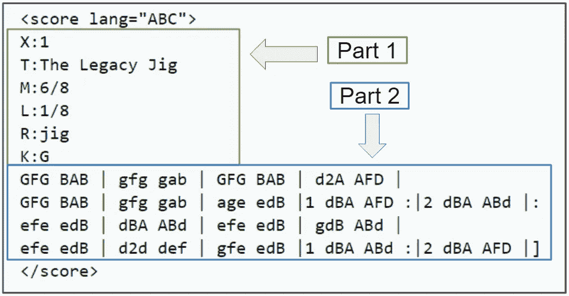
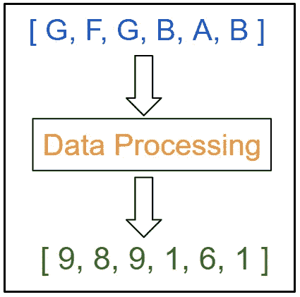
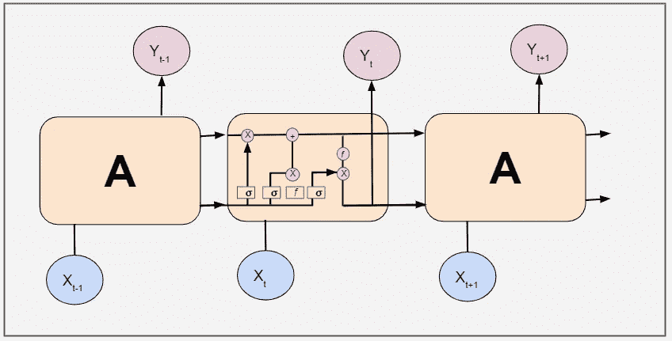
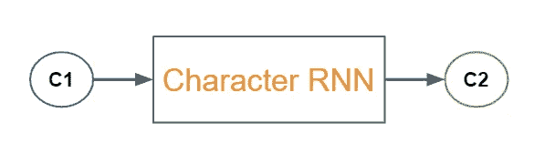
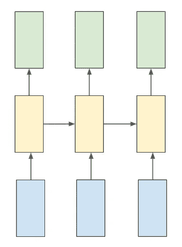
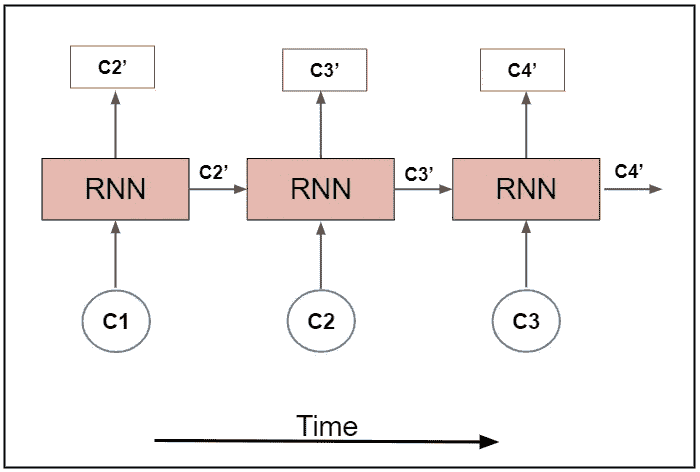
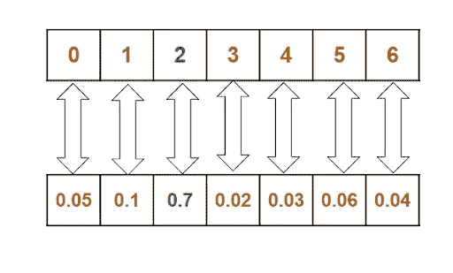
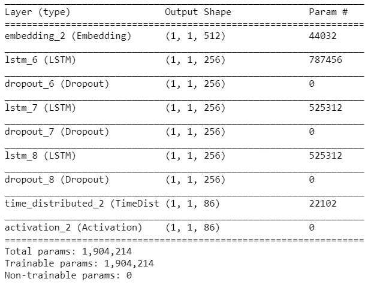
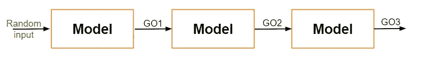

# 通过深度神经网络生成音乐

> 原文：<https://towardsdatascience.com/music-generation-through-deep-neural-networks-21d7bd81496e?source=collection_archive---------18----------------------->


阿列克谢·鲁班在 [Unsplash](https://unsplash.com?utm_source=medium&utm_medium=referral) 上的照片

## [动手教程](https://towardsdatascience.com/tagged/hands-on-tutorials)，深度学习

## 机器学习的创造性应用

深度学习以明显和微妙的方式改善了我们生活的许多方面。深度学习在[电影推荐系统](/how-to-build-a-movie-recommendation-system-67e321339109)、[垃圾邮件检测](/spam-detection-in-emails-de0398ea3b48)和计算机视觉等过程中发挥着关键作用。尽管围绕深度学习作为黑盒和训练难度的讨论正在进行，但它在包括医学、[虚拟助手](https://lionbridge.ai/solutions/virtual-assistants/)和电子商务在内的广泛领域中有着巨大的潜力。

深度学习可以发挥作用的一个令人着迷的领域是艺术和技术的交叉点。为了进一步探索这个想法，在本文中，我们将通过深度学习过程来研究机器学习音乐生成，这是一个许多人认为超出机器范围的领域(也是另一个激烈辩论的有趣领域！).

# 内容

*   机器学习模型的音乐表示
*   音乐数据集
*   数据处理
*   型号选择
*   多-多 RNN
*   时间分布密集层
*   宏伟威严的
*   脱落层
*   Softmax 层
*   【计算机】优化程序
*   音乐的一代
*   摘要


# 机器学习模型的音乐表示

我们将使用 ABC 乐谱。ABC 符号是一种简写形式的音乐符号，它使用字母 A 到 G 来表示音符，并使用其他元素来放置附加值。这些附加值包括升半音、降半音、音符长度、调和装饰音。

这种形式的符号最初是一种 ASCII 字符集代码，用于促进在线音乐共享，为软件开发人员增加了一种新的简单语言，旨在方便使用。图 1 是音乐的 ABC 符号的快照。



音乐的 ABC 符号的插图(来源，由作者编辑)

乐谱第一部分的线条显示了一个字母后跟一个冒号。这些指示曲调的各个方面，例如索引，当文件中有多个曲调时(X:)，标题(T:)，拍号(M:)，默认音符长度(L:)，曲调类型(R:)和音调(K:)。按键符号后面的线条代表曲调本身。


# 音乐数据集

在本文中，我们将使用诺丁汉音乐数据库的 [ABC 版本上可用的开源数据。它包含了 1000 多首民间曲调，其中绝大多数都被转换成 ABC 记谱法。](http://abc.sourceforge.net/NMD/)

# 数据处理

数据目前是基于字符的分类格式。在数据处理阶段，我们需要将数据转换为基于整数的数字格式，为使用神经网络做准备。



数据处理概述(图片由作者创建)

这里每个字符被映射到一个唯一的整数。这可以通过使用一行代码来实现。“文本”变量是输入数据。

```
char_to_idx = { ch: i for (i, ch) in enumerate(sorted(list(set(text)))) }
```

为了训练该模型，我们使用 vocab 将整个文本数据转换成数字格式。

```
T = np.asarray([char_to_idx[c] for c in text], dtype=np.int32)
```


# 机器学习音乐生成的模型选择

在传统的机器学习模型中，我们无法存储模型的先前阶段。但是，我们可以用[递归神经网络](https://lionbridge.ai/articles/difference-between-cnn-and-rnn/)(俗称 RNN)存储之前的阶段。

RNN 有一个重复模块，它接收前一级的输入，并将其输出作为下一级的输入。然而，RNNs 只能保留最近阶段的信息，因此我们的网络需要更多的内存来学习长期依赖关系。这就是长短期记忆网络(LSTMs)的救援之处。

LSTMs 是 RNNs 的特例，具有与 RNNs 相同的链状结构，但具有不同的重复模块结构。



LSTM 结构概述(图片由作者创建)

这里使用 RNN 是因为:

1.  数据的长度不需要固定。对于每个输入，数据长度可能不同。
2.  存储顺序记忆。
3.  可以使用输入和输出序列长度的各种组合。

除了一般的 RNN，我们将通过添加一些调整来定制它以适应我们的用例。我们将使用一个“字符 RNN”。在字符 RNNs 中，输入、输出和转换输出都是以字符的形式出现的。



人物 RNN 概述(作者创造的形象)

# 多-多 RNN

因为我们需要在每个时间戳生成输出，所以我们将使用多对多 RNN。为了实现多对多 RNN，我们需要将参数' return_sequences '设置为 true，以便在每个时间戳生成每个字符。您可以通过查看下面的图 5 来更好地理解它。



多对多 RNN 概览(图片由作者创建)

在上图中，蓝色单元是输入单元，黄色单元是隐藏单元，绿色单元是输出单元。这是一个多对多 RNN 的简单概述。为了更详细地了解 RNN 序列，这里有一个[有用的资源](http://karpathy.github.io/2015/05/21/rnn-effectiveness/)。

# 时间分布密集层

为了处理每个时间戳的输出，我们创建了一个时间分布的密集层。为了实现这一点，我们在每个时间戳生成的输出之上创建了一个时间分布的密集层。

# 宏伟威严的

通过将参数 stateful 设置为 true，批处理的输出将作为输入传递给下一个批处理。在组合了所有的特性之后，我们的模型将看起来像下面图 6 中描绘的概述。



了解有状态 RNN(图片由作者创建)

模型架构的代码片段如下:

```
model = Sequential()
model.add(Embedding(vocab_size, 512, batch_input_shape=(BATCH_SIZE, SEQ_LENGTH)))for i in range(3): model.add(LSTM(256, return_sequences=True, stateful=True))
     model.add(Dropout(0.2))model.add(TimeDistributed(Dense(vocab_size)))
model.add(Activation('softmax'))model.summary()
model.compile(loss='categorical_crossentropy', optimizer='adam', metrics=['accuracy'])
```

我强烈建议尝试使用这些层来提高性能。

# 脱落层

丢弃层是一种正则化技术，在训练过程中的每次更新中，它将输入单元的一部分归零，以防止过度拟合。该分数由该层使用的参数决定。

# Softmax 层

音乐的生成是一个多类分类问题，其中每个类都是来自输入数据的唯一字符。因此，我们在模型上使用 softmax 层，并使用分类交叉熵作为损失函数。

这一层给出了每一类的概率。从概率列表中，我们选择概率最大的一个。



了解 Softmax 图层的输出(由作者创建的图像)

# 【计算机】优化程序

为了优化我们的模型，我们使用自适应矩估计，也称为亚当，因为它是一个非常好的选择 RNN。


创建的训练模型概述(图片由作者创建)


# 创作音乐

到目前为止，我们创建了一个 RNN 模型，并根据我们的输入数据对其进行了训练。该模型在训练阶段学习输入数据的模式。让我们称这个模型为“训练模型”。

训练模型中使用的输入大小是批量大小。并且对于通过机器学习生成音乐，输入大小是单个字符。因此，我们创建了一个新的模型，它类似于已训练的模型，但是单个字符的输入大小为(1，1)。对于这个新模型，我们从已训练的模型加载权重，以复制已训练的模型的特征。

```
model2 = Sequential()model2.add(Embedding(vocab_size, 512, batch_input_shape=(1,1)))for i in range(3): 
     model2.add(LSTM(256, return_sequences=True, stateful=True))
     model2.add(Dropout(0.2))model2.add(TimeDistributed(Dense(vocab_size)))
model2.add(Activation(‘softmax’))
```

我们将已训练模型的权重加载到新模型中。这可以通过使用一行代码来实现。

```
model2.load_weights(os.path.join(MODEL_DIR,‘weights.100.h5’.format(epoch)))model2.summary()
```



生成的音乐模型概述(由作者创建的图像)

在音乐生成的过程中，从唯一的字符集中随机选择第一个字符，使用先前生成的字符生成下一个字符，依此类推。有了这个结构，我们就产生了音乐。



生成的音乐流程概述(由作者创建的图像)

下面是帮助我们实现这一目标的代码片段。

```
sampled = []for i in range(1024): batch = np.zeros((1, 1)) if sampled: batch[0, 0] = sampled[-1] else: batch[0, 0] = np.random.randint(vocab_size) result = model2.predict_on_batch(batch).ravel() sample = np.random.choice(range(vocab_size), p=result) sampled.append(sample)print("sampled")print(sampled)print(''.join(idx_to_char[c] for c in sampled))
```

以下是一些生成的音乐片段:

我们使用被称为 LSTMs 的机器学习神经网络生成了这些令人愉快的音乐样本。对于每一代，模式将不同，但与训练数据相似。这些旋律可用于多种用途:

*   通过灵感增强艺术家的创造力
*   作为开发新想法的生产力工具
*   作为艺术家作品的附加曲调
*   完成一件未完成的工作
*   作为一首独立的音乐

但是，这个模型仍然可以改进。我们的训练数据只包含一种乐器，钢琴。我们可以增强训练数据的一种方法是添加来自多种乐器的音乐。另一个方法是增加音乐的类型、节奏和节拍。

目前，我们的模型产生一些假音符，音乐也不例外。我们可以减少这些错误，并通过增加我们的训练数据集来提高我们的音乐质量，如上所述。


# 摘要

在这篇文章中，我们研究了如何处理音乐以用于神经网络，RNN 和 LSTMs 等深度学习模型的深入工作，我们还探索了调整模型如何导致音乐生成。我们可以将这些概念应用到任何其他生成其他艺术形式的系统中，包括生成风景画或人类肖像。


感谢阅读！本文原帖[此处](https://lionbridge.ai/articles/machine-learning-music-generation-through-deep-neural-networks/)。如果你想自己试验这个自定义数据集，你可以在这里下载[带注释的数据](http://abc.sourceforge.net/NMD/)，在 [Github](https://github.com/RamyaVidiyala/Generate-Music-Using-Neural-Networks) 查看我的代码。

我也将在未来写更多初学者友好的帖子。请在[媒体](https://medium.com/@ramyavidiyala)上关注我，以便了解他们。我欢迎反馈，可以通过 Twitter [ramya_vidiyala](https://twitter.com/ramya_vidiyala) 和 LinkedIn [RamyaVidiyala](https://www.linkedin.com/in/ramya-vidiyala-308ba6139/) 联系。快乐学习！