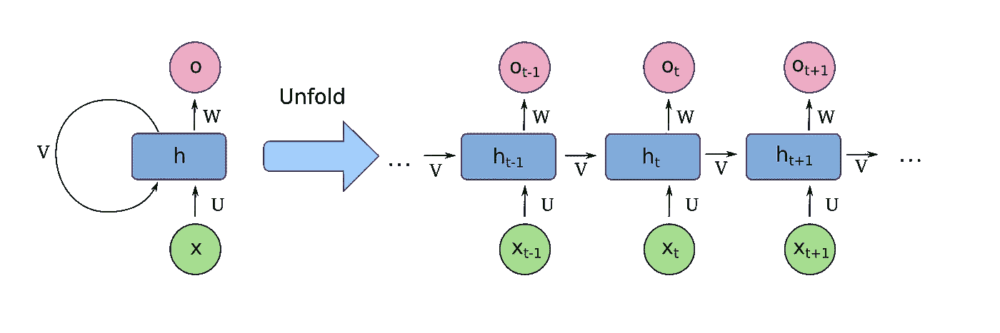
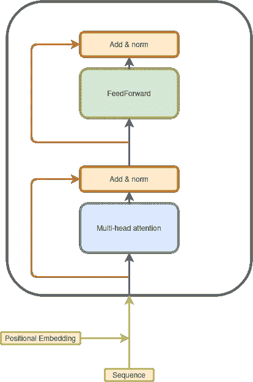
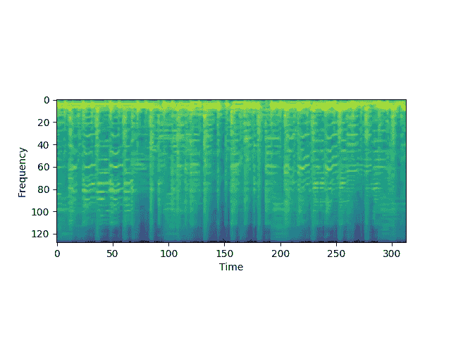
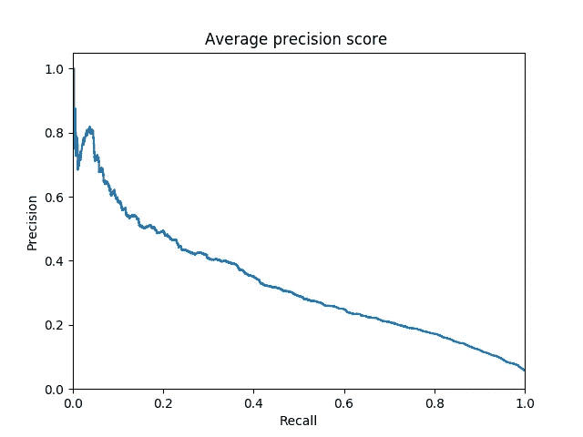

# 音乐流派分类:变形金刚 vs 递归神经网络

> 原文：<https://towardsdatascience.com/music-genre-classification-transformers-vs-recurrent-neural-networks-631751a71c58?source=collection_archive---------32----------------------->

## 在音频分类任务中比较两种架构。


马库斯·斯皮斯克在 Unsplash 上拍摄的照片

这篇文章的目的是通过比较两种流行的序列建模架构来实现一个音乐流派分类模型:递归神经网络和变压器。

rnn 在各种 1D 序列处理任务中很受欢迎，它们在每个时间步重复使用相同的权重，并通过保持内部状态和使用门控机制(LSTM、格鲁什…)将信息从一个时间步传递到下一个时间步。由于它们使用递归，这些模型可能遭受消失/爆炸梯度，这可能使训练和学习长期模式更加困难。



[来源:https://en.wikipedia.org/wiki/Recurrent_neural_network](https://en.wikipedia.org/wiki/Recurrent_neural_network)BY[fdeloche](https://commons.wikimedia.org/wiki/User:Ixnay)下 [CC BY-SA 4.0](https://creativecommons.org/licenses/by-sa/4.0)

变压器是一种相对较新的架构，它可以处理序列，而无需使用任何递归或卷积[[https://arxiv.org/pdf/1706.03762.pdf](https://arxiv.org/pdf/1706.03762.pdf)。变压器层大多是逐点前馈操作和自我关注。这些类型的网络在自然语言处理方面取得了一些巨大的成功，特别是在对大量未标记数据进行预训练时[[https://arxiv.org/pdf/1810.04805](https://arxiv.org/pdf/1810.04805)]。



变形层—作者提供的图像

# 数据集

我们将使用免费的音乐档案数据集[https://github.com/mdeff/fma/](https://github.com/mdeff/fma/)，更具体地说是包含 106，574 首 30 秒曲目、161 个不平衡流派的大型版本，总共有 93 Gb 的音乐数据。每首曲目都标有一组最能描述它的流派。

```
"20": [
        "Experimental Pop",
        "Singer-Songwriter"
    ],
    "26": [
        "Experimental Pop",
        "Singer-Songwriter"
    ],
    "30": [
        "Experimental Pop",
        "Singer-Songwriter"
    ],
    "46": [
        "Experimental Pop",
        "Singer-Songwriter"
    ],
    "48": [
        "Experimental Pop",
        "Singer-Songwriter"
    ],
    "134": [
        "Hip-Hop"
    ]
```

我们在这个项目中的目标是预测这些标签。因为一首歌可以被附加到多个标签，所以它可以被公式化为具有 163 个目标的多标签分类问题，每个类别一个目标。

一些类别非常频繁，例如电子音乐，占数据的 22%，但其他一些类别出现的次数很少，如萨尔萨，占数据集的 0.01%。这在训练和评估中造成了极端的不平衡，导致我们使用精确召回曲线下的微平均面积作为我们的度量。

```
|     | Genre                    |   Frequency |    Fraction |
|----:|:-------------------------|------------:|------------:|
|   0 | Experimental             |       24912 | 0.233753    |
|   1 | Electronic               |       23866 | 0.223938    |
|   2 | Avant-Garde              |        8693 | 0.0815677   |
|   3 | Rock                     |        8038 | 0.0754218   |
|   4 | Noise                    |        7268 | 0.0681967   |
|   5 | Ambient                  |        7206 | 0.067615    |
|   6 | Experimental Pop         |        7144 | 0.0670332   |
|   7 | Folk                     |        7105 | 0.0666673   |
|   8 | Pop                      |        6362 | 0.0596956   |
|   9 | Electroacoustic          |        6110 | 0.0573311   |
|  10 | Instrumental             |        6055 | 0.056815    |
|  11 | Lo-Fi                    |        6041 | 0.0566836   |
|  12 | Hip-Hop                  |        5922 | 0.055567    |
|  13 | Ambient Electronic       |        5723 | 0.0536998   |
.
.
.
| 147 | North African            |          40 | 0.000375326 |
| 148 | Sound Effects            |          36 | 0.000337793 |
| 149 | Tango                    |          30 | 0.000281495 |
| 150 | Fado                     |          26 | 0.000243962 |
| 151 | Talk Radio               |          26 | 0.000243962 |
| 152 | Symphony                 |          25 | 0.000234579 |
| 153 | Pacific                  |          23 | 0.000215812 |
| 154 | Musical Theater          |          18 | 0.000168897 |
| 155 | South Indian Traditional |          17 | 0.000159514 |
| 156 | Salsa                    |          12 | 0.000112598 |
| 157 | Banter                   |           9 | 8.44484e-05 |
| 158 | Western Swing            |           4 | 3.75326e-05 |
| 159 | N. Indian Traditional    |           4 | 3.75326e-05 |
| 160 | Deep Funk                |           1 | 9.38315e-06 |
```

# 音频处理

我们使用 Mel-Spectrograms 作为网络的输入，因为它是音频输入的密集表示，并且它更适合 transformer 架构，因为它将原始音频波转换为向量序列。



```
**def** pre_process_audio_mel_t(audio, sample_rate=16000):
    mel_spec = librosa.feature.melspectrogram(y=audio, sr=sample_rate,
                                              n_mels=n_mels)
    mel_db = (librosa.power_to_db(mel_spec, ref=np.max) + 40) / 40**return** mel_db.T
```

时间轴上的每个 128 维向量被认为是输入序列的一个元素。

加载音频文件并将其子采样到 16kHz，然后计算 Mel 频谱图可能需要大量时间，因此我们使用 NumPy.save 预先计算并将其作为. npy 文件保存在磁盘上。

# 模型

我选择超参数，使 rnn 和变压器都有类似数量的可训练参数。

```
Model: "Transformer"
_________________________________________________________________
**Layer** (**type**)                 **Output Shape              Param** *#* =================================================================
**input_1** (**InputLayer**)         [(**None**, **None**, **128**)]       **0** _________________________________________________________________
**encoder** (**Encoder**)            (**None**, **None**, **128**)         **529920** _________________________________________________________________
**dropout_9** (**Dropout**)          (**None**, **None**, **128**)         **0** _________________________________________________________________
**global_average_pooling1d** (**Gl** (**None**, **128**)               **0** _________________________________________________________________
**dense_24** (**Dense**)             (**None**, **652**)               **84108** _________________________________________________________________
**dense_25** (**Dense**)             (**None**, **163**)               **106439** =================================================================
**Total** params: 720,467
**Trainable** params: 720,467
**Non-trainable** params: 0
_________________________________________________________________Model: "RNN"
_________________________________________________________________
**Layer** (**type**)                 **Output Shape              Param** *#* =================================================================
**input_1** (**InputLayer**)         [(**None**, **None**, **128**)]       **0** _________________________________________________________________
**bidirectional** (**Bidirectional** (**None**, **None**, **256**)         **198144** _________________________________________________________________
**bidirectional_1** (**Bidirection** (**None**, **None**, **256**)         **296448** _________________________________________________________________
**dropout** (**Dropout**)            (**None**, **None**, **256**)         **0** _________________________________________________________________
**global_average_pooling1d** (**Gl** (**None**, **256**)               **0** _________________________________________________________________
**dense** (**Dense**)                (**None**, **652**)               **167564** _________________________________________________________________
**dense_1** (**Dense**)              (**None**, **163**)               **106439** =================================================================
**Total** params: 768,595
**Trainable** params: 768,595
**Non-trainable** params: 0
_________________________________________________________________
```

这两种型号之间的唯一区别是编码器部分是变压器或双向 GRU。这两种型号具有 700k 可训练参数。

# 估价

我们将使用精确回忆曲线下的面积来评估每一种体裁，然后对各个班级进行微观平均。



变形金刚的嘻哈 PR 曲线

```
**RNN vs Transformer AUC PR =>****transformer micro-average** :  **0.20
rnn micro-average** :  **0.18**
```

我们可以看到 transformer 比 GRU 工作得好一点。我们可以通过做一些测试时间增加和平均输入序列的多个作物的预测来提高性能。

```
**Test-Time Augmentation =>****transformer micro-average** :  **0.22
rnn micro-average** :  **0.19**
```

结果总体上看起来有点弱，这可能是由于大量的课程使任务变得更加困难，或者可能是由于课程的不平衡。一个可能的改进是放弃多标签方法，转而采用排序方法，因为它对类别不平衡和大量类别不太敏感。

## 预测示例:

五大预测:

贾扎的《午睡》

```
('Folk', 0.7591149806976318)
('**Pop**', **0.7336021065711975**)
('**Indie-Rock**', **0.6384000778198242**)
('Instrumental', 0.5678483843803406)
('Singer-Songwriter', 0.558732271194458)
```

[扬·卡茨的《聪明人》](https://freemusicarchive.org/music/Jahzzar/Travellers_Guide/Siesta)

```
('Electronic', 0.8624182939529419)
('Experimental', 0.6041183471679688)
('**Hip-Hop**', **0.369397908449173**)
('Glitch', 0.31879115104675293)
('Techno', 0.30013027787208557)
```

# 结论

在这篇文章中，我们比较了两种流行的序列建模结构 rnn 和变压器。我们看到 transformers 在性能上略胜 GRUs，这表明 Transformers 甚至可以在自然语言处理之外进行测试。

# 参考

TF2 变形金刚:[https://github . com/tensor flow/docs/blob/master/site/en/tutorials/text/transformer . ipynb](https://github.com/tensorflow/docs/blob/master/site/en/tutorials/text/transformer.ipynb)

代号:[https://github.com/CVxTz/music_genre_classification](https://github.com/CVxTz/music_genre_classification)