# Python 必备的日期时间函数

> 原文：<https://towardsdatascience.com/must-have-on-finger-tips-datetime-functions-for-python-31cc76b17d07?source=collection_archive---------46----------------------->

## 从蟒蛇和熊猫


[亨利&公司](https://unsplash.com/@hngstrm?utm_source=medium&utm_medium=referral)在 [Unsplash](https://unsplash.com?utm_source=medium&utm_medium=referral) 上的照片

Python 提供了一整套用于处理日期时间数据的函数和库。我经常使用:

*   **Python 的日期时间**
*   **熊猫的时间戳**

在处理某种数据一段时间后，我们会比其他人更频繁地使用一些函数。虽然功能的选择完全取决于个人的经验和舒适度，但了解自己的选择是有好处的。如果您正在处理带有原始时间戳的时间序列或由各种系统和设备提供的某种形式的 DateTime 对象，那么本文应该复习一下将会派上用场的流行的 DateTime 函数。

# 1.日期和日期格式的字符串

这里我们讨论一下 python **。strftime()** 函数和 pandas **date_format** 选项在 excel 和 CSV 中编写 pandas。

通常，如果您将 pandas 数据帧保存到 excel 或文本文档中，您会对 pandas 生成的 yyyy-mm-dd hh:mm:ss 默认格式不满意。这是我控制这些输出的方法。

让我们以一个包含随机日期和字符串代码的数据框为例。下面是我们将使用的玩具数据框:

```
start = datetime.datetime(2020,2,1)end = datetime.datetime(2020,2,10)dates = pd.date_range(start = start, end = end,freq=’D’).to_list()codes = [ "".join(choice(ascii_lowercase) for i in range(10)) for j   
        in range(10)]df = pd.DataFrame(columns=['date','code'])df.date  = datesdf.code = codes
```

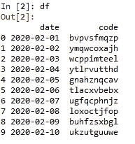

示例数据

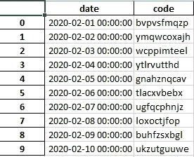

Excel 输出

显然，日期列提供了很多信息，但不一定好看。我们不希望我们的输出报告中有这么大的日期，我们只需要知道日期的格式，比如日期/月/年。

## 战斗支援车

如果 csv 或文本输出是你的目标，这很容易改变。只需在您的 to_csv 函数中用 kwarg date_format 指定输出的格式。

```
df.to_csv(‘C:/location/slash_dates.txt’,date_format=’%M/%D/%Y’)
```

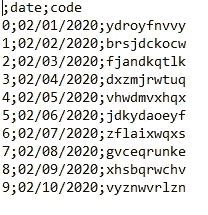

用斜线分隔的输出在 CSV 中很容易。

## 擅长

当使用 excel 时，你必须要小心一点，因为 Excel 在格式化日期时有自己的想法。

当然，您可以右键单击您的格式单元格，将格式更改为您想要的任何格式。但是一提到斜线，excel 就很固执。它不是 excel 必须提供的格式选项之一(可能是因为它看起来很丑，咄！).而且，值得一提的是，当 python 提供这么多功能时，不必每次都干扰 excel 中的输出。

**python。strftime()方式:**

为了实现与 to_csv 中的 date_format 等效的灵活性，我们“欺骗”excel，使用。strftime()并将其传递给 excel。(因为我们有一个 Series 对象，所以我们需要一个. dt 来访问它的值)

```
df.date = df.date.dt.strftime(“%d/%m/%y”)
```

哒哒！

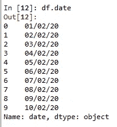

斜线分隔的日期

哒哒！

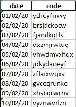

excel 输出

或者，

**熊猫道:**

使用 pandas excel writer 并指定格式，如 to_csv(并为您的工作表命名作为额外的奖励。)

```
writer = pd.ExcelWriter(‘C:/location/writer_datetime.xlsx’,  
         date_format=”%D/%M/%Y”)df.to_excel(writer, sheet_name=’xl_slashes’)writer.save() 
```

哒哒！

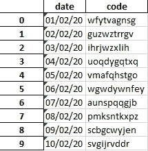

# 2.字符串中的日期

这里我们讨论一下**。strptime( )** 和 **to_datetime( )** 函数，基本上是我们前面所做的姊妹函数。

通过上面的步骤，您现在已经将带有一组时间戳属性的 datetime64 对象转换为一个字符串序列。(Pandas 数据类型是字符串或混合序列的“对象”)

之前。strftime():

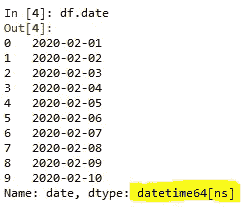

之后。strftime():

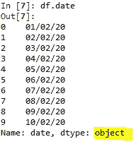

出于某种原因，你想要回你的约会。假设您想要获取日期是几月几号或属于哪个日历周。使用内置的 datetime 函数比解析看起来像 DateTime 的字符串要好。

为此，我们使用了。strftime()，也就是**。strptime( )** 或 pandas **to_datetime( )** 函数，如果这是您更喜欢的。

**熊猫的 to_datetime()方式:**

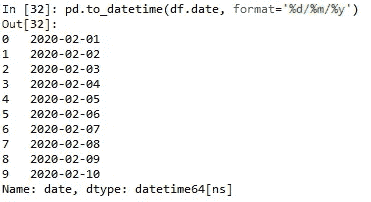

日期对象从日期列中返回

注意它们所表达的意思的格式和相应的简短形式。假设您的日期字符串看起来不同，如下所示:

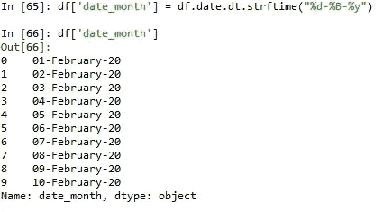

日期字符串的不同格式

你有没有注意到%B 代表这个月的扩张？

让我们将这个日期字符串转换成一个 DateTime 对象，从中获得日历周。

```
df['date_month'] = pd.to_datetime(df.date_month, format=’%d-%B-%y’)
```

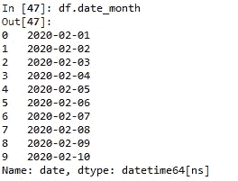

现在我们有了 datetime 对象，让我们使用 pandas datetime 函数来获取日历周。周

```
df['calender_week'] = df.date_month.dt.week
```

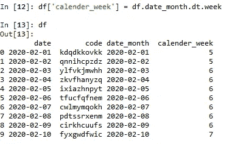

在这里，日历周，熊猫之路。

**Python 的 strptime()方式:**

Pandas 不赞成使用 Timestamp.strptime()，而是用一个非常有效的 to_datetime()代替，可以使用. dt 访问器将它应用于整个系列。

但是，如果您有单独的时间戳实体需要在系列之外进行格式化。strptime()是一个有效的 python 函数。

```
import datetimedate_string = “2 March, 2020”dttime_obj = datetime.datetime.strptime(date_string, “%d %B, %Y”)
```

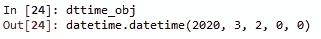

我们有一个来自字符串的日期、时间对象

datetime 的 isocalendar()方法是一个元组，包含位置 1 处的日历周。

```
dttime_obj.isocalendar()[1]
```

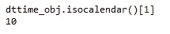

日历周，python 方式。

这些是 Python 中熊猫内外的一些有用的日期时间对象函数。希望这有所帮助！