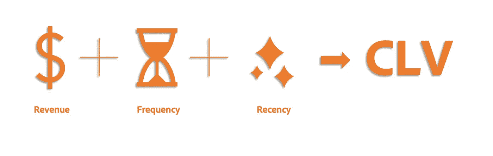
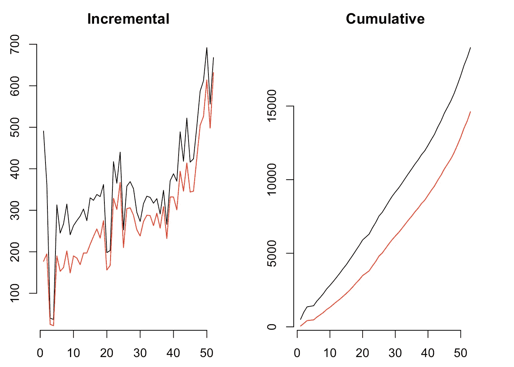
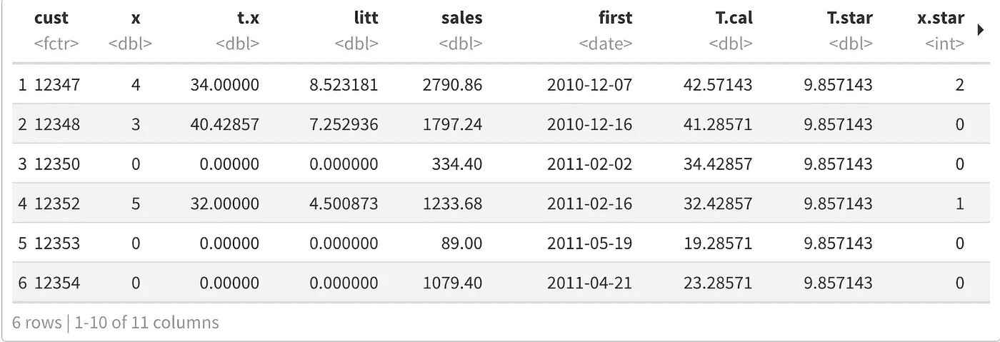
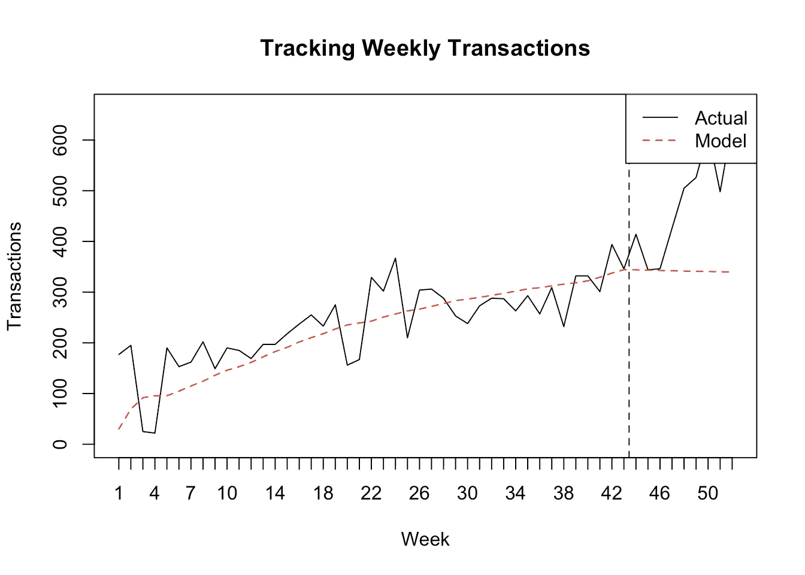
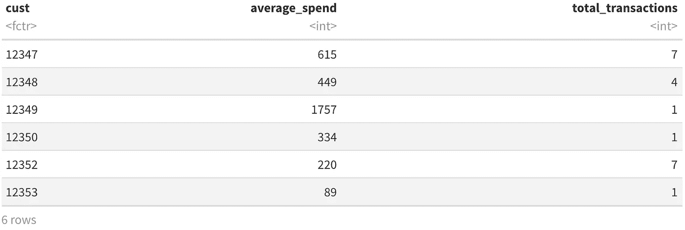
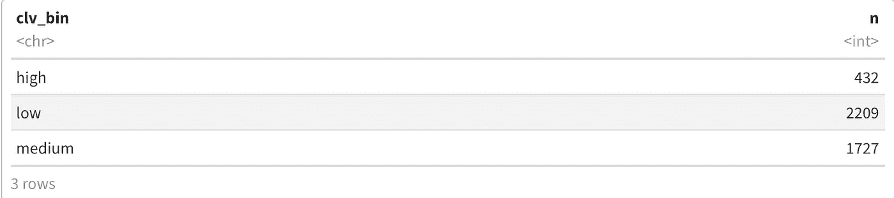
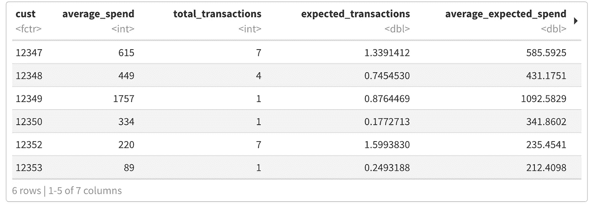
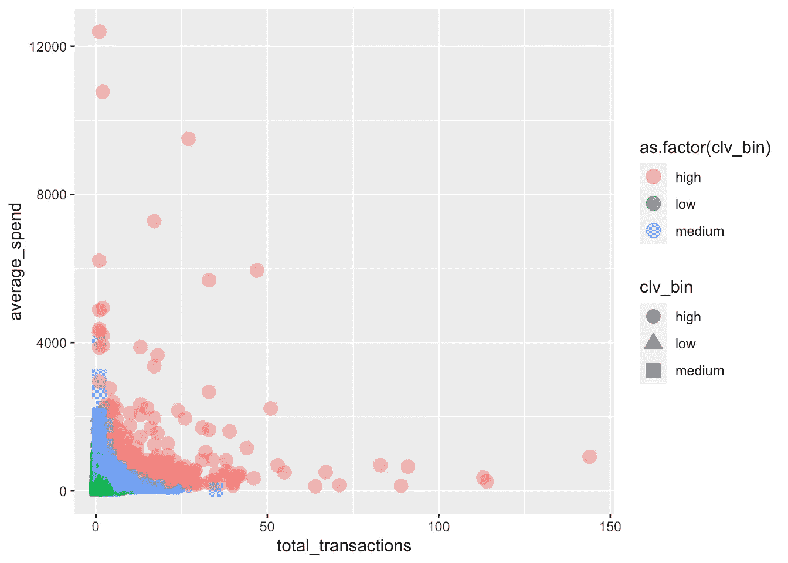

# 数字分析师必备的 ML 技术:第 2 部分——客户终身价值

> 原文：<https://towardsdatascience.com/must-know-ml-techniques-for-digital-analysts-part-2-customer-lifetime-value-22cd7496beca?source=collection_archive---------38----------------------->

## 介绍可以帮助您优化数字分析价值链的机器学习技术



作者图片

正如我们在[第 1 部分](https://medium.com/@abhinavsharma_64776/ml-techniques-to-optimise-digital-analytics-part-1-association-analysis-2ab198d56181)中介绍关联分析概念时所指出的，分析正变得越来越增强和相关。作为一名数字分析师，我们最好意识到不同数据源之间的联系，并准备好产生比描述性分析更多的东西。

考虑到这种必要性，我们将讨论另一个智能数字分析概念——客户终身价值。

# 计算寿命值

客户终身价值(CLV)是归属于客户关系的未来现金流的贴现总和。CLV 估计了一个组织未来将从顾客那里获得的“利润”。CLV 可用于评估可合理用于获取客户的资金量。即使不考虑美元价值，CLV 建模仍然有助于确定最重要的(又名。有利可图的)客户群，这些客户群随后可以在收购策略方面获得不同的待遇。

CLV 模型的分类很大程度上取决于业务的性质。如果企业与客户有*合同关系*(如订阅模式)，那么在这些情况下最重要的问题是长期留住客户，生存分析模型用于研究客户取消之前的时间。这些模型有时也被称为*【一去不复返】*模型，因为这些模型假设取消服务的客户不会再回来。

典型的“一去不复返”模型的简单 CLV 公式

> CLV 公式将每期现金利润率 *$M* 乘以一个长期乘数，该乘数代表客户关系预期长度的现值:
> 
> CLV = $M [r / 1 + d-r]
> 
> 其中 *r* 为每期留存率， *d* 为每期折现率。

CLV 模式的另一个主要类别叫做*“永远分享”*这些模型没有假设客户不活动意味着客户永远不会回来。例如，一个本月没有购买的零售客户可能下个月会回来。

> 正是这些类型的 CLV 模型与在线零售业务设置最相关，在在线零售业务设置中，用户可以随意参与业务，例如在电子商务商店中，用户可以随时进行购买。

在本文中，我详细介绍了一个模型，该模型可用于根据客户与企业的历史交易来预测未来的 CLV。本系列中描述的模型最适用于预测至少有适量交易历史的现有客户的未来价值。

# 为 CLV 买概率模型直到你死

BTYD 模型捕捉了客户的非合同购买行为，或者更简单地说，这些模型讲述了人们购买直到死亡(作为客户变得不活跃)的故事。

有两种广泛使用的模型-

*   **帕累托/NBD**
*   **BG/NBD**

BG/NBD (Beta 几何负二项分布)模型比帕累托/NBD 更容易实现，运行速度也更快(我是故意天真的)。这两个模型倾向于产生相似的结果。这些模型假设顾客购买率和退出率的概率分布。建模基于描述这些假设的四个参数。

对假设的统计介绍很重要，但超出了本文的范围。要记住的一个高层次的想法是，这些模型假设客户与您的业务的交互应该是按照他们自己的意愿进行的(换句话说，对于您的解释是随机的)。如果你在获取客户方面有任何影响力(活动或促销优惠)，那么这种历史数据不适合这些模型。

# 示例实现

让我们考虑下面的场景-

*一家零售商正在重新策划他们的 CPC 广告。他们想了解谁是他们最有利可图的客户，以及这个理想客户的人口统计情况。最终，他们希望更好地定位他们的 CPC 广告，以尽可能获得最有利可图的客户。他们为您提供了过去几年的交易数据，并根据三个客户类别(高价值、中价值和低价值)预测和输出。他们希望将这个客户价值标识符反馈到他们的数据湖，并了解更多关于每个桶的相关人口统计。*

我们将该模型应用于公共数据集(详见引文)。该数据集包含 2010 年至 2011 年的交易。我们将首先准备数据，使其符合模型的预期“事件日志”格式。事件日志基本上是每个客户购买的日志，记录了相关的收入和时间戳。然后我们将使用一个概率模型来计算 CLV。这些数据足以提取**最近、频率和货币(RFM)** 值。这里的解决方案使用了 r 中现有的 BTYD 库。

完整代码请参考我的 [GitHub](https://github.com/abhinav-sharma15/Customer-Lifetime-Value)

抛开上传和数据清理部分(我们将数据集转换成事件日志格式)，下面是剩余代码的分解

# 每周交易分析

方法 elog2cum 和 elog2inc 将事件日志作为第一个参数，并计算每个时间单位的累积或增量事务数。如果参数 first 设置为 TRUE，则包括客户的初始交易，否则不包括。

```
op <- par(mfrow = c(1, 2), mar = c(2.5, 2.5, 2.5, 2.5))
*# incremental*
weekly_inc_total <- elog2inc(elog, by = 7, first = TRUE)
weekly_inc_repeat <- elog2inc(elog, by = 7, first = FALSE)
plot(weekly_inc_total, typ = "l", frame = FALSE, main = "Incremental")
lines(weekly_inc_repeat, col = "red")
*# commualtive*
weekly_cum_total <- elog2cum(elog, by = 7, first = TRUE)
weekly_cum_repeat <- elog2cum(elog, by = 7, first = FALSE)
plot(weekly_cum_total, typ = "l", frame = FALSE, main = "Cumulative")
lines(weekly_cum_repeat, col = "red")
```



作者图片

此外，我们需要将事件日志转换成**customer-by-sufficient-statistic(CBS)**格式。elog2cbs 方法是将事件日志转换为 CBS data.frame 的有效实现，每个客户对应一行。这是估计模型参数所需的数据格式。参数 T.cal 允许用户分别计算校准和维持期的汇总统计数据。

我想使用 T.cal 只对 2011 年假日购物前的交易进行采样，而不是进行实际的校准和抵制，在 2011 年假日购物前，会有一个增量高峰。这将使估计的参数对未来的预测保持现实。

```
calibration_cbs = elog2cbs(elog, units = "week", T.cal = "2011-10-01")
head(calibration_cbs)
```



作者图片

返回的字段 cust 是唯一的客户标识符，x 是重复交易的次数(即频率)，t.x 是最后记录的交易的时间(即最近)，litt 是对数交互时间的总和(估计规律性所需)，first 是第一次交易的日期，T.cal 是第一次交易和校准周期结束之间的持续时间。用于表示 t.x、T.cal 和 litt 的时间单位是通过参数单位确定的，参数单位传递给方法 difftime，默认为周。仅包含那些在校准期间至少发生过一次事件的客户。

*   客户:客户 id(唯一键)。
*   x:校准期间重复事件的数量。
*   t.x:校准周期中第一个和最后一个事件之间的时间。
*   litt:校准期间对数交互时序的总和。
*   销售额:校准期间的销售额总和，包括初始交易。
*   first:校准期间第一笔交易的日期。
*   T.cal:第一次事件和校准周期结束之间的时间。
*   T.star:维持期的长度。
*   x.star:维持期内的事件数。
*   sales.star:维持期内的销售额总和。

估计 BG/NBD 过程的参数值。

```
*# estimate parameters for various models*
params.bgnbd <- BTYD::bgnbd.EstimateParameters(calibration_cbs) *# BG/NBD*
row <- **function**(params, LL) {
names(params) <- c("k", "r", "alpha", "a", "b")
c(round(params, 3), LL = round(LL))
}
rbind(`BG/NBD` = row(c(1, params.bgnbd),
BTYD::bgnbd.cbs.LL(params.bgnbd, calibration_cbs)))##        k     r alpha     a     b     LL
## BG/NBD 1 0.775 7.661 0.035 0.598 -29637
```

# 预测维持期

```
*# predicting on holdout*
calibration_cbs$xstar.bgnbd <- bgnbd.ConditionalExpectedTransactions(
params = params.bgnbd, T.star = 9,
x = calibration_cbs$x, t.x = calibration_cbs$t.x,
T.cal = calibration_cbs$T.cal)
*# compare predictions with actuals at aggregated level*
rbind(`Actuals` = c(`Holdout` = sum(calibration_cbs$x.star)),
`BG/NBD` = c(`Holdout` = round(sum(calibration_cbs$xstar.bgnbd))))##         Holdout
## Actuals    4308
## BG/NBD     2995
```

在总体水平上比较预测，我们看到 BG/NBD 对数据集“预测不足”。这归因于在坚守期(2011 年 11 月和 12 月)的交易量激增。在 bgcnbd 的帮助下，聚集水平的动态可以被可视化。PlotTrackingInc

```
nil <- bgnbd.PlotTrackingInc(params.bgnbd,
T.cal = calibration_cbs$T.cal,
T.tot = max(calibration_cbs$T.cal + calibration_cbs$T.star),
actual.inc.tracking = elog2inc(elog))
```



作者图片

在测试模型的情况下，我们可以使用维持期来计算 MAE

```
*# mean absolute error (MAE)*
mae <- **function**(act, est) {
stopifnot(length(act)==length(est))
sum(abs(act-est)) / sum(act)
}
mae.bgnbd <- mae(calibration_cbs$x.star, calibration_cbs$xstar.bgnbd)
rbind(
`BG/NBD` = c(`MAE` = round(mae.bgnbd, 3)))##          MAE
## BG/NBD 0.769
```

# 伽玛支出的参数

现在，我们需要为客户的平均交易价值开发一个模型。我们将使用一个两层的层次模型。平均交易值将按照形状参数 *p* 进行伽马分布。这个伽玛分布的比例参数也是伽玛分布，形状和比例参数分别为 *q* 和$$。估计这些参数要求数据的格式与我们用于 BG/NBD 模型的 cbs 格式略有不同。相反，我们只需要每个客户的平均交易值和交易总数。在 elog 对象上使用 dplyr 符号可以很容易地实现这一点。

```
spend_df = elog %>%
    group_by(cust) %>%
    summarise(average_spend = mean(sales),
              total_transactions = n())## `summarise()` ungrouping output (override with `.groups` argument)spend_df$average_spend <- as.integer(spend_df$average_spend)
spend_df <- filter(spend_df, spend_df$average_spend>0)

  head(spend_df)
```



作者图片

现在让我们将这些格式化的数据插入到支出中。BTYD 包中的 EstimateParameters()函数来获取 Gamma-Gamma 花费模型的参数值。

```
gg_params = spend.EstimateParameters(spend_df$average_spend, 
                                       spend_df$total_transactions)
  gg_params## [1]   2.619805   3.346577 313.666656
```

# 将模型应用于整个群体

有了理解交易和平均收入行为所需的所有参数，我们现在可以将该模型应用于我们的整个客户群体。为此，我们需要为整个数据集创建一个 cbs 数据框(即无校准周期)。我们可以再次使用 elog2cbs()函数，但是省略 calibration_date 参数。然后，我们可以计算每个客户未来 12 周的预期交易和平均交易值。

```
customer_cbs = elog2cbs(elog, units = "week")
customer_expected_trans <- data.frame(cust = customer_cbs$cust,
                                      expected_transactions = 
                                        bgnbd.ConditionalExpectedTransactions(params = params.bgnbd,
                                                                              T.star = 12,
                                                                              x = customer_cbs[,'x'],
                                                                              t.x = customer_cbs[,'t.x'],
                                                                              T.cal  = customer_cbs[,'T.cal']))
customer_spend = elog %>%
  group_by(cust) %>%
  summarise(average_spend = mean(sales),
            total_transactions = n())## `summarise()` ungrouping output (override with `.groups` argument)customer_spend <- filter(customer_spend, customer_spend$average_spend>0)
customer_expected_spend = data.frame(cust = customer_spend$cust,
                                     average_expected_spend = 
                                        spend.expected.value(gg_params,
                                                             m.x = customer_spend$average_spend,
                                                             x = customer_spend$total_transactions))
```

将这两个数据框架结合在一起，我们可以得到数据集中每个人未来三个月的客户价值。我们可以进一步把它们分成高、中、低三类。

```
merged_customer_data = customer_expected_trans %>%
  full_join(customer_expected_spend) %>%
  mutate(clv = expected_transactions * average_expected_spend,
         clv_bin = case_when(clv >= quantile(clv, .9, na.rm = TRUE) ~ "high",
                             clv >= quantile(clv, .5, na.rm = TRUE) ~ "medium",
                             TRUE ~ "low"))merged_customer_data %>%
  group_by(clv_bin) %>%
  summarise(n = n())
```



作者图片

将历史支出和预测结合在一起，并将其保存为输出 csv —

```
customer_clv <- left_join(spend_df, merged_customer_data, by ="cust")
head(customer_clv)
write.csv(customer_clv, "clv_output.csv")
```



作者图片

# CLV 星团图

```
 customer_clv  %>% 
    ggplot(aes(x = total_transactions,
               y = average_spend,
               col = as.factor(clv_bin),
               shape = clv_bin))+
    geom_point(size = 4,alpha = 0.5)
```



作者图片

输出 csv 现在可以反馈给客户数据库并与之合并。然后，clv 桶指标将可用于分解其他人口统计或行为信息。

# 引用

陈大庆、赛梁赛恩和郭昆，“在线零售业的数据挖掘:使用数据挖掘进行基于 RFM 模型的客户细分的案例研究”，《数据库营销和客户战略管理杂志》，第 19 卷第 3 期，第 197-208 页，2012 年(印刷前在线出版:2012 年 8 月 27 日)。doi: 10.1057/dbm.2012.17)。