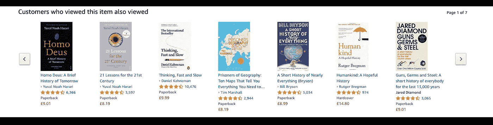
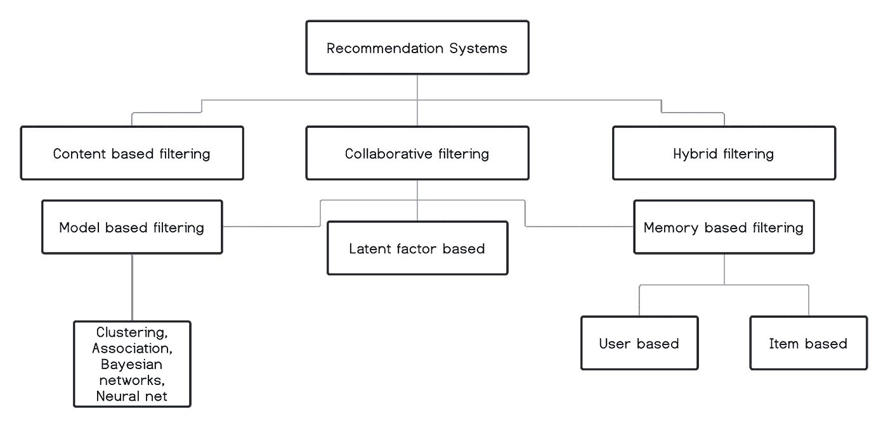
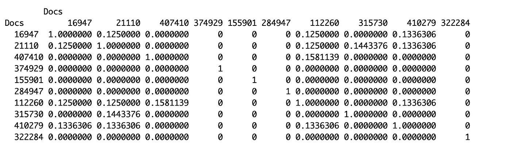
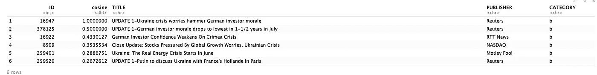
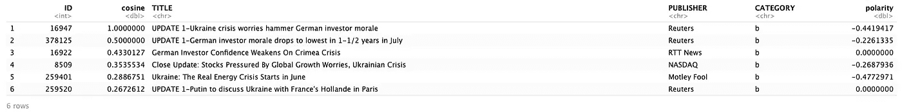
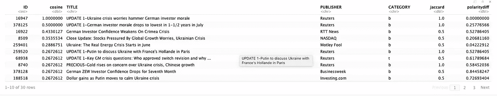
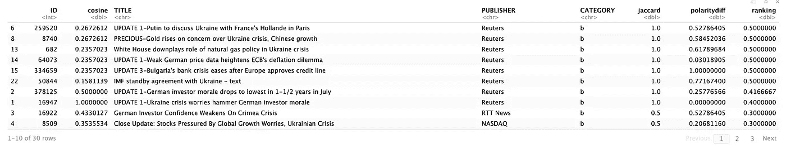

# 数字分析师必备的 ML 技术:第 3 部分——推荐引擎

> 原文：<https://towardsdatascience.com/must-know-ml-techniques-for-digital-analysts-part-3-recommendation-engines-23713ae80b49?source=collection_archive---------41----------------------->

## 介绍可以帮助您优化数字分析价值链的机器学习技术

作为贵组织的数字分析师，您不应该为推荐引擎编写 ML 代码。然而，即使是编写这些代码的 ML 工程师也会依赖你来了解这些引擎在网站上的表现。此外，数字分析团队还会影响内容放置和内容的 A/B 测试(或不同的 ML 算法)。因此，一些关于推荐引擎如何工作的固有知识对你来说可能是一笔宝贵的财富。



我在浏览某本书的时候亚马逊给我的推荐。你能猜出是哪个吗？作者图片

# 推荐引擎—简介

推荐引擎优势的典型代表是亚马逊、网飞、Tinder 等公司。你的亚马逊主页是实践推荐的最好例子。在主页上滚动，你可以找到像*、【受你购物趋势的启发】、【与你看过的商品相关】*等部分。所有这些都由后台的推荐引擎提供支持。推荐引擎不仅仅局限于在电子商务页面上展示类似的产品。这些引擎有一个更深刻的用途，那就是使用*右*频道在*右*时间向*右*客户呈现相关的和个人的(*右*)内容。

除了一起购买的地图产品之外，推荐器的使用可以扩展到-

*   根据客户统计数据提出建议。
*   基于客户之间的相似性进行推荐。
*   基于产品相似度推荐。
*   基于客户的历史购买档案进行推荐。

推荐系统的用例不仅限于电子商务，还广泛存在于医药、金融和旅游等领域。

# 推荐引擎类型



作者图片

图中所示的每一种技术都可以用来建立一个推荐系统模型。让我们简单地探讨一下各种推荐引擎类别。

**基于内容的过滤**，通过比较产品属性和客户档案属性来推荐商品。每个产品的属性都表示为一组标签或术语，通常是产品描述文档中出现的词语。客户简档用相同的术语表示，并通过分析客户看过或评价过的产品的内容来构建。通常，基于内容的过滤方法基于一些相似性得分提供前 N 个推荐的列表。

**协同过滤**通过使用其他人的推荐来过滤信息。给定产品的用户评级数据库，其中一组用户已经对一组产品进行了评级，协同过滤算法可以对特定用户尚未评级的产品给出评级。这利用了用户的邻居信息来提供这样的推荐。协同过滤算法的潜在前提是，如果两个用户对一大组项目的评级达成一致，他们也可能倾向于对其他项目达成一致。

协同过滤可以进一步分为:

*   **基于记忆的**:在这种方法中，用户评分信息被用来计算用户或物品之间的相似度。这个计算出的相似度然后被用于提出推荐。这与基于内容的推荐不同，在基于内容的推荐中，项目/用户元数据用于计算相似性得分，而不是它们的反馈(例如评级)。
*   **基于模型的**:应用数据挖掘方法来识别数据中的模式，然后使用学习到的模式来生成建议。我们已经在第 1 部分的[中介绍了一种使用 apriori 算法的流行关联挖掘技术。](/ml-techniques-to-optimise-digital-analytics-part-1-association-analysis-2ab198d56181)
*   潜在因素法利用**矩阵分解**技术来得出建议。最近，这些方法被证明优于基于项目和基于用户的推荐系统。这是著名的网飞推荐竞赛的获奖方案之一。

最后，**混合过滤**是我们结合多种类型的推荐系统来提出最终推荐的系统。

奇异值分解近似、最受欢迎项目和 SlopeOne 是可以用来建立推荐系统的一些其他受欢迎的技术。对推荐引擎的进一步学习可以是探索和研究这些很少使用的技术，并将它们应用于现实世界的问题。

# 示例实现

对于独立的实现，Python 和 R 都有包，其中包括捆绑在一起的最流行的推荐技术。*re commender lab*R 中的软件包是用于构建推荐引擎的一站式商店，并提供了将数据集转换为所需格式以及训练/测试模型集合的强大功能。推荐器功能包含包含我们想要选择的不同相似性分数的参数的选项。

作为本文的一个例子，我们将采用一种更加有机的方法，尝试为新闻聚合网站实现基于内容的推荐。

考虑下面的用例-

***一个新闻聚合器想要解决以下问题:当一个客户浏览某篇特定的文章时，我们应该向他推荐哪些其他的文章？挑战在于我们没有任何关于客户偏好的信息。我们要么是第一次看到顾客，要么是还没有建立任何机制来捕捉顾客与我们产品/物品的互动。***

我们将从 UCI 公共知识库的新闻聚合器数据集中提取数据。

当用户浏览一篇特定的新闻文章时，我们需要向他推荐其他的新闻文章，推荐的依据是:

*   他当前正在阅读的文章标题的文本内容
*   此文档的发布者
*   文档所属的类别
*   文档的极性(我们将根据标题的文本内容来计算)

极性识别算法使用文本挖掘来获得文档的观点。我们将使用一种这样的算法来获得我们文本的极性。
对于这个用例，我们需要多个相似性度量:

*   余弦距离/相似度用于比较两个文档中的单词
*   对于极性，曼哈顿距离测量
*   对于出版商和类别，Jaccard 的距离

参考 [GitHub](https://github.com/abhinav-sharma15/CF_Recommendation) 了解该项目的全部降价情况。

这是代码的分解-

代码的第一部分(直到第 62 行)关注数据争论，然后细化数据集，使其只包含一小部分数据(用于缩小项目规模)，并进一步只关注文章数量最多的前 100 家出版商。

# 相似指数

我们使用所有文章标题的单词包表示来衡量它们的相似性得分。我们使用余弦距离作为相似性得分度量，因为它对于值的大小的变化不是不变的，并且如果文章中有变化，它也会变化。

该流程包括:

*   使用 R 中的 tm 包，创建所有文章的文档术语矩阵(dtm)。
*   用它来测量文章之间的余弦距离，并返回一个文档矩阵。

```
# cosine distance
sim.score <- tcrossprod_simple_triplet_matrix(dtm)/(sqrt( row_sums(dtm^2) %*% t(row_sums(dtm^2)) ))sim.score[1:10,1:10]
```



作者图片

# 搜索

在这一节中，我们的目标是根据余弦相似性匹配过滤前 30 篇文章。例如，我们当前的文档是路透社题为“更新 1-乌克兰危机担忧打击德国投资者士气”的文章 ID 16947，然后我们根据余弦距离挑选出前 30 篇匹配的文章。

```
# merge title.df and other.df with match.refined:
match.refined <- inner_join(match.refined, title.df,by = "ID")
match.refined <- inner_join(match.refined, others.df,by = "ID")head(match.refined)
```



作者图片

# 极性得分

我们利用 R 中的 *sentimentr* package 来衡量我们收集的热门文章的观点。分数为-1 表示这个句子的极性非常低。1 分表示这个句子非常肯定。0 分表示句子的中性。

```
# update the match.refined data frame with the polarity scores:
match.refined$polarity <- sentiment.score$sentiment
head(match.refined)
```



作者图片

# 雅克卡德距离

我们还通过 Jaccard 索引来衡量当前文章的出版商和类别相似性。Jaccard 指数衡量两个集合之间的相似性，是参与集合的交集大小和并集大小的比率。这里我们只有两个元素，一个用于 publisher，一个用于 category，所以我们的 union 是 2。分子，通过添加两个布尔变量，我们得到交集。我们还计算搜索结果中的文章和我们的搜索文章之间的极性值的绝对差异(曼哈顿距离)。我们对差异分数进行最小/最大归一化，

```
# Jaccard's distance
match.refined$jaccard <- (match.refined$is.publisher + match.refined$is.category)/2# Manhattan distance
match.refined$polaritydiff <- abs(target.polarity - match.refined$polarity)range01 <- function(x){(x-min(x))/(max(x)-min(x))}
match.refined$polaritydiff <- range01(unlist(match.refined$polaritydiff)) 
```



作者图片

# 模糊逻辑排序

最后，我们使用这 3 个分数将模糊规则应用于列表，并获得前 30 篇文章的排名。基于语言变量余弦、Jaccard 和极性之间的相互作用，排序语言变量被分配不同的语言值。这些交互被定义为规则。定义了语言变量、语言值和隶属函数后，我们继续写下我们的模糊规则。

```
# The get.ranks function is applied in each row of match.refined to get the fuzzy ranking. Finally, we sort the results using this ranking.
get.ranks <- function(dataframe){
  cosine =  as.numeric(dataframe['cosine'])
  jaccard = as.numeric(dataframe['jaccard'])
  polarity = as.numeric(dataframe['polaritydiff'])
  fi <- fuzzy_inference(ranking.system, list(cosine = cosine,  jaccard = jaccard, polarity=polarity))
  return(gset_defuzzify(fi, "centroid"))

}match.refined$ranking <- apply(match.refined, 1, get.ranks)
match.refined <- match.refined[order(-match.refined$ranking),]
match.refined
```



作者图片

这样我们就完成了一个简单的模糊诱导的基于内容的推荐系统的设计和实现。

*故事还没完—*

[**第一部分——联想分析**](/ml-techniques-to-optimise-digital-analytics-part-1-association-analysis-2ab198d56181)

[**第二部分——客户终身价值**](/must-know-ml-techniques-for-digital-analysts-part-2-customer-lifetime-value-22cd7496beca)